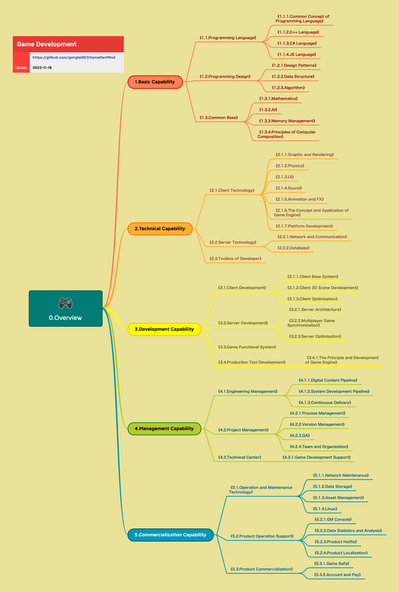

<p align="center">
  
  <h2 align="center">Online Game Development Map</h2>
  <p align="center">A quick navigation map for game developers.</p>
</p>

*[中文](README.md)* | *[English](README-en.md)*

```cpp
#include <iostream>
int main(){
    std::cout << "Hello, Game Development World!" << std::endl;
    return 0;
}
```
<br/>
<br/>

## Introduction
<p>
&emsp;&emsp;We recently organized an open source material library——"Online Game Development Map". The purpose is provide a quick manual for game technical developer to search or view the technology content in his work.
<br/>
</p>

<div align="center">
    <table style="width:640px;">
        <thead style="font-weight: bold; font-style: italic;">
            <tr>
                <td>&emsp;&emsp;✅ Has &emsp;&emsp;</td>
                <td>&emsp;&emsp;❌ Has not &emsp;&emsp;</td>
            </tr>
        </thead>
        <tbody>
            <tr>
                <td>&emsp;&emsp; ✓ Useful knowledge points. &emsp;&emsp;</td>
                <td>&emsp;&emsp; × <strike>Systematic knowledge explain.</strike> &emsp;&emsp;</td>
            </tr>
            <tr>
                <td>&emsp;&emsp; ✓ Technology application and experience. &emsp;&emsp;</td>
                <td>&emsp;&emsp; × <strike>Specific implementation details.</strike> &emsp;&emsp;</td>
            </tr>
            <tr>
                <td>&emsp;&emsp; ✓ Points or methods to consider. &emsp;&emsp;</td>
                <td>&emsp;&emsp; × <strike>Complete solution.</strike> &emsp;&emsp;</td>
            </tr>
        </tbody>
    </table>
</div>


## Overview


## Menu
### 1.Basic Capability
<p>

```cpp
```

</p>

* [1.1.Programming Language](md/1.1.编程语言.md)
    * [1.1.1.Common Concept of Programming Language](mds/1.1.1.编程语言共通概念.md)
    * [1.1.2.C++ Language](mds/1.1.2.C++语言.md)
    * [1.1.3.C# Language](mds/1.1.3.C%23%E8%AF%AD%E8%A8%80.md)
    * [1.1.4.JS Language](mds/1.1.4.JS语言.md)
    * [1.1.5.Programming Language Mix](mds/1.1.5.编程语言综合.md)
* [1.2.Programming Design](mds/1.2.程序设计.md)
    * [1.2.1.Design Patterns](mds/1.2.1.设计模式.md)
    * [1.2.2.Data Structure](mds/1.2.2.数据结构.md)
    * [1.2.3.Algorithm](mds/1.2.3.算法.md)
    * [1.2.4.Code Refactoring](mds/1.2.4.代码重构.md)
* [1.3.Common Base](mds/1.3.通用基础.md)
    * [1.3.1.Mathematics](mds/1.3.1.数学.md)
    * [1.3.2.AI](mds/1.3.2.人工智能.md)
    * [1.3.3.Memory Management](mds/1.3.3.内存管理.md)
    * [1.3.4.Principles of Computer Composition](mds/1.3.4.计算机组成原理.md)
<br/>

### 2.Technical Capability
<p>

```cpp
```

</p>

* [2.1.Client Technology](mds-en/2.1.Client%20Technology.md)
    * [2.1.1.Graphic and Rendering](mds/2.1.1.图形与渲染.md)
    * [2.1.2.Physics](mds/2.1.2.物理.md)
    * [2.1.3.UI](mds/2.1.3.UI.md)
    * [2.1.4.Sound](mds/2.1.4.声音.md)
    * [2.1.5.Animation and FX](mds/2.1.5.动画与特效.md)
    * [2.1.6.The Concept and Application of Game Engine](mds/2.1.6.游戏引擎概念与应用.md)
    * [2.1.7.Platform Development](mds/2.1.7.平台开发.md)
* [2.2.Server Technology](mds-en/2.2.Server%20Technology.md)
    * [2.2.1.Network and Communication](mds/2.2.1.网络与通信.md)
    * [2.2.2.Database](mds/2.2.2.数据库.md)
    * [2.2.3.Server Middleware](mds/2.2.3.服务端中间件.md)
* [2.3.Toolbox of Developer](mds/2.3.开发者工具箱.md)
<br/>

### 3.Development Capability
<p>

```cpp
```

</p>

* [3.1.Client Development](mds/3.1.客户端产品研发.md)
    * [3.1.1.Client Base System](mds/3.1.1.客户端底层通用系统.md)
    * [3.1.2.Client 3D Scene Development](mds/3.1.2.客户端3D场景开发.md)
    * [3.1.3.Client Optimization](mds/3.1.3.客户端优化.md)
    * [3.1.4.Client Network System](mds/3.1.4.客户端网络系统.md)
    * [3.1.5.Render and Effect](mds/3.1.5.效果与表现.md)
* [3.2.Server Development](mds/3.2.服务端产品研发.md)
    * [3.2.1.Server Architecture](mds/3.2.1.服务端架构.md)
    * [3.2.2.Multiplayer Game Synchronization](mds/3.2.2.网游网络同步.md)
    * [3.2.3.Server Optimization](mds/3.2.3.服务端优化.md)
    * [3.2.4.Server Basic Functions](mds/3.2.4.服务端基础功能.md)
* [3.3.Game Functional System](mds/3.3.业务层功能系统.md)
* [3.4.Production Tool Development](mds/3.4.生产工具研发.md)
    * [3.4.1.The Principle and Development of Game Engine](mds/3.4.1.游戏引擎原理与开发.md)
    * [3.4.2.Editor Development](mds/3.4.2.编辑器开发.md)
    * [3.4.3.Tool Development and Application](mds/3.4.3.工具开发与应用.md)
<br/>

### 4.Management Capability
<p>

```cpp
```

</p>

* [4.1.Engineering Management](mds/4.1.生产线研发.md)
    * [4.1.1.Digital Content Pipeline](mds/4.1.1.数字内容生产线.md)
    * [4.1.2.System Development Pipeline](mds/4.1.2.系统开发生产线.md)
    * [4.1.3.DevOps](mds/4.1.3.DevOps.md)
    * [4.1.4.Development Workflow](mds/4.1.4.开发工作流.md)
* [4.2.Project Management](mds-en/4.2.Project%20Management.md)
    * [4.2.1.Project Management Mix](mds/4.2.1.项目管理综合.md)
    * [4.2.2.Version Management](mds/4.2.2.版本管理.md)
    * [4.2.3.QA](mds/4.2.3.质量保证.md)
    * [4.2.4.Team and Organization](mds/4.2.4.团队与组织.md)
    * [4.2.5.SCRUM](mds/4.2.5.SCRUM.md)
* [4.3.Technical Center](mds/4.3.技术中台.md)
    * [4.3.1.Quick Development Framework](mds/4.3.1.游戏开发支持.md)
    * [4.3.2.Technical Support](mds/4.3.1.游戏开发支持.md)
<br/>
        
### 5.Commercialization Capability
<p>

```cpp
```

</p>

* [5.1.Operation and Maintenance Technology](mds/5.1.运维技术.md)
    * [5.1.1.Network Maintenance](mds/5.1.1.网络维护.md)
    * [5.1.2.Data Storage](mds/5.1.2.数据存储.md)
    * [5.1.3.Asset Management](mds/5.1.3.资产管理.md)
    * [5.1.4.Linux](mds/5.1.4.Linux系统.md)
    * [5.1.5.Middleware Operation](mds/5.1.5.中间件.md)
* [5.2.Product Operation Support](mds/5.2.产品运营支持.md)
    * [5.2.1.GM Console](mds/5.2.1.GM后台.md)
    * [5.2.2.Data Statistics and Analysis](mds/5.2.2.数据统计分析.md)
    * [5.2.3.Product Hotfix](mds/5.2.3.产品热更新.md)
    * [5.2.4.Product Localization](mds/5.2.4.产品本地化.md)
    * [5.2.5.Development Cooperation](mds/5.2.5.开发配合.md)
* [5.3.Product Commercialization](mds/5.3.产品商业化.md)
    * [5.3.1.Game Safe](mds/5.3.1.游戏安全.md)
    * [5.3.2.Account and Pay](mds/5.3.2.帐号与支付.md)
<br/>

## Discussions

[](https://github.com/gonglei007/GameDevMind/discussions)

## Contact us
Email: gonglei007@hotmail.com

## Preview


## Edit and View
* Use XMind to edit content of folder /xminds/.<br/>
* View quickly in folder /exports/.
* Markdown text content folder（/mds/）。<br/>

## Contributors

| [公雷(发起者)](https://github.com/gonglei007),&emsp; [Game Atom](https://github.com/gameatom),&emsp; [管仲才](https://github.com/guanzhongcai),&emsp; [王栋](https://github.com/wangdng),&emsp; ... |
| :---: |

We sincerely invite more contributors.

## Repo rosters
### Stargazers
[](https://github.com/gonglei007/GameDevMind/stargazers)
<br/>
### Forkers
[](https://github.com/gonglei007/GameDevMind/network/members)


## History

<div>

[2022-11-11]<br/>
* Do a lot of refactor to the materials.<br/>

</div>

<div>

[2022-06-22]<br/>
* The first version pushed to github.

</div>

