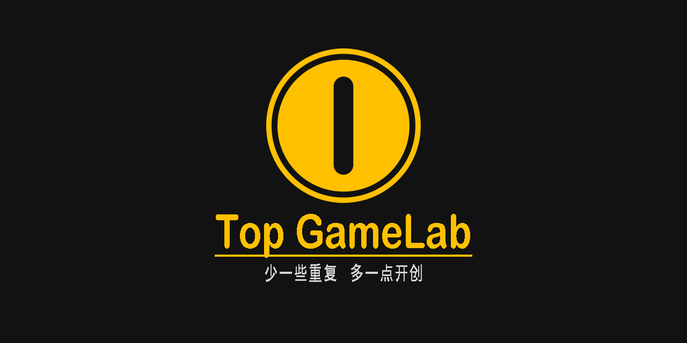
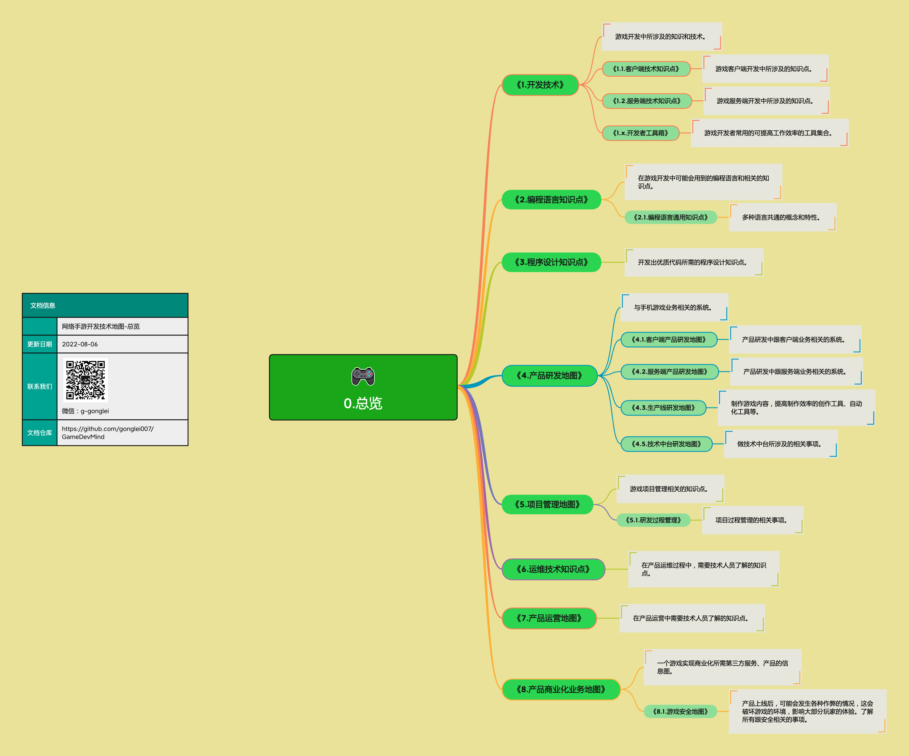
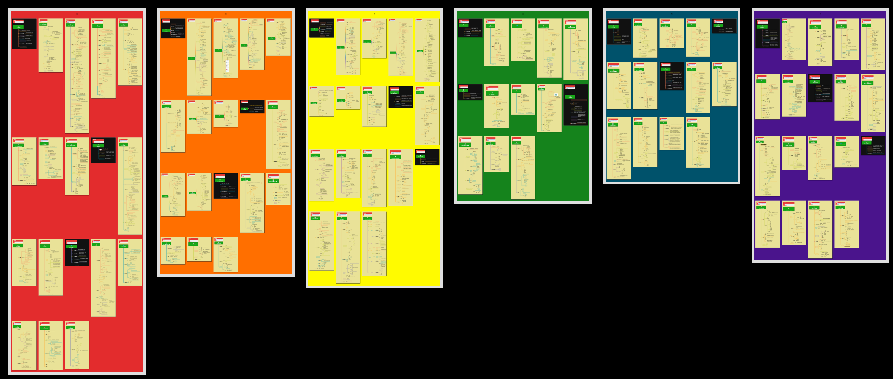

  
  <h1 align="center">游戏开发-技术图谱</h1>
<!--
  
  

    少一些重复，多一点创意
  

-->  
  

      
      
      
      
      
  

 

<!--
*[中文](README.md)* | *[English](README-en.md)*
-->

> *❝我们的愿景❞*   希望能通过我们的分享，让游戏开发者们在已知事情上节省时间，把省出来的时间投入到创造性的工作中，进而拓宽这个行业的技术边界。

 

## 介绍

> 时至今日，游戏行业已走过了半个世纪，但今天的游戏开发者们还是要花大把时间重复的去做着别人做过的事情。在这里我们整理了一套（技术侧的）《游戏开发图谱》，希望能帮助游戏开发者们在处理问题的时候，能快速地找问题要考虑的要点、方向或方案。

    <table style="width:640px;">
        <thead style="font-weight: bold; font-style: italic;">
            <tr>
                <td>&emsp;&emsp;✅ “有”什么？&emsp;&emsp;</td>
                <td>&emsp;&emsp;❌ “没有”什么？&emsp;&emsp;</td>
            </tr>
        </thead>
        <tbody>
            <tr>
                <td>&emsp;&emsp; ✓ 做什么用的？用在哪里？&emsp;&emsp;</td>
                <td>&emsp;&emsp; × <strike>系统的知识讲解。</strike>&emsp;&emsp;</td>
            </tr>
            <tr>
                <td>&emsp;&emsp; ✓ 会遇到哪些问题？用什么去解决？&emsp;&emsp;</td>
                <td>&emsp;&emsp; × <strike>具体的实现细节。</strike>&emsp;&emsp;</td>
            </tr>
            <tr>
                <td>&emsp;&emsp; ✓ 要考虑到的要点或方法。&emsp;&emsp;</td>
                <td>&emsp;&emsp; × <strike>完整的解决方案。</strike>&emsp;&emsp;</td>
            </tr>
        </tbody>
    </table>

 

## 阅读说明

* [在线阅读](README.md#正文) - 在线阅读，页面中附带了更多参考资料。
* [下载pdf版（预览版）](../../releases) - 在一些特定节点制作并发布pdf电子版，更便于本地阅读。
* [项目历史](HISTORY.md) - 项目的主要节点。

<!--
## 总览
 
 
 
-->

 

## 正文

  

游戏研运在技术方面需要具备的能力

<table border="none">
    <thead>
    </thead>
    <tbody>
        <tr>
            <td><a href="#1基础能力"></img></a></td>
            <td><a href="#2技术能力"></img></a></td>
            <td><a href="#3研发能力"></img></a></td>
        </tr>
        <tr>
            <td width="20%" align="center"><a href="#1基础能力">1.基础能力</a></td>
            <td width="20%" align="center"><a href="#2技术能力">2.技术能力</a></td>
            <td width="20%" align="center"><a href="#3研发能力">3.研发能力</a></td>
        </tr>
        <tr>
            <td><a href="#4生产能力"></img></a></td>
            <td><a href="#5管理能力"></img></a></td>
            <td><a href="#6运营能力"></img></a></td>
        </tr>
        <tr>
            <td width="20%" align="center"><a href="#4生产能力">4.生产能力</a></td>
            <td width="20%" align="center"><a href="#5管理能力">5.管理能力</a></td>
            <td width="20%" align="center"><a href="#6运营能力">6.运营能力</a></td>
        </tr>
    </tbody>
</table>

*[[ 图谱总览 ]](exports/0.总览.png)*

----

### 1.基础能力

> 游戏产品也是一种软件产品，所有的软件研发，就需要有一些共通的基础能力。这些基础能力是软件开发的基本功，基本功越强，整个产品的开发过程就会越稳健、高效。

* [1.1.编程语言](mds/1.1.编程语言.md)
    * [1.1.1.编程语言基础概念](mds/1.1.1.编程语言基础概念.md)
    * [⭕ 1.1.2.C++语言](mds/1.1.2.C++语言.md)
    * [1.1.3.C#语言](mds/1.1.3.C%23%E8%AF%AD%E8%A8%80.md)
    * [1.1.4.JS语言](mds/1.1.4.JS语言.md)
    * [1.1.5.编程语言综合](mds/1.1.5.编程语言综合.md)
    * [1.1.6.内存管理](mds/1.1.6.内存管理.md)
    * [1.1.7.编程语言高阶概念](mds/1.1.7.编程语言高阶概念.md)
* [1.2.程序设计](mds/1.2.程序设计.md)
    * [⭕ 1.2.1.设计模式](mds/1.2.1.设计模式.md)
    * [1.2.2.数据结构](mds/1.2.2.数据结构.md)
    * [1.2.3.算法](mds/1.2.3.算法.md)
* [1.3.通用基础](mds/1.3.通用基础.md)
    * [⭕ 1.3.1.数学](mds/1.3.1.数学.md)
    * [1.3.2.人工智能](mds/1.3.2.人工智能.md)
    * [1.3.3.操作系统](mds/1.3.3.操作系统.md)
    * [1.3.4.计算机组成原理](mds/1.3.4.计算机组成原理.md)
    * [1.3.5.计算机网络](mds/1.3.5.计算机网络.md)
 

### 2.技术能力

> 游戏软件有其特定的技术要求，要研发游戏产品，就可能会需要具备这些技术。

* [2.1.客户端技术](mds/2.1.客户端技术.md)
    * [⭕ 2.1.1.图形与渲染](mds/2.1.1.图形与渲染.md)
    * [⭕ 2.1.2.物理](mds/2.1.2.物理.md)
    * [⭕ 2.1.3.UI](mds/2.1.3.UI.md)
    * [⭕ 2.1.4.声音](mds/2.1.4.声音.md)
    * [2.1.5.动画与特效](mds/2.1.5.动画与特效.md)
    * [2.1.6.游戏引擎概念与应用](mds/2.1.6.游戏引擎概念与应用.md)
    * [2.1.7.平台开发](mds/2.1.7.平台开发.md)
* [2.2.服务端技术](mds/2.2.服务端技术.md)
    * [2.2.1.网络与通信](mds/2.2.1.网络与通信.md)
    * [2.2.2.数据库](mds/2.2.2.数据库.md)
    * [2.2.3.服务端中间件](mds/2.2.3.服务端中间件.md)
* [2.3.开发者工具箱](mds/2.3.开发者工具箱.md)
    * [2.3.1.通用工具](mds/2.3.1.通用工具.md)
    * [2.3.2.客户端开发工具](mds/2.3.2.客户端开发工具.md)
    * [2.3.3.服务端开发工具](mds/2.3.3.服务端开发工具.md)
    * [2.3.4.设计工具](mds/2.3.4.设计工具.md)
    * [2.3.5.日常工具](mds/2.3.5.日常工具.md)
 

### 3.研发能力

> 游戏是一种有艺术成分的商品，它是由数字内容和互动功能构建起来的。开发一款游戏产品，要有跟其它软件产品不同的一系列的技术、方法、工具和流程。

* [3.1.客户端产品研发](mds/3.1.客户端产品研发.md)
    * [⭕ 3.1.1.客户端底层通用系统](mds/3.1.1.客户端底层通用系统.md)
    * [3.1.2.客户端3D场景开发](mds/3.1.2.客户端3D场景开发.md)
    * [⭕ 3.1.3.客户端优化](mds/3.1.3.客户端优化.md)
    * [⭕ 3.1.4.客户端网络系统](mds/3.1.4.客户端网络系统.md)
    * [3.1.5.渲染与特效](mds/3.1.5.渲染与特效.md)
    * [3.1.6.UI系统](mds/3.1.6.UI系统.md)
    * [3.1.7.客户端中间件](mds/3.1.7.客户端中间件.md)
* [3.2.服务端产品研发](mds/3.2.服务端产品研发.md)
    * [⭕ 3.2.1.服务端底层架构](mds/3.2.1.服务端底层架构.md)
    * [3.2.2.网游网络同步](mds/3.2.2.网游网络同步.md)
    * [3.2.3.服务端优化](mds/3.2.3.服务端优化.md)
    * [3.2.4.服务端基础功能](mds/3.2.4.服务端基础功能.md)
    * [⭕ 3.2.5.服务端业务架构](mds/3.2.5.服务端业务架构.md)
* [3.3.业务层功能系统](mds/3.3.业务层功能系统.md)
    * [⭕ 3.3.1.摄像机控制](mds/3.3.1.摄像机控制.md)
    * [3.3.2.角色](mds/3.3.2.角色.md)
* [3.4.游戏生产](mds/3.4.游戏生产.md)
    * [⭕ 3.4.1.AI助力游戏研运](mds/3.4.1.AI助力游戏研运.md)
    * [3.4.2.编辑器开发](mds/3.4.2.编辑器开发.md)
    * [3.4.3.工具开发与应用](mds/3.4.3.工具开发与应用.md)
    * [3.4.4.游戏数据文件](mds/3.4.4.游戏数据文件.md)
* [3.5.游戏引擎原理与开发](mds/3.5.游戏引擎原理与开发.md)
    * [3.5.1.引擎的基本功能系统](mds/3.5.1.引擎的基本功能系统.md)
    * [3.5.2.引擎的其它系统](mds/3.5.2.引擎的其它系统.md)
 

### 4.管理能力

> 管理中最具挑战的是尺度、分寸与随机应变。火候少一分，生了；火候多一分，焦了。追求的是复杂的事情简单化，面对的也可能是简单的事情复杂化。

* [4.1.工程管理](mds/4.1.工程管理.md)
    * [4.1.1.数字内容生产线](mds/4.1.1.数字内容生产线.md)
    * [⭕ 4.1.2.系统开发生产线](mds/4.1.2.系统开发生产线.md)
    * [4.1.3.代码质量管理](mds/4.1.3.代码质量管理.md)
    * [4.1.4.开发工作流](mds/4.1.4.开发工作流.md)
* [4.2.项目管理](mds/4.2.项目管理.md)
    * [4.2.1.项目里程](mds/4.2.1.项目里程.md)
    * [4.2.2.版本管理](mds/4.2.2.版本管理.md)
    * [4.2.3.质量保证](mds/4.2.3.质量保证.md)
    * [4.2.4.团队与组织](mds/4.2.4.团队与组织.md)
    * [4.2.5.SCRUM](mds/4.2.5.SCRUM.md)
    * [⭕ 4.2.6.团队管理](mds/4.2.6.团队管理.md)
    * [4.2.7.项目管理综合](mds/4.2.7.项目管理综合.md)
* [4.3.技术中台](mds/4.3.技术中台.md)
    * [4.3.1.快速开发框架](mds/4.3.1.快速开发框架.md)
    * [4.3.2.技术支持](mds/4.3.2.技术支持.md)
    * [4.3.3.DevOps](mds/4.3.3.DevOps.md)
 

### 5.运营能力

> 作为一个组织，不论你有什么样的技术或能力，一个最重要的目标是——赚钱。在当下的市场环境下，一款好玩的游戏做出来了不一定就能够赚钱。还需要有一系列运营能力，才能让产品运转和盈利，让团队持续存活。 （这里只展示跟技术相关的那些）

* [5.1.运维技术](mds/5.1.运维技术.md)
    * [⭕ 5.1.1.网络维护](mds/5.1.1.网络维护.md)
    * [5.1.2.数据存储](mds/5.1.2.数据存储.md)
    * [5.1.3.资产管理](mds/5.1.3.资产管理.md)
    * [5.1.4.Linux系统](mds/5.1.4.Linux系统.md)
    * [5.1.5.中间件运维](mds/5.1.5.中间件运维.md)
    * [⭕ 5.1.6.网络安全](mds/5.1.6.网络安全.md)
* [5.2.产品运营支持](mds/5.2.产品运营支持.md)
    * [5.2.1.GM后台](mds/5.2.1.GM后台.md)
    * [5.2.2.数据统计分析](mds/5.2.2.数据统计分析.md)
    * [⭕ 5.2.3.产品热更新](mds/5.2.3.产品热更新.md)
    * [5.2.4.产品本地化](mds/5.2.4.产品本地化.md)
    * [5.2.5.开发配合](mds/5.2.5.开发配合.md)
* [5.3.产品商业化](mds/5.3.产品商业化.md)
    * [5.3.1.游戏安全](mds/5.3.1.游戏安全.md)
    * [5.3.2.帐号与支付](mds/5.3.2.帐号与支付.md)
    * [5.3.3.第三方服务](mds/5.3.3.第三方服务.md)
 

## 缩略预览

 

## 交流讨论
欢迎进群、进讨论区交流和分享游戏开发中遇到的问题或者解决方案。

|  |  |
| --- | -------- |
| QQ群: | 242500383  |
|  |  |
| 讨论区: | [https://github.com/gonglei007/GameDevMind/discussions](https://github.com/gonglei007/GameDevMind/discussions) |

 

<!--
## 编辑与查看
* 资料库使用XMind编辑内容（/xminds/目录）。 
* 也可以快速查看导出图（/exports/目录）。 
* markdown文本内容（/mds/目录）。 
-->

## 支持者
### 贡献者

| [公雷](https://github.com/gonglei007),&emsp; [Atom](https://github.com/gameatom),&emsp; [管仲才](https://github.com/guanzhongcai),&emsp; [王栋](https://github.com/wangdng),&emsp; [KK](https://github.com/manchurio),&emsp; [陈运雄](https://github.com/chenyunxiong),&emsp;... |
| :---: |

【虚席以待...】 诚挚的邀请更多参与者来一起完善资料库。
 

### Stargazers

 

### Forkers

 

## 联系我们

[-Email-] 

<gonglei007@hotmail.com>  

[-微信-] 

  

