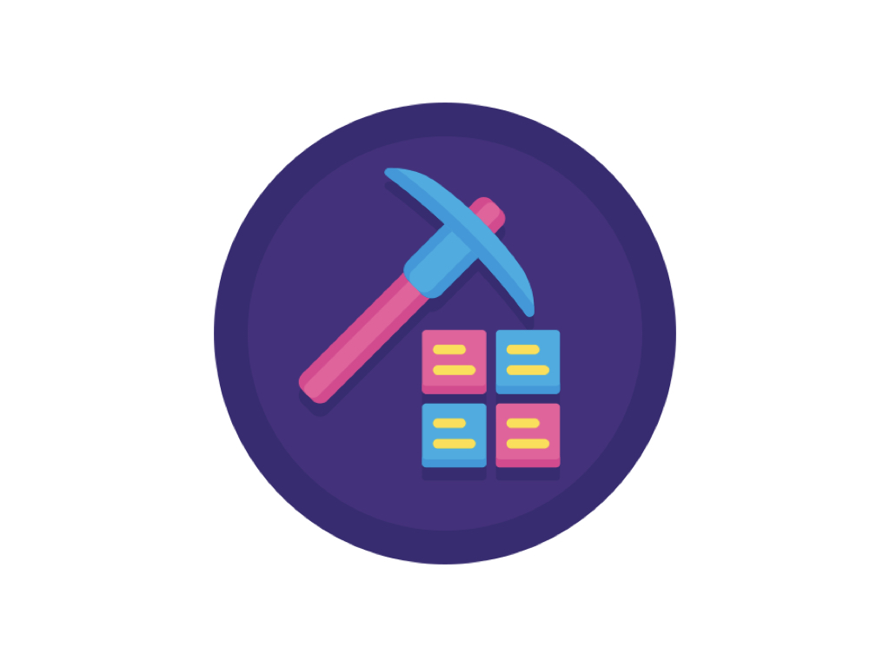

  
  <h1 align="center">游戏开发-技术图谱</h1>
<!--
  
  

    少一些重复，多一点创意
  

-->  
  

      
      
      
      
      
  

 

[English](https://github.com/gonglei007/GameDevMind-EN)

 

> *❝我们的愿景❞*   希望能通过我们的分享，让游戏开发者们在已知事情上节省时间，把省出来的时间投入到创造性的工作中，进而拓宽这个行业的技术边界。

 

## 介绍

> 时至今日，游戏行业已走过了半个世纪，但今天的游戏开发者们还是要花大把时间重复的去做着别人做过的事情。在这里我们整理了一套（技术侧的）《游戏开发图谱》，希望能帮助游戏开发者们在处理问题的时候，能快速地找问题要考虑的要点、方向或方案。

    <table style="width:640px;">
        <thead style="font-weight: bold; font-style: italic;">
            <tr>
                <td>&emsp;&emsp;✅ “有”什么？&emsp;&emsp;</td>
                <td>&emsp;&emsp;❌ “没有”什么？&emsp;&emsp;</td>
            </tr>
        </thead>
        <tbody>
            <tr>
                <td>&emsp;&emsp; ✓ 做什么用的？用在哪里？&emsp;&emsp;</td>
                <td>&emsp;&emsp; × <strike>系统的知识讲解。</strike>&emsp;&emsp;</td>
            </tr>
            <tr>
                <td>&emsp;&emsp; ✓ 会遇到哪些问题？用什么去解决？&emsp;&emsp;</td>
                <td>&emsp;&emsp; × <strike>具体的实现细节。</strike>&emsp;&emsp;</td>
            </tr>
            <tr>
                <td>&emsp;&emsp; ✓ 要考虑到的要点或方法。&emsp;&emsp;</td>
                <td>&emsp;&emsp; × <strike>完整的解决方案。</strike>&emsp;&emsp;</td>
            </tr>
        </tbody>
    </table>

 

## 阅读说明

* [在线阅读](README.md#正文) - 在线阅读，页面中附带了更多参考资料。
<!-- * [下载pdf版（预览版）](../../releases) - 在一些特定节点制作并发布pdf电子版，更便于本地阅读。-->
* [项目历史](HISTORY.md) - 项目的主要节点。

## 最近提交
- 添加update-readme.yml ([e2d83c4](https://github.com/gonglei007/GameDevMind/commit/e2d83c450c6015985de3416e4e114d4a730098f3))
<!--
## 总览
 
 
 
-->

 

## 正文
> 游戏研运在技术方面需要具备的能力

  

----

### 1.基础能力
<table width="100%" border=1>
    <tr>
        <td width="256" height="192">
            <a href="mds/1.基础能力/1.基础能力.md"></img></a>
        </td>
        <td>
            

            作为一种软件产品，游戏开发需要具备一些基础能力。这些能力在软件开发中至关重要，是开发过程中的基本技能。而基础技能的熟练程度越高，整个游戏产品的开发过程就会更加稳健、高效。
            

             
            
<a href="mds/1.基础能力/1.基础能力.md">[阅读详细内容...]</a>

        </td>
    </tr>
</table>

 

### 2.技术能力
<table width="100%" border=1>
    <tr>
        <td width="256" height="192">
            <a href="mds/2.技术能力/2.技术能力.md"></img></a>
        </td>
        <td>
            

                游戏产品在开发中也有其特定的技术需求，要研发一款游戏产品，会需要具备这些技术能力。
            

             
            
<a href="mds/2.技术能力/2.技术能力.md">[阅读详细内容...]</a>

        </td>
    </tr>
</table>

 

### 3.研发能力
<table width="100%" border=1>
    <tr>
        <td width="256" height="192">
            <a href="mds/3.研发能力/3.研发能力.md"></img></a>
        </td>
        <td>
            

                游戏是一种有艺术成分的商品，它是由数字内容和互动功能构建起来的。开发一款游戏产品，要有跟其它软件产品不同的一系列的技术、方法、工具和流程。
            

             
            
<a href="mds/3.研发能力/3.研发能力.md">[阅读详细内容...]</a>

        </td>
    </tr>
</table>

 

### 4.生产能力
<table width="100%" border=1>
    <tr>
        <td width="256" height="192">
            <a href="mds/4.生产能力/4.生产能力.md"></img></a>
        </td>
        <td>
            

                随着游戏行业的发展，游戏产品的研发规模越来越大，这时候除了产品内容怎么好玩，产品核心功能怎么开发之外，产品如何高效的生产也变得非常重要，这就需要各种工具和方法来提高生产效率。
            

             
            
<a href="mds/4.生产能力/4.生产能力.md">[阅读详细内容...]</a>

        </td>
    </tr>
</table>

 

### 5.管理能力
<table width="100%" border=1>
    <tr>
        <td width="256" height="192">
            <a href="mds/5.管理能力/5.管理能力.md"></img></a>
        </td>
        <td>
            

                管理中最具挑战的是尺度、分寸与随机应变。火候少一分，生了；火候多一分，焦了。追求的是复杂的事情简单化，面对的也可能是简单的事情复杂化。
            

             
            
<a href="mds/5.管理能力/5.管理能力.md">[阅读详细内容...]</a>

        </td>
    </tr>
</table>

 

### 6.运营能力
<table width="100%" border=1>
    <tr>
        <td width="256" height="192">
            <a href="mds/6.运营能力/6.运营能力.md"></img></a>
        </td>
        <td>
            

                作为一个组织，不论你有什么样的技术或能力，一个最重要的目标是——赚钱。在当下的市场环境下，一款好玩的游戏做出来了不一定就能够赚钱。还需要有一系列运营能力，才能让产品运转和盈利，让团队持续存活。 （这里只展示跟技术相关的那些）
            

             
            
<a href="mds/6.运营能力/6.运营能力.md">[阅读详细内容...]</a>

        </td>
    </tr>
</table>

 

### 游戏研运资产样例-SLG手游（2D）
<table width="100%" border=1>
    <tr>
        <td width="256" height="192">
            <a href="mds/游戏研运资产样例-SLG手游（2D）.md"></img></a>
        </td>
        <td>
            

                要开发并上线运营一款 SLG 手游（2D），需要准备好并积累下来的全套相关资产清单。可用于辅助评估项目内容、项目成本、项目工作量等，为游戏立项或投资提供参考。
            

             
            
<a href="mds/游戏研运资产样例-SLG手游（2D）.md">[阅读详细内容...]</a>

        </td>
    </tr>
</table>

## 缩略预览
*[[ 图谱总览 ]](exports/0.总览.png)*

 

## 合作组织

    <table border=1 style="background:black;">
        <tr>
            <td align="center" style="padding: 0px;">
                <a href="https://www.finclip.com/landing/miniappgame?from=gamedevmind" target="_blank"></img></a>
            </td>
        </tr>
        <tr>
            <td align="center" style="background:#0f3fff;padding: 0px;">
                <a href="https://club.gltop.com" target="_blank"></img></a>
            </td>
        </tr>
    </table>

## 交流讨论
欢迎进群、进讨论区交流和分享游戏开发中遇到的问题或者解决方案。

|  |  |
| --- | -------- |
| QQ群: | 242500383    |
|  |  |
| 讨论区: | [https://github.com/gonglei007/GameDevMind/discussions](https://github.com/gonglei007/GameDevMind/discussions) |

<!--
## 编辑与查看
* 资料库使用XMind编辑内容（/xminds/目录）。 
* 也可以快速查看导出图（/exports/目录）。 
* markdown文本内容（/mds/目录）。 
-->

## 贡献者

| [公雷](https://github.com/gonglei007),&emsp; [Atom](https://github.com/gameatom),&emsp; [管仲才](https://github.com/guanzhongcai),&emsp; [王栋](https://github.com/wangdng),&emsp; [KK](https://github.com/manchurio),&emsp; [陈运雄](https://github.com/chenyunxiong),&emsp;[彭静](https://github.com/goddie),&emsp;[宋博](https://github.com/ax-jason),&emsp; [Hardy LYU](https://github.com/Colythme),&emsp;... |
| :---: |

【虚席以待...】 诚挚的邀请更多参与者来一起完善资料库。
 

<!--
### Stargazers

 

### Forkers

 
-->

## 联系我们

[-Email-] 

<gonglei007@hotmail.com>  

[-微信-] 

  

