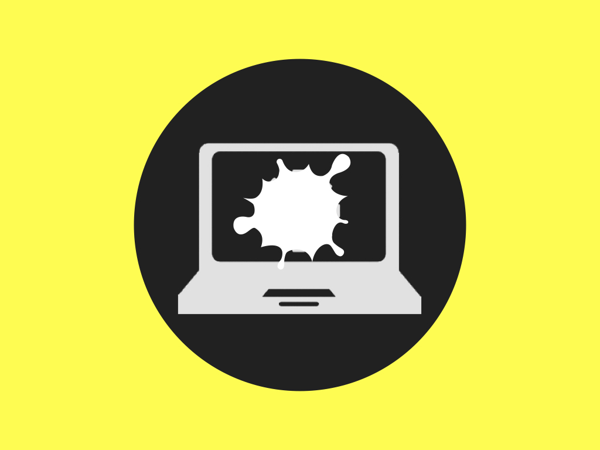
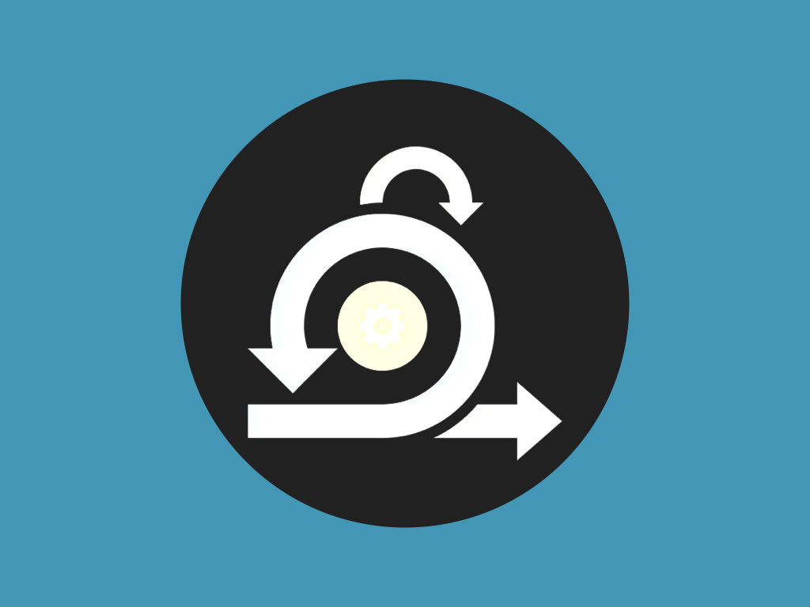
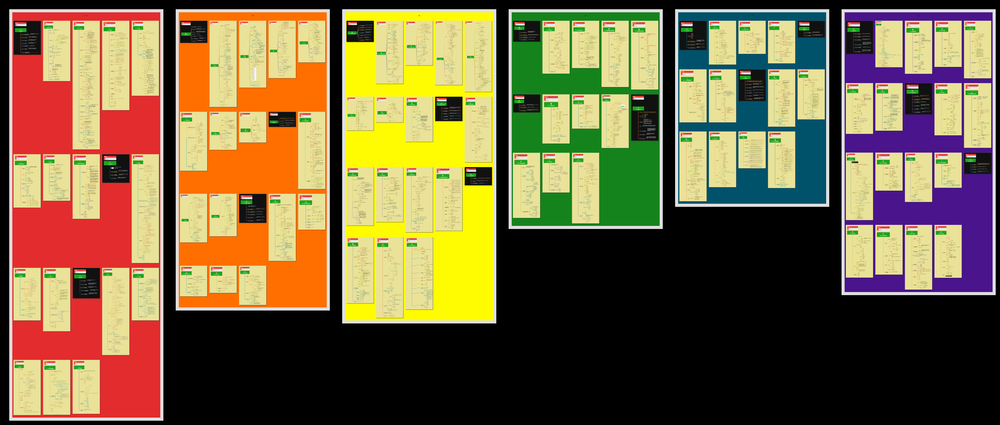
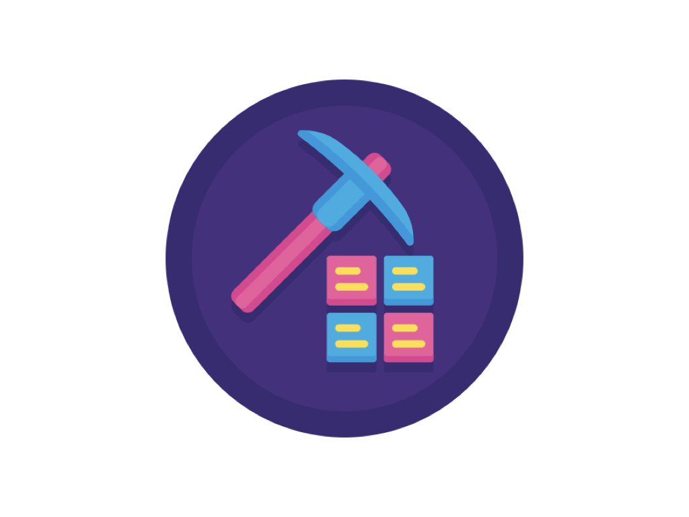

  <h1 align="center">游戏开发 · 技术图谱</h1>
  

      
      
      
      
      
  

  

    <a href="https://github.com/gonglei007/GameDevMind-EN">English</a>
    &nbsp;|&nbsp;
    <a href="https://www.zhihu.com/column/c_2015116242835482449">知乎专栏</a>
    &nbsp;|&nbsp;
    <a href="mds/阅读说明.md">阅读说明</a>
    &nbsp;|&nbsp;
    <a href="INDEX.md">📑 文档索引</a>
    &nbsp;|&nbsp;
    <a href="HISTORY.md">📋 更新日志</a>
    &nbsp;|&nbsp;
    <a href="https://gonglei007.github.io/GameDevMind/nav/">🔍 交互式导航</a>
    &nbsp;|&nbsp;
    <a href="https://gonglei007.github.io/GameDevMind/nav/panorama.html">🗺️ 全景图</a>
    &nbsp;|&nbsp;
    <strong>Powered by <a href="https://www.gltop.com?from=gamedevmind">顶游社</a></strong>
  

 

> 💡 **我们的愿景**
>
> 希望通过这份资料的分享，帮大家在已经有人走过的"老路"上节省时间 ⏳，把宝贵的精力投入到真正有创造力的事情上 🛠️🎨，一起拓展游戏开发这片土地的技术边界 🚀！

 

| 📊 121 篇文档 | 💻 2 套代码集合 | 🏥 8 个实战案例 | 🤖 5 个 AI 对话 |
|:---:|:---:|:---:|:---:|
| [开始阅读 →](mds/阅读说明.md) | [运行代码 →](code/README.md) | [看案例 →](cases/README.md) | [看对话 →](ai-cases/README.md) |

 

## 介绍

游戏开发已经走过了半个多世纪，但开发者们常常还得重复造轮子。我们希望通过整理这份（技术向的）**《游戏开发图谱》**，帮你在面对问题时快速抓住关键点，找到解决方向，少踩坑，多飞跃。

 

<table style="width:640px; border-collapse: collapse;">
    <thead>
        <tr style="background:#f6f8fa;">
            <th style="padding:10px 18px; text-align:left;">✅ 这份图谱是</th>
            <th style="padding:10px 18px; text-align:left;">📦 另配套提供</th>
        </tr>
    </thead>
    <tbody>
        <tr>
            <td style="padding:8px 18px;">🎯 是做什么的？在哪用？</td>
            <td style="padding:8px 18px;">💻 <a href="code/README.md">可运行的代码示例</a></td>
        </tr>
        <tr>
            <td style="padding:8px 18px;">🛠️ 会遇到哪些问题？用什么解决？</td>
            <td style="padding:8px 18px;">🏥 <a href="cases/README.md">真实踩坑案例</a></td>
        </tr>
        <tr>
            <td style="padding:8px 18px;">🔍 要点和思考方向</td>
            <td style="padding:8px 18px;">🤖 <a href="ai-cases/README.md">AI 协作实战记录</a></td>
        </tr>
    </tbody>
</table>

 

## 📖 阅读说明

* [mds/阅读说明.md](mds/阅读说明.md) — 内容结构、文档格式、推荐阅读路径、如何配合 AI 使用
* [mds/topics/推荐阅读路径.md](mds/topics/推荐阅读路径.md) — **三条主路径**（新人入门 / 研发实战 / 上线运营）详细文档清单
* [INDEX.md](INDEX.md) · [KEYWORDS.md](KEYWORDS.md) · [HISTORY.md](HISTORY.md) · [常见问题](mds/topics/常见问题.md)

 

## 🧭 三条推荐路径

> 121 篇文档如何读？按你的阶段选一条路径，配合 [交互式导航](https://gonglei007.github.io/GameDevMind/nav/) 一键筛选。

| 路径 | 适合谁 | 入口 |
|------|--------|------|
| **A · 新人入门线** | 在校生、转行者、0～1 年 | [开始 →](mds/topics/推荐阅读路径.md#路径-a新人入门线) |
| **B · 研发实战线** | 1～5 年客户端/服务端/全栈 | [开始 →](mds/topics/推荐阅读路径.md#路径-b研发实战线) |
| **C · 上线运营线** | 主程、CTO、准备上线团队 | [开始 →](mds/topics/推荐阅读路径.md#路径-c上线运营线) |

 

## 📚 正文

> 游戏研运在技术方面需要具备的能力

六大能力按照游戏产品的价值链组织，而不是简单按岗位或技术栈平铺：

```mermaid
flowchart LR
    A["基础知识"] --> B["游戏专项技术"]
    B --> C["游戏产品研发"]
    C --> D["工业化生产"]
    D --> E["管理协作"]
    E --> F["上线运营"]
    F --> G["持续盈利"]
```

具体判定标准见 [知识结构分层规范](docs/知识结构分层规范.md)。每篇正文只有一个主归属，跨层关系通过专题路径、标签和关联链接表达。

---

<table width="100%" border=1 style="border-collapse: collapse;">
    <tr>
        <td width="220" style="padding: 12px; vertical-align: top; text-align:center;">
            <a href="mds/1.基础能力/1.基础能力.md"><strong>1. 基础能力</strong></a>
              
            <a href="mds/1.基础能力/1.基础能力.md"></img></a>
        </td>
        <td style="padding: 14px 16px; vertical-align: top;">
            
与游戏行业相关、但不限于游戏行业的编程、数学、计算机系统和软件工程基础。

            
<a href="mds/1.基础能力/1.基础能力.md">阅读详细内容 →</a>

        </td>
    </tr>
    <tr>
        <td width="220" style="padding: 12px; vertical-align: top; text-align:center;">
            <a href="mds/2.技术能力/2.技术能力.md"><strong>2. 技术能力</strong></a>
              
            <a href="mds/2.技术能力/2.技术能力.md"></img></a>
        </td>
        <td style="padding: 14px 16px; vertical-align: top;">
            
可跨游戏项目复用的图形、物理、UI、音频、引擎、网络和数据专项技术。

            
<a href="mds/2.技术能力/2.技术能力.md">阅读详细内容 →</a>

        </td>
    </tr>
    <tr>
        <td width="220" style="padding: 12px; vertical-align: top; text-align:center;">
            <a href="mds/3.研发能力/3.研发能力.md"><strong>3. 研发能力</strong></a>
              
            <a href="mds/3.研发能力/3.研发能力.md"></img></a>
        </td>
        <td style="padding: 14px 16px; vertical-align: top;">
            
面向游戏产品本身的客户端、服务端、玩法、业务系统和运行时架构。

            
<a href="mds/3.研发能力/3.研发能力.md">阅读详细内容 →</a>

        </td>
    </tr>
    <tr>
        <td width="220" style="padding: 12px; vertical-align: top; text-align:center;">
            <a href="mds/4.生产能力/4.生产能力.md"><strong>4. 生产能力</strong></a>
              
            <a href="mds/4.生产能力/4.生产能力.md"></img></a>
        </td>
        <td style="padding: 14px 16px; vertical-align: top;">
            
围绕内容、数据、工具、自动化、技术中台和交付流水线建立游戏工业化生产能力。

            
<a href="mds/4.生产能力/4.生产能力.md">阅读详细内容 →</a>

        </td>
    </tr>
    <tr>
        <td width="220" style="padding: 12px; vertical-align: top; text-align:center;">
            <a href="mds/5.管理能力/5.管理能力.md"><strong>5. 管理能力</strong></a>
              
            <a href="mds/5.管理能力/5.管理能力.md"></img></a>
        </td>
        <td style="padding: 14px 16px; vertical-align: top;">
            
围绕角色、流程、目标、质量、版本、项目、团队和风险的生产管理能力。

            
<a href="mds/5.管理能力/5.管理能力.md">阅读详细内容 →</a>

        </td>
    </tr>
    <tr>
        <td width="220" style="padding: 12px; vertical-align: top; text-align:center;">
            <a href="mds/6.运营能力/6.运营能力.md"><strong>6. 运营能力</strong></a>
              
            <a href="mds/6.运营能力/6.运营能力.md"></img></a>
        </td>
        <td style="padding: 14px 16px; vertical-align: top;">
            
产品上线后的运维、LiveOps、数据分析、用户服务、商业化、安全、合规和持续盈利能力。

            
<a href="mds/6.运营能力/6.运营能力.md">阅读详细内容 →</a>

        </td>
    </tr>
</table>

---

## 📈 知识全景

*[[ 图谱总览 ]](exports/0.总览.png)*

> 🖱️ [查看交互式全景图 →](https://gonglei007.github.io/GameDevMind/nav/panorama.html)

---

## 💻 配套代码示例

> 📦 两套可运行示例：图谱章节配套（C++/C#）+ 专栏文章样例（Python）

### 图谱配套 · [gamedevmind/](code/gamedevmind/)

| 示例 | 知识点 | 亮点 |
|------|--------|------|
| [内存池](code/gamedevmind/1.基础能力/1.1.2.C++语言/memory_pool/) | C++ 内存管理 | malloc vs 池化 10 万次性能对比 |
| [智能指针陷阱](code/gamedevmind/1.基础能力/1.1.2.C++语言/smart_pointer/) | unique_ptr / shared_ptr / weak_ptr | 循环引用泄漏 vs 修复对比日志 |
| [命令模式](code/gamedevmind/1.基础能力/1.2.1.设计模式/command/) | 设计模式 | 游戏输入录制 / 撤销 / 回放 |
| [对象池](code/gamedevmind/1.基础能力/1.2.1.设计模式/object_pool/) | 设计模式 | 子弹系统 new/delete vs 对象池 |
| [四叉树](code/gamedevmind/1.基础能力/1.2.2.数据结构/quadtree/) | 数据结构 | 碰撞检测 O(n²) vs 空间分区 |
| [帧同步 vs 状态同步](code/gamedevmind/2.技术能力/2.2.1.网络与通信/network_sync/) | 网络同步 | Lockstep vs State Sync 本地模拟 |
| [六边形网格 + A*](code/gamedevmind/3.研发能力/3.1.2.客户端3D场景开发/hex_grid/) | 地图/寻路 | Cube 坐标 + ASCII 可视化 |

### 文章样例 · [artile-sample-code/](code/artile-sample-code/)

知乎专栏《游戏开发图谱》文章引用的 Python（及少量 C++）样例，覆盖基础 / 技术 / 研发 / 生产 / 管理 / 运营 / 专题等篇章，约 43 个零依赖可运行示例。

[📂 查看全部代码集合 →](code/README.md)

---

## 🏥 实战案例

> 💡 别人踩过的坑，就是你最好的老师

| 案例 | 症状 | 根因 | 对应图谱 |
|------|------|------|----------|
| [SLG手游内存泄漏](cases/memory-leak-slg.md) | 挂机2小时后OOM崩溃 | shared_ptr 循环引用 | C++·智能指针 |
| [MOBA角色回弹](cases/network-reconciliation.md) | 海外玩家角色频繁回弹 | 客户端预测与服务器校正冲突 | 网游网络同步 |
| [开放世界卡顿](cases/drawcall-optimization.md) | Draw Call 3000+，帧率22fps | 材质未复用+无LOD+无合批 | 客户端优化 |
| [服务器死锁](cases/server-deadlock.md) | 不定期卡死无响应 | 逻辑线程与网络线程ABBA死锁 | 操作系统·多线程 |
| [排行榜查询超时](cases/leaderboard-optimization.md) | 全服排行查询5秒超时 | 无索引全表扫描+无缓存 | 数据库 |

[📂 查看全部案例 →](cases/README.md)

---

## 🤖 AI 实战对话

> 💬 真实的 AI 协作过程——包含 prompt、AI 输出、人工修正和最终成果

| 对话 | AI 工具 | 场景 |
|------|---------|------|
| [用 Claude 设计内存池](ai-cases/cpp-memory-pool.md) | Claude | C++ 服务器内存池，从初版到 ARM 对齐修正 |
| [用 Cursor 优化 Draw Call](ai-cases/unity-drawcall-optimization.md) | Cursor | Unity 项目从 3200 Draw Call 降到 480 |
| [用 ChatGPT 设计缓存方案](ai-cases/go-leaderboard-cache.md) | ChatGPT | Go 排行榜查询从 5s 优化到 8ms |

> 🛠️ 附：[.cursorrules 游戏开发模板](.cursorrules.example) · [CLAUDE.md 项目记忆模板](CLAUDE.md.example)

[📂 查看全部 AI 对话 →](ai-cases/README.md)

---

## 🧑‍💻 游戏程序员职业发展路径

<table width="100%" border=1 style="border-collapse: collapse;">
    <tr>
        <td width="220" style="padding: 12px; vertical-align: top; text-align:center;">
            <a href="mds/topics/游戏程序员职业发展路径.md"><strong>游戏程序员职业发展路径</strong></a>
              
            <a href="mds/topics/游戏程序员职业发展路径.md"></img></a>
        </td>
        <td style="padding: 14px 16px; vertical-align: top;">
            
游戏程序员在不同职业阶段需要具备的能力和职责，以及对应的学习资源。从初级程序员到技术主管，每个阶段都有明确的能力要求和成长路径。

            
<a href="mds/topics/游戏程序员职业发展路径.md">阅读详细内容 →</a>

        </td>
    </tr>
</table>

---

## 📊 游戏研运资产样例 · SLG手游（2D）

<table width="100%" border=1 style="border-collapse: collapse;">
    <tr>
        <td width="220" style="padding: 12px; vertical-align: top; text-align:center;">
            <a href="mds/游戏研运资产样例-SLG手游（2D）.md"><strong>游戏研运资产样例</strong></a>
              
            <a href="mds/游戏研运资产样例-SLG手游（2D）.md"></img></a>
        </td>
        <td style="padding: 14px 16px; vertical-align: top;">
            
要开发并上线运营一款 SLG 手游（2D），需要准备并积累的全套资产清单。可用于辅助评估项目内容、项目成本、项目工作量等，为游戏立项或投资提供参考。

            
<a href="mds/游戏研运资产样例-SLG手游（2D）.md">阅读详细内容 →</a>

        </td>
    </tr>
</table>

---

## 💬 交流与关注

欢迎通过以下方式交流、分享游戏开发中遇到的问题或解决方案。

| 方式 | 链接/信息 |
| --- | --- |
| **知乎专栏** | [《游戏开发图谱》](https://www.zhihu.com/column/c_2015116242835482449) — 专栏文章与深度解读 |
| **QQ 群** | 242500383  |
| **讨论区** | [GitHub Discussions](https://github.com/gonglei007/GameDevMind/discussions) |

---

## 🙏 特别鸣谢

    <table border=1 style="background:#f6f8fa; border-collapse: collapse;">
        <tr>
            <td align="center" style="background:#ffffff; padding: 12px;">
                <a href="https://vika.cn?from=gamedevmind" target="_blank"></img></a>
            </td>
        </tr>
        <!--tr>
            <td align="center" style="background:#ffffff; padding: 12px;">
                <a href="https://www.finclip.com/landing/miniappgame?from=gamedevmind" target="_blank"></img></a>
            </td>
        </tr-->
        <tr>
            <td align="center" style="background:#ffffff; padding: 12px;">
                <a href="https://www.gltop.com?from=gamedevmind" target="_blank"></img></a>
            </td>
        </tr>
    </table>

---

## 👥 贡献者

感谢所有为这个项目做出贡献的开发者！

[公雷](https://github.com/gonglei007) · [Atom](https://github.com/gameatom) · [管仲才](https://github.com/guanzhongcai) · [王栋](https://github.com/wangdng) · [KK](https://github.com/manchurio) · [陈运雄](https://github.com/chenyunxion) · [彭静](https://github.com/goddie) · [宋博](https://github.com/ax-jason) · [Hardy LYU](https://github.com/Colythme) · ...

> 🧑‍💻👩‍💻 **欢迎更多开发者一起来参与完善这份图谱！**
> 有你的一星 ⭐、一 Fork 🍴，我们就能走得更远！【虚位以待…】

---

## 🗺️ 未来规划

我们正在持续进化这个项目。以下是正在推进和计划中的方向：

| 方向 | 说明 | 状态 |
|------|------|------|
| 🌍 **多语言支持** | 翻译管道 + Crowdin/GitLocalize 集成，将知识图谱推广到全球开发者 | 📋 规划中 |
| 🎬 **视频化内容** | B站/YouTube 系列视频教程，每个知识模块配套视频讲解 | 📋 规划中 |
| 📊 **交互式全景图** | D3.js 可交互思维导图，支持搜索、筛选、路径推荐 | ✅ 已上线 |
| 💻 **配套代码示例** | 图谱配套（C++/C#）+ 专栏文章样例（Python，`artile-sample-code/`） | ✅ 已上线 |
| 🏥 **实战案例库** | 5 个真实排查故事 + 3 个 AI 协作案例 | ✅ 已上线 |
| 🤖 **AI 实战对话** | 展示如何用 AI 辅助游戏开发的真实对话记录 | ✅ 已上线 |
| 🏆 **社区激励体系** | 三级贡献者成长路径 + 贡献积分 | ✅ 已上线 |

> 💡 想参与推进这些方向？查看 [贡献指南](CONTRIBUTING.md) 加入我们！

---

## 📧 联系我们

**顶游社** — 游戏研发技术中台

> 提供游戏开发技术咨询、团队培训、项目技术方案评估等服务

| 方式 | 信息 |
|------|------|
| 🌐 官网 | [gltop.com](https://www.gltop.com?from=gamedevmind) |
| 📮 邮箱 | [gonglei@gltop.com](mailto:gonglei@gltop.com) |
| 💬 微信 |  |
| 🗣️ QQ群 | [242500383](https://qm.qq.com/cgi-bin/qm/qr?k=fy4Z65nE-5Jd1ay8FkJpDc9iPJyW3d38&jump_from=webapi) |

