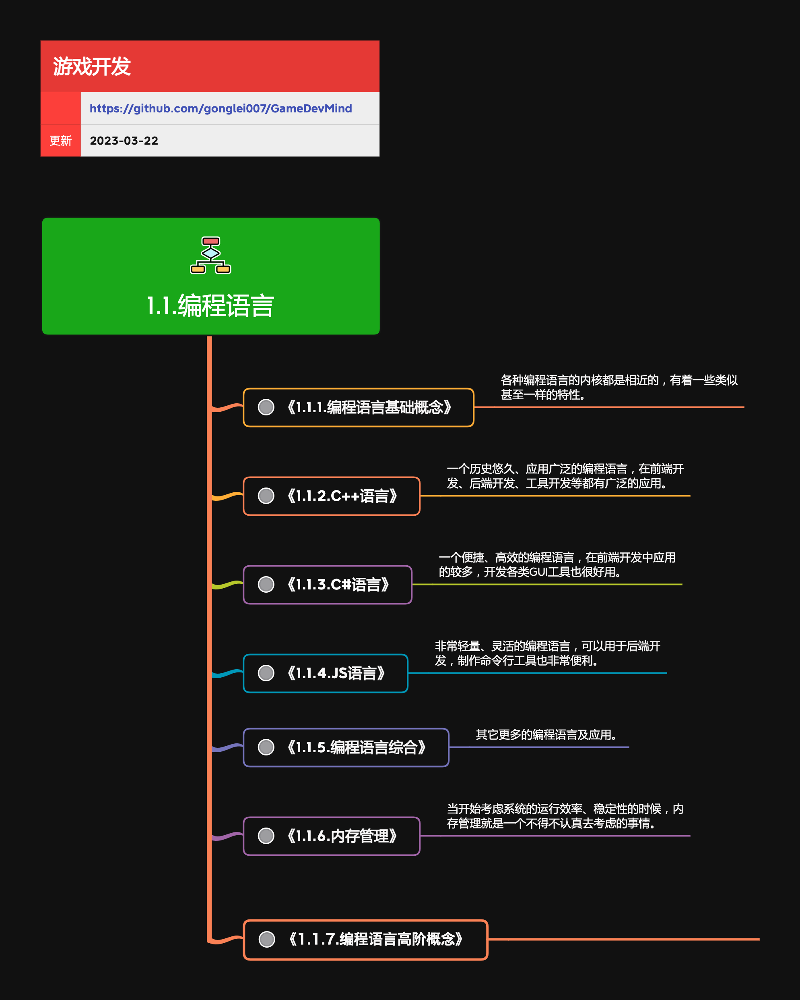
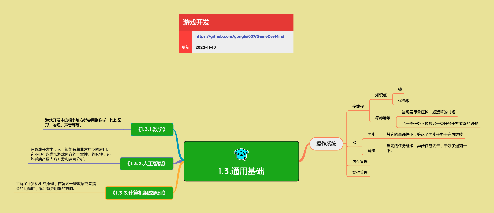
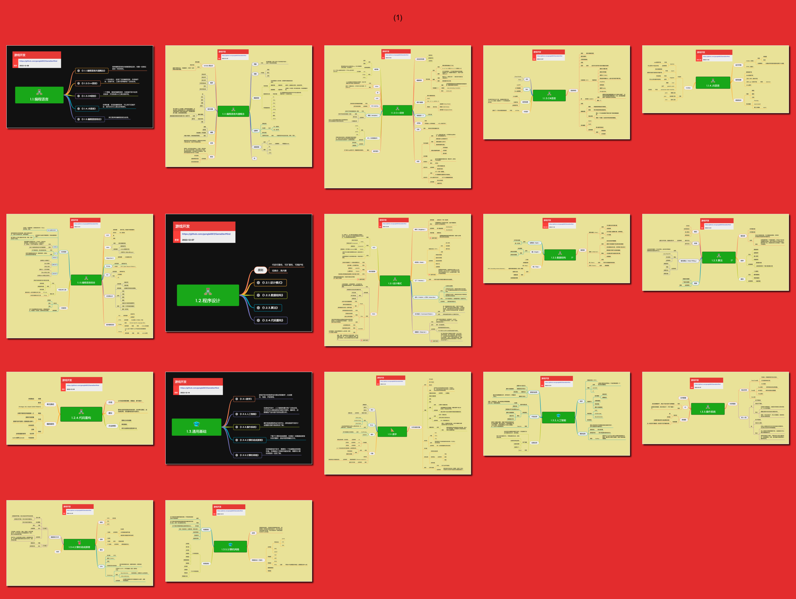

<h2 align="center">基础能力</h2>

游戏产品也是一种软件产品，所有的软件研发，就需要有一些共通的基础能力。 
这些基础能力是软件开发的基本功，基本功越强，整个产品的开发过程就会越稳健、高效。

## 目录

* [1.1.编程语言](mds/1.1.编程语言.md)

    * [1.1.1.编程语言共通概念](mds/1.1.1.编程语言共通概念.md)
    * [1.1.2.C++语言](mds/1.1.2.C++语言.md)
    * [1.1.3.C#语言](mds/1.1.3.C%23%E8%AF%AD%E8%A8%80.md)
    * [1.1.4.JS语言](mds/1.1.4.JS语言.md)
    * [1.1.5.编程语言综合](mds/1.1.5.编程语言综合.md)

* [1.2.程序设计](mds/1.2.程序设计.md)

    * [1.2.1.设计模式](mds/1.2.1.设计模式.md)
    * [1.2.2.数据结构](mds/1.2.2.数据结构.md)
    * [1.2.3.算法](mds/1.2.3.算法.md)
    * [1.2.4.代码重构](mds/1.2.4.代码重构.md)

* [1.3.通用基础](mds/1.3.通用基础.md)

    * [1.3.1.数学](mds/1.3.1.数学.md)
    * [1.3.2.人工智能](mds/1.3.2.人工智能.md)
    * [1.3.3.操作系统](mds/1.3.3.操作系统.md)
    * [1.3.4.计算机组成原理](mds/1.3.4.计算机组成原理.md)
    * [1.3.5.计算机网络](mds/1.3.5.计算机网络.md)
 

## 预览

