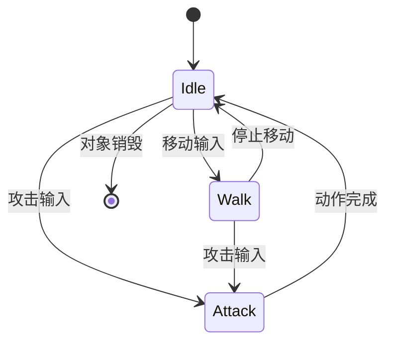
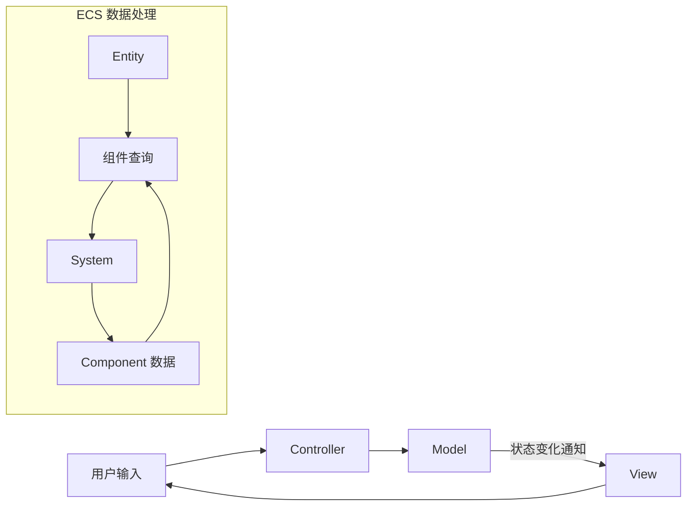

## 设计模式

程序开发的一项内功，合理的使用/选用设计模式（不滥用），能让系统更健壮、更易读、更易用。

**关键词:** 
*设计模式,GOF,MVC,ASync,Delegate,Singleton,State,Factory,Observer,ECS,AI Coding*

**标签:** 
*等级: 中级, 阶段: 学习|开发, 分类: 基础能力, 角色: 客户端开发|服务端开发|全栈开发*

----

    14|> 💡 **AI Coding 总览**（为何要掌握知识才能更好操作 AI、指南的三类内容等）见 [阅读说明 - AI Coding 总览](../../阅读说明.md#ai-coding-总览)。

---

## 目录

- [对象创建与状态管理](#对象创建与状态管理)
- [事件与行为模式](#事件与行为模式)
- [架构与数据流](#架构与数据流)
- [模式扩展](#模式扩展)
- [更多资料](#更多资料)

----

## 对象创建与状态管理

### 单件（Singleton）

| 维度 | 内容 |
|------|------|
| **作用** | 确保类只有一个实例，提供全局访问点 |
| **应用场景** | 全局唯一对象；各基础系统（GameSystem、SoundSystem 等） |
| **特点** | 不需管理生命期，不需预先设定实例化时机 |

### 应用举例

| 基础系统 | 说明 |
|----------|------|
| GameSystem | 游戏系统 |
| SoundSystem | 音效系统 |
| ResourceManager | 资源管理 |
| NetworkManager | 网络管理 |

**会遇到哪些问题？用什么解决？**
| 问题 | 解决方向 |
|------|----------|
| **线程安全** | 双重检查锁定；静态初始化；Thread Local；原子操作 |
| **测试困难** | 依赖注入替代；提供设置实例方法；接口抽象 |
| **全局状态** | 明确职责和依赖；避免循环依赖；考虑依赖注入 |
| **生命周期管理** | 显式销毁方法；智能指针；程序退出时清理 |

| 要点和思考方向 |
|----------------|
| 谨慎使用；注意线程安全；避免过度使用；不用单例时需理清流程和依赖 |

| 类型 | AI Coding 指南 |
|------|----------------|
| **交互提示** | 说明语言、多线程需求、测试需求；如「C# GameManager 单例」「需支持单元测试替换」 |
| **方法** | 要求线程安全实现；提供依赖注入替代；说明生命周期 |
| **应用** | 生成线程安全单例；将单例改为可注入；检查循环依赖 |
| **提示词范例** | 「为这个 C# SoundSystem 实现线程安全的懒加载单例，并提供一个 SetInstance 方法便于测试时注入 Mock」 |

### 状态机（State）

| 维度 | 内容 |
|------|------|
| **作用** | 管理状态转换，将不同状态行为封装在独立状态类中 |
| **应用场景** | 多状态且转换逻辑复杂；需清晰管理状态转换 |
| **FSM 状态** | OnEnter（进入）；OnUpdate（更新）；OnExit（离开）；迁移（状态间转换） |

### 应用举例

| 场景 | 示例 |
|------|------|
| 网络状态 | 连接中、已连接、断开 |
| 登录状态 | 未登录、登录中、已登录 |
| 游戏房间 | 等待中、游戏中、结算中 |
| 角色行为 | 待机、移动、攻击、死亡 |
| 动画管理 | 播放、暂停、停止 |

**会遇到哪些问题？用什么解决？**
| 问题 | 解决方向 |
|------|----------|
| **状态数量爆炸** | 分层状态机；行为树；合并相似状态；状态组合 |
| **转换逻辑复杂** | 状态转换表；避免循环依赖；转换事件；验证机制 |
| **状态数据共享** | Context 共享；状态参数传递；全局状态管理器 |
| **性能问题** | 优化转换逻辑；状态池；避免转换中耗时操作 |

| 要点和思考方向 |
|----------------|
| 适合明确状态转换；注意状态爆炸；不用状态机则需复杂 if/switch，可读性差 |

| 类型 | AI Coding 指南 |
|------|----------------|
| **交互提示** | 说明状态数量、转换规则、共享数据；如「角色 idle/walk/attack 三状态」「需共享 Animator」 |
| **方法** | 要求 FSM 接口（OnEnter/OnUpdate/OnExit）；提供转换表或事件；考虑分层/行为树 |
| **应用** | 将 if/switch 改为状态机；设计状态转换表；生成 FSM 骨架 |
| **提示词范例** | 「将这段角色行为用 if-else 判断的代码改为状态机，状态有 idle、walk、attack，请定义接口和转换逻辑」 |

### 工厂（Factory）

| 维度 | 内容 |
|------|------|
| **作用** | 封装对象创建过程，客户端通过工厂获取实例 |
| **应用场景** | 按条件创建不同类型；创建过程复杂；统一管理创建 |

### 应用举例

| 场景 | 说明 |
|------|------|
| 第三方中间件 | 统一管理不同中间件创建 |
| 对象池 | 工厂创建和管理池中对象实例 |
| 资源管理器 | 创建和管理图片、音频、模型等资源 |
| 实体组件 | 创建和管理渲染、碰撞、动画等组件 |

**会遇到哪些问题？用什么解决？**
| 问题 | 解决方向 |
|------|----------|
| **工厂类膨胀** | 抽象工厂；工厂方法；注册机制 |
| **扩展困难** | 反射；配置文件；依赖注入 |
| **类型安全** | 泛型工厂；接口/基类；类型检查 |

| 要点和思考方向 |
|----------------|
| 注意膨胀；考虑扩展性；确保类型安全 |

| 类型 | AI Coding 指南 |
|------|----------------|
| **交互提示** | 说明创建类型、扩展需求、语言；如「按配置创建不同 Enemy」「需支持运行时注册新类型」 |
| **方法** | 要求工厂接口；注册机制或反射；泛型保证类型安全 |
| **应用** | 将 new 分散改为工厂；生成注册式工厂；添加新类型支持 |
| **提示词范例** | 「为技能系统设计工厂，按技能 ID 创建不同技能实例，支持运行时注册新技能类型，用 C# 实现」 |

## 事件与行为模式

### 发布（Publish）/订阅（Subscribe）

| 维度 | 内容 |
|------|------|
| **作用** | 系统解耦；处理者不必立即响应；发布者不必等待处理完成 |
| **应用场景** | 解耦的系统间通信；一对多通知；异步事件 |
| **好处** | 系统更独立，运算量明确，性能可控 |

### 应用举例

| 场景 | 说明 |
|------|------|
| 服务端 | 消息队列 |
| 游戏 | 事件系统 |
| UI | 事件通知 |
| 日志 | 日志系统 |

**会遇到哪些问题？用什么解决？**
| 问题 | 解决方向 |
|------|----------|
| **消息丢失** | 持久化队列；消息重放；确认机制 |
| **性能问题** | 异步处理；限制订阅者；消息过滤；优化分发 |
| **调试困难** | 消息日志；追踪工具；可视化工具 |
| **循环依赖** | 明确流向；消息优先级；避免循环订阅 |

| 要点和思考方向 |
|----------------|
| 注意消息丢失和性能；提供调试工具；避免循环依赖 |

| 类型 | AI Coding 指南 |
|------|----------------|
| **交互提示** | 说明消息类型、持久化需求、性能要求；如「游戏事件系统」「需支持重放」「高频率」 |
| **方法** | 要求异步/同步选项；消息过滤；提供调试日志；避免循环发布 |
| **应用** | 设计事件系统接口；生成发布订阅封装；检查循环依赖 |
| **提示词范例** | 「设计一个游戏内事件系统，支持 PlayerDied、ItemPicked 等事件，订阅者可能很多，请考虑性能和调试支持」 |

### 命令模式（Command Pattern）

| 维度 | 内容 |
|------|------|
| **作用** | 将请求封装为对象，支持参数化、队列化、日志化、撤销/重做 |
| **应用场景** | 撤销/重做；操作日志；宏命令；GUI 工具 |

### 应用

| 场景 | 说明 |
|------|------|
| GUI 工具 | 各种 GUI 工具开发 |
| 游戏 | 撤销/重做功能 |
| 操作历史 | 历史记录 |
| 宏命令 | 组合命令系统 |

**会遇到哪些问题？用什么解决？**
| 问题 | 解决方向 |
|------|----------|
| **命令对象过多** | 命令对象池；轻量级命令；合并相似命令 |
| **撤销/重做复杂** | 备忘录模式；命令保存状态；限制深度 |
| **性能问题** | 优化执行逻辑；命令队列批量处理；避免不必要创建 |

| 要点和思考方向 |
|----------------|
| 注意对象过多用对象池；合理设计状态保存 |

| 类型 | AI Coding 指南 |
|------|----------------|
| **交互提示** | 说明撤销深度、命令类型、性能；如「编辑器需支持 100 步撤销」「命令需序列化」 |
| **方法** | 要求命令接口（Execute/Undo）；对象池；备忘录保存状态；限制栈深度 |
| **应用** | 将操作封装为命令；实现撤销重做；生成命令队列 |
| **提示词范例** | 「为关卡编辑器实现撤销/重做，操作包括移动、旋转、删除对象，请用命令模式并支持最多 50 步撤销」 |

### 观察者（Observer）

| 维度 | 内容 |
|------|------|
| **作用** | 两系统无耦合交互，一系统变化让另一系统知道并响应 |
| **应用场景** | 事件、变化通知；一对多依赖；解耦观察者与被观察者 |

### 应用举例

| 场景 | 说明 |
|------|------|
| 网络系统 | 状态变化通知 |
| MVC | View 对 Model 变化的监听与响应 |
| UI | 更新通知 |
| 数据 | 变化通知 |

**会遇到哪些问题？用什么解决？**
| 问题 | 解决方向 |
|------|----------|
| **内存泄漏** | 弱引用；对象销毁时取消订阅；RAII |
| **通知顺序** | 优先级机制；明确规则；同步机制 |
| **性能问题** | 异步通知；批量通知；限制数量；优化机制 |
| **循环通知** | 避免通知中修改被观察者；标志位；延迟通知 |

| 要点和思考方向 |
|----------------|
| 注意内存泄漏；明确通知顺序；避免循环；不用则系统直接依赖，可读性和维护性变差 |

| 类型 | AI Coding 指南 |
|------|----------------|
| **交互提示** | 说明观察者生命周期、通知频率、语言；如「UI 监听 Model」「View 销毁时需取消订阅」 |
| **方法** | 要求弱引用或取消订阅；避免循环通知；提供优先级机制 |
| **应用** | 实现观察者模式；检查泄漏；生成带取消订阅的封装 |
| **提示词范例** | 「这段 UI 监听背包数据变化，但关闭界面后未取消订阅导致泄漏，请改为在 OnDestroy 中取消订阅，或用弱引用」 |

## 架构与数据流

### MVC

| 维度 | 内容 |
|------|------|
| **作用** | Model、View、Controller 分离，关注点分离 |
| **好处** | 程序清晰、思路聚焦、代码可读 |
| **使用场景** | 有表现和交互的业务功能（好友、排行榜、投票等） |

### 实践

| 部分 | 作用 | 注意 |
|------|------|------|
| **Model** | 业务数据模型；提供改变数据接口；数据变化事件 | - |
| **View** | 纯粹表现；页面动态表现、部件更新 | 尽量不做业务逻辑和业务数据存储 |
| **Controller** | 业务逻辑；如向服务器发请求 | 需刷新 View 时调用 View 接口 |

**会遇到哪些问题？用什么解决？**
| 问题 | 解决方向 |
|------|----------|
| **Controller 膨胀** | 提取到 Service 层；命令模式；按功能拆分 |
| **View 和 Model 耦合** | 观察者；通过 Controller 更新；ViewModel（MVVM） |
| **数据同步** | 观察者通知所有 View；事件机制；数据绑定 |
| **测试困难** | 依赖注入；Service 层；Mock 对象 |

| 要点和思考方向 |
|----------------|
| 注意 Controller 膨胀；避免 View 与 Model 直接耦合；不用则数据逻辑表现交织，维护成本高 |

| 类型 | AI Coding 指南 |
|------|----------------|
| **交互提示** | 说明模块划分、膨胀程度、框架；如「好友界面 Controller 超 500 行」「Unity UI」 |
| **方法** | 要求 Service 层抽取；观察者解耦 View-Model；依赖注入便于测试 |
| **应用** | 拆分膨胀 Controller；引入 ViewModel；生成 MVC 骨架 |
| **提示词范例** | 「这个排行榜界面的 Controller 混合了请求、排序、刷新逻辑，请按 MVC 拆分为 Model、View、Controller，并抽取 Service 层」 |

### 异步流控制

| 维度 | 内容 |
|------|------|
| **作用** | 异步代码结构化管理，避免回调地狱 |
| **应用场景** | 多异步操作；控制执行顺序；并行执行 |
| **好处** | 减少嵌套；统一错误处理；复杂流程控制 |

### 举例

| 方法 | 说明 |
|------|------|
| waterfall | 顺序执行，前一个结果作为下一个输入 |
| foreach | 对数组每个元素执行异步操作 |
| parallel | 并行执行多个异步操作 |
| series | 顺序执行，不传递结果 |

### 补充

| 语言/库 | 方案 |
|---------|------|
| JavaScript | async 库、Promise、async/await |
| C# | Task、async/await |
| Python | asyncio |

**会遇到哪些问题？用什么解决？**
| 问题 | 解决方向 |
|------|----------|
| **错误处理复杂** | 统一错误处理；try-catch + async/await；错误回调 |
| **性能问题** | 限制并发；队列管理；优化操作本身 |
| **调试困难** | 异步调试工具；日志；Promise 链式调用 |

| 要点和思考方向 |
|----------------|
| 减少嵌套；注意错误处理和性能；不用则层层嵌套回调，可读性差 |

| 类型 | AI Coding 指南 |
|------|----------------|
| **交互提示** | 说明语言、异步流程、错误处理；如「Node.js 多接口串行」「需统一错误处理」 |
| **方法** | 要求 async/await 或 Promise 链；统一 catch；限制并发（如 async 库 parallelLimit） |
| **应用** | 将回调改为 async；生成 waterfall/parallel 流程；添加错误传播 |
| **提示词范例** | 「将这段加载配置→加载资源→初始化系统的嵌套回调改为 async/await，添加统一错误处理，任一失败则终止」 |

### ECS

| 维度 | 内容 |
|------|------|
| **作用** | 数据（Component）与逻辑（System）分离，组合（Entity）实现灵活对象系统 |
| **概要** | 类似"过程操作数据结构"，可获得高性能 |
| **应用场景** | 大量对象处理；高性能；灵活组合；物理、渲染等 |

### 构成

| 部分 | 说明 |
|------|------|
| **Entity** | 实体，含多个 component，通常只是 ID |
| **Component** | 纯数据结构，不含逻辑 |
| **System** | 逻辑系统，更新 component，处理特定 component 组合的 entity |

### 应用

| 适用 | 不适用 |
|------|----------|
| 大量对象；高性能；物理、渲染 | 偏向业务流程的功能 |

**会遇到哪些问题？用什么解决？**
| 问题 | 解决方向 |
|------|----------|
| **学习曲线** | 理解数据与逻辑分离；从简单场景开始；参考成熟框架 |
| **组件查询性能** | 组件索引；缓存结果；Sparse Set |
| **系统执行顺序** | 明确依赖；依赖图；Phase 组织 |
| **调试困难** | 可视化工具；日志；调试器支持 |

| 要点和思考方向 |
|----------------|
| 适合高性能和灵活组合；注意查询性能和执行顺序；不适合业务流程 |

| 类型 | AI Coding 指南 |
|------|----------------|
| **交互提示** | 说明对象数量、组件类型、框架；如「1000 个敌人」「Transform+Health+AI 组件」「Unity DOTS」 |
| **方法** | 要求 Component 纯数据；System 按组件查询；明确 System 执行顺序和依赖 |
| **应用** | 将 OOP 改为 ECS；设计组件和系统；生成 ECS 骨架 |
| **提示词范例** | 「为小怪系统设计 ECS 结构，组件有 Transform、Health、AI，系统有 MovementSystem、CombatSystem，请说明执行顺序和查询方式」 |

## 模式扩展

| 模式 | 说明 |
|------|------|
| 原型模式 | 复制现有实例创建新实例 |
| 建造者模式 | 复杂对象构建与表示分离 |
| 代理模式 | 代理控制对象访问 |
| 桥接模式 | 抽象与实现分离 |
| 外观模式 | 子系统接口统一 |
| 中介者模式 | 中介对象封装对象交互 |

## 更多资料

### 文章

| 链接 | 说明 |
|------|------|
| [The Entity-Component-System](https://www.gamedeveloper.com/design/the-entity-component-system---an-awesome-game-design-pattern-in-c-part-1-) | ECS 模式 C++ 实现 |

### 在线电子书

| 链接 | 说明 |
|------|------|
| [《游戏编程模式》](https://gpp.tkchu.me) | 游戏编程模式 |
| [《Game Programming Patterns》](http://gameprogrammingpatterns.com/contents.html) | 游戏编程模式英文版 |
| [《Game Design Patterns in Unity》](https://livebook.manning.com/book/game-programming-design-patterns/welcome/v-3/) | Unity 设计模式 |

### 视频资料

| 链接 | 说明 |
|------|------|
| [10 Design Patterns Explained in 10 Minutes](https://www.youtube.com/watch?v=tv-_1er1mWI) | 10 种设计模式 |
| [How To Build An Event System in Unity](https://www.youtube.com/watch?v=gx0Lt4tCDE0) | Unity 事件系统 |
