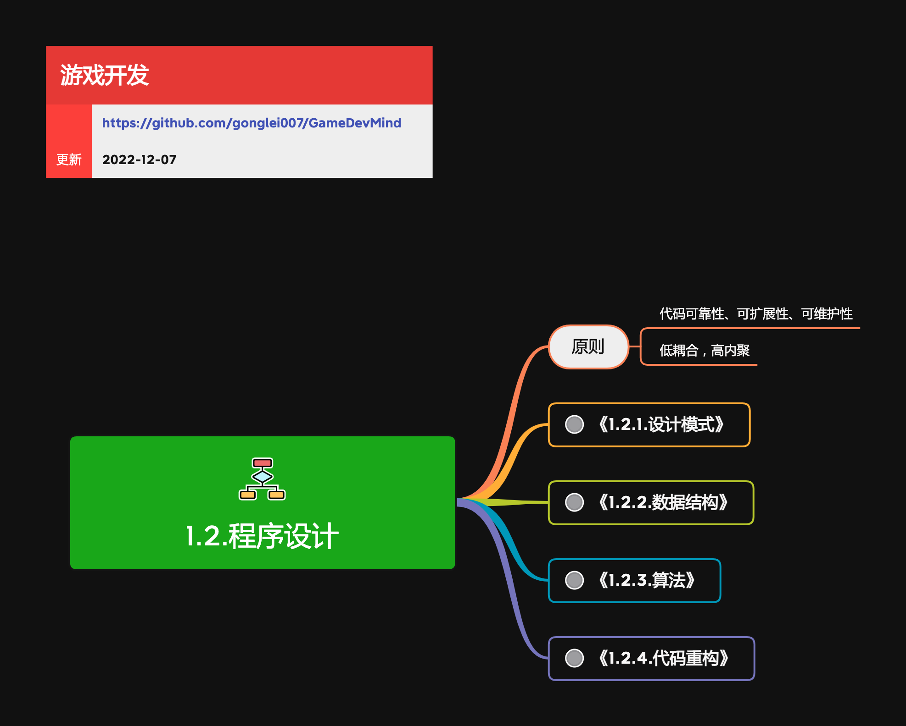

<h2 align="center">程序设计</h2>

程序设计，是软件开发人员最重要的基本功。做任何软件开发，都需要有优秀的设计能力。设计的够好，整个团队的开发效率就越高，维护软件的成本就越底。

**关键词:** 
*UML*

**标签:** 
*等级: 中级, 阶段: 学习|开发, 分类: 基础能力, 角色: 客户端开发|服务端开发|全栈开发*

## 图谱

* [1.2.1.设计模式](1.2.1.设计模式.md)
* [1.2.2.数据结构](1.2.2.数据结构.md)
* [1.2.3.算法](1.2.3.算法.md)
* [1.2.4.代码重构](1.2.4.代码重构.md)