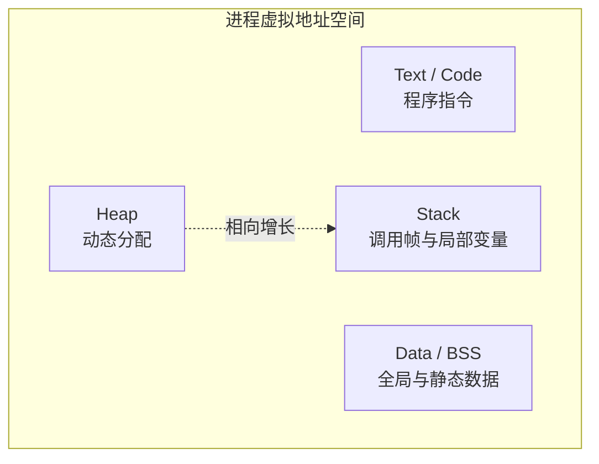
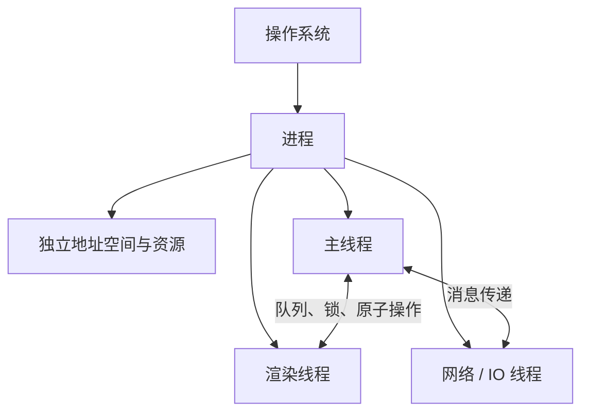

## 操作系统

操作系统是程序运行的平台，游戏底层开发多少会需要对操作系统有些了解。

**关键词:** 
*操作系统,堆,栈,进程,线程,IO,同步,异步,地址空间,内存管理,Text段,Code段,Data段,Heap,Stack,死锁,竞态条件,锁,优先级,文件管理,网络管理,Windows,Linux,Ubuntu,CentOS,Mac,OSX,Android,iOS,鸿蒙,XBox,PS,PlayStation,Nintendo Switch,AI Coding*

**标签:** 
*等级: 中级, 阶段: 学习|开发, 分类: 基础能力, 角色: 客户端开发|服务端开发|运维*

----

> 💡 **AI Coding 总览**（为何要掌握知识才能更好操作 AI、指南的三类内容等）见 [阅读说明 - AI Coding 总览](../阅读说明.md#ai-coding-总览)。

---

> 🏥 **实战案例：** [服务器死锁 — 逻辑线程与网络线程 ABBA 死锁](../../cases/server-deadlock.md)

## 目录

- [系统抽象与内存](#系统抽象与内存)
- [进程、线程与 IO](#进程线程与-io)
- [系统服务](#系统服务)
- [操作系统平台](#操作系统平台)
- [更多资料](#更多资料)

----

## 系统抽象与内存

### 硬件抽象层

| 维度 | 内容 |
|------|------|
| **作用** | 屏蔽硬件细节，提供统一接口 |
| **应用场景** | 跨平台开发；驱动管理；设备抽象；图形 API 抽象 |

**会遇到哪些问题？用什么解决？**

| 问题 | 解决方向 |
|------|----------|
| **性能开销** | 底层 API；优化实现；平台特定优化 |
| **平台差异** | SDL、GLFW；封装平台代码；条件编译 |

| 要点和思考方向 |
|----------------|
| 平衡易用性与性能；理解底层特性 |

| 类型 | AI Coding 指南 |
|------|----------------|
| **交互提示** | 说明目标平台、性能需求、抽象层；如「跨平台 PC+主机」「需底层优化」「图形 API 抽象」 |
| **方法** | 跨平台用 SDL/GLFW；平台特定用条件编译；性能关键路径用底层 API |
| **应用** | 实现 HAL；平台抽象；条件编译 |
| **提示词范例** | 「游戏需支持 Windows/Linux/Mac，请用 SDL 或 GLFW 封装窗口和输入，并说明如何用条件编译做平台特定优化」 |

### 内存管理

### 地址空间

| 维度 | 内容 |
|------|------|
| **作用** | 为进程分配独立虚拟地址空间 |
| **应用场景** | 内存管理；进程隔离；内存保护 |

### 组成

| 段 | 作用 | 特点 |
|------|------|------|
| Text/Code | 可执行指令 | 只读；大小固定 |
| Data | Gvar（初始化全局变量）；BSS（未初始化）；Heap（动态分配） | - |
| Stack | 函数调用、局部变量 | - |

**会遇到哪些问题？用什么解决？**

| 问题 | 解决方向 |
|------|----------|
| **地址空间不足** | 64 位系统；优化使用；虚拟内存 |
| **内存碎片** | 内存池；预分配；对象池 |

| 要点和思考方向 |
|----------------|
| 注意 32/64 位地址空间差异 |

| 类型 | AI Coding 指南 |
|------|----------------|
| **交互提示** | 说明目标平台、内存需求、32/64 位；如「移动端 32 位」「大纹理加载」「需虚拟内存」 |
| **方法** | 地址不足用 64 位；碎片用内存池、对象池 |
| **应用** | 内存布局分析；虚拟内存配置；内存池设计 |
| **提示词范例** | 「游戏在 32 位 Android 上内存不足崩溃，请分析 Text/Data/Heap/Stack 各段可能原因，并给出内存池减少碎片的方案」 |

### 堆 vs 栈

| 维度 | 内容 |
|------|------|
| **作用** | 理解堆栈区别，选择合适分配方式 |
| **应用场景** | 内存管理；性能优化；内存安全 |

### 堆 vs 栈 对比

| 特性 | 堆 | 栈 |
|------|------|------|
| 位置 | 高地址，向下增长 | 低地址，向上增长 |
| 生存期 | 显式释放前一直占用 | 出栈即销毁 |
| 访问 | 通过指针 | 变量直接访问 |
| 大小 | 大；适合大数组、结构体 | 小；避免大局部数组 |
| 速度 | 分配释放较慢 | 分配释放快 |
| 管理 | 手动 | 自动 |

**会遇到哪些问题？用什么解决？**

| 问题 | 解决方向 |
|------|----------|
| **内存泄漏** | 智能指针；内存池；RAII；GC；定期检查 |
| **栈溢出** | 限制递归；避免大局部变量；大对象放堆；迭代 |
| **性能问题** | 内存池；对象池；避免游戏循环中分配 |

| 要点和思考方向 |
|----------------|
| 避免游戏循环中分配堆内存 |

| 类型 | AI Coding 指南 |
|------|----------------|
| **交互提示** | 说明分配场景、性能要求、语言；如「每帧分配」「C++」「需零分配」 |
| **方法** | 游戏循环避免 new/malloc；用对象池、内存池；大对象放堆 |
| **应用** | 对象池实现；内存分配优化；栈溢出排查 |
| **提示词范例** | 「C++ 游戏每帧 new 大量小对象导致卡顿，请设计对象池替代方案，支持预分配和回收，并说明如何避免游戏循环中的堆分配」 |

## 进程、线程与 IO

### 进程和线程

| 维度 | 内容 |
|------|------|
| **作用** | 理解进程线程，合理使用并发 |
| **应用场景** | 多任务；并行计算；IO 密集；任务隔离 |
| **概念** | 进程（独立内存）；线程（共享进程内存） |

### 知识点

| 概念 | 说明 |
|------|------|
| 锁 | 保证共享数据正确性；互斥锁、读写锁、自旋锁 |
| 优先级 | 控制调度顺序 |

### 考虑场景

| 场景 | 方案 | 举例 |
|------|------|------|
| 压榨 IO/运算 | 多线程/多进程 | 多线程加载；并行计算；异步 IO |
| 任务隔离 | 独立线程/进程 | 渲染、网络、音频分离 |

**会遇到哪些问题？用什么解决？**

| 问题 | 解决方向 |
|------|----------|
| **死锁** | 避免嵌套锁；超时；按序获取；死锁检测；无锁结构 |
| **竞态条件** | 锁；原子操作；无锁；TLS；避免共享可变 |
| **性能问题** | 合理线程数；线程池；避免频繁创建；异步 IO |
| **调试困难** | 线程安全结构；详细日志；分析工具；单元测试 |

| 要点和思考方向 |
|----------------|
| 避免主循环中锁；考虑无锁数据结构 |

| 类型 | AI Coding 指南 |
|------|----------------|
| **交互提示** | 说明并发场景、共享数据、性能；如「渲染+网络+音频」「共享配置」「主线程不能阻塞」 |
| **方法** | 避免主循环持锁；用无锁队列、原子操作；按序获取锁防死锁 |
| **应用** | 多线程架构；无锁队列；死锁排查 |
| **提示词范例** | 「游戏有渲染线程和网络线程，需要传递消息，请用无锁队列实现线程间通信，避免主线程阻塞和死锁」 |

### IO

| 维度 | 内容 |
|------|------|
| **作用** | 输入输出操作 |
| **应用场景** | 文件读写；网络通信；设备输入 |

### 同步

| 维度 | 内容 |
|------|------|
| **作用** | 等待 IO 完成后再继续 |
| **应用场景** | 简单文件读写；初始化加载；非高并发 |
| **特点** | 阻塞；简单直接 |

**会遇到哪些问题？用什么解决？**

| 问题 | 解决方向 |
|------|----------|
| **阻塞问题** | 异步 IO；多线程；后台线程 |

| 要点和思考方向 |
|----------------|
| 避免主线程同步 IO；初始化可用同步 |

| 类型 | AI Coding 指南 |
|------|----------------|
| **交互提示** | 说明 IO 场景、阻塞影响；如「主线程读配置」「加载大文件」「会卡顿」 |
| **方法** | 主线程避免同步 IO；初始化阶段可用；大文件用后台线程 |
| **应用** | 加载流程设计；阻塞点排查 |
| **提示词范例** | 「游戏启动时同步读取 10MB 配置文件导致黑屏 2 秒，请改为异步加载并给出加载进度回调的 C# 实现」 |

### 异步

| 维度 | 内容 |
|------|------|
| **作用** | 不等待 IO 完成，回调/事件通知 |
| **应用场景** | 网络通信；大文件；高并发 |
| **特点** | 不阻塞；提高并发 |

**会遇到哪些问题？用什么解决？**

| 问题 | 解决方向 |
|------|----------|
| **代码复杂度** | async/await；Promise/Future；事件驱动 |
| **错误处理** | 统一机制；try-catch；回调中处理 |
| **资源管理** | RAII；智能指针；明确所有权；及时取消 |

| 要点和思考方向 |
|----------------|
| 网络通信常用异步；注意错误处理和资源管理 |

| 类型 | AI Coding 指南 |
|------|----------------|
| **交互提示** | 说明异步场景、语言、错误处理；如「网络请求」「C# async/await」「需超时和取消」 |
| **方法** | 网络用 async/await、Promise；统一错误处理；资源及时释放 |
| **应用** | 异步网络封装；错误处理；取消逻辑 |
| **提示词范例** | 「Unity C# 中异步请求 HTTP API，需支持超时 5 秒和取消，请用 async/await 实现并处理网络错误和取消时的资源释放」 |

## 系统服务

### 文件管理

| 维度 | 内容 |
|------|------|
| **作用** | 管理文件存储、读取、写入 |
| **应用场景** | 资源管理；配置；日志；数据持久化 |

**会遇到哪些问题？用什么解决？**

| 问题 | 解决方向 |
|------|----------|
| **文件路径** | 跨平台路径库；相对路径；路径分隔符常量 |
| **文件权限** | 检查权限；请求权限；应用数据目录 |
| **文件不存在** | 检查存在；默认值；创建目录 |
| **大文件加载** | 异步加载；分块；流式；后台线程 |

| 要点和思考方向 |
|----------------|
| 跨平台兼容；资源打包；异步加载 |

| 类型 | AI Coding 指南 |
|------|----------------|
| **交互提示** | 说明目标平台、路径需求；如「Windows+Mac+Linux」「读写配置」「资源路径」 |
| **方法** | 跨平台用 path.join、Path.Combine；相对路径；异步加载大文件 |
| **应用** | 跨平台路径处理；资源加载；权限检查 |
| **提示词范例** | 「游戏需在 Windows/Mac/Linux 读取用户配置目录下的 config.json，请用跨平台路径库实现并处理文件不存在时创建默认配置」 |

### 网络管理

| 维度 | 内容 |
|------|------|
| **作用** | 管理网络通信 |
| **应用场景** | 客户端-服务器；多人同步；实时对战；在线功能 |

**会遇到哪些问题？用什么解决？**

| 问题 | 解决方向 |
|------|----------|
| **网络延迟** | 预测插值；客户端预测；延迟补偿；服务器位置 |
| **网络不稳定** | 重连；心跳；错误处理；离线模式 |
| **数据包丢失** | TCP；可靠 UDP；重传；冗余 |
| **安全问题** | TLS/SSL；验证完整性；防作弊 |

| 要点和思考方向 |
|----------------|
| 考虑延迟补偿；处理网络错误和重连 |

| 类型 | AI Coding 指南 |
|------|----------------|
| **交互提示** | 说明游戏类型、网络模型、延迟；如「实时对战」「客户端-服务器」「100ms 延迟」 |
| **方法** | 延迟用预测插值、客户端预测；不稳定用重连、心跳；丢包用 TCP 或可靠 UDP |
| **应用** | 网络同步；重连逻辑；延迟补偿 |
| **提示词范例** | 「多人射击游戏，100ms 延迟下射击感觉延迟，请说明客户端预测和服务器校正的流程，并给出位置插值的实现思路」 |

## 操作系统平台

### 常见操作系统

### PC

| 维度 | 内容 |
|------|------|
| **作用** | PC 平台操作系统 |
| **应用场景** | PC 游戏；游戏服务器 |
| **类型** | Windows 桌面版；Windows Server |

**会遇到哪些问题？用什么解决？**

| 问题 | 解决方向 |
|------|----------|
| **版本兼容性** | 测试多版本；兼容性模式；明确最低要求 |

| 要点和思考方向 |
|----------------|
| 注意版本兼容；使用 DirectX |

| 类型 | AI Coding 指南 |
|------|----------------|
| **交互提示** | 说明目标版本、兼容需求；如「支持 Win7/Win10/Win11」「最低 DirectX 版本」 |
| **方法** | 测试多版本；兼容性模式；明确最低要求 |
| **应用** | 版本检测；兼容性处理 |
| **提示词范例** | 「PC 游戏需支持 Windows 10 及以上，请给出检测系统版本和 DirectX 版本的 C++ 代码，并说明最低配置的声明方式」 |

### Mac

| 维度 | 内容 |
|------|------|
| **作用** | Mac 平台操作系统 |
| **应用场景** | Mac 游戏；跨平台开发 |
| **类型** | macOS（原 OS X） |

| 问题 | 解决方向 |
|------|----------|
| **市场份额** | 评估目标用户；跨平台；跨平台引擎 |

| 要点和思考方向 |
|----------------|
| 使用 Metal；考虑跨平台 |

| 类型 | AI Coding 指南 |
|------|----------------|
| **交互提示** | 说明跨平台需求、图形 API；如「Mac+Windows」「需 Metal」「跨平台引擎」 |
| **方法** | Mac 用 Metal；跨平台用 Vulkan/OpenGL 或引擎抽象 |
| **应用** | Mac 构建；Metal 适配 |
| **提示词范例** | 「Unity 游戏发布 Mac 版，请说明 Metal 与 DirectX 的差异，以及 Mac 上常见的崩溃和性能问题的排查思路」 |

### Linux

| 维度 | 内容 |
|------|------|
| **作用** | 开源 OS，常用于服务器 |
| **应用场景** | 游戏服务器；跨平台开发 |
| **发行版** | Ubuntu；CentOS；Debian |

**会遇到哪些问题？用什么解决？**

| 问题 | 解决方向 |
|------|----------|
| **发行版差异** | 标准库；测试主要发行版；容器化 |
| **游戏支持** | Steam Proton；原生支持；评估用户 |

| 要点和思考方向 |
|----------------|
| 使用 OpenGL/Vulkan |

| 类型 | AI Coding 指南 |
|------|----------------|
| **交互提示** | 说明发行版、服务器/桌面；如「Ubuntu 22.04 服务器」「Steam Deck」「需 Vulkan」 |
| **方法** | 测试主要发行版；服务器用标准库；游戏用 Steam Proton |
| **应用** | Linux 构建；发行版兼容 |
| **提示词范例** | 「游戏服务器部署在 Ubuntu 22.04，请说明与 CentOS 的差异，以及如何用 Docker 保证在不同 Linux 发行版上的一致性」 |

### 华为

| 维度 | 内容 |
|------|------|
| **作用** | 华为移动操作系统 |
| **应用场景** | 移动游戏；中国市场 |
| **类型** | 鸿蒙（HarmonyOS） |

| 问题 | 解决方向 |
|------|----------|
| **生态兼容性** | 兼容 Android API；鸿蒙特定功能；测试 |

| 要点和思考方向 |
|----------------|
| 注意与 Android 兼容 |

| 类型 | AI Coding 指南 |
|------|----------------|
| **交互提示** | 说明鸿蒙版本、兼容需求；如「鸿蒙 NEXT」「需兼容 Android API」「中国市场」 |
| **方法** | 兼容 Android API；鸿蒙特定功能单独处理；多设备测试 |
| **应用** | 鸿蒙适配；兼容层 |
| **提示词范例** | 「Unity 游戏要上架鸿蒙应用市场，请说明鸿蒙与 Android 的兼容性，以及需要做哪些适配和测试」 |

### Android

| 维度 | 内容 |
|------|------|
| **作用** | 移动平台主要 OS 之一 |
| **应用场景** | 移动游戏；全球市场 |
| **特点** | 开源；份额大；设备碎片化 |

**会遇到哪些问题？用什么解决？**

| 问题 | 解决方向 |
|------|----------|
| **设备碎片化** | 分级适配；测试主流设备；性能分析 |
| **版本兼容性** | 明确最低版本；兼容库；测试 |

| 要点和思考方向 |
|----------------|
| 注意性能适配；使用 Vulkan |

| 类型 | AI Coding 指南 |
|------|----------------|
| **交互提示** | 说明设备范围、性能、图形；如「低端到高端」「需分级」「Vulkan 支持」 |
| **方法** | 分级适配；测试主流设备；Vulkan 优先 |
| **应用** | 设备分级；性能适配 |
| **提示词范例** | 「Android 游戏在低端机上帧率低，请给出设备分级方案（如按 GPU/内存分档），以及每档的图形质量、分辨率建议」 |

### iOS

| 维度 | 内容 |
|------|------|
| **作用** | 苹果移动平台 OS |
| **应用场景** | 移动游戏；高端市场 |
| **特点** | 封闭生态；设备统一；性能好 |

**会遇到哪些问题？用什么解决？**

| 问题 | 解决方向 |
|------|----------|
| **审核严格** | 遵循指南；提前测试；准备材料 |
| **开发限制** | 跨平台引擎；云构建；远程 Mac |

| 要点和思考方向 |
|----------------|
| 注意 App Store 审核；使用 Metal |

| 类型 | AI Coding 指南 |
|------|----------------|
| **交互提示** | 说明审核问题、限制；如「内购」「隐私」「被拒原因」 |
| **方法** | 遵循 App Store 指南；提前测试；准备审核材料 |
| **应用** | 审核准备；常见拒因规避 |
| **提示词范例** | 「iOS 游戏首次提交 App Store 被拒，常见原因有哪些？请列出审核指南中与游戏相关的重点，以及内购、隐私政策的注意事项」 |

### XBox

| 维度 | 内容 |
|------|------|
| **作用** | XBox 主机平台 |
| **应用场景** | 主机游戏；跨平台 |
| **特点** | 底层 Windows NT kernel |

**会遇到哪些问题？用什么解决？**

| 问题 | 解决方向 |
|------|----------|
| **开发工具** | 开发者账号；XBox 工具；遵循规范 |

| 要点和思考方向 |
|----------------|
| 基于 Windows；使用 DirectX |

| 类型 | AI Coding 指南 |
|------|----------------|
| **交互提示** | 说明开发阶段、工具；如「XBox 移植」「需开发者账号」「Unity 项目」 |
| **方法** | 开发者账号；XBox SDK；遵循 TRC |
| **应用** | XBox 移植；认证准备 |
| **提示词范例** | 「Unity PC 游戏要移植 XBox，请说明需要的开发工具、账号流程，以及与 Windows 版本的主要差异（输入、存储、成就等）」 |

### PS

| 维度 | 内容 |
|------|------|
| **作用** | PlayStation 主机平台 |
| **应用场景** | 主机游戏；跨平台 |
| **特点** | 底层 FreeBSD |

**会遇到哪些问题？用什么解决？**

| 问题 | 解决方向 |
|------|----------|
| **开发工具** | 开发者账号；PS 工具；遵循规范 |

| 要点和思考方向 |
|----------------|
| 基于 FreeBSD；注意特定功能 |

| 类型 | AI Coding 指南 |
|------|----------------|
| **交互提示** | 说明移植需求、工具；如「PS5 移植」「开发者账号」「引擎」 |
| **方法** | 开发者账号；PS SDK；遵循规范 |
| **应用** | PS 移植；平台特性 |
| **提示词范例** | 「游戏要移植 PlayStation，请说明与 PC 开发的主要差异，包括输入（DualSense）、存储、成就系统，以及开发流程中的注意事项」 |

### Nintendo Switch

| 维度 | 内容 |
|------|------|
| **作用** | Nintendo Switch 主机平台 |
| **应用场景** | 主机游戏；跨平台 |
| **特点** | 底层基于 FreeBSD 的 Switch Kernel |

**会遇到哪些问题？用什么解决？**

| 问题 | 解决方向 |
|------|----------|
| **开发工具** | 开发者账号；Switch 工具；遵循规范 |

| 要点和思考方向 |
|----------------|
| 基于 FreeBSD；注意特定功能 |

| 类型 | AI Coding 指南 |
|------|----------------|
| **交互提示** | 说明移植需求、Switch 特性；如「Unity 移植」「掌机/主机模式」「Joy-Con」 |
| **方法** | 开发者账号；Switch SDK；注意内存和性能限制 |
| **应用** | Switch 移植；双模式适配 |
| **提示词范例** | 「Unity 游戏移植 Nintendo Switch，请说明 Switch 的硬件限制（内存、GPU）、掌机/主机模式差异，以及 Joy-Con 输入的适配要点」 |

## 更多资料
