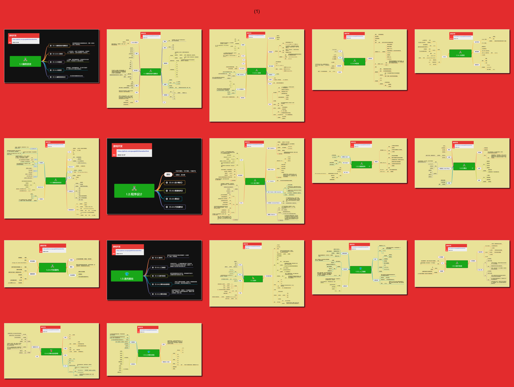

## 基础能力

基础能力是与游戏行业相关、但不限于游戏行业的底层知识，包括编程、数学、计算机系统和软件工程基础。它们回答“开发者需要掌握哪些可迁移的基本原理”，是进入游戏专项技术之前的知识地基。

**关键词:** 
*编程语言,程序设计,数据结构,算法,数学,人工智能,操作系统,计算机原理,网络*

**标签:** 
*等级: 入门|初级|中级, 阶段: 学习, 分类: 基础能力, 角色: 客户端开发|服务端开发|全栈开发*

## 目录

* [1.1.编程语言](1.1.编程语言.md)
    * [1.1.1.编程语言基础概念](1.1.1.编程语言基础概念.md)
    * [⭕ 1.1.2.C++语言](1.1.2.C++语言.md)
    * [1.1.3.C#语言](1.1.3.C%23语言.md)
    * [1.1.4.JS语言](1.1.4.JS语言.md)
    * [1.1.5.编程语言综合](1.1.5.编程语言综合.md)
    * [1.1.6.内存管理](1.1.6.内存管理.md)
    * [1.1.7.编程语言高阶概念](1.1.7.编程语言高阶概念.md)

* [1.2.程序设计](1.2.程序设计.md)
    * [⭕ 1.2.1.设计模式](1.2.1.设计模式.md)
    * [1.2.2.数据结构](1.2.2.数据结构.md)
    * [1.2.3.算法](1.2.3.算法.md)
    * [1.2.4.代码重构](1.2.4.代码重构.md)

* [1.3.通用基础](1.3.通用基础.md)
    * [⭕ 1.3.1.数学](1.3.1.数学.md)
    * [1.3.2.人工智能基础](1.3.2.人工智能.md)
    * [1.3.3.操作系统](1.3.3.操作系统.md)
    * [1.3.4.计算机组成原理](1.3.4.计算机组成原理.md)
    * [1.3.5.计算机网络](1.3.5.计算机网络.md)
 

----

## 预览

