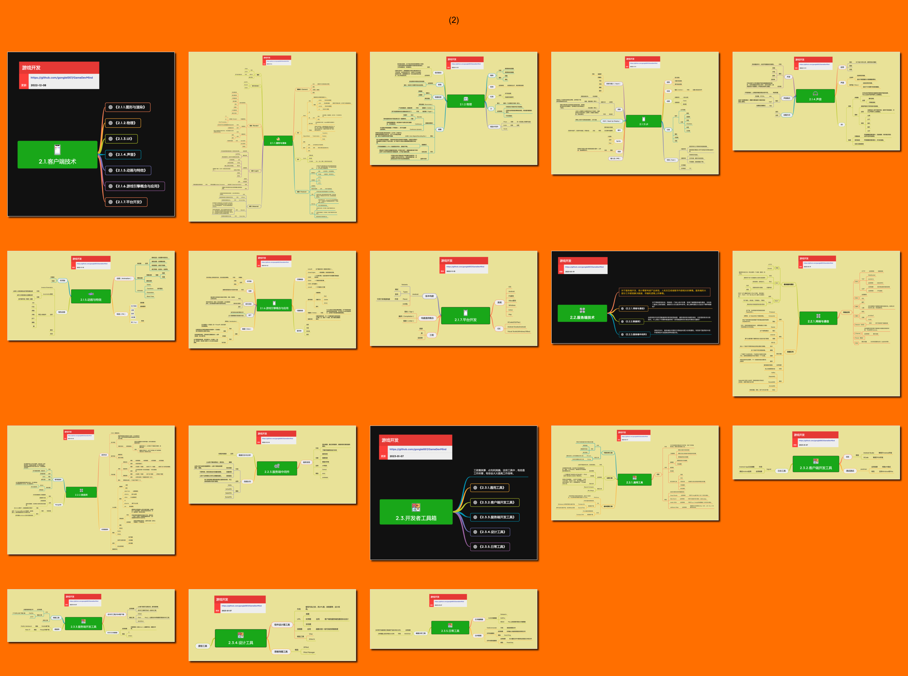

<h2 align="center">技术能力</h2>

游戏软件有其特定的技术要求，要研发游戏产品，就可能会需要具备这些技术。

## 目录

* [2.1.客户端技术](2.1.客户端技术.md)
    * [2.1.1.图形与渲染](2.1.1.图形与渲染.md)
    * [2.1.2.物理](2.1.2.物理.md)
    * [2.1.3.UI](2.1.3.UI.md)
    * [2.1.4.声音](2.1.4.声音.md)
    * [2.1.5.动画与特效](2.1.5.动画与特效.md)
    * [2.1.6.游戏引擎概念与应用](2.1.6.游戏引擎概念与应用.md)
    * [2.1.7.平台开发](2.1.7.平台开发.md)
* [2.2.服务端技术](2.2.服务端技术.md)
    * [2.2.1.网络与通信](2.2.1.网络与通信.md)
    * [2.2.2.数据库](2.2.2.数据库.md)
    * [2.2.3.服务端中间件](2.2.3.服务端中间件.md)
* [2.3.开发者工具箱](2.3.开发者工具箱.md)
    * [2.3.1.通用工具](2.3.1.通用工具.md)
    * [2.3.2.客户端开发工具](2.3.2.客户端开发工具.md)
    * [2.3.3.服务端开发工具](2.3.3.服务端开发工具.md)
    * [2.3.4.设计工具](2.3.4.设计工具.md)
    * [2.3.5.日常工具](2.3.5.日常工具.md)
 

## 预览

