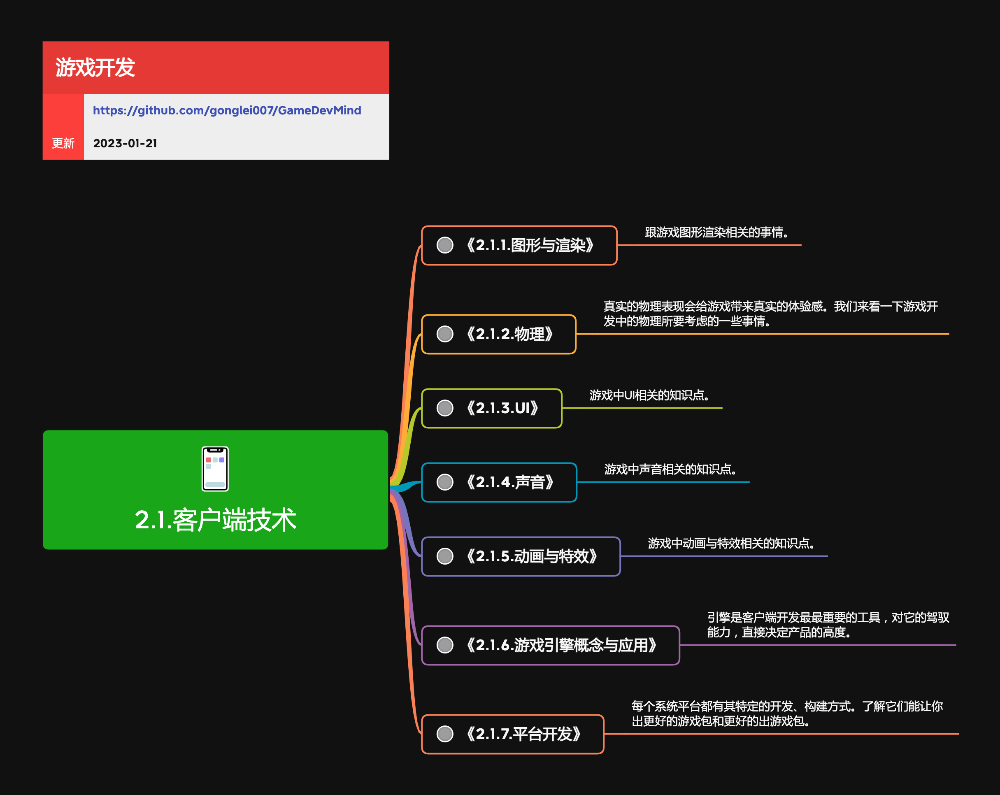

<h2 align="center">客户端技术</h2>

游戏客户端开发可能涉及的方向和技术。

**关键词:** 
*对象,数据*

**标签:** 
*等级: 初级|中级, 阶段: 学习|开发, 分类: 技术能力, 角色: 客户端开发*

## 图谱

## 子主题
* [2.1.1.图形与渲染](2.1.1.图形与渲染.md)
* [2.1.2.物理](2.1.2.物理.md)
* [2.1.3.UI](2.1.3.UI.md)
* [2.1.4.声音](2.1.4.声音.md)
* [2.1.5.动画与特效](2.1.5.动画与特效.md)
* [2.1.6.游戏引擎概念与应用](2.1.6.游戏引擎概念与应用.md)
* [2.1.7.平台开发](2.1.7.平台开发.md)
