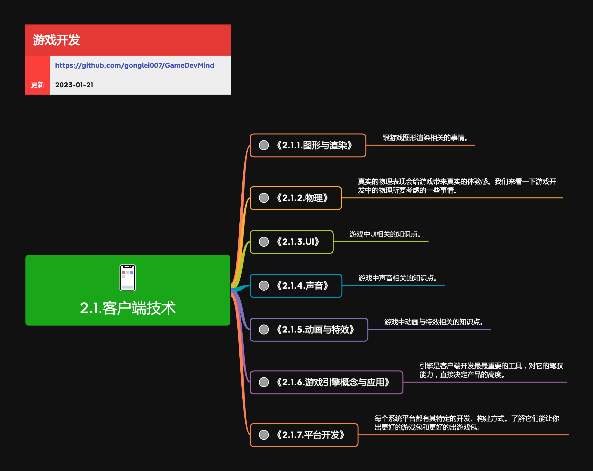

## 客户端技术

游戏客户端开发高频使用、可跨项目复用的专项技术。这里介绍技术原理、能力边界与选型；具体产品中的客户端系统架构归入研发能力。

**关键词:** 
*对象,数据*

**标签:** 
*等级: 初级|中级, 阶段: 学习|开发, 分类: 技术能力, 角色: 客户端开发*

## 图谱

* [2.1.1.图形与渲染](2.1.1.图形与渲染.md)
* [2.1.2.物理](2.1.2.物理.md)
* [2.1.3.UI](2.1.3.UI.md)
* [2.1.4.声音](2.1.4.声音.md)
* [2.1.5.动画与特效](2.1.5.动画与特效.md)
* [2.1.6.游戏引擎概念与应用](2.1.6.游戏引擎概念与应用.md)
* [2.1.7.平台开发](2.1.7.平台开发.md)
* [游戏引擎功能系统](../4.生产能力/4.1.3.引擎的基本功能系统.md)（迁移期保留旧路径）
* [游戏引擎支撑与扩展系统](../4.生产能力/4.1.4.引擎的其它系统.md)（迁移期保留旧路径）

> UI、网络、渲染等技术在产品中的系统化实现，参见 [3.1.客户端产品研发](../3.研发能力/3.1.客户端产品研发.md)。
