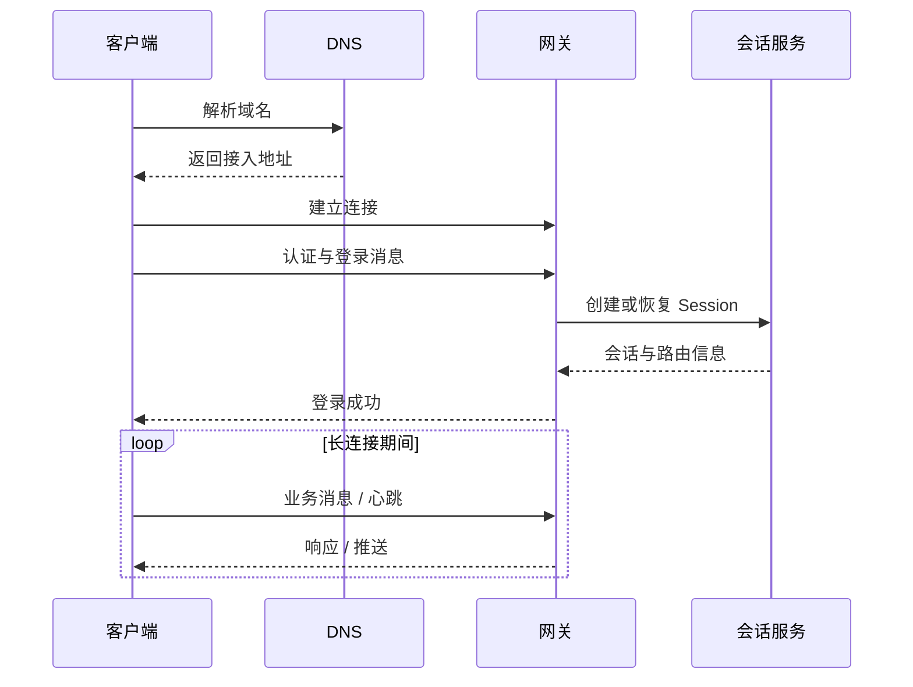
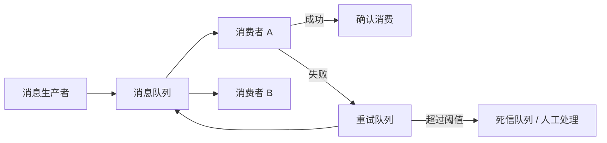

## 网络与通信

对于网络游戏来说，网络是一个核心技术支撑，有客户端跟服务端的通信，也有各个服务之间的通信，通信的方式也是多种多样。那么哪种通信方式适合于哪种情景呢？

**关键词:** 
*协议,消息,RPC,并发,负载,Session,Socket,消息队列,REST,WebSocket,心跳,粘包,AI Coding*

**标签:** 
*等级: 中级, 阶段: 学习|开发, 分类: 技术能力, 角色: 客户端开发|服务端开发*

----

> 💡 **AI Coding 总览**（为何要掌握知识才能更好操作 AI、指南的三类内容等）见 [阅读说明 - AI Coding 总览](../阅读说明.md#ai-coding-总览)。

---

> **分层定位：** 本文介绍网络协议、连接、消息、RPC 和通信模式等可跨项目复用的专项技术；客户端网络实现和多人游戏同步属于 [3.研发能力](../3.研发能力/3.研发能力.md)。

## 目录

- [协议与安全](#协议与安全)
- [连接与消息](#连接与消息)
- [并发与消息队列](#并发与消息队列)
- [服务间通信与 API](#服务间通信与-api)
- [更多资料](#更多资料)

----

## 协议与安全

### 网络应用

**是什么？在哪用？**
- **作用**：网络应用是游戏客户端和服务端之间、服务端之间的通信基础
- **应用场景**：
  - 客户端-服务端通信
  - 服务端间通信
  - 实时游戏同步

### 协议

**是什么？在哪用？**
- **作用**：定义数据传输的规则和格式
- **应用场景**：
  - 游戏网络通信
  - 数据传输
  - 实时同步
- **HTTP**
  - **特点**：无状态、短连接、基于请求-响应
  - **应用举例**：轻度游戏
  - **应用场景**：登录、支付、配置获取等

- **TCP**
  - **特点**：面向连接、可靠传输、有序传输
  - **WebSocket**：基于TCP的WebSocket协议
    - **应用**：实时双向通信
  - **socket.io**：基于WebSocket的实时通信库
    - **应用**：简化WebSocket使用
  - **应用举例**：MMORPG
  - **应用场景**：需要可靠传输的场景

- **UDP**
  - **特点**：无连接、快速传输、低延迟
  - **应用场景**：实时响应要求高的游戏
  - **应用举例**：FPS游戏
  - **应用场景**：实时同步、语音通话等

**会遇到哪些问题？用什么解决？**
- **协议选择**
  - **问题**：不同游戏类型需要不同的网络协议
  - **解决方向**：
    - 轻度游戏可以使用HTTP
    - MMORPG等需要长连接的可以使用TCP/WebSocket
    - 实时性要求高的游戏（如FPS）可以使用UDP
    - 混合使用多种协议（如HTTP用于登录，TCP用于游戏）

- **协议性能**
  - **问题**：协议选择不当可能影响性能
  - **解决方向**：
    - 根据需求选择合适的协议
    - 优化协议参数
    - 使用协议优化技术（如TCP_NODELAY）
    - 测试不同协议的性能

**要点和思考方向**
- 根据游戏类型选择合适的协议
- HTTP适合短连接场景
- TCP/WebSocket适合长连接场景
- UDP适合实时性要求高的场景
- 可以混合使用多种协议

| 类型 | AI Coding 指南 |
|------|----------------|
| **交互提示** | 说明游戏类型、通信需求；如「MMO」「FPS」「登录+游戏」 |
| **方法** | 轻度用 HTTP；长连接用 TCP/WebSocket；实时用 UDP；混合使用 |
| **应用** | 协议选型 |
| **提示词范例** | 「游戏需要：登录用 HTTP，游戏内用长连接，实时对战用低延迟，请设计混合协议方案并说明各场景的选择」 |

### 安全

**是什么？在哪用？**
- **作用**：保护数据传输安全，防止数据被窃取或篡改
- **应用场景**：
  - 敏感数据传输
  - 用户认证
  - 支付交易
- **加密解密**：保护数据传输安全
  - **应用**：对敏感数据进行加密传输
- **SSL**：安全套接层，提供加密通信
  - **应用**：HTTPS、WSS等安全连接
  - **说明**：现在通常使用TLS（SSL的后续版本）

**会遇到哪些问题？用什么解决？**
- **性能影响**
  - **问题**：加密解密可能影响性能
  - **解决方向**：
    - 使用硬件加速
    - 优化加密算法
    - 选择性加密（只加密敏感数据）
    - 使用高效的加密库

- **证书管理**
  - **问题**：SSL/TLS证书管理复杂
  - **解决方向**：
    - 使用证书管理工具
    - 设置证书过期提醒
    - 使用自动续期
    - 测试证书有效性

**要点和思考方向**
- 安全是网络通信的重要方面
- 使用SSL/TLS保护数据传输
- 注意加密对性能的影响
- 妥善管理证书

| 类型 | AI Coding 指南 |
|------|----------------|
| **交互提示** | 说明安全需求、性能；如「HTTPS」「WSS」「敏感数据」「加密开销」 |
| **方法** | SSL/TLS；选择性加密；证书管理 |
| **应用** | 安全通信 |
| **提示词范例** | 「WebSocket 需升级到 WSS 加密，请说明 TLS 握手、证书配置、以及 C# 或 Node.js 的 WSS 服务端实现」 |

## 连接与消息

### 连接

**是什么？在哪用？**
- **作用**：建立和维护网络连接
- **应用场景**：
  - 长连接通信
  - 实时同步
- **握手**：建立连接的过程
  - **应用**：TCP三次握手、WebSocket握手等
  - **说明**：建立连接需要客户端和服务端协商

- **心跳**
  - **作用**：定时查看客户端跟服务器的连接状态。如果长时间没有心跳，将连接断掉
  - **应用**：保持长连接，检测连接状态
  - **实现**：定期发送心跳包，检测连接是否有效

**会遇到哪些问题？用什么解决？**
- **连接断开**
  - **问题**：网络不稳定导致连接断开
  - **解决方向**：
    - 实现自动重连
    - 使用心跳检测连接状态
    - 处理网络异常
    - 实现断线重连机制

- **连接管理**
  - **问题**：大量连接难以管理
  - **解决方向**：
    - 使用连接池
    - 限制连接数量
    - 监控连接状态
    - 及时清理无效连接

**要点和思考方向**
- 连接管理是网络通信的基础
- 使用心跳保持长连接
- 实现自动重连机制
- 注意连接的性能和资源消耗

| 类型 | AI Coding 指南 |
|------|----------------|
| **交互提示** | 说明连接问题、场景；如「断线重连」「心跳间隔」「连接池」 |
| **方法** | 心跳包；自动重连；连接池；超时检测 |
| **应用** | 长连接管理 |
| **提示词范例** | 「长连接 5 分钟无数据被 NAT 断开，请设计心跳机制：间隔、超时判定、以及断线重连的指数退避策略」 |

### 消息

**是什么？在哪用？**
- **作用**：定义和传输游戏中的各种消息
- **应用场景**：
  - 游戏逻辑通信
  - 数据同步
  - 事件通知

### 粘包、半包

**是什么？在哪用？**
- **作用**：处理TCP流式协议的数据包问题
- **应用场景**：
  - TCP通信
  - 数据包解析
- **粘包**：多个数据包粘在一起
- **半包**：一个数据包被分成多个部分

**会遇到哪些问题？用什么解决？**
- **问题**：TCP是流式协议，数据包可能会粘在一起或分片
- **解决方向**：
  - **发送**：使用包头+包体的格式，包头包含包体长度
  - **解包**：根据包头信息正确解析包体
  - **缓冲**：使用缓冲区处理不完整的数据包
  - **测试**：测试各种数据包大小和网络情况

**要点和思考方向**
- 粘包和半包是TCP通信的常见问题
- 使用包头+包体格式可以解决
- 注意数据包解析的正确性
- 测试各种边界情况

| 类型 | AI Coding 指南 |
|------|----------------|
| **交互提示** | 说明协议格式、粘包场景；如「自定义 TCP 协议」「包头+包体」「多消息」 |
| **方法** | 包头含长度；缓冲区；正确解析边界 |
| **应用** | 粘包拆包 |
| **提示词范例** | 「TCP 自定义协议，消息格式 [4字节长度][N字节数据]，请用 C# 实现粘包拆包，处理半包和粘包」 |

### 压缩

**是什么？在哪用？**
- **作用**：减少数据传输量，提高传输效率
- **应用场景**：
  - 大量数据传输
  - 带宽受限场景
  - 降低传输成本
- **protobuf**：高效的二进制序列化格式
  - **应用**：消息序列化
  - **优点**：体积小、性能好
- **route**：路由压缩
  - **应用**：压缩消息路由信息
- **gzip**：通用的数据压缩格式
  - **应用**：HTTP响应压缩、文件压缩

**会遇到哪些问题？用什么解决？**
- **压缩性能**
  - **问题**：压缩可能影响性能
  - **解决方向**：
    - 选择合适的压缩算法
    - 使用硬件加速
    - 选择性压缩（只压缩大文件）
    - 测试压缩效果和性能

- **压缩率**
  - **问题**：某些数据压缩率不高
  - **解决方向**：
    - 选择合适的压缩算法
    - 预处理数据（如去除冗余）
    - 使用字典压缩
    - 测试不同压缩算法

**要点和思考方向**
- 压缩可以减少数据传输量
- 选择合适的压缩算法很重要
- 注意压缩对性能的影响
- 测试压缩效果

| 类型 | AI Coding 指南 |
|------|----------------|
| **交互提示** | 说明压缩场景、数据；如「消息体大」「带宽受限」「protobuf」 |
| **方法** | protobuf；gzip；选择性压缩；测试压缩率 |
| **应用** | 消息压缩 |
| **提示词范例** | 「游戏消息用 JSON 体积大，请比较 protobuf、MessagePack、gzip 的压缩率、性能、以及 C# 的集成方式」 |

### Session（会话）

**是什么？在哪用？**
- **作用**：用于存放用户连接信息
- **应用场景**：
  - 用户会话管理
  - 连接状态管理
  - 用户认证
- **应用**：管理用户会话状态
- **内容**：
  - 用户ID
  - 连接信息
  - 会话状态
  - 认证信息

**会遇到哪些问题？用什么解决？**
- **Session管理**
  - **问题**：大量Session难以管理
  - **解决方向**：
    - 使用Session池
    - 定期清理过期Session
    - 使用分布式Session存储
    - 监控Session状态

- **Session过期**
  - **问题**：Session过期导致用户需要重新登录
  - **解决方向**：
    - 实现Session续期
    - 设置合理的过期时间
    - 处理Session过期事件
    - 提供自动重连

**要点和思考方向**
- Session管理用户会话状态
- 注意Session的生命周期
- 使用分布式存储支持多服务器
- 及时清理过期Session

| 类型 | AI Coding 指南 |
|------|----------------|
| **交互提示** | 说明 Session 场景、规模；如「多服」「分布式」「Session 过期」 |
| **方法** | 分布式存储；Redis；续期；过期清理 |
| **应用** | 会话管理 |
| **提示词范例** | 「游戏多服，用户换服需共享 Session，请说明 Redis 存储 Session、Token 刷新、以及跨服 Session 同步方案」 |

### Channel

**是什么？在哪用？**
- **作用**：当后端想向特定客户端或者分组推送消息的时候，可以使用Channel
- **应用场景**：
  - 消息推送
  - 分组通信
  - 广播消息
- **应用举例**：聊天消息
- **类型**：
  - **单播**：向单个客户端推送
  - **组播**：向一组客户端推送
  - **广播**：向所有客户端推送

**会遇到哪些问题？用什么解决？**
- **Channel管理**
  - **问题**：大量Channel难以管理
  - **解决方向**：
    - 使用Channel管理器
    - 实现Channel订阅机制
    - 监控Channel状态
    - 及时清理无效Channel

- **消息推送性能**
  - **问题**：大量消息推送可能影响性能
  - **解决方向**：
    - 使用消息队列
    - 批量推送
    - 异步推送
    - 优化推送逻辑

**要点和思考方向**
- Channel用于消息推送
- 支持单播、组播、广播
- 注意Channel的管理和性能
- 实现订阅机制

| 类型 | AI Coding 指南 |
|------|----------------|
| **交互提示** | 说明推送场景、规模；如「聊天」「房间广播」「全服公告」 |
| **方法** | 订阅机制；单播/组播/广播；消息队列 |
| **应用** | 消息推送 |
| **提示词范例** | 「聊天室需向房间内所有人推送消息，请设计 Channel 订阅模型：加入/离开、消息分发、以及房间与 Channel 的映射」 |

### Route（路由）

**是什么？在哪用？**
- **作用**：将消息路由到对应的处理函数
- **应用场景**：
  - 消息分发
  - 请求处理
  - 功能调用
- **实现**：
  - 路由表
  - 路由规则
  - 路由匹配

**会遇到哪些问题？用什么解决？**
- **路由性能**
  - **问题**：路由查找可能影响性能
  - **解决方向**：
    - 使用高效的路由算法
    - 使用路由缓存
    - 优化路由表结构
    - 使用哈希表加速查找

- **路由管理**
  - **问题**：路由配置复杂
  - **解决方向**：
    - 使用配置文件
    - 实现路由注册机制
    - 使用路由中间件
    - 文档化路由规则

**要点和思考方向**
- 路由将消息分发到处理函数
- 注意路由的性能
- 使用配置文件管理路由
- 实现路由注册机制

| 类型 | AI Coding 指南 |
|------|----------------|
| **交互提示** | 说明路由需求、性能；如「消息分发」「协议号映射」「路由表」 |
| **方法** | 路由表；哈希查找；注册机制；中间件 |
| **应用** | 消息分发 |
| **提示词范例** | 「游戏协议 100+ 种，需根据协议号路由到处理函数，请设计 C# 路由表：协议号→Handler、支持中间件、以及异步处理」 |

## 并发与消息队列

### 并发

**是什么？在哪用？**
- **作用**：处理并发请求和连接
- **应用场景**：
  - 多用户同时在线
  - 并发请求处理
  - 高并发场景

### 解决问题

**是什么？在哪用？**
- **作用**：解决并发访问共享资源的问题
- **应用场景**：
  - 多线程/多进程环境
  - 共享资源访问
- **对共有资源的访问（比如内存等）**
  - **问题**：多线程/多进程访问共享资源可能导致数据竞争
  - **解决方向**：
    - 使用锁、原子操作、无锁数据结构等同步机制
    - 使用消息队列
    - 使用Actor模型
    - 避免共享状态

**会遇到哪些问题？用什么解决？**
- **并发控制**
  - **问题**：并发控制不当可能导致死锁或性能问题
  - **解决方向**：
    - 使用合适的同步机制
    - 避免死锁
    - 使用无锁数据结构
    - 测试并发场景

- **性能问题**
  - **问题**：锁竞争可能影响性能
  - **解决方向**：
    - 减少锁的粒度
    - 使用读写锁
    - 使用无锁编程
    - 优化并发模型

**要点和思考方向**
- 并发是网络服务的基础
- 注意并发访问共享资源的问题
- 使用合适的同步机制
- 避免死锁和性能问题

| 类型 | AI Coding 指南 |
|------|----------------|
| **交互提示** | 说明并发场景、共享资源；如「多线程」「连接池」「数据竞争」 |
| **方法** | 锁；无锁队列；Actor 模型；避免共享 |
| **应用** | 并发控制 |
| **提示词范例** | 「网络服务多线程处理消息，共享连接池可能竞争，请说明无锁队列、线程池、以及 C# ConcurrentQueue 的用法」 |

### 消息队列

**是什么？在哪用？**
- **作用**：提供异步消息传递机制，解耦系统组件
- **应用场景**：
  - 服务器间通信
  - 异步任务处理
  - 系统解耦
  - 削峰填谷

### 说明

**是什么？在哪用？**
- **作用**：消息队列的基本组件和概念
- **应用场景**：
  - 消息队列设计
  - 消息队列使用
- **Producer（生产者）**
  - **作用**：生成消息并把消息发送给消息队列
  - **应用**：产生消息的系统或组件

- **Consumer（消费者）**
  - **作用**：从消息队列中接收消息
  - **应用**：处理消息的系统或组件

- **路由**
  - **作用**：将生产者传递的消息根据不同的路由规则传递到对应的队列中
  - **应用**：消息分发和路由

- **Queue（队列）**
  - **作用**：实际存储消息的地方，消费者通过订阅队列来获取队列中的消息
  - **应用**：消息存储和传递

**要点和思考方向**
- 消息队列采用生产者-消费者模式
- 路由决定消息的去向
- 队列存储消息
- 支持多个生产者和消费者

| 类型 | AI Coding 指南 |
|------|----------------|
| **交互提示** | 说明 MQ 场景、组件；如「生产者」「消费者」「路由」「队列」 |
| **方法** | 生产者-消费者；路由规则；队列订阅 |
| **应用** | MQ 设计 |
| **提示词范例** | 「游戏日志需异步写入，请用生产者-消费者模式设计：日志生产者、队列、消费者写入文件，并说明背压处理」 |

### 特性

**是什么？在哪用？**
- **作用**：消息队列的重要特性
- **应用场景**：
  - 消息队列选择
  - 消息队列配置
- **模式**：生产消费者模式
  - **应用**：解耦生产者和消费者

- **channel**：消息通道
  - **应用**：消息传递的通道

- **管理**：要可以看到整个集群的统计信息并进行管理
  - **应用**：监控和管理消息队列

- **持久化**：消息持久化存储，防止消息丢失
  - **应用**：重要消息的可靠存储

**要点和思考方向**
- 消息队列支持生产消费者模式
- 持久化保证消息不丢失
- 管理功能便于监控和运维
- 支持多种消息通道

| 类型 | AI Coding 指南 |
|------|----------------|
| **交互提示** | 说明 MQ 特性需求；如「持久化」「监控」「不丢消息」 |
| **方法** | 持久化；ACK；监控面板 |
| **应用** | MQ 选型 |
| **提示词范例** | 「订单消息不能丢失，请说明 RabbitMQ 的持久化、Publisher Confirm、Consumer ACK 的配置和消息可靠性保证」 |

### 解决问题

**是什么？在哪用？**
- **作用**：消息队列解决的主要问题
- **应用场景**：
  - 系统设计
  - 架构优化
- **异步**
  - **作用**：发出一个请求不用等待响应后再处理其它事情
  - **应用**：提高系统响应速度

- **解耦**
  - **作用**：各个系统不用互相强依赖
  - **应用**：系统架构解耦

- **削峰**
  - **作用**：一下堆积了太多的任务，不会把自己或其它系统卡住，按照资源限制或可控节奏来一个个处理
  - **应用**：处理流量峰值

- **顺序**
  - **说明**：消息发送的先后顺序，不一定就是消息处理的先后顺序
  - **应用**：某些场景需要保证消息顺序

**要点和思考方向**
- 消息队列提供异步、解耦、削峰等能力
- 注意消息顺序的处理
- 根据需求选择合适的特性

| 类型 | AI Coding 指南 |
|------|----------------|
| **交互提示** | 说明 MQ 解决的问题；如「异步」「解耦」「削峰」「顺序」 |
| **方法** | 异步处理；解耦；限流；分区保序 |
| **应用** | 架构设计 |
| **提示词范例** | 「活动开始瞬间大量请求，服务可能被打挂，请说明消息队列削峰填谷的原理和实现：限流、队列缓冲、消费速率」 |

### 应用场景

**是什么？在哪用？**
- **作用**：消息队列的应用场景
- **应用场景**：
  - 服务器间通信
  - 异步任务处理
  - 系统解耦
- **服务器间的通信**：用于服务器之间的异步消息传递
  - **应用**：微服务架构、分布式系统

**要点和思考方向**
- 消息队列主要用于服务器间通信
- 适合异步任务处理
- 支持系统解耦

| 类型 | AI Coding 指南 |
|------|----------------|
| **交互提示** | 说明 MQ 应用场景；如「服务间通信」「异步任务」「微服务」 |
| **方法** | 服务解耦；异步任务；事件驱动 |
| **应用** | 微服务架构 |
| **提示词范例** | 「游戏服与支付服解耦，支付结果通过 MQ 通知，请设计消息格式、幂等处理、以及支付服宕机时的重试策略」 |

### 作用

**是什么？在哪用？**
- **作用**：消息队列的核心作用
- **应用场景**：
  - 性能优化
  - 系统稳定
- **防止性能管理失控**：通过消息队列控制消息处理节奏，避免系统过载
  - **应用**：流量控制、资源管理

**要点和思考方向**
- 消息队列可以防止系统过载
- 控制消息处理节奏
- 提高系统稳定性

| 类型 | AI Coding 指南 |
|------|----------------|
| **交互提示** | 说明过载、流量控制；如「流量峰值」「限流」「背压」 |
| **方法** | 限流；背压；消费速率控制 |
| **应用** | 流量控制 |
| **提示词范例** | 「MQ 消费速度跟不上生产速度导致堆积，请说明 RabbitMQ 的 prefetch、Kafka 的 consumer lag、以及背压策略」 |

### 候选

**是什么？在哪用？**
- **作用**：常用的消息队列实现
- **应用场景**：
  - 消息队列选择
  - 技术选型
- **Kafka**：高吞吐量的分布式消息队列
  - **特点**：高吞吐、分布式、持久化
  - **应用**：大数据、日志收集

- **RabbitMQ**
  - **说明**：RabbitMQ 是对 AMQP（高级消息队列协议）的实现，成熟可靠并且开源
  - **特点**：成熟、可靠、功能丰富
  - **应用**：企业级应用

- **RocketMQ**：阿里巴巴开源的分布式消息中间件
  - **特点**：高性能、分布式、事务支持
  - **应用**：电商、金融

- **ActiveMQ**：Apache的消息中间件
  - **特点**：成熟、支持多种协议
  - **应用**：企业级应用

- **NSQ**
  - **特点**：高效轻量、简单、易于分布式扩展
  - **应用**：轻量级应用

**会遇到哪些问题？用什么解决？**
- **消息队列选择**
  - **问题**：不同消息队列有不同的特点和适用场景
  - **解决方向**：
    - 根据项目需求、性能要求、可靠性要求等因素选择合适的消息队列
    - 评估吞吐量需求
    - 考虑运维复杂度
    - 测试不同消息队列

- **消息丢失**
  - **问题**：消息可能丢失
  - **解决方向**：
    - 使用消息持久化
    - 使用消息确认机制
    - 实现消息重试
    - 监控消息状态

- **消息重复**
  - **问题**：消息可能重复处理
  - **解决方向**：
    - 实现幂等性
    - 使用消息去重
    - 记录处理状态
    - 使用唯一ID

**要点和思考方向**
- 根据需求选择合适的消息队列
- 注意消息的可靠性和一致性
- 实现消息去重和幂等性
- 监控消息队列状态

| 类型 | AI Coding 指南 |
|------|----------------|
| **交互提示** | 说明 MQ 选型、场景；如「Kafka」「RabbitMQ」「消息丢失」「重复」 |
| **方法** | 按需求选型；持久化；幂等；去重 |
| **应用** | MQ 选型 |
| **提示词范例** | 「游戏需选消息队列，高吞吐日志用 Kafka，订单用 RabbitMQ，请比较两者并说明消息去重、幂等、以及 at-least-once 的实现」 |

## 服务间通信与 API

### 服务器间通信

**是什么？在哪用？**
- **作用**：实现服务器之间的通信和协作
- **应用场景**：
  - 微服务架构
  - 分布式系统
  - 服务调用

### 网络

**是什么？在哪用？**
- **作用**：服务器间通信的网络协议
- **应用场景**：
  - 服务调用
  - 数据传输
- **HTTP**：基于HTTP协议的通信
  - **应用**：REST API、服务调用
  - **特点**：简单、通用、跨平台

- **Socket**：基于Socket的通信
  - **应用**：高性能通信、实时通信
  - **特点**：高效、灵活

**要点和思考方向**
- HTTP适合简单的服务调用
- Socket适合高性能通信
- 根据需求选择合适的协议

| 类型 | AI Coding 指南 |
|------|----------------|
| **交互提示** | 说明服务间通信、协议；如「微服务」「HTTP」「gRPC」 |
| **方法** | HTTP REST；Socket；gRPC |
| **应用** | 服务调用 |
| **提示词范例** | 「游戏服调用用户服查询信息，请比较 HTTP REST 与 gRPC 的延迟、序列化、以及 C# 或 Go 的 gRPC 客户端实现」 |

### RPC

**是什么？在哪用？**
- **作用**：
  - 像调用本地方法一样去调用一个远程（服务）的方法
  - 通常用于各个后端服务之间的功能调用
- **应用场景**：
  - 微服务调用
  - 分布式系统
  - 服务间通信
- **特点**：即刻调用，即刻执行
- **优势**：
  - 调用简单
  - 类型安全
  - 性能好

**会遇到哪些问题？用什么解决？**
- **资源的使用与限制**
  - **问题**：RPC调用需要考虑资源限制
  - **考虑因素**：
    - **内存**：内存使用限制
    - **线程**：线程池大小限制
  - **解决方向**：
    - 使用连接池
    - 限制并发数
    - 使用异步RPC
    - 监控资源使用

- **RPC超时**
  - **问题**：RPC调用可能超时
  - **解决方向**：
    - 设置合理的超时时间
    - 实现重试机制
    - 使用熔断器
    - 处理超时异常

- **服务发现**
  - **问题**：如何发现和定位服务
  - **解决方向**：
    - 使用服务注册中心
    - 实现服务发现机制
    - 使用负载均衡
    - 监控服务状态

**要点和思考方向**
- RPC简化远程服务调用
- 注意资源限制和超时处理
- 实现服务发现和负载均衡
- 使用熔断器提高系统稳定性

| 类型 | AI Coding 指南 |
|------|----------------|
| **交互提示** | 说明 RPC 场景、问题；如「超时」「服务发现」「熔断」「连接池」 |
| **方法** | 超时设置；重试；熔断器；服务注册 |
| **应用** | RPC 调用 |
| **提示词范例** | 「gRPC 调用下游超时导致线程阻塞，请说明超时配置、异步 RPC、熔断器（如 Polly）、以及连接池大小」 |

### REST

**是什么？在哪用？**
- **作用**：基于HTTP的RESTful API设计
- **应用场景**：
  - Web API
  - 服务调用
  - 资源操作
- **说明**：REST API 遵循传统的 CRUD 理念，请求通过 GET、POST、PUT 或 DELETE 操作与资源交互

- **特点**：
  - 可扩展性、高性能、可移植性、可靠性
  - 跨各种技术堆栈使用时相对简单

**会遇到哪些问题？用什么解决？**
- **REST设计**
  - **问题**：REST API设计不当
  - **解决方向**：
    - 遵循RESTful设计原则
    - 使用合适的HTTP方法
    - 设计清晰的资源路径
    - 使用标准状态码

- **性能问题**
  - **问题**：REST API可能性能不如RPC
  - **解决方向**：
    - 使用HTTP/2
    - 优化请求和响应
    - 使用缓存
    - 批量操作

**要点和思考方向**
- REST适合Web API和服务调用
- 遵循RESTful设计原则
- 注意性能和缓存
- 使用标准HTTP方法

| 类型 | AI Coding 指南 |
|------|----------------|
| **交互提示** | 说明 REST 设计、性能；如「API 设计」「资源路径」「缓存」 |
| **方法** | RESTful 原则；HTTP 方法；缓存；批量接口 |
| **应用** | Web API |
| **提示词范例** | 「游戏后台 REST API 设计，资源有用户、背包、任务，请给出资源路径、HTTP 方法、以及分页、过滤的 Query 设计」 |

## 更多资料

## 资料库
* [Game Networking Resources](https://github.com/ThusSpokeNomad/GameNetworkingResources) - 里面集合了跟游戏网络开发相关的很多资料。

## 视频资料
* [TCP/IP 网络通信之 Socket 编程入门](https://www.youtube.com/watch?v=ST6WLZFSHXs)
* [System Design: Why is Kafka fast?](https://www.youtube.com/watch?v=UNUz1-msbOM)

## 文章资料
* [What's the Difference Between RPC and REST?](https://nordicapis.com/whats-the-difference-between-rpc-and-rest/#:~:text=The%20most%20fundamental%20difference%20between,handling%20large%20quantities%20of%20data.) - 简单介绍了RPC和REST，并比较了它们的差异。
* [RPC vs. Messaging – which is faster?](https://particular.net/blog/rpc-vs-messaging-which-is-faster#:~:text=Systems%20built%20on%20message%20queues,requests%2C%20it%20uses%20durable%20disks.)
