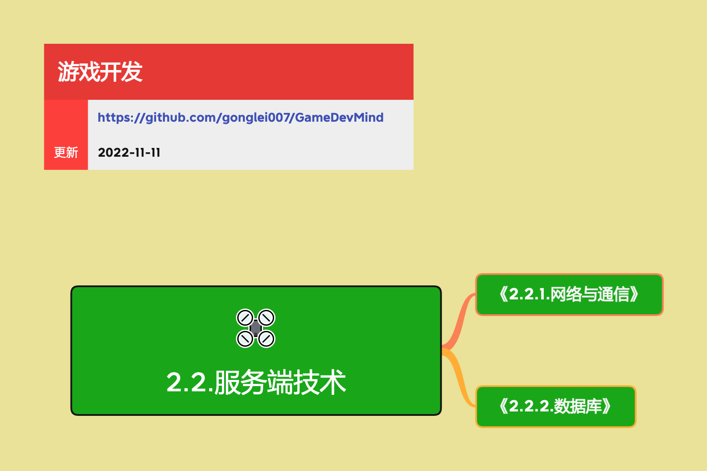

<h2 align="center">服务端技术</h2>

对于服务端开发，很少需要考虑产品表现、人机交互或者数字内容相关的事情。服务端的大部分工作都是解决数据、传输和逻辑上的事情。

**关键词:** 
*游戏服务器*

**标签:** 
*等级: 中级, 阶段: 学习|开发, 分类: 技术能力, 角色: 服务端开发*

## 图谱

* [2.2.1.网络与通信](2.2.1.网络与通信.md)
* [2.2.2.数据库](2.2.2.数据库.md)
* [2.2.3.服务端中间件](2.2.3.服务端中间件.md)
