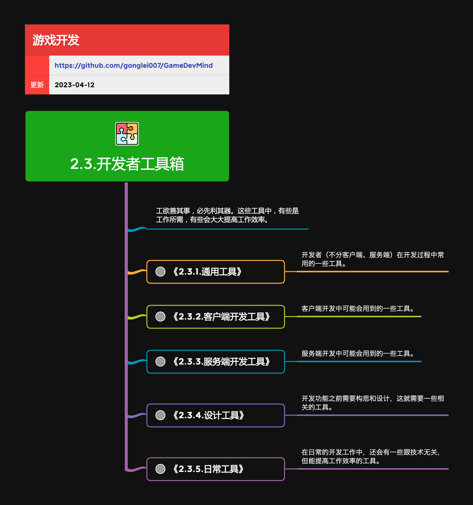

## 开发者工具箱

游戏开发者用于编码、调试、分析和定位技术问题的工具集合。本模块关注工具的使用与选型；定制编辑器、自动化工具和生产线的建设归入生产能力。

**关键词:** 
*开发工具*

**标签:** 
*等级: 入门|初级, 阶段: 学习|开发, 分类: 技术能力, 角色: 客户端开发|服务端开发|全栈开发*

## 图谱

* [2.3.1.通用工具](2.3.1.通用工具.md)
* [2.3.2.客户端开发工具](2.3.2.客户端开发工具.md)
* [2.3.3.服务端开发工具](2.3.3.服务端开发工具.md)
* [2.3.4.设计工具](2.3.4.设计工具.md)
* [2.3.5.日常工具](2.3.5.日常工具.md)

> **边界：** “使用工具解决技术问题”属于技术能力；“开发工具、串联资产流程、实现批量自动化”属于 [4.2.工具开发](../4.生产能力/4.2.工具开发.md)。
