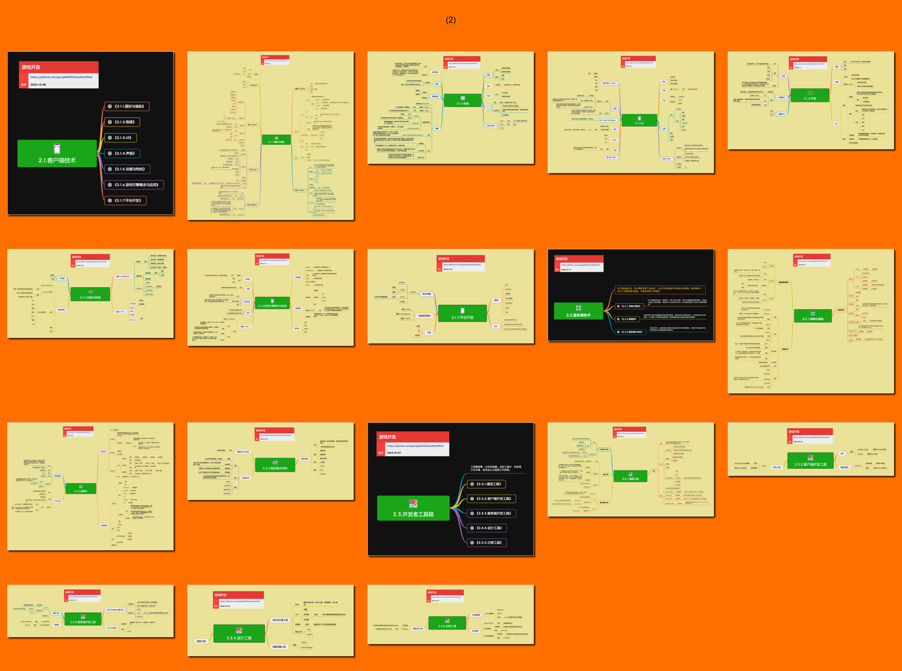

## 技术能力

技术能力是与游戏行业高度相关、能够跨项目复用的专项知识与技术，包括图形、物理、UI、音频、引擎、网络和数据技术。它关注技术原理、能力边界与选型；这些技术在具体游戏产品中的系统化实现归入“研发能力”。

**关键词:** 
*客户端技术,服务端技术,游戏引擎,图形渲染,物理,UI,声音,动画,网络,数据库,开发工具*

**标签:** 
*等级: 初级|中级, 阶段: 学习|开发, 分类: 技术能力, 角色: 客户端开发|服务端开发|全栈开发*

## 目录

* [2.1.客户端技术](2.1.客户端技术.md)
    * [⭕ 2.1.1.图形与渲染](2.1.1.图形与渲染.md)
    * [⭕ 2.1.2.物理](2.1.2.物理.md)
    * [⭕ 2.1.3.UI](2.1.3.UI.md)
    * [⭕ 2.1.4.声音](2.1.4.声音.md)
    * [2.1.5.动画与特效](2.1.5.动画与特效.md)
    * [2.1.6.游戏引擎概念与应用](2.1.6.游戏引擎概念与应用.md)
    * [2.1.7.平台开发](2.1.7.平台开发.md)
    * [游戏引擎功能系统](../4.生产能力/4.1.3.引擎的基本功能系统.md)（迁移期保留旧路径）
    * [游戏引擎支撑与扩展系统](../4.生产能力/4.1.4.引擎的其它系统.md)（迁移期保留旧路径）
* [2.2.服务端技术](2.2.服务端技术.md)
    * [2.2.1.网络与通信](2.2.1.网络与通信.md)
    * [2.2.2.数据库](2.2.2.数据库.md)
    * [2.2.3.服务端中间件](2.2.3.服务端中间件.md)
* [2.3.开发者工具箱](2.3.开发者工具箱.md)
    * [2.3.1.通用工具](2.3.1.通用工具.md)
    * [2.3.2.客户端开发工具](2.3.2.客户端开发工具.md)
    * [2.3.3.服务端开发工具](2.3.3.服务端开发工具.md)
    * [2.3.4.设计工具](2.3.4.设计工具.md)
    * [2.3.5.日常工具](2.3.5.日常工具.md)

> **分层边界：** 本模块介绍“技术是什么、能解决什么、如何选”。客户端网络系统、游戏 UI 框架、服务端业务架构等产品级实现参见 [3.研发能力](../3.研发能力/3.研发能力.md)；编辑器、自动化和生产线参见 [4.生产能力](../4.生产能力/4.生产能力.md)。
 

----

## 预览

