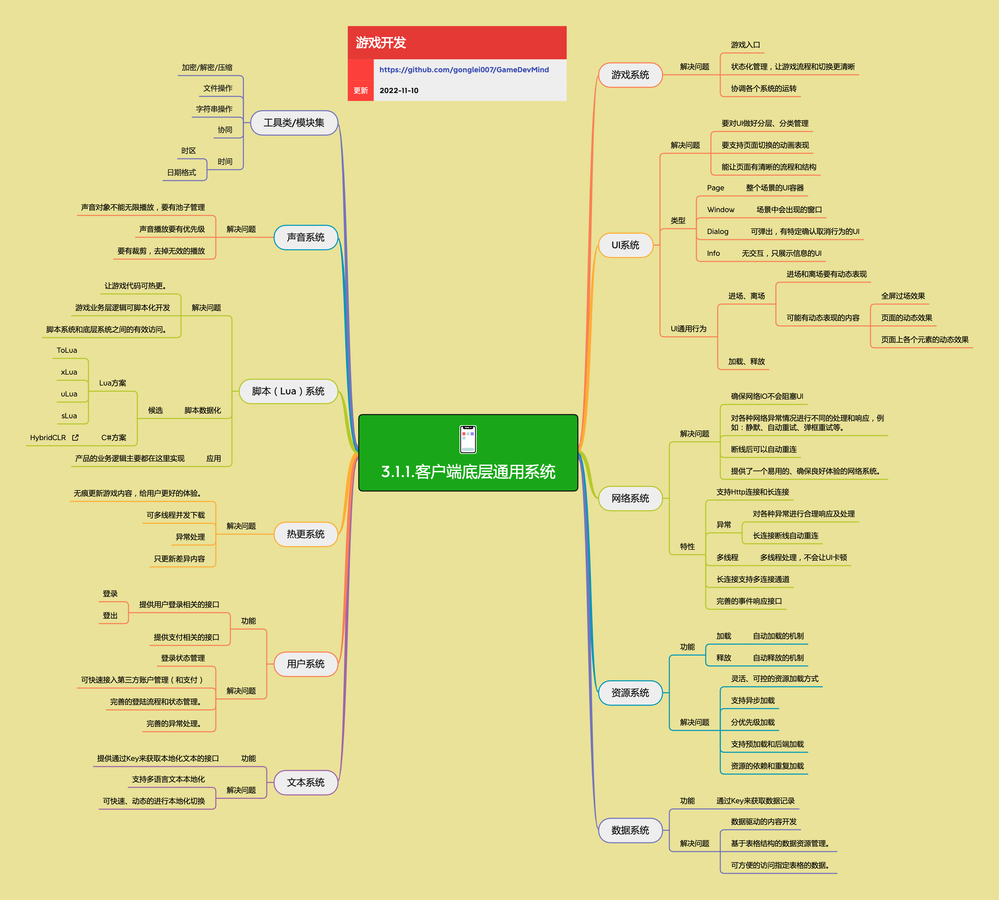

<h2 align="center">客户端底层通用系统</h2>

客户端框架层相关的功能和系统，可以被用到各种类型游戏的开发。这些系统构成了游戏的基础架构，为上层业务逻辑提供稳定的支撑。

**关键词:**  
*游戏系统，UI系统，资源系统，数据系统，文本系统，声音系统，热更系统，脚本系统*

**标签:** 
*等级: 中级|高级, 阶段: 开发, 分类: 研发能力, 角色: 客户端开发*

## 图谱

## 系统概览

客户端底层通用系统是游戏开发的基础框架，包含多个核心子系统，每个系统都解决特定的开发问题。以下是各系统的关键信息：

## 游戏系统

**是什么？在哪用？**

- **作用**：游戏的核心入口和状态管理框架
- **应用场景**：
  - 游戏启动入口
  - 游戏流程管理
  - 游戏状态切换
  - 系统协调管理
- **做什么的？** 游戏的核心入口和状态管理框架。
- **在哪用？** 作为游戏的启动入口，管理游戏的整体流程和状态切换。

**会遇到哪些问题？用什么解决？**

- **游戏入口如何设计？**
  - **问题**：游戏入口设计需要考虑初始化顺序、异常处理等
  - **解决方向**：
    - 设计清晰的初始化流程
    - 使用单例模式管理游戏实例
    - 实现异常捕获和恢复机制
    - 提供启动配置接口

- **如何管理游戏流程和状态切换？**
  - **问题**：游戏流程复杂，状态切换容易出错
  - **解决方向**：
    - 使用状态机模式管理游戏状态
    - 定义清晰的状态转换规则
    - 实现状态进入、退出、更新接口
    - 使用事件系统通知状态变化

- **如何协调各个系统的运转？**
  - **问题**：多个系统需要协调工作，初始化顺序和依赖关系复杂
  - **解决方向**：
    - 定义系统初始化顺序
    - 使用依赖注入管理系统依赖
    - 实现系统生命周期管理
    - 使用消息系统进行系统间通信

- **游戏生命周期管理**
  - **问题**：游戏启动、暂停、恢复、退出等生命周期管理复杂
  - **解决方向**：
    - 实现完整的生命周期接口
    - 处理应用前后台切换
    - 管理资源加载和释放
    - 实现优雅的退出机制

**要点和思考方向：**
- 状态化管理，让游戏流程和切换更清晰
- 需要协调各个系统的运转
- 考虑游戏启动、暂停、恢复等状态管理
- 使用状态机模式简化状态管理
- 设计清晰的系统初始化顺序
- 实现完善的异常处理机制

## 网络系统

**做什么的？** 处理客户端与服务器之间的通信。

**在哪用？** 所有需要网络交互的游戏功能。

**详情参考：** [3.1.4.客户端网络系统](./3.1.4.客户端网络系统.md)

## UI系统

**做什么的？** 用户界面管理和渲染系统。

**在哪用？** 所有需要用户交互的界面。

**详情参考：** [3.1.6.UI系统](./3.1.6.UI系统.md)

## 资源系统

**是什么？在哪用？**

- **作用**：游戏资源的加载、管理和释放系统
- **应用场景**：
  - 模型资源加载
  - 贴图资源加载
  - 音频资源加载
  - 配置文件加载
  - 场景资源加载
- **做什么的？** 游戏资源的加载、管理和释放系统。
- **在哪用？** 所有需要加载游戏资源的地方（模型、贴图、音频、配置等）。

**会遇到哪些问题？用什么解决？**

- **如何实现灵活、可控的资源加载方式？**
  - **问题**：不同资源需要不同的加载方式，需要统一的接口
  - **解决方向**：
    - 设计统一的资源加载接口
    - 支持同步和异步加载
    - 实现资源加载器抽象
    - 支持自定义加载策略

- **如何支持异步加载？**
  - **问题**：同步加载会阻塞主线程，影响游戏性能
  - **解决方向**：
    - 使用协程或异步任务实现异步加载
    - 实现加载进度回调
    - 支持加载完成回调
    - 处理异步加载异常

- **如何实现分优先级加载？**
  - **问题**：不同资源有不同优先级，需要优先加载重要资源
  - **解决方向**：
    - 定义资源优先级枚举
    - 实现优先级队列管理加载任务
    - 高优先级资源优先加载
    - 支持动态调整优先级

- **如何支持预加载和后端加载？**
  - **问题**：需要提前加载资源或后台加载资源，避免卡顿
  - **解决方向**：
    - 实现资源预加载接口
    - 支持后台加载队列
    - 控制后台加载速度
    - 实现加载完成通知

- **如何处理资源的依赖和重复加载？**
  - **问题**：资源之间存在依赖关系，重复加载浪费内存
  - **解决方向**：
    - 实现资源依赖关系管理
    - 使用引用计数管理资源生命周期
    - 实现资源缓存机制
    - 避免重复加载相同资源

- **资源内存管理**
  - **问题**：资源占用内存，需要及时释放避免内存泄漏
  - **解决方向**：
    - 实现自动加载和自动释放机制
    - 使用引用计数管理资源引用
    - 实现资源卸载接口
    - 监控资源内存使用

- **资源加载性能**
  - **问题**：大量资源加载可能影响游戏性能
  - **解决方向**：
    - 实现资源加载限流
    - 使用对象池管理资源对象
    - 优化资源加载流程
    - 实现资源加载缓存

**要点和思考方向：**
- 需要实现自动加载和自动释放的机制
- 考虑资源加载的优先级管理
- 设计资源依赖关系管理
- 避免重复加载相同资源
- 使用引用计数管理资源生命周期
- 实现资源加载缓存机制
- 支持异步加载提高性能
- 考虑资源内存管理

## 数据系统

**是什么？在哪用？**

- **作用**：游戏数据的管理和访问系统，支持数据驱动的开发方式
- **应用场景**：
  - 角色属性配置
  - 关卡配置数据
  - 道具数据配置
  - 技能数据配置
  - 数值平衡配置
- **做什么的？** 游戏数据的管理和访问系统，支持数据驱动的开发方式。
- **在哪用？** 需要配置化、数据驱动的游戏内容（角色属性、关卡配置、道具数据等）。

**会遇到哪些问题？用什么解决？**

- **如何实现数据驱动的内容开发？**
  - **问题**：需要将游戏内容配置化，支持策划修改数据而不改代码
  - **解决方向**：
    - 使用Excel等工具配置数据
    - 实现数据到代码的转换流程
    - 支持数据热更新
    - 建立数据规范

- **如何管理基于表格结构的数据资源？**
  - **问题**：游戏数据通常以表格形式存在，需要统一管理
  - **解决方向**：
    - 实现表格数据管理器
    - 支持多种数据格式（JSON、CSV、二进制）
    - 实现数据序列化和反序列化
    - 支持数据版本管理

- **如何方便地访问指定表格的数据？**
  - **问题**：需要快速访问特定表格的特定数据
  - **解决方向**：
    - 通过Key来获取数据记录
    - 实现数据索引机制
    - 提供类型安全的数据访问接口
    - 支持数据查询和过滤

- **数据热更新**
  - **问题**：需要在不重启游戏的情况下更新数据
  - **解决方向**：
    - 实现数据热更新机制
    - 支持增量数据更新
    - 处理数据更新后的内存同步
    - 实现数据回滚机制

- **数据验证**
  - **问题**：配置数据可能有错误，需要验证
  - **解决方向**：
    - 实现数据验证规则
    - 支持数据类型检查
    - 实现数据范围检查
    - 提供数据验证工具

- **数据性能**
  - **问题**：大量数据可能影响加载和访问性能
  - **解决方向**：
    - 使用二进制格式提高加载速度
    - 实现数据缓存机制
    - 优化数据访问接口
    - 使用索引加速查询

**要点和思考方向：**
- 通过Key来获取数据记录
- 支持表格结构的数据资源管理
- 提供便捷的数据访问接口
- 实现数据驱动的内容开发
- 支持数据热更新
- 建立数据规范和验证机制
- 优化数据加载和访问性能

## 文本系统

**是什么？在哪用？**

- **作用**：多语言文本管理和本地化系统
- **应用场景**：
  - UI文本显示
  - 游戏内文本显示
  - 多语言支持
  - 文本本地化
- **做什么的？** 多语言文本管理和本地化系统。
- **在哪用？** 所有需要显示文本的界面和功能。

**会遇到哪些问题？用什么解决？**

- **如何支持多语言文本本地化？**
  - **问题**：需要支持多种语言，文本管理复杂
  - **解决方向**：
    - 使用Key-Value方式管理文本
    - 实现多语言文本资源管理
    - 支持文本资源加载和切换
    - 建立文本规范

- **如何快速、动态地进行本地化切换？**
  - **问题**：需要运行时切换语言，不能重启游戏
  - **解决方向**：
    - 支持运行时动态切换语言
    - 实现文本更新通知机制
    - 自动刷新UI文本显示
    - 缓存当前语言文本

- **文本格式化和参数替换**
  - **问题**：文本需要支持参数替换和格式化
  - **解决方向**：
    - 实现文本参数替换接口
    - 支持文本格式化（如数字、日期）
    - 处理特殊字符和转义
    - 支持富文本格式

- **文本资源管理**
  - **问题**：大量文本资源需要高效管理
  - **解决方向**：
    - 使用表格管理文本资源
    - 实现文本资源加载和缓存
    - 支持文本资源热更新
    - 优化文本查找性能

- **文本长度适配**
  - **问题**：不同语言文本长度不同，UI需要适配
  - **解决方向**：
    - 实现文本长度检测
    - 支持文本自动换行
    - 动态调整UI布局
    - 处理文本溢出

**要点和思考方向：**
- 提供通过Key来获取本地化文本的接口
- 支持运行时动态切换语言
- 考虑文本格式化和参数替换
- 实现文本资源管理和缓存
- 支持文本热更新
- 处理文本长度适配问题
- 建立文本规范和验证机制

## 用户系统

**是什么？在哪用？**

- **作用**：用户登录、登出和支付相关的管理系统
- **应用场景**：
  - 用户登录认证
  - 用户登出
  - 支付功能
  - 账户管理
- **做什么的？** 用户登录、登出和支付相关的管理系统。
- **在哪用？** 需要用户认证和支付功能的所有游戏。

**会遇到哪些问题？用什么解决？**

- **如何管理登录状态？**
  - **问题**：登录状态需要持久化，应用重启后需要恢复
  - **解决方向**：
    - 实现登录状态持久化
    - 使用Token管理登录凭证
    - 实现自动登录机制
    - 处理Token过期和刷新

- **如何快速接入第三方账户管理和支付？**
  - **问题**：不同平台需要接入不同的SDK，接入复杂
  - **解决方向**：
    - 设计统一的账户和支付接口
    - 实现SDK适配层
    - 支持第三方账户和支付SDK的快速接入
    - 封装SDK调用细节

- **如何设计完善的登录流程和状态管理？**
  - **问题**：登录流程复杂，状态管理容易出错
  - **解决方向**：
    - 使用状态机管理登录流程
    - 实现登录状态枚举
    - 处理登录各阶段的状态转换
    - 实现登录超时和重试机制

- **如何处理异常情况？**
  - **问题**：网络异常、SDK异常等需要妥善处理
  - **解决方向**：
    - 实现完善的异常处理机制
    - 处理网络异常和超时
    - 处理SDK调用异常
    - 提供用户友好的错误提示

- **支付安全**
  - **问题**：支付涉及资金安全，需要严格验证
  - **解决方向**：
    - 实现支付订单验证
    - 使用服务端验证支付结果
    - 处理支付重复和异常
    - 实现支付日志记录

- **多平台支持**
  - **问题**：不同平台（iOS、Android）支付流程不同
  - **解决方向**：
    - 实现平台适配层
    - 统一支付接口
    - 处理平台差异
    - 测试各平台支付流程

**要点和思考方向：**
- 提供用户登录、登出接口
- 提供支付相关接口
- 完善的异常处理机制
- 支持第三方账户和支付SDK的快速接入
- 实现登录状态持久化
- 使用状态机管理登录流程
- 注意支付安全性
- 实现平台适配

## 热更系统

**是什么？在哪用？**

- **作用**：游戏内容的无痕更新系统，支持增量更新
- **应用场景**：
  - 游戏资源更新
  - 游戏代码更新
  - 配置文件更新
  - 游戏内容更新
- **做什么的？** 游戏内容的无痕更新系统，支持增量更新。
- **在哪用？** 需要在不重新发布应用的情况下更新游戏内容。

**会遇到哪些问题？用什么解决？**

- **如何实现无痕更新，给用户更好的体验？**
  - **问题**：更新过程不能影响用户体验，需要后台更新
  - **解决方向**：
    - 实现后台静默更新
    - 支持更新进度显示
    - 实现更新完成通知
    - 优化更新流程，减少等待时间

- **如何支持多线程并发下载？**
  - **问题**：大量资源需要下载，单线程下载太慢
  - **解决方向**：
    - 实现多线程并发下载
    - 控制并发下载数量
    - 实现下载任务队列
    - 优化下载性能

- **如何处理更新异常？**
  - **问题**：网络异常、下载失败等需要妥善处理
  - **解决方向**：
    - 实现完善的异常处理和重试机制
    - 处理网络异常和超时
    - 实现下载失败重试
    - 提供错误提示和恢复机制

- **如何只更新差异内容，减少下载量？**
  - **问题**：完整更新下载量大，需要只更新差异内容
  - **解决方向**：
    - 支持增量更新，只下载差异内容
    - 实现资源版本管理
    - 使用文件Hash比较差异
    - 实现差异文件列表生成

- **更新版本管理**
  - **问题**：需要管理多个版本，支持版本回滚
  - **解决方向**：
    - 实现版本号管理
    - 支持版本比较和检查
    - 实现版本回滚机制
    - 管理版本历史

- **断点续传**
  - **问题**：下载中断后需要支持断点续传
  - **解决方向**：
    - 考虑断点续传功能
    - 实现下载进度保存
    - 支持下载恢复
    - 优化断点续传性能

- **更新安全性**
  - **问题**：更新内容需要验证，防止被篡改
  - **解决方向**：
    - 实现文件完整性验证
    - 使用数字签名验证
    - 验证文件Hash
    - 实现安全下载机制

**要点和思考方向：**
- 支持增量更新，只下载差异内容
- 多线程并发下载，提高更新速度
- 完善的异常处理和重试机制
- 考虑断点续传功能
- 实现版本管理和回滚
- 注意更新安全性
- 优化更新流程，提升用户体验

## 脚本（Lua）系统

**是什么？在哪用？**

- **作用**：让游戏代码可热更新的脚本系统
- **应用场景**：
  - 游戏业务逻辑热更新
  - 游戏玩法逻辑开发
  - 游戏配置逻辑
  - 游戏UI逻辑
- **做什么的？** 让游戏代码可热更新的脚本系统。
- **在哪用？** 需要热更新的游戏业务逻辑。

**会遇到哪些问题？用什么解决？**

- **如何让游戏代码可热更？**
  - **问题**：原生代码无法热更新，需要脚本语言支持
  - **解决方向**：
    - 使用脚本语言（Lua、C#）实现热更新
    - 实现脚本运行时环境
    - 支持脚本代码动态加载
    - 实现脚本代码热更新机制

- **如何让游戏业务层逻辑可脚本化开发？**
  - **问题**：需要将业务逻辑脚本化，支持快速迭代
  - **解决方向**：
    - 将业务逻辑迁移到脚本层
    - 提供脚本开发工具和调试支持
    - 实现脚本代码版本管理
    - 建立脚本开发规范

- **如何实现脚本系统和底层系统之间的有效访问？**
  - **问题**：脚本需要访问底层系统功能，需要设计交互接口
  - **解决方向**：
    - 设计脚本与底层系统的交互接口
    - 实现C#到Lua的绑定机制
    - 提供类型安全的接口调用
    - 实现回调机制支持双向通信

- **脚本性能**
  - **问题**：脚本执行性能可能不如原生代码
  - **解决方向**：
    - 优化脚本执行性能
    - 使用JIT编译提高性能
    - 避免频繁的C#和Lua交互
    - 关键逻辑使用原生代码

- **脚本调试**
  - **问题**：脚本代码调试困难
  - **解决方向**：
    - 提供脚本调试工具
    - 支持断点调试
    - 实现日志输出
    - 提供错误堆栈信息

- **脚本安全**
  - **问题**：脚本代码可能被篡改，需要验证
  - **解决方向**：
    - 实现脚本代码签名验证
    - 使用加密保护脚本代码
    - 验证脚本代码完整性
    - 实现脚本沙箱机制

**要点和思考方向：**
- **Lua 方案候选：**
  - ToLua
  - xLua
  - uLua
  - sLua
- **C# 方案候选：**
  - [HybridCLR](https://github.com/focus-creative-games/hybridclr) - 支持 C# 热更新
- 产品的业务逻辑主要都在这里实现
- 需要设计好脚本与底层系统的交互接口
- 考虑脚本性能和调试支持
- 注意脚本安全性
- 选择合适的脚本方案

## 声音系统

**是什么？在哪用？**

- **作用**：游戏音频的播放和管理系统
- **应用场景**：
  - 音效播放
  - 背景音乐播放
  - 语音播放
  - 音频管理
- **做什么的？** 游戏音频的播放和管理系统。
- **在哪用？** 所有需要播放音效和背景音乐的地方。

**会遇到哪些问题？用什么解决？**

- **声音对象不能无限播放，要有池子管理**
  - **问题**：创建大量音频对象会消耗内存和性能
  - **解决方向**：
    - 实现音频对象池管理
    - 复用音频对象
    - 控制音频对象数量
    - 实现对象池自动回收

- **声音播放要有优先级**
  - **问题**：不同音频有不同重要性，需要优先级管理
  - **解决方向**：
    - 设计音频播放优先级机制
    - 高优先级音频优先播放
    - 低优先级音频可以被中断
    - 支持动态调整优先级

- **要有裁剪，去掉无效的播放**
  - **问题**：无效的音频播放浪费资源
  - **解决方向**：
    - 自动裁剪无效播放，优化性能
    - 检测并停止无效音频
    - 实现音频播放状态管理
    - 优化音频播放逻辑

- **音频资源管理**
  - **问题**：大量音频资源需要管理
  - **解决方向**：
    - 实现音频资源加载和释放
    - 支持音频资源缓存
    - 实现音频资源预加载
    - 优化音频资源内存使用

- **音频播放控制**
  - **问题**：需要控制音频播放、暂停、停止等
  - **解决方向**：
    - 实现音频播放控制接口
    - 支持音频淡入淡出
    - 实现音频音量控制
    - 支持音频循环播放

- **3D音频支持**
  - **问题**：需要支持3D空间音频
  - **解决方向**：
    - 实现3D音频定位
    - 支持音频衰减
    - 实现音频空间效果
    - 优化3D音频性能

**要点和思考方向：**
- 实现音频对象池管理
- 设计音频播放优先级机制
- 自动裁剪无效播放，优化性能
- 实现音频资源管理
- 支持音频播放控制
- 考虑3D音频支持
- 优化音频内存和性能

## 工具类/模块集

**是什么？在哪用？**

- **作用**：提供各种通用工具和辅助功能
- **应用场景**：
  - 数据安全处理
  - 文件操作
  - 字符串处理
  - 协程管理
  - 时间处理
  - 调试日志
- **做什么的？** 提供各种通用工具和辅助功能。
- **在哪用？** 游戏开发的各个场景。

**会遇到哪些问题？用什么解决？**

- **工具类设计**
  - **问题**：工具类需要通用、易用、高效
  - **解决方向**：
    - 设计统一的工具类接口
    - 实现工具类的单例或静态方法
    - 提供完善的工具类文档
    - 优化工具类性能

- **数据安全**
  - **问题**：数据需要加密保护，防止被篡改
  - **解决方向**：
    - 实现加密/解密功能
    - 使用安全的加密算法
    - 实现数据完整性验证
    - 保护密钥安全

- **文件操作**
  - **问题**：文件操作需要处理各种异常情况
  - **解决方向**：
    - 实现文件读写接口
    - 处理文件不存在、权限等异常
    - 支持异步文件操作
    - 实现文件缓存机制

- **协程管理**
  - **问题**：协程需要统一管理，避免泄漏
  - **解决方向**：
    - 实现协程管理器
    - 支持协程启动、停止、暂停
    - 实现协程生命周期管理
    - 避免协程泄漏

- **时间处理**
  - **问题**：不同时区、不同格式的时间需要统一处理
  - **解决方向**：
    - 实现时区处理
    - 支持日期格式转换
    - 实现时间戳转换
    - 处理夏令时等特殊情况

- **调试日志**
  - **问题**：需要完善的日志系统支持调试
  - **解决方向**：
    - 实现日志分级（Debug、Info、Warning、Error）
    - 支持日志输出到文件
    - 实现日志过滤和搜索
    - 使用日志中间件（如ConsolePro）

**要点和思考方向：**
- **包含的工具：**
  - **加密/解密/压缩：** 数据安全处理
  - **文件操作：** 文件读写和管理
  - **字符串操作：** 字符串处理工具
  - **协同：** 协程管理
  - **时间：** 时区处理、日期格式转换
  - **调试/日志：** 开发调试和日志记录
    - 可用中间件：ConsolePro 等
- 设计通用、易用的工具类
- 注意数据安全性
- 实现完善的异常处理
- 优化工具类性能
- 建立工具类使用规范

## 动画系统

**是什么？在哪用？**

- **作用**：游戏动画和曲线运动系统
- **应用场景**：
  - 物体运动轨迹
  - UI动画表现
  - 2D骨骼动画
  - 特效动画
- **做什么的？** 游戏动画和曲线运动系统。
- **在哪用？** 物体运动轨迹、UI 动画表现等。

**会遇到哪些问题？用什么解决？**

- **如何实现平滑的物体运动轨迹？**
  - **问题**：物体运动需要平滑、自然的轨迹
  - **解决方向**：
    - 使用缓动函数实现平滑运动
    - 使用曲线工具（如Tweener、HoTween）
    - 支持贝塞尔曲线路径
    - 实现运动插值算法

- **如何实现流畅的 UI 动画表现？**
  - **问题**：UI动画需要流畅、不卡顿
  - **解决方向**：
    - 使用动画库实现UI动画
    - 优化动画性能
    - 支持动画缓动效果
    - 实现动画序列和组合

- **如何处理 2D 骨骼动画？**
  - **问题**：2D骨骼动画需要专业工具支持
  - **解决方向**：
    - 使用2D骨骼动画工具（如Spine）
    - 实现骨骼动画播放接口
    - 支持动画混合和过渡
    - 优化骨骼动画性能

- **动画性能**
  - **问题**：大量动画可能影响性能
  - **解决方向**：
    - 优化动画计算性能
    - 使用对象池管理动画对象
    - 实现动画LOD机制
    - 减少不必要的动画更新

- **动画控制**
  - **问题**：需要控制动画播放、暂停、停止等
  - **解决方向**：
    - 实现动画播放控制接口
    - 支持动画播放速度控制
    - 实现动画事件回调
    - 支持动画循环和反向播放

- **动画资源管理**
  - **问题**：动画资源需要加载和管理
  - **解决方向**：
    - 实现动画资源加载和释放
    - 支持动画资源缓存
    - 实现动画资源预加载
    - 优化动画资源内存使用

**要点和思考方向：**
- **曲线工具候选：**
  - Tweener
  - HoTween
  - DoTween
- **2D 骨骼动画候选：**
  - Spine
  - DragonBones
- 使用缓动函数实现平滑运动
- 优化动画性能
- 实现动画资源管理
- 支持动画控制接口
- 选择合适的动画工具

## 更多资料
