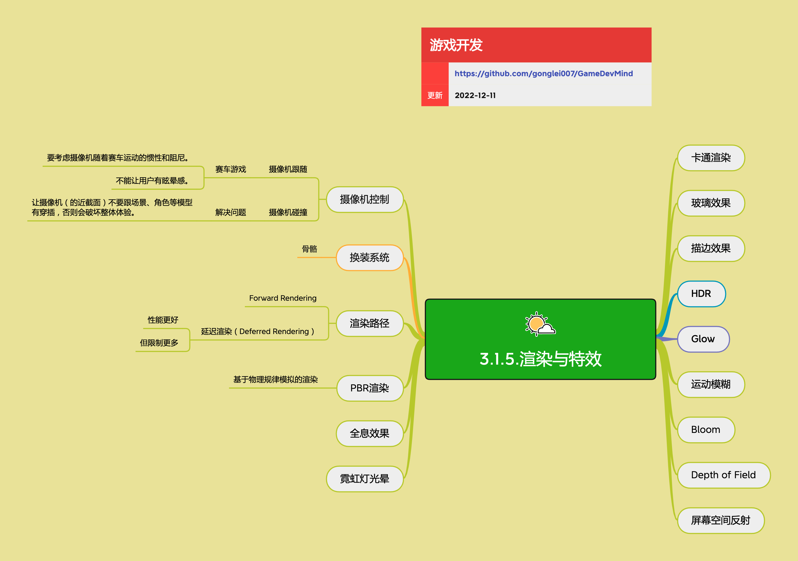

<h2 align="center">渲染与特效</h2>

各种风格的游戏画面表现，需要各种渲染方式和特效辅助。渲染与特效系统决定了游戏的视觉风格和表现力，从写实到卡通，从2D到3D，不同的渲染技术带来不同的视觉体验。

**关键词:** 
*HDR,Bloom,Toon,DOF,PBR,全局光照,描边,运动模糊*

**标签:** 
*等级: 中级|高级, 阶段: 开发, 分类: 研发能力, 角色: 客户端开发|美术*

## 图谱

## 渲染技术概览

### 全局光照（Global Illumination）

**是什么？在哪用？**

- **作用**：模拟真实世界的光照效果，包括直接光照和间接光照
- **应用场景**：
  - 需要真实感光照的3D游戏场景
  - 写实风格游戏
  - 开放世界游戏
- **做什么的？** 模拟真实世界的光照效果，包括直接光照和间接光照。
- **在哪用？** 需要真实感光照的3D游戏场景。

**会遇到哪些问题？用什么解决？**

- **如何实现全局光照？**
  - **问题**：全局光照计算复杂，性能开销大
  - **解决方向**：
    - 使用预计算全局光照（Baked GI）
    - 使用实时全局光照（Real-time GI）
    - 使用环境光遮蔽（Ambient Occlusion）增加画面光影真实感
    - 优化全局光照性能
    - 使用Light Probe和Reflection Probe

- **全局光照性能优化**
  - **问题**：全局光照可能影响渲染性能
  - **解决方向**：
    - 使用预计算减少实时计算
    - 限制全局光照范围
    - 使用简化算法
    - 优化光照贴图分辨率
    - 实现动态开关

**要点和思考方向：**
- **环境光遮蔽（Ambient Occlusion）：** 可增加画面光影真实感，模拟物体之间相互遮挡产生的阴影效果
- 考虑全局光照性能优化
- 使用预计算和实时混合方案

### HDR

**是什么？在哪用？**

- **作用**：High Dynamic Range（高动态范围），让画面获得更大范围的颜色和对比度
- **应用场景**：
  - 需要更丰富色彩表现和层次感的游戏场景
  - 写实风格游戏
  - 需要高对比度的场景
- **做什么的？** High Dynamic Range（高动态范围），让画面获得更大范围的颜色和对比度。
- **在哪用？** 需要更丰富色彩表现和层次感的游戏场景。

**会遇到哪些问题？用什么解决？**

- **如何实现HDR？**
  - **问题**：需要实现HDR渲染管线
  - **解决方向**：
    - 使用HDR渲染目标
    - 实现色调映射（Tone Mapping）
    - 支持HDR显示设备
    - 优化HDR性能
    - 处理HDR到LDR的转换

- **HDR性能优化**
  - **问题**：HDR可能影响渲染性能
  - **解决方向**：
    - 优化HDR渲染流程
    - 使用合适的HDR格式
    - 限制HDR范围
    - 优化色调映射算法

**要点和思考方向：**
- 让画面获得更大范围的颜色和对比度，让画面更有层次、更逼真
- 考虑HDR性能优化
- 实现合适的色调映射

### 描边效果

**是什么？在哪用？**

- **作用**：为物体添加描边，用于表现物体被选中或突出显示
- **应用场景**：
  - 需要高亮显示物体的场景
  - 选中物体
  - 技能范围
  - UI高亮
- **做什么的？** 为物体添加描边，用于表现物体被选中或突出显示。
- **在哪用？** 需要高亮显示物体的场景，如选中物体、技能范围等。

**会遇到哪些问题？用什么解决？**

- **如何实现描边效果？**
  - **问题**：需要实现描边渲染效果
  - **解决方向**：
    - 取得深度纹理的颜色
    - 计算深度差值，假设要绘制1像素宽度的描边
    - 深度差值小于某个值，表示这是边缘
    - 否则就绘制颜色纹理
    - 使用法线扩展方法
    - 使用后处理描边

- **如何控制描边宽度？**
  - **问题**：需要控制描边宽度以适应不同场景
  - **解决方向**：
    - 调整深度差值阈值
    - 使用法线扩展距离
    - 支持动态调整描边宽度
    - 优化描边性能

- **描边性能优化**
  - **问题**：描边可能影响渲染性能
  - **解决方向**：
    - 使用简化的描边算法
    - 限制描边对象数量
    - 优化描边Shader
    - 使用后处理描边

**要点和思考方向：**
- **基本原理：**
  - 取得深度纹理的颜色
  - 计算深度差值，假设要绘制1像素宽度的描边
  - 深度差值小于某个值，表示这是边缘
  - 否则就绘制颜色纹理

### Bloom

**是什么？在哪用？**

- **作用**：使图像增加光晕效果，使其显得更加有灵气
- **应用场景**：
  - 需要发光效果的游戏场景
  - 魔法效果
  - 霓虹灯
  - 光源效果
- **做什么的？** 使图像增加光晕效果，使其显得更加有灵气。
- **在哪用？** 需要发光效果的游戏场景，如魔法效果、霓虹灯等。

**会遇到哪些问题？用什么解决？**

- **如何实现Bloom效果？**
  - **问题**：需要实现Bloom后处理效果
  - **解决方向**：
    - 提取高亮区域
    - 对高亮区域进行模糊处理
    - 将模糊结果和原始图像相加
    - 使用高斯模糊或双线性模糊
    - 优化Bloom性能

- **Bloom性能优化**
  - **问题**：Bloom可能影响渲染性能
  - **解决方向**：
    - 降低Bloom分辨率
    - 使用多级模糊
    - 限制Bloom范围
    - 优化模糊算法
    - 使用GPU加速

**要点和思考方向：**
- **基本原理：** 将原始图像或像素颜色值模糊处理后，将模糊的结果和原始的图像像素值相加，从而得到处理后的图像
- 考虑Bloom性能优化
- 使用合适的模糊算法

### 运动模糊

**是什么？在哪用？**

- **作用**：用于表现运动时，背景的模糊感
- **应用场景**：
  - 需要表现高速运动的场景
  - 赛车游戏
  - 动作游戏
  - 快速移动场景
- **做什么的？** 用于表现运动时，背景的模糊感。
- **在哪用？** 需要表现高速运动的场景，如赛车游戏、动作游戏等。

**会遇到哪些问题？用什么解决？**

- **如何实现运动模糊？**
  - **问题**：需要实现运动模糊效果
  - **解决方向**：
    - 使用速度缓冲（Velocity Buffer）
    - 计算物体运动速度
    - 根据速度进行模糊处理
    - 使用后处理实现
    - 优化运动模糊性能

- **运动模糊性能优化**
  - **问题**：运动模糊可能影响渲染性能
  - **解决方向**：
    - 降低运动模糊分辨率
    - 限制运动模糊范围
    - 优化速度缓冲计算
    - 使用简化的模糊算法
    - 支持动态开关

**要点和思考方向：**
- 模拟真实世界中快速运动时产生的视觉模糊效果
- 考虑运动模糊性能优化
- 使用速度缓冲实现运动模糊

### Depth of Field（景深）

**是什么？在哪用？**

- **作用**：用于表现视线的聚焦，模拟真实相机的景深效果
- **应用场景**：
  - 需要突出焦点、营造氛围的场景
  - 摄影模式
  - 过场动画
  - 焦点切换场景
- **做什么的？** 用于表现视线的聚焦，模拟真实相机的景深效果。
- **在哪用？** 需要突出焦点、营造氛围的场景。

**会遇到哪些问题？用什么解决？**

- **如何实现景深效果？**
  - **问题**：需要实现景深后处理效果
  - **解决方向**：
    - 使用深度信息计算焦点距离
    - 根据距离进行模糊处理
    - 通过模糊前景和背景，突出焦点物体
    - 使用圆形模糊或双线性模糊
    - 优化景深性能

- **景深性能优化**
  - **问题**：景深可能影响渲染性能
  - **解决方向**：
    - 降低景深分辨率
    - 限制景深范围
    - 优化模糊算法
    - 使用GPU加速
    - 支持动态开关

**要点和思考方向：**
- 通过模糊前景和背景，突出焦点物体
- 考虑景深性能优化
- 使用深度信息计算焦点

### 卡通渲染

**是什么？在哪用？**

- **作用**：实现卡通风格的渲染效果
- **应用场景**：
  - 需要卡通风格的游戏
  - 二次元风格游戏
  - 非写实风格游戏
- **做什么的？** 实现卡通风格的渲染效果。
- **在哪用？** 需要卡通风格的游戏。

**会遇到哪些问题？用什么解决？**

- **如何实现卡通渲染？**
  - **问题**：需要实现卡通风格的着色效果
  - **解决方向**：
    - 使用特殊的着色技术实现非写实的卡通风格
    - 实现色阶化（Color Ramping）
    - 使用描边效果
    - 简化光照模型
    - 使用Toon Shader

- **卡通渲染性能优化**
  - **问题**：卡通渲染可能影响性能
  - **解决方向**：
    - 优化Toon Shader
    - 简化光照计算
    - 使用预计算光照
    - 优化描边性能

**要点和思考方向：**
- 通过特殊的着色技术实现非写实的卡通风格
- 考虑卡通渲染性能优化
- 使用色阶化和描边增强卡通效果

### 玻璃效果

**是什么？在哪用？**

- **作用**：实现透明、折射、反射等玻璃材质效果
- **应用场景**：
  - 需要玻璃、水晶等透明材质的场景
  - 窗户、镜子
  - 透明物体
- **做什么的？** 实现透明、折射、反射等玻璃材质效果。
- **在哪用？** 需要玻璃、水晶等透明材质的场景。

**会遇到哪些问题？用什么解决？**

- **如何实现玻璃效果？**
  - **问题**：需要实现透明、折射、反射效果
  - **解决方向**：
    - 实现透明度渲染
    - 使用折射贴图或折射计算
    - 使用反射贴图或屏幕空间反射
    - 处理渲染顺序问题
    - 优化玻璃渲染性能

- **玻璃效果性能优化**
  - **问题**：玻璃效果可能影响渲染性能
  - **解决方向**：
    - 使用简化的折射和反射
    - 限制透明物体数量
    - 优化渲染顺序
    - 使用预计算反射
    - 优化透明渲染

**要点和思考方向：**
- 考虑透明渲染顺序问题
- 优化玻璃效果性能
- 使用合适的折射和反射方法

### 屏幕空间反射

**是什么？在哪用？**

- **作用**：在屏幕空间内计算反射效果
- **应用场景**：
  - 需要反射效果但性能要求较高的场景
  - 水面反射
  - 镜面反射
  - 光滑表面反射
- **做什么的？** 在屏幕空间内计算反射效果。
- **在哪用？** 需要反射效果但性能要求较高的场景。

**会遇到哪些问题？用什么解决？**

- **如何实现屏幕空间反射？**
  - **问题**：需要实现屏幕空间反射效果
  - **解决方向**：
    - 使用屏幕空间信息计算反射
    - 使用Ray Marching算法
    - 优化反射计算性能
    - 处理反射边界问题
    - 使用降采样提高性能

- **屏幕空间反射性能优化**
  - **问题**：屏幕空间反射可能影响性能
  - **解决方向**：
    - 降低反射分辨率
    - 限制反射步数
    - 使用简化的反射算法
    - 优化Ray Marching性能
    - 支持动态开关

**要点和思考方向：**
- 考虑屏幕空间反射性能优化
- 使用Ray Marching实现反射
- 处理反射边界和精度问题

### 霓虹灯光晕

**是什么？在哪用？**

- **作用**：实现霓虹灯等发光物体的光晕效果
- **应用场景**：
  - 赛博朋克风格
  - 霓虹灯场景
  - 发光物体
- **做什么的？** 实现霓虹灯等发光物体的光晕效果。
- **在哪用？** 赛博朋克风格、霓虹灯场景等。

**会遇到哪些问题？用什么解决？**

- **如何实现霓虹灯光晕？**
  - **问题**：需要实现霓虹灯光晕效果
  - **解决方向**：
    - 使用Bloom效果
    - 实现发光材质
    - 使用后处理增强光晕
    - 优化光晕性能
    - 支持颜色和强度调整

- **霓虹灯光晕性能优化**
  - **问题**：霓虹灯光晕可能影响性能
  - **解决方向**：
    - 优化Bloom性能
    - 限制发光物体数量
    - 使用简化的光晕算法
    - 降低光晕分辨率
    - 支持动态开关

**要点和思考方向：**
- 使用Bloom实现光晕效果
- 考虑光晕性能优化
- 支持光晕参数调整

### 全息效果

**是什么？在哪用？**

- **作用**：实现全息投影的视觉效果
- **应用场景**：
  - 科幻风格游戏
  - UI显示
  - 全息投影场景
- **做什么的？** 实现全息投影的视觉效果。
- **在哪用？** 科幻风格游戏、UI显示等。

**会遇到哪些问题？用什么解决？**

- **如何实现全息效果？**
  - **问题**：需要实现全息投影视觉效果
  - **解决方向**：
    - 使用扫描线效果
    - 实现透明度渐变
    - 使用噪声纹理
    - 实现闪烁效果
    - 优化全息渲染性能

- **全息效果性能优化**
  - **问题**：全息效果可能影响性能
  - **解决方向**：
    - 优化Shader性能
    - 使用简化的效果
    - 限制全息对象数量
    - 优化纹理采样
    - 支持动态开关

**要点和思考方向：**
- 使用扫描线和噪声实现全息效果
- 考虑全息效果性能优化
- 实现合适的视觉效果

### PBR渲染

**是什么？在哪用？**

- **作用**：基于物理规律模拟的渲染，实现更真实的材质表现
- **应用场景**：
  - 需要写实风格的游戏
  - 真实感材质
  - 物理准确的光照
- **做什么的？** 基于物理规律模拟的渲染，实现更真实的材质表现。
- **在哪用？** 需要写实风格的游戏。

**会遇到哪些问题？用什么解决？**

- **如何实现PBR渲染？**
  - **问题**：需要实现基于物理的渲染
  - **解决方向**：
    - 使用物理材质属性（如金属度、粗糙度等）来模拟真实材质
    - 实现PBR光照模型
    - 使用环境贴图（IBL）
    - 优化PBR Shader
    - 支持PBR材质工作流

- **PBR渲染性能优化**
  - **问题**：PBR渲染可能影响性能
  - **解决方向**：
    - 优化PBR Shader
    - 使用简化的光照模型
    - 优化环境贴图采样
    - 限制PBR材质复杂度
    - 使用预计算光照

**要点和思考方向：**
- 基于物理规律模拟的渲染
- 使用物理材质属性（如金属度、粗糙度等）来模拟真实材质
- 考虑PBR渲染性能优化
- 使用环境贴图增强真实感

### 渲染路径

**是什么？在哪用？**

- **作用**：选择不同的渲染管线来处理光照和渲染
- **应用场景**：
  - 所有3D游戏都需要选择合适的渲染路径
  - 不同性能要求的游戏
  - 不同平台适配
- **做什么的？** 选择不同的渲染管线来处理光照和渲染。
- **在哪用？** 所有3D游戏都需要选择合适的渲染路径。

**会遇到哪些问题？用什么解决？**

- **如何选择合适的渲染路径？**
  - **问题**：需要根据项目需求选择合适的渲染路径
  - **解决方向**：
    - **Forward Rendering（前向渲染）：** 传统的渲染方式，兼容性好
      - 适合移动平台
      - 支持半透明物体
      - 光照数量有限
    - **延迟渲染（Deferred Rendering）：** 性能更好，但限制更多（如不支持半透明物体）
      - 适合PC和主机平台
      - 支持大量光源
      - 不支持半透明物体
    - 根据平台和需求选择

- **Forward Rendering 和 Deferred Rendering 有什么区别？**
  - **问题**：需要理解两种渲染路径的区别
  - **解决方向**：
    - Forward Rendering：逐物体渲染，兼容性好
    - Deferred Rendering：先渲染G-Buffer，再计算光照，性能更好
    - 根据项目需求选择合适的方案
    - 考虑平台兼容性

**要点和思考方向：**
- **Forward Rendering（前向渲染）：** 传统的渲染方式，兼容性好
- **延迟渲染（Deferred Rendering）：** 性能更好，但限制更多（如不支持半透明物体）

### 换装系统

**是什么？在哪用？**

- **作用**：实现角色的换装功能
- **应用场景**：
  - 需要角色换装的游戏
  - 角色定制系统
  - 装备系统
- **做什么的？** 实现角色的换装功能。
- **在哪用？** 需要角色换装的游戏。

**会遇到哪些问题？用什么解决？**

- **如何处理骨骼绑定？**
  - **问题**：不同装备需要绑定到相同骨骼
  - **解决方向**：
    - 需要处理不同装备的骨骼绑定
    - 使用统一的骨骼结构
    - 实现骨骼映射
    - 处理骨骼权重
    - 优化骨骼绑定性能

- **如何实现动态资源加载？**
  - **问题**：需要按需加载装备资源
  - **解决方向**：
    - 实现动态资源加载，按需加载装备资源
    - 使用资源池管理装备资源
    - 实现资源预加载
    - 优化资源加载性能
    - 处理资源卸载

- **换装系统性能优化**
  - **问题**：换装可能影响性能
  - **解决方向**：
    - 优化骨骼计算
    - 使用GPU Skinning
    - 优化资源加载
    - 实现资源缓存
    - 优化渲染批次

**要点和思考方向：**
- **骨骼：** 需要处理不同装备的骨骼绑定
- **动态资源加载：** 按需加载装备资源

## 更多资料
### 在线资料
* [3D Game Shaders For Beginners](https://github.com/lettier/3d-game-shaders-for-beginners)
* [Bloom](https://learnopengl.com/Advanced-Lighting/Bloom) - 一个关于Bloom效果的教程。
* [Nilo Toon URP](https://github.com/ColinLeung-NiloCat/UnityURPToonLitShaderExample) - 一个非常简单的卡通光照着色器示例，供您学习在 Unity URP 中编写自定义光照着色器。
* [Distorting Object Shapes in Screen Space](http://kylehalladay.com/blog/tutorial/2017/02/06/ObjectShapeDistortion.html) - 一个空间扭曲的全屏效果。
### 在线课程
* [GAMES202: 高质量实时渲染](https://sites.cs.ucsb.edu/~lingqi/teaching/games202.html) - 本课程将全面地介绍现代实时渲染中的关键问题与解决方法。
### 视频资料
* [Using Post-Processing to improve visuals in Unity](https://www.youtube.com/watch?v=_PzYAbPpK8k&t=489s) - 在本视频中，我们将了解如何使用 Unity 中的后处理堆栈来显着改善项目中的视觉效果。
* [Shader Basics, Blending & Textures • Shaders for Game Devs [Part 1]](https://www.youtube.com/watch?v=kfM-yu0iQBk) 
* [Healthbars, SDFs & Lighting • Shaders for Game Devs [Part 2]](https://www.youtube.com/watch?v=mL8U8tIiRRg)
* [Normal Maps, Tangent Space & IBL • Shaders for Game Devs [Part 3]](https://www.youtube.com/watch?v=E4PHFnvMzFc)
* [Bloom & Glow Post Process Effect - Shader Graph Basics - Episode 56](https://www.youtube.com/watch?v=kRIUsIO16yI) - 在此视频中，展示了如何创建光晕效果，其中场景的明亮部分会产生明亮的光晕。
