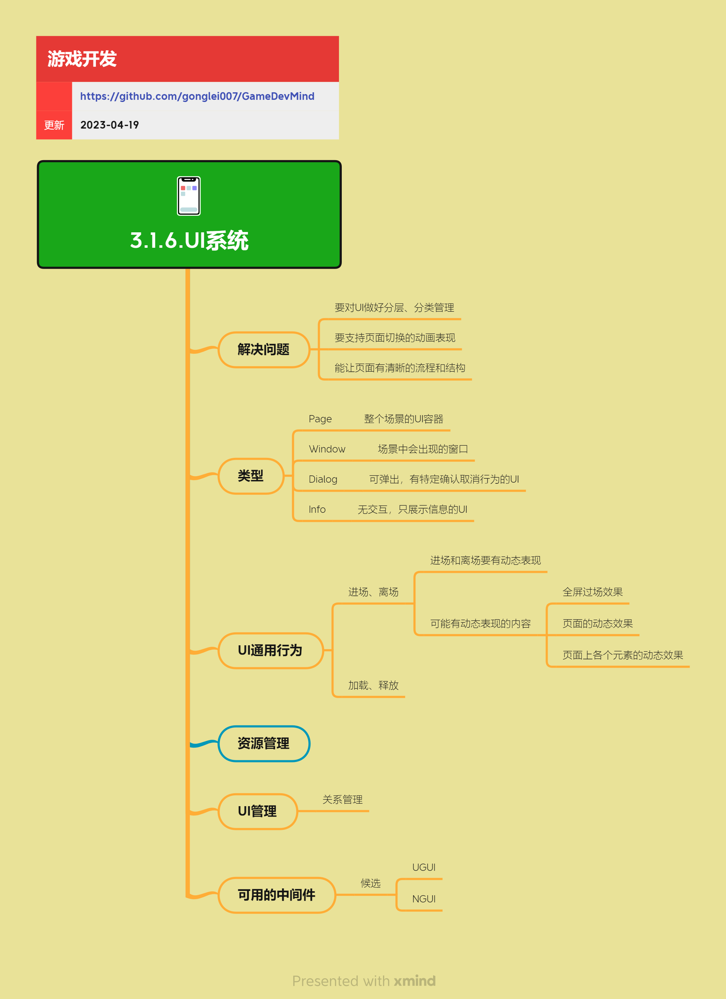

<h2 align="center">UI系统</h2>

我们常用的UI库都是通用型UI库，在游戏开发中，还需要有一系列游戏所需的特性。一个完善的UI系统需要支持分层管理、页面切换、资源管理、事件处理等功能。

**关键词:** 
*Page,Window,Dialog,Loading,Info,UGUI,NGUI*

**标签:** 
*等级: 中级, 阶段: 开发, 分类: 研发能力, 角色: 客户端开发*

## 图谱

## 系统概览

### 是什么？在哪用？

- **作用**：提供完善的UI管理系统，支持游戏所需的各种UI特性，包括分层管理、页面切换、资源管理、事件处理等
- **应用场景**：所有需要UI界面的游戏
- **核心功能**：
  - UI分层和分类管理
  - 页面切换和流程管理
  - UI资源加载和释放
  - 事件处理和交互响应
  - 动画和特效支持

### 会遇到哪些问题？用什么解决？

- **UI分层管理混乱**
  - **问题**：UI元素层级关系不清晰，导致显示错乱、事件响应异常
  - **解决方向**：
    - 建立清晰的UI层级体系（如：背景层、内容层、弹窗层、提示层）
    - 使用层级管理器统一管理UI显示顺序
    - 明确不同层级UI的交互规则

- **页面切换不流畅**
  - **问题**：页面切换时出现卡顿、闪烁、资源加载延迟
  - **解决方向**：
    - 实现页面切换动画，提升视觉体验
    - 预加载常用页面资源
    - 使用异步加载，避免阻塞主线程
    - 合理管理页面生命周期

- **页面流程不清晰**
  - **问题**：页面之间的跳转关系混乱，用户容易迷失
  - **解决方向**：
    - 采用树状结构的UI页面关系
    - 使用堆栈化管理页面进出
    - 提供清晰的导航路径
    - 记录页面跳转历史，支持返回

- **资源管理不当**
  - **问题**：UI资源加载时机不当，导致内存占用过高或加载延迟
  - **解决方向**：
    - 规划好各个UI的加载时机（预加载 vs 动态加载）
    - 及时释放不用的UI资源
    - 使用对象池复用UI元素
    - 建立资源依赖关系管理

### 要点和思考方向

- 要对UI做好分层、分类管理，建立清晰的层级体系
- 要支持页面切换的动画表现，提升用户体验
- 能让页面有清晰的流程和结构，采用树状结构和堆栈化管理
- 合理规划资源加载时机，平衡内存占用和加载速度
- 使用MVC等设计模式，保持代码结构清晰

## UI类型

### 是什么？在哪用？

- **作用**：不同类型的UI容器，用于不同的使用场景，提供不同的交互行为
- **应用场景**：根据不同的UI需求选择合适的类型

### UI类型分类

#### Page（页面）

### 是什么？在哪用？

- **作用**：整个场景的UI容器，通常占据整个屏幕
- **应用场景**：
  - 主菜单页面
  - 游戏大厅页面
  - 设置页面
  - 商店页面等主要功能页面

### 会遇到哪些问题？用什么解决？

- **页面切换管理**
  - **问题**：多个页面之间的切换关系复杂，容易出现状态混乱
  - **解决方向**：使用页面管理器统一管理页面切换，支持堆栈化进出

### 要点和思考方向

- Page通常作为场景的主要UI容器，需要清晰的进入和退出逻辑
- 支持页面切换动画，提升用户体验

#### Window（窗口）

### 是什么？在哪用？

- **作用**：场景中会出现的窗口，通常有背景遮罩，可以关闭
- **应用场景**：
  - 功能窗口（背包、角色、装备等）
  - 设置窗口
  - 信息展示窗口

### 会遇到哪些问题？用什么解决？

- **窗口层级管理**
  - **问题**：多个窗口同时打开时，层级关系混乱
  - **解决方向**：使用窗口管理器管理窗口层级，支持置顶、置底等操作

- **窗口关闭逻辑**
  - **问题**：窗口关闭时数据未保存、状态未清理
  - **解决方向**：实现窗口生命周期管理，在关闭时自动清理资源

### 要点和思考方向

- Window通常有明确的打开和关闭操作，需要管理好生命周期
- 支持窗口拖拽、缩放等交互（根据需求）

#### Dialog（对话框）

### 是什么？在哪用？

- **作用**：可弹出，有特定确认取消行为的UI，用于提示、确认等操作
- **应用场景**：
  - 确认对话框（删除确认、退出确认等）
  - 提示对话框（错误提示、成功提示等）
  - 输入对话框（输入文本、输入数字等）

### 会遇到哪些问题？用什么解决？

- **模态化处理**
  - **问题**：对话框与其他UI的关系不明确，可能被其他UI遮挡或同时响应多个对话框
  - **解决方向**：
    - 设计清晰的对话框管理机制
    - 明确同时展示几个对话框的规则
    - 使用遮罩层阻止底层UI交互

- **对话框队列**
  - **问题**：多个对话框需要依次显示，但显示逻辑混乱
  - **解决方向**：使用对话框队列，按顺序显示对话框

### 要点和思考方向

- Dialog需要明确的确认/取消行为定义
- 支持对话框队列，避免同时显示多个对话框
- 考虑对话框的优先级和显示规则

#### Loading（加载界面）

### 是什么？在哪用？

- **作用**：显示加载进度和状态，提升用户体验
- **应用场景**：
  - 游戏启动加载
  - 场景切换加载
  - 资源下载加载
  - 网络请求等待

### 会遇到哪些问题？用什么解决？

- **加载进度不准确**
  - **问题**：加载进度显示不准确，用户等待体验差
  - **解决方向**：
    - 实现准确的进度计算和显示
    - 使用平滑的进度动画
    - 提供加载提示信息

- **加载时间过长**
  - **问题**：加载时间过长，用户可能认为游戏卡死
  - **解决方向**：
    - 优化资源加载速度
    - 提供加载提示和预计时间
    - 支持后台加载和预加载

### 要点和思考方向

- Loading界面需要提供清晰的进度反馈
- 支持取消加载操作（根据场景）
- 优化加载体验，避免用户等待焦虑

#### Info（信息提示）

### 是什么？在哪用？

- **作用**：无交互，只展示信息的UI，通常自动消失
- **应用场景**：
  - 提示信息（获得道具、完成任务等）
  - 状态信息（网络状态、系统消息等）
  - 浮动提示（操作反馈、错误提示等）

### 会遇到哪些问题？用什么解决？

- **信息堆积**
  - **问题**：多个信息提示同时显示，界面混乱
  - **解决方向**：
    - 使用信息队列，按顺序显示
    - 支持信息合并和优先级管理
    - 限制同时显示的信息数量

- **信息显示时间**
  - **问题**：信息显示时间不合适，用户可能错过或感觉烦扰
  - **解决方向**：
    - 根据信息重要性设置显示时间
    - 支持用户手动关闭
    - 提供信息历史记录功能（可选）

### 要点和思考方向

- Info通常自动消失，需要合理设置显示时间
- 支持信息队列，避免信息堆积
- 考虑信息的优先级和重要性

## UI通用行为

### 是什么？在哪用？

- **作用**：UI的进场、离场、加载、释放等通用行为，提供统一的UI生命周期管理
- **应用场景**：所有UI页面都需要这些通用行为

### 进场与离场

### 是什么？在哪用？

- **作用**：UI显示和隐藏时的动画表现，提升用户体验
- **应用场景**：所有UI页面的显示和隐藏

### 会遇到哪些问题？用什么解决？

- **动画性能问题**
  - **问题**：复杂的进场离场动画可能导致性能下降
  - **解决方向**：
    - 使用高效的动画库（如DOTween、iTween）
    - 优化动画复杂度，避免过度使用
    - 在低端设备上简化或关闭动画

- **动画时机控制**
  - **问题**：动画与数据加载时机不匹配，导致动画不流畅
  - **解决方向**：
    - 在数据加载完成后再播放进场动画
    - 使用异步加载，避免阻塞动画
    - 实现动画队列，按顺序播放

### 动画表现内容

- **全屏过场效果**：页面切换时的全屏过渡动画
- **页面的动态效果**：整个页面的进入/退出动画
- **页面上各个元素的动态效果**：页面内元素的逐个显示动画

### 要点和思考方向

- 进场和离场要有动态表现，提升用户体验
- 动画要流畅自然，符合游戏风格
- 考虑性能影响，在低端设备上适当简化

### 加载与释放

### 是什么？在哪用？

- **作用**：管理UI资源的加载和释放时机，优化内存使用
- **应用场景**：所有UI页面的资源管理

### 会遇到哪些问题？用什么解决？

- **加载时机不当**
  - **问题**：UI资源加载时机不当，导致显示延迟或内存占用过高
  - **解决方向**：
    - 规划好各个UI的加载时机
    - 使用预加载和动态加载相结合的策略
    - 实现异步加载，避免阻塞主线程

- **资源释放不及时**
  - **问题**：UI关闭后资源未释放，导致内存泄漏
  - **解决方向**：
    - 实现自动释放机制
    - 在UI关闭时自动释放资源
    - 使用引用计数管理资源生命周期

- **资源重复加载**
  - **问题**：相同资源被多次加载，浪费内存和加载时间
  - **解决方向**：
    - 实现资源缓存机制
    - 使用资源管理器统一管理
    - 建立资源引用计数

### 加载策略

- **预加载**：
  - **预定义加载时机**：在特定时机（如游戏启动、进入场景）预加载常用UI
  - **动态判断预先加载的时机**：根据游戏流程动态判断需要预加载的UI
- **动态加载**：使用的时候进行加载和创建，适合不常用的UI

### 要点和思考方向

- 需要管理UI资源的加载和释放时机，平衡内存占用和加载速度
- 实现资源缓存和复用机制，避免重复加载
- 使用异步加载，避免阻塞主线程

## 资源管理

### 是什么？在哪用？

- **作用**：管理UI资源的加载时机和方式，优化内存使用和加载性能
- **应用场景**：所有UI系统都需要资源管理

### 会遇到哪些问题？用什么解决？

- **加载时机规划困难**
  - **问题**：如何规划好各个UI的加载时机，平衡内存占用和加载速度
  - **解决方向**：
    - 分析UI使用频率，高频UI预加载，低频UI动态加载
    - 在合适的时机（如场景切换、功能开启前）预加载
    - 建立UI加载优先级机制

- **预加载 vs 动态加载选择**
  - **问题**：什么时候预加载，什么时候动态加载
  - **解决方向**：
    - **预加载适用场景**：
      - 高频使用的UI（如主菜单、HUD）
      - 游戏启动时必需的UI
      - 可以提前预判会使用的UI
    - **动态加载适用场景**：
      - 低频使用的UI（如设置、帮助）
      - 体积较大的UI资源
      - 不确定是否会使用的UI

- **资源依赖管理**
  - **问题**：UI资源可能依赖其他资源（如图集、字体），依赖关系复杂
  - **解决方向**：
    - 建立资源依赖关系图
    - 按依赖顺序加载资源
    - 实现依赖资源自动加载

- **图集管理**
  - **问题**：UI图片资源分散，导致DrawCall过多
  - **解决方向**：
    - 使用图集（Atlas）将多个小图片打包成大图
    - 按功能模块组织图集
    - 动态图集和静态图集相结合

### 要点和思考方向

- 规划好各个UI的加载时机，平衡内存占用和加载速度
- 预加载常用UI，动态加载不常用UI
- 建立资源缓存机制，避免重复加载
- 使用图集优化渲染性能
- 实现资源依赖管理，确保资源加载顺序正确

## UI管理

### 是什么？在哪用？

- **作用**：管理UI页面之间的关系和层级，提供统一的UI管理机制
- **应用场景**：所有UI系统都需要UI管理

### 页面栈管理

### 是什么？在哪用？

- **作用**：管理UI页面的进出栈关系，支持页面返回和历史记录
- **应用场景**：需要支持页面返回的场景（如设置页面、详情页面）

### 会遇到哪些问题？用什么解决？

- **栈管理混乱**
  - **问题**：页面进出栈关系不清晰，返回逻辑错误
  - **解决方向**：
    - 使用栈数据结构管理页面进出
    - 明确页面入栈和出栈的规则
    - 支持清空栈、跳转到指定页面等操作

- **页面状态保存**
  - **问题**：页面返回后状态丢失，用户体验差
  - **解决方向**：
    - 保存页面状态（滚动位置、输入内容等）
    - 页面返回时恢复状态
    - 使用页面数据缓存机制

### 要点和思考方向

- UI页面的进出栈关系要清晰，支持页面返回
- 保存页面状态，提升用户体验
- 支持清空栈、跳转等操作，灵活管理页面流程

### 层级管理

### 是什么？在哪用？

- **作用**：管理UI显示层级的关系，确保UI正确显示和交互
- **应用场景**：所有UI系统都需要层级管理

### 会遇到哪些问题？用什么解决？

- **层级冲突**
  - **问题**：多个UI同时显示时，层级关系混乱，导致显示错乱
  - **解决方向**：
    - 建立清晰的层级体系（如：背景层、内容层、弹窗层、提示层）
    - 使用层级管理器统一管理
    - 明确不同层级的显示规则

- **事件响应冲突**
  - **问题**：上层UI和下层UI同时响应事件，导致交互异常
  - **解决方向**：
    - 实现事件穿透机制
    - 上层UI阻止下层UI事件响应
    - 使用事件优先级管理

### 层级分类

- **背景层**：最底层，通常用于背景图片、全屏遮罩
- **内容层**：主要内容UI，如页面、窗口
- **弹窗层**：弹窗、对话框等临时UI
- **提示层**：最上层，用于提示信息、浮动提示

### 要点和思考方向

- UI显示层级的关系要清晰，避免显示错乱
- 建立层级体系，统一管理UI显示顺序
- 实现事件穿透机制，正确处理事件响应

### 父子关系管理

### 是什么？在哪用？

- **作用**：管理UI元素的父子关系，支持层级组织和批量操作
- **应用场景**：所有UI系统都需要父子关系管理

### 会遇到哪些问题？用什么解决？

- **父子关系混乱**
  - **问题**：UI元素父子关系不清晰，导致组织混乱
  - **解决方向**：
    - 使用树状结构组织UI元素
    - 明确父子关系的建立和解除规则
    - 支持批量操作（如父元素隐藏时子元素也隐藏）

- **性能问题**
  - **问题**：深层嵌套的UI结构可能导致性能问题
  - **解决方向**：
    - 避免过深的嵌套结构
    - 优化UI树遍历算法
    - 使用对象池复用UI元素

### 要点和思考方向

- UI元素的父子关系要清晰，支持层级组织
- 支持批量操作，提高开发效率
- 避免过深的嵌套结构，优化性能

### 事件管理

### 是什么？在哪用？

- **作用**：处理UI响应事件和上下层传递的关系，实现交互功能
- **应用场景**：所有需要交互的UI元素

### 会遇到哪些问题？用什么解决？

- **事件定义不明确**
  - **问题**：不同平台、不同场景下，同一个操作可能有不同的解释
  - **解决方向**：
    - 明确定义各种交互事件的行为
    - 建立事件规范文档
    - 统一事件处理接口

- **事件传递混乱**
  - **问题**：事件在UI层级间传递时，响应逻辑混乱
  - **解决方向**：
    - 实现事件冒泡和捕获机制
    - 支持事件阻止传播
    - 使用事件优先级管理

- **事件响应性能**
  - **问题**：大量UI元素同时响应事件，导致性能下降
  - **解决方向**：
    - 优化事件分发机制
    - 使用事件池减少GC
    - 避免在事件处理中执行耗时操作

### 事件类型

- **OnLoad**：UI加载时触发
- **OnShow**：UI显示时触发
- **OnHide**：UI隐藏时触发
- **OnDestroy**：UI销毁时触发
- **OnClick**：点击事件
- **OnDrag**：拖拽事件
- **OnHover**：悬停事件

### 要点和思考方向

- UI响应事件和上下层传递的关系要清晰
- 明确定义事件行为，避免歧义
- 实现高效的事件分发机制，优化性能

## Unity UI方案

### 是什么？在哪用？

- **作用**：Unity引擎中可用的UI框架和工具，提供UI开发的基础能力
- **应用场景**：Unity游戏项目的UI开发

### UGUI

### 是什么？在哪用？

- **说明**：Unity官方的UI系统（Unity GUI），基于Canvas和RectTransform
- **特点**：
  - 官方支持，更新及时
  - 性能较好，适合移动平台
  - 功能完善，支持大部分UI需求
- **应用场景**：大多数Unity游戏项目的UI开发

### 会遇到哪些问题？用什么解决？

- **DrawCall优化**
  - **问题**：UI元素过多时，DrawCall数量增加，影响性能
  - **解决方向**：
    - 使用图集减少DrawCall
    - 合理使用Canvas分组
    - 避免频繁的UI更新

- **分辨率适配**
  - **问题**：不同分辨率设备上UI显示不一致
  - **解决方向**：
    - 使用Canvas Scaler进行适配
    - 合理使用锚点和相对布局
    - 考虑安全区域（Safe Area）

### 要点和思考方向

- UGUI是Unity官方UI系统，适合大多数项目
- 注意DrawCall优化和分辨率适配
- 合理使用Canvas分组，优化性能

### NGUI

### 是什么？在哪用？

- **说明**：第三方UI框架，Unity早期常用的UI系统
- **特点**：
  - 功能丰富，扩展性强
  - 社区支持较好
  - 但已停止更新，不推荐新项目使用
- **应用场景**：老项目维护，不推荐新项目使用

### 要点和思考方向

- NGUI已停止更新，新项目建议使用UGUI或UI Toolkit
- 老项目如需维护，可以考虑迁移到UGUI

### UI Toolkit

### 是什么？在哪用？

- **说明**：Unity新的UI系统，基于Web技术栈（类似HTML/CSS）
- **特点**：
  - 性能优秀，适合大量UI元素
  - 支持运行时和编辑器UI
  - 学习曲线较陡
- **应用场景**：
  - 需要大量UI元素的游戏
  - 编辑器工具开发
  - 新项目可以考虑使用

### 会遇到哪些问题？用什么解决？

- **学习成本**
  - **问题**：UI Toolkit基于Web技术栈，需要学习新的概念
  - **解决方向**：
    - 学习HTML/CSS相关知识
    - 参考官方文档和示例
    - 逐步迁移现有UI

- **生态不完善**
  - **问题**：UI Toolkit相对较新，第三方工具和资源较少
  - **解决方向**：
    - 关注官方更新
    - 参与社区讨论
    - 自行开发需要的工具

### 要点和思考方向

- UI Toolkit是Unity的新UI系统，性能优秀但学习成本较高
- 适合新项目或需要大量UI元素的游戏
- 关注官方更新，生态在不断完善

### 其他UI方案

### 是什么？在哪用？

- **FairyGUI**：跨引擎UI编辑器，支持Unity、Unreal等
- **Figma**：设计工具，可用于UI设计和原型制作
- **自研UI框架**：根据项目需求自行开发的UI系统

### 要点和思考方向

- 根据项目需求选择合适的UI方案
- 考虑团队技术栈、项目规模、性能要求等因素
- 可以结合多种方案使用（如Figma设计 + UGUI实现）

## UI系统设计模式

### 是什么？在哪用？

- **作用**：使用设计模式组织UI代码，提高代码可维护性和可扩展性
- **应用场景**：所有UI系统开发

### MVC模式

### 是什么？在哪用？

- **说明**：Model-View-Controller模式，分离数据、视图和逻辑
- **应用场景**：复杂的UI功能开发

### 会遇到哪些问题？用什么解决？

- **代码组织**
  - **问题**：UI代码结构混乱，难以维护
  - **解决方向**：
    - 使用MVC模式分离关注点
    - Model管理数据，View管理显示，Controller管理逻辑
    - 建立清晰的代码组织结构

### 要点和思考方向

- MVC模式适合复杂的UI功能，让代码结构更清晰
- Model、View、Controller职责要明确，避免相互耦合
- 可以结合其他模式（如观察者模式）使用

### MVP模式

### 是什么？在哪用？

- **说明**：Model-View-Presenter模式，View和Model完全解耦
- **应用场景**：需要View和Model完全解耦的场景

### 要点和思考方向

- MVP模式比MVC更解耦，适合大型项目
- Presenter负责View和Model之间的交互

### MVVM模式

### 是什么？在哪用？

- **说明**：Model-View-ViewModel模式，通过数据绑定实现View和Model的同步
- **应用场景**：需要数据驱动的UI开发

### 要点和思考方向

- MVVM模式适合数据驱动的UI开发
- 通过数据绑定减少手动更新UI的代码
- 需要框架支持数据绑定功能

## UI性能优化

### 是什么？在哪用？

- **作用**：优化UI系统性能，提升游戏流畅度
- **应用场景**：所有UI系统都需要性能优化

### 会遇到哪些问题？用什么解决？

- **DrawCall过多**
  - **问题**：UI元素过多导致DrawCall数量增加，影响渲染性能
  - **解决方向**：
    - 使用图集减少DrawCall
    - 合理使用Canvas分组
    - 合并相同材质的UI元素

- **UI更新频繁**
  - **问题**：UI元素频繁更新，导致CPU占用过高
  - **解决方向**：
    - 减少不必要的UI更新
    - 使用对象池复用UI元素
    - 批量更新UI数据

- **内存占用过高**
  - **问题**：UI资源占用内存过多，影响游戏性能
  - **解决方向**：
    - 及时释放不用的UI资源
    - 使用资源压缩和优化
    - 实现资源按需加载

### 要点和思考方向

- UI性能优化要平衡视觉效果和性能
- 使用图集、对象池等技术优化性能
- 建立性能监控机制，及时发现问题

## 更多资料

### 在线资料
* [Unity UI Best Practices](https://docs.unity3d.com/Manual/UIBestPractices.html) - Unity官方UI最佳实践
* [UGUI Performance Optimization](https://learn.unity.com/tutorial/optimizing-unity-ui) - UGUI性能优化指南

### 文章
* [游戏UI系统设计实践](https://zhuanlan.zhihu.com/p/xxx) - 游戏UI系统的设计实践案例

### 视频资料
* [Unity UI System Tutorial](https://www.youtube.com/watch?v=xxx) - Unity UI系统教程
* [Making a Modal Window in Unity](https://www.youtube.com/watch?v=SzQABx2YTJA) - Unity模态窗口实现