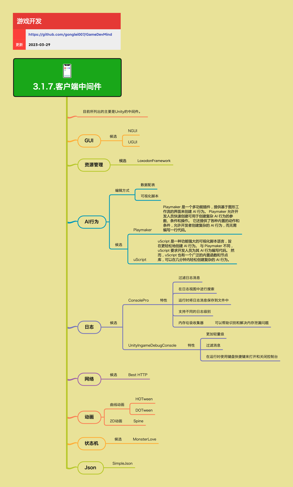

<h2 align="center">客户端中间件</h2>

市面上有很多可以被游戏开发者所使用的轮子，这能大大节省开发者的时间。目前所列出的主要是Unity的中间件，涵盖了GUI、资源管理、AI行为、日志、网络、动画、状态机等多个方面。

**关键词:** 
*中间件,NGUI,UGUI,Playmaker,Spine,DOTween*

**标签:** 
*等级: 初级|中级, 阶段: 学习|开发, 分类: 研发能力, 角色: 客户端开发*

## 图谱

## 中间件概览

### GUI

**做什么的？** UI界面开发框架。

**在哪用？** 所有需要UI的游戏项目。

**要点和思考方向：**
- **候选：**
  - **NGUI：** 第三方UI框架
  - **UGUI：** Unity官方UI系统

### 资源管理

**做什么的？** 游戏资源的管理和加载框架。

**在哪用？** 所有需要资源管理的游戏项目。

**要点和思考方向：**
- **候选：** LoxodonFramework

### AI行为

**做什么的？** 创建AI行为的工具和框架。

**在哪用？** 需要AI控制的角色和NPC的游戏。

**会遇到哪些问题？**
- 如何创建复杂的AI行为？
- 如何让非程序员也能创建AI行为？

**要点和思考方向：**
- **编辑方式：**
  - 数据配表
  - 可视化脚本
- **候选：**
  - **Playmaker：** 一个多功能插件，提供基于图形工作流的界面来创建AI行为。Playmaker允许开发人员快速创建可用于创建复杂AI行为的参数、条件和操作。它还提供了各种内置的动作和条件，允许开发者创建复杂的AI行为，而无需编写一行代码
  - **uScript：** 一种功能强大的可视化脚本语言，旨在更轻松地创建AI行为。与Playmaker不同，uScript要求开发人员为其AI行为编写代码。然而，uScript也有一个广泛的内置函数和节点库，可以在几分钟内轻松创建复杂的AI行为

### 日志

**做什么的？** 日志记录和调试工具。

**在哪用？** 开发和调试阶段。

**要点和思考方向：**
- **候选：**
  - **ConsolePro：**
    - 特性：
      - 过滤日志消息
      - 在日志视图中进行搜索
      - 运行时将日志消息保存到文件中
      - 支持不同的日志级别
      - 内存垃圾收集器（可以帮助识别和解决内存泄漏问题）
  - **UnityIngameDebugConsole：**
    - 特性：
      - 更加轻量级
      - 过滤消息
      - 在运行时使用键盘快捷键来打开和关闭控制台

### 网络

**做什么的？** 网络通信框架。

**在哪用？** 需要网络通信的游戏。

**要点和思考方向：**
- **候选：** Best HTTP

### 动画

**做什么的？** 动画制作和播放工具。

**在哪用？** 需要动画效果的游戏。

**要点和思考方向：**
- **曲线动画：**
  - HOTween
  - DOTween
- **2D动画：** Spine

### 状态机

**做什么的？** 状态机框架，用于管理对象的状态转换。

**在哪用？** 需要状态管理的系统，如角色状态、游戏状态等。

**要点和思考方向：**
- **候选：** MonsterLove

### Json

**做什么的？** JSON数据序列化和反序列化工具。

**在哪用？** 需要处理JSON数据的场景。

**要点和思考方向：**
- SimpleJson

## 更多资料
### 框架资源
* [Unity3D System Design Architecture](https://github.com/liangxiegame/QFramework) - 一个开源的Unity客户端框架。
* [Game Framework](https://github.com/EllanJiang/GameFramework)