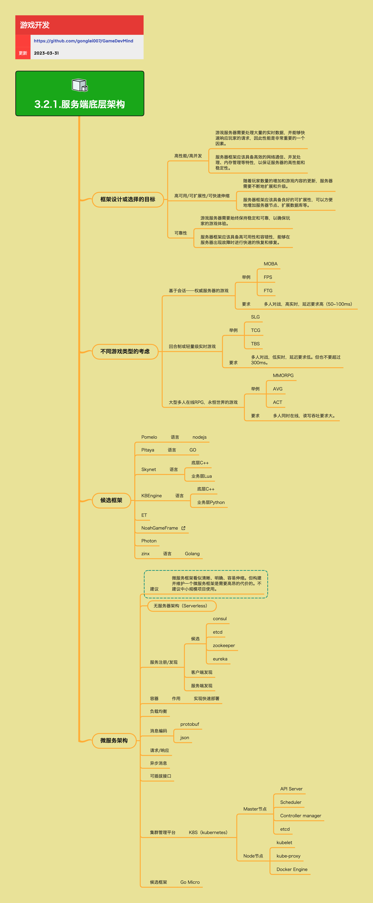

<h2 align="center">服务端底层架构</h2>

开发游戏服务端会有大量的共通需求，目前有不少框架可以选择和使用，不同框架的主要特性相近，细节上有所一些差别，根据你的团队和产品的特点，选择一款合适你们的框架来使用。服务端底层架构需要考虑高性能、高并发、高可用、可扩展性等多个方面。

**关键词:**  
*Actor,分布式,微服务,容器,K8S,Pomelo,Pitaya,Skynet,KBEngine*

**标签:** 
*等级: 高级, 阶段: 开发, 分类: 研发能力, 角色: 服务端开发*

## 图谱

## 架构概览

## 框架设计或选择的目标

**是什么？在哪用？**

- **作用**：确定服务端框架的设计目标和选择标准
- **应用场景**：
  - 服务端框架选型
  - 架构设计阶段
  - 技术方案评估
- **做什么的？** 确定服务端框架的设计目标和选择标准。
- **在哪用？** 服务端框架选型和架构设计阶段。

**会遇到哪些问题？用什么解决？**

- **如何选择适合自己项目的服务端框架？**
  - **问题**：需要根据项目特点选择合适的框架
  - **解决方向**：
    - 评估团队技术栈
    - 评估项目规模和复杂度
    - 考虑游戏类型和性能要求
    - 评估框架的学习成本和维护成本
    - 测试框架的稳定性和性能

- **框架需要满足哪些特性？**
  - **问题**：需要明确框架的核心特性要求
  - **解决方向**：
    - **高性能/高并发：**
      - 游戏服务器需要处理大量的实时数据，并能够快速响应玩家的请求
      - 服务器框架应该具备高效的网络通信、并发处理、内存管理等特性
    - **高可用/可扩展性/可快速伸缩：**
      - 随着玩家数量的增加和游戏内容的更新，服务器需要不断地扩展和升级
      - 服务器框架应该具备良好的可扩展性，可以方便地增加服务器节点、扩展数据库等
    - **可靠性：**
      - 游戏服务器需要始终保持稳定和可靠，以确保玩家的游戏体验
      - 服务器框架应该具备高可用性和容错性，能够在服务器出现故障时进行快速的恢复和修复

**要点和思考方向：**

**高性能/高并发：**
- 游戏服务器需要处理大量的实时数据，并能够快速响应玩家的请求，因此性能是非常重要的一个因素
- 服务器框架应该具备高效的网络通信、并发处理、内存管理等特性，以保证服务器的高性能和稳定性

**高可用/可扩展性/可快速伸缩：**
- 随着玩家数量的增加和游戏内容的更新，服务器需要不断地扩展和升级
- 服务器框架应该具备良好的可扩展性，可以方便地增加服务器节点、扩展数据库等

**可靠性：**
- 游戏服务器需要始终保持稳定和可靠，以确保玩家的游戏体验
- 服务器框架应该具备高可用性和容错性，能够在服务器出现故障时进行快速的恢复和修复

## 不同游戏类型的考虑

**是什么？在哪用？**

- **作用**：根据游戏类型选择适合的架构方案
- **应用场景**：
  - 游戏项目初期架构设计
  - 技术选型
  - 性能规划
- **做什么的？** 根据游戏类型选择适合的架构方案。
- **在哪用？** 游戏项目初期架构设计。

**会遇到哪些问题？用什么解决？**

- **不同类型的游戏对服务端有什么不同的要求？**
  - **问题**：不同游戏类型有不同的性能和技术要求
  - **解决方向**：
    - **基于会话——权威服务器的游戏：**
      - **举例：** MOBA、FPS、FTG
      - **要求：** 多人对战，高实时，延迟要求高（50~100ms）
      - **架构特点：** 需要低延迟、高实时性、状态同步
    - **回合制或轻量级实时游戏：**
      - **举例：** SLG、TCG、TBS
      - **要求：** 多人对战，低实时，延迟要求低。但也不要超过300ms
      - **架构特点：** 可以容忍较高延迟，但需要保证数据一致性
    - **大型多人在线RPG，永恒世界的游戏：**
      - **举例：** MMORPG、AVG、ACT
      - **要求：** 多人同时在线，读写吞吐要求大
      - **架构特点：** 需要高并发、高吞吐、数据持久化

- **如何根据游戏类型选择合适的架构？**
  - **问题**：需要根据游戏类型选择匹配的架构方案
  - **解决方向**：
    - 分析游戏的实时性要求
    - 评估并发和吞吐需求
    - 考虑数据持久化需求
    - 评估延迟容忍度
    - 选择匹配的框架和架构模式

**要点和思考方向：**

**基于会话——权威服务器的游戏：**
- **举例：** MOBA、FPS、FTG
- **要求：** 多人对战，高实时，延迟要求高（50~100ms）

**回合制或轻量级实时游戏：**
- **举例：** SLG、TCG、TBS
- **要求：** 多人对战，低实时，延迟要求低。但也不要超过300ms

**大型多人在线RPG，永恒世界的游戏：**
- **举例：** MMORPG、AVG、ACT
- **要求：** 多人同时在线，读写吞吐要求大

## 候选框架

**是什么？在哪用？**

- **作用**：可用的服务端框架和工具
- **应用场景**：
  - 需要选择服务端框架的项目
  - 技术选型
  - 框架评估
- **做什么的？** 可用的服务端框架和工具。
- **在哪用？** 需要选择服务端框架的项目。

**会遇到哪些问题？用什么解决？**

- **如何选择合适的框架？**
  - **问题**：需要根据项目需求选择合适的框架
  - **解决方向**：
    - 评估框架的语言和生态
    - 评估框架的性能和稳定性
    - 考虑框架的学习成本和维护成本
    - 评估框架的社区支持
    - 测试框架的实际表现

- **框架对比和评估**
  - **问题**：需要对比不同框架的优缺点
  - **解决方向**：
    - **Pomelo：** 语言 - nodejs
      - 特点：基于Node.js、适合中小型项目、开发效率高
    - **Pitaya：** 语言 - GO
      - 特点：基于Go、高性能、适合大型项目
    - **Skynet：** 底层C++，业务层Lua
      - 特点：高性能、支持热更新、适合大型项目
    - **KBEngine：** 底层C++，业务层Python
      - 特点：功能完善、适合MMORPG、商业授权
    - **ET：** 开源游戏框架
      - 特点：基于C#、功能完善、开源免费
    - **[NoahGameFrame](https://github.com/ketoo/NoahGameFrame)：** 开源游戏框架
      - 特点：功能完善、开源免费
    - **Photon：** 商业游戏服务器框架
      - 特点：商业支持、功能完善、需要授权
    - **zinx：** 语言 - Golang
      - 特点：轻量级、适合中小型项目

**要点和思考方向：**
- 根据项目需求、团队技术栈、性能要求选择合适的框架
- 考虑框架的学习成本和维护成本
- 评估框架的稳定性和社区支持
- 测试框架的实际表现

## 微服务架构

**是什么？在哪用？**

- **作用**：将服务拆分为多个独立的微服务
- **应用场景**：
  - 大型、复杂的游戏项目
  - 需要高可扩展性的项目
  - 多团队协作的项目
- **做什么的？** 将服务拆分为多个独立的微服务。
- **在哪用？** 大型、复杂的游戏项目。

**会遇到哪些问题？用什么解决？**

- **是否应该使用微服务架构？**
  - **问题**：需要评估是否适合使用微服务架构
  - **解决方向**：
    - **建议：** 微服务框架看似清晰、明确、容易伸缩。但构建并维护一个微服务框架是需要高昂的代价的。不建议中小规模项目使用
    - 评估项目规模和复杂度
    - 评估团队规模和能力
    - 考虑运维成本
    - 评估技术债务
    - **无服务器架构（Serverless）：** 另一种架构选择

- **如何实现服务注册和发现？**
  - **问题**：微服务需要服务注册和发现机制
  - **解决方向**：
    - **服务注册/发现：**
      - **候选：** consul、etcd、zookeeper、eureka
      - **客户端发现：** 客户端查询服务注册表
      - **服务端发现：** 通过负载均衡器发现服务
    - 选择合适的服务注册中心
    - 实现服务健康检查
    - 处理服务故障转移

- **如何实现负载均衡？**
  - **问题**：需要将请求分发到多个服务器
  - **解决方向**：
    - **负载均衡：** 分发请求到多个服务器
    - 使用负载均衡器（如Nginx、HAProxy）
    - 实现负载均衡算法（轮询、加权、最少连接等）
    - 实现健康检查
    - 处理服务器故障

- **微服务通信**
  - **问题**：微服务之间需要通信
  - **解决方向**：
    - **消息编码：** protobuf、json
    - **请求/响应：** 同步通信模式
    - **异步消息：** 异步通信模式
    - 选择合适的通信协议
    - 实现服务间认证和授权

- **容器和集群管理**
  - **问题**：需要管理大量微服务实例
  - **解决方向**：
    - **容器：** 实现快速部署
    - **集群管理平台：**
      - **K8S（kubernetes）：**
        - Master节点：API Server、Scheduler、Controller manager、etcd
        - Node节点：kubelet、kube-proxy、Docker Engine
    - 使用容器化部署
    - 使用K8S管理集群
    - 实现自动扩缩容

- **可插拔接口**
  - **问题**：需要支持插件化扩展
  - **解决方向**：
    - **可插拔接口：** 支持插件化扩展
    - 设计插件接口规范
    - 实现插件加载机制
    - 支持插件热更新

**要点和思考方向：**
- **建议：** 微服务框架看似清晰、明确、容易伸缩。但构建并维护一个微服务框架是需要高昂的代价的。不建议中小规模项目使用
- **无服务器架构（Serverless）：** 另一种架构选择
- **服务注册/发现：**
  - **候选：** consul、etcd、zookeeper、eureka
  - **客户端发现**
  - **服务端发现**
- **容器：** 实现快速部署
- **负载均衡：** 分发请求到多个服务器
- **消息编码：** protobuf、json
- **请求/响应：** 同步通信模式
- **异步消息：** 异步通信模式
- **可插拔接口：** 支持插件化扩展
- **集群管理平台：**
  - **K8S（kubernetes）：**
    - Master节点：API Server、Scheduler、Controller manager、etcd
    - Node节点：kubelet、kube-proxy、Docker Engine
- **候选框架：** Go Micro

## 更多资料
## 文章
* [一些关于分布式游戏服务器框架的文章](https://www.shuzhiduo.com/R/kjdwDZ7EzN/)
* [长连接网关技术专题(七)：小米小爱单机120万长连接接入层的架构演进](http://www.52im.net/thread-3860-1-1.html)

## 视频
* [Microservices explained - the What, Why and How?](https://www.youtube.com/watch?v=rv4LlmLmVWk)
* [What Are Microservices Really All About? (And When Not To Use It)](https://www.youtube.com/watch?v=lTAcCNbJ7KE)

## 框架资源
* [Pomelo(nodejs)](https://github.com/NetEase/pomelo)
* [Pitaya(Go)](https://github.com/topfreegames/pitaya)
* [Leaf(Go)](https://github.com/name5566/leaf)
* [nano(Go)](https://github.com/lonng/nano)
* [ET框架](https://github.com/egametang/ET)
