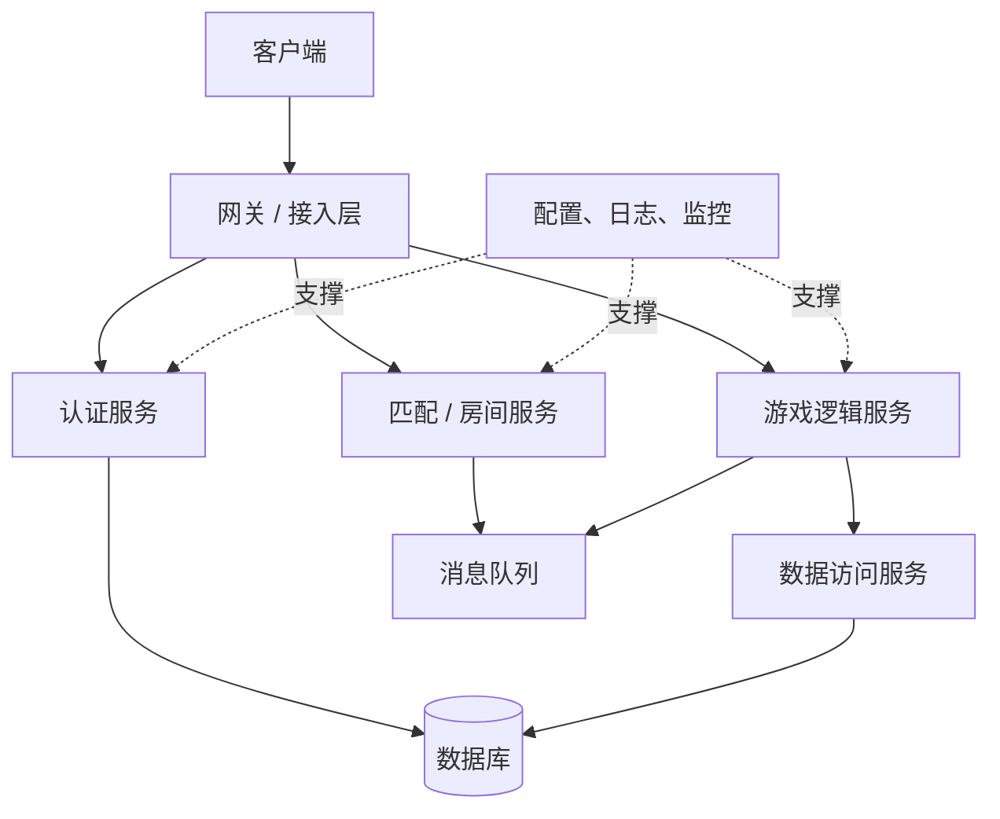

## 服务端底层架构

开发游戏服务端会有大量的共通需求，目前有不少框架可以选择和使用，不同框架的主要特性相近，细节上有所一些差别，根据你的团队和产品的特点，选择一款合适你们的框架来使用。服务端底层架构需要考虑高性能、高并发、高可用、可扩展性等多个方面。

**关键词:**  
*Actor,分布式,微服务,容器,K8S,Nakama,Mirror,FishNet,Leaf,GoWorld,Agones,Pitaya,Skynet,ET,AI Coding*

**标签:** 
*等级: 高级, 阶段: 开发, 分类: 研发能力, 角色: 服务端开发*

## 图谱

## 目录

- [架构目标与框架选择](#架构目标与框架选择)
- [架构范式与对比](#架构范式与对比)
- [更多资料](#更多资料)

----

> 💡 **AI Coding 总览**（为何要掌握知识才能更好操作 AI、指南的三类内容等）见 [阅读说明 - AI Coding 总览](../阅读说明.md#ai-coding-总览)。

---

## 架构目标与框架选择

### 架构概览

### 框架设计或选择的目标

| 维度 | 内容 |
|------|------|
| **作用** | 确定服务端框架的设计目标和选择标准 |
| **应用场景** | 服务端框架选型、架构设计阶段、技术方案评估 |
| **做什么的？** | 确定服务端框架的设计目标和选择标准 |
| **在哪用？** | 服务端框架选型和架构设计阶段 |

| 问题 | 解决方向 |
|------|----------|
| **如何选择适合自己项目的服务端框架？** 需要根据项目特点选择合适的框架 | 评估团队技术栈；评估项目规模和复杂度；考虑游戏类型和性能要求；评估框架的学习成本和维护成本；测试框架的稳定性和性能 |
| **框架需要满足哪些特性？** 需要明确框架的核心特性要求 | 高性能/高并发：高效网络通信、并发处理、内存管理；高可用/可扩展性/可快速伸缩：方便增加服务器节点、扩展数据库；可靠性：高可用性、容错性、快速恢复修复 |

| 特性 | 要点 |
|------|------|
| **高性能/高并发** | 处理大量实时数据、快速响应；具备高效网络通信、并发处理、内存管理 |
| **高可用/可扩展性/可快速伸缩** | 随玩家增加和内容更新不断扩展；方便增加服务器节点、扩展数据库 |
| **可靠性** | 保持稳定可靠；高可用性和容错性；故障时快速恢复和修复 |

| 类型 | AI Coding 指南 |
|------|----------------|
| **交互提示** | 说明项目规模、团队技术栈、游戏类型；如「高性能」「高并发」「可扩展」「选型标准」 |
| **方法** | 让 AI 根据约束生成评估清单、对比维度、决策树 |
| **应用** | 框架选型评估、设计目标文档、技术方案评审 |
| **提示词范例** | 「团队 5 人，Node.js 为主，做 MOBA 手游，请列出服务端框架选型的评估维度和推荐方向」 |

### 不同游戏类型的考虑

| 维度 | 内容 |
|------|------|
| **作用** | 根据游戏类型选择适合的架构方案 |
| **应用场景** | 游戏项目初期架构设计、技术选型、性能规划 |
| **做什么的？** | 根据游戏类型选择适合的架构方案 |
| **在哪用？** | 游戏项目初期架构设计 |

| 问题 | 解决方向 |
|------|----------|
| **不同类型的游戏对服务端有什么不同的要求？** 不同游戏类型有不同的性能和技术要求 | 基于会话：低延迟、高实时性、状态同步；回合制：容忍较高延迟、保证数据一致性；MMORPG：高并发、高吞吐、数据持久化 |
| **如何根据游戏类型选择合适的架构？** 需要根据游戏类型选择匹配的架构方案 | 分析游戏实时性要求；评估并发和吞吐需求；考虑数据持久化需求；评估延迟容忍度；选择匹配的框架和架构模式 |

| 游戏类型 | 举例 | 要求 | 架构特点 |
|----------|------|------|----------|
| **基于会话——权威服务器** | MOBA、FPS、FTG | 多人对战，高实时，延迟 50~100ms | 低延迟、高实时性、状态同步 |
| **回合制或轻量级实时** | SLG、TCG、TBS | 多人对战，低实时，延迟不超过 300ms | 容忍较高延迟，保证数据一致性 |
| **大型多人在线RPG** | MMORPG、AVG、ACT | 多人同时在线，读写吞吐要求大 | 高并发、高吞吐、数据持久化 |

| 类型 | AI Coding 指南 |
|------|----------------|
| **交互提示** | 说明游戏类型、实时性、并发量；如「MOBA」「MMORPG」「回合制」「延迟要求」 |
| **方法** | 让 AI 根据游戏类型推荐架构模式、技术选型、性能指标 |
| **应用** | 架构设计、技术选型、性能规划 |
| **提示词范例** | 「做 SLG 回合制手游，延迟可接受 300ms，请说明服务端架构应侧重哪些方面，以及与 MOBA 的差异」 |

### 候选框架

| 维度 | 内容 |
|------|------|
| **作用** | 可用的服务端框架和工具 |
| **应用场景** | 需要选择服务端框架的项目、技术选型、框架评估 |
| **做什么的？** | 可用的服务端框架和工具 |
| **在哪用？** | 需要选择服务端框架的项目 |

| 问题 | 解决方向 |
|------|----------|
| **如何选择合适的框架？** 需要根据项目需求选择合适的框架 | 评估框架的语言和生态；评估框架的性能和稳定性；考虑框架的学习成本和维护成本；评估框架的社区支持；测试框架的实际表现 |
| **框架对比和评估** 需要对比不同框架的优缺点 | 根据项目需求、团队技术栈、性能要求选择；考虑学习成本和维护成本；评估稳定性和社区支持 |

| 框架 | 语言 | 特点 |
|------|------|------|
| **Nakama** | Go/Lua | 开源游戏服务器、社交/排行榜/匹配内置、Docker 部署、适合休闲/中核网游 |
| **Mirror** | C# | Unity 原生网络框架、组件式设计、HLAPI 兼容、适合 Unity 网游 |
| **FishNet** | C# | Mirror 替代品、更好的预测/回滚、适合 Unity 网游 |
| **Leaf** | Go | 高性能、模块化、社区活跃、适合中大型网游 |
| **GoWorld** | Go | Entity 框架、AOI/A* 内置、适合 MMO |
| **Pitaya** | Go | 基于 Go、高性能、适合大型项目 |
| **Skynet** | C++/Lua | 高性能、支持热更新、适合大型项目 |
| **ET** | C# | 开源游戏框架、功能完善、开源免费 |
| **[NoahGameFrame](https://github.com/ketoo/NoahGameFrame)** | C++ | 开源游戏框架、功能完善、开源免费 |
| **Photon** | C#/C++ | 商业游戏服务器框架、需要授权 |
| **zinx** | Golang | 轻量级、适合中小型项目 |

| 要点和思考方向 |
|----------------|
| 根据项目需求、团队技术栈、性能要求选择合适的框架 |
| 考虑框架的学习成本和维护成本 |
| 评估框架的稳定性和社区支持 |
| 测试框架的实际表现 |

| 类型 | AI Coding 指南 |
|------|----------------|
| **交互提示** | 说明语言、规模、游戏类型；如「Nakama」「Mirror」「FishNet」「Leaf」「GoWorld」「Pitaya」「Skynet」「ET」 |
| **方法** | 让 AI 对比框架优缺点、生成选型矩阵、给出迁移建议 |
| **应用** | 框架选型、技术对比、迁移评估 |
| **提示词范例** | 「游戏服务端选型：Nakama、Mirror、FishNet、Leaf、GoWorld、Pitaya、Skynet，请对比语言、性能、学习成本、适用游戏类型，给出选型建议」 |

## 架构范式与对比

```mermaid
flowchart TB
    C["客户端"] --> G["网关 / 接入层"]
    G --> A["认证服务"]
    G --> M["匹配 / 房间服务"]
    G --> GS["游戏逻辑服务"]
    GS --> D["数据访问服务"]
    A --> DB[("数据库")]
    D --> DB
    M --> Q["消息队列"]
    GS --> Q
    O["配置、日志、监控"] -.支撑.-> A
    O -.支撑.-> M
    O -.支撑.-> GS
```

### 微服务架构

| 维度 | 内容 |
|------|------|
| **作用** | 将服务拆分为多个独立的微服务 |
| **应用场景** | 大型、复杂的游戏项目、需要高可扩展性的项目、多团队协作的项目 |
| **做什么的？** | 将服务拆分为多个独立的微服务 |
| **在哪用？** | 大型、复杂的游戏项目 |

| 问题 | 解决方向 |
|------|----------|
| **是否应该使用微服务架构？** 需要评估是否适合使用微服务架构 | 建议：微服务构建维护代价高，不建议中小规模项目使用；评估项目规模和复杂度、团队规模和能力；考虑运维成本；无服务器架构（Serverless）为另一种选择 |
| **如何实现服务注册和发现？** 微服务需要服务注册和发现机制 | 候选：consul、etcd、zookeeper、eureka；客户端发现/服务端发现；实现服务健康检查；处理服务故障转移 |
| **如何实现负载均衡？** 需要将请求分发到多个服务器 | 使用负载均衡器（Nginx、HAProxy）；实现负载均衡算法（轮询、加权、最少连接等）；实现健康检查；处理服务器故障 |
| **微服务通信** 微服务之间需要通信 | 消息编码：protobuf、json；请求/响应：同步通信；异步消息：异步通信；实现服务间认证和授权 |
| **容器和集群管理** 需要管理大量微服务实例 | 容器：实现快速部署；K8S 管理集群；实现自动扩缩容 |
| **可插拔接口** 需要支持插件化扩展 | 设计插件接口规范；实现插件加载机制；支持插件热更新 |

| 组件 | 说明 |
|------|------|
| **服务注册/发现** | 候选：consul、etcd、zookeeper、eureka；客户端发现/服务端发现 |
| **负载均衡** | 分发请求到多个服务器 |
| **消息编码** | protobuf、json |
| **通信模式** | 请求/响应（同步）、异步消息 |
| **容器** | 实现快速部署 |
| **K8S** | Master：API Server、Scheduler、Controller manager、etcd；Node：kubelet、kube-proxy、Docker Engine |
| **可插拔接口** | 支持插件化扩展 |
| **候选框架** | Go Micro |

| 要点和思考方向 |
|----------------|
| 微服务框架看似清晰、明确、容易伸缩，但构建维护代价高昂，不建议中小规模项目使用 |
| 无服务器架构（Serverless）为另一种架构选择 |

#### 微服务适用性评估

| 类型 | AI Coding 指南 |
|------|----------------|
| **交互提示** | 说明项目规模、团队人数、运维能力；如「微服务」「Serverless」「中小项目」 |
| **方法** | 让 AI 评估是否适合微服务、给出替代方案 |
| **应用** | 架构决策、技术选型 |
| **提示词范例** | 「团队 8 人，做中型 MMO，是否适合微服务？请说明微服务构建维护成本，以及 Serverless 等替代方案」 |

#### 服务注册与发现

| 类型 | AI Coding 指南 |
|------|----------------|
| **交互提示** | 说明环境、语言；如「Consul」「etcd」「Zookeeper」「服务发现」 |
| **方法** | 让 AI 设计注册/发现流程、健康检查、客户端/服务端发现模式 |
| **应用** | 服务发现实现、健康检查配置 |
| **提示词范例** | 「游戏多服，网关需动态发现游戏服，请用 Consul 或 etcd 实现：服务注册、健康检查、以及网关的服务发现与负载均衡」 |

#### 负载均衡

| 类型 | AI Coding 指南 |
|------|----------------|
| **交互提示** | 说明场景、算法需求；如「Nginx」「HAProxy」「轮询」「加权」「最少连接」 |
| **方法** | 让 AI 设计负载均衡配置、健康检查、故障转移 |
| **应用** | 负载均衡配置、高可用设计 |
| **提示词范例** | 「游戏网关需负载均衡到多个游戏服，请说明 Nginx 或 HAProxy 的配置要点，以及轮询、加权、最少连接算法的适用场景」 |

#### 微服务通信

| 类型 | AI Coding 指南 |
|------|----------------|
| **交互提示** | 说明编码、模式；如「Protobuf」「JSON」「同步」「异步」「RPC」 |
| **方法** | 让 AI 设计消息格式、通信协议、认证授权 |
| **应用** | 服务间通信设计、消息编码选型 |
| **提示词范例** | 「微服务间通信需选型：Protobuf 与 JSON，同步 RPC 与异步消息，请对比性能、可维护性，并给出游戏服场景的推荐」 |

#### 容器与 K8S

| 类型 | AI Coding 指南 |
|------|----------------|
| **交互提示** | 说明部署环境、规模；如「Docker」「K8S」「扩缩容」「部署」 |
| **方法** | 让 AI 生成 Dockerfile、K8S 配置、HPA 策略 |
| **应用** | 容器化部署、集群管理 |
| **提示词范例** | 「游戏服需 Docker 部署，K8S 管理，请给出多副本部署的 Deployment 配置、服务发现、以及基于 CPU 的自动扩缩容」 |

#### 可插拔接口

| 类型 | AI Coding 指南 |
|------|----------------|
| **交互提示** | 说明扩展需求；如「插件」「热更新」「可插拔」 |
| **方法** | 让 AI 设计插件接口、加载机制、热更新流程 |
| **应用** | 插件系统设计、框架扩展 |
| **提示词范例** | 「游戏服需支持插件化扩展，请设计插件接口规范、加载机制，以及插件热更新不重启服务的实现思路」 |

### 现代游戏服务端框架对比（2024-2026）

| 框架 | 语言 | 适用类型 | 特点 |
|------|------|----------|------|
| Nakama | Go/Lua | 休闲/中核网游 | 开源、社交/排行榜/匹配内置、Docker部署 |
| Mirror | C# | Unity网游 | Unity原生、组件式、HLAPI兼容 |
| FishNet | C# | Unity网游 | Mirror替代品、更好的预测/回滚 |
| Leaf | Go | 中大型网游 | 高性能、模块化、社区活跃 |
| GoWorld | Go | MMO | Entity框架、AOI/A*内置 |
| Agones | Kubernetes | 专用服务器 | Google开源、自动扩缩容 |

| 维度 | Nakama | Mirror | Leaf | GoWorld |
|------|--------|--------|------|---------|
| 语言 | Go+Lua | C# | Go | Go |
| Unity集成 | 客户端SDK | 原生 | - | - |
| 网络模型 | 状态同步 | 状态/帧同步 | 状态同步 | 状态同步 |
| 部署 | Docker/K8s | 独立进程 | 独立进程 | 独立进程 |
| 开源 | Apache 2.0 | MIT | Apache | Apache |

#### 框架选型建议
- Unity项目首选 **Mirror** / **FishNet**
- Go技术栈中大型项目选 **Leaf**
- 需要开箱即用社交/匹配功能选 **Nakama**
- 专用服务器(Dedicated Server)选 **Agones** + K8s

## 更多资料

| 链接 | 说明 |
|------|------|
| [一些关于分布式游戏服务器框架的文章](https://www.shuzhiduo.com/R/kjdwDZ7EzN/) | 分布式游戏服务器框架 |
| [长连接网关技术专题(七)：小米小爱单机120万长连接接入层的架构演进](http://www.52im.net/thread-3860-1-1.html) | 长连接网关架构演进 |
| [Microservices explained - the What, Why and How?](https://www.youtube.com/watch?v=rv4LlmLmVWk) | 微服务介绍 |
| [What Are Microservices Really All About? (And When Not To Use It)](https://www.youtube.com/watch?v=lTAcCNbJ7KE) | 微服务适用场景 |
| [Nakama(Go/Lua)](https://github.com/heroiclabs/nakama) | 开源游戏服务器、社交/匹配内置 |
| [Mirror(C#)](https://github.com/MirrorNetworking/Mirror) | Unity 原生网络框架 |
| [FishNet(C#)](https://github.com/FirstGearGames/FishNet) | Unity 网络框架、预测/回滚 |
| [Leaf(Go)](https://github.com/name5566/leaf) | Go 游戏服务器框架 |
| [GoWorld(Go)](https://github.com/xiaonanln/goworld) | MMO 游戏服务器框架 |
| [Agones(K8s)](https://github.com/googleforgames/agones) | Kubernetes 专用游戏服务器 |
| [Pitaya(Go)](https://github.com/topfreegames/pitaya) | Go 游戏服务器框架 |
| [nano(Go)](https://github.com/lonng/nano) | Go 游戏服务器框架 |
| [ET框架](https://github.com/egametang/ET) | C# 游戏框架 |
