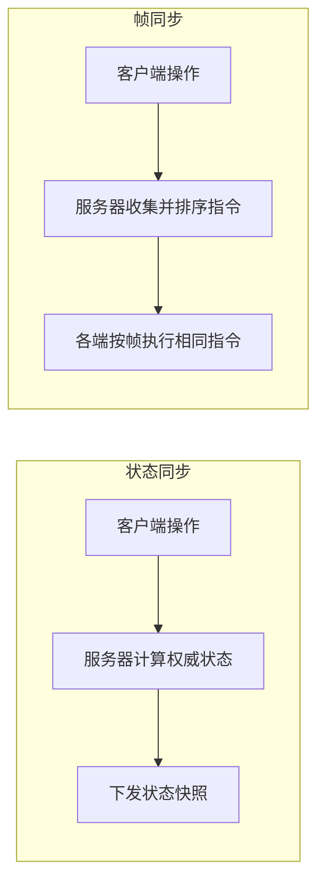
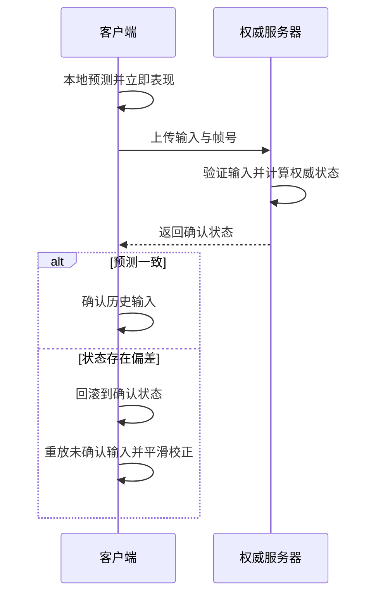

## 网游网络同步

网络游戏中，玩家之间需要同步信息（数据/状态），不同的游戏类型对信息同步的要求也不相同。你的产品需要哪些同步上的考量？在多人游戏中，每个玩家都会看到自己的游戏画面，但其他玩家的游戏画面可能会与自己的有所不同，这是因为网络延迟和带宽限制等因素的影响。为了保持游戏的一致性，需要进行同步，使每个玩家都看到相同的游戏状态和行为。

**关键词:** 
*AOI,状态同步,帧同步，混合同步,插值,预测,校正,AI Coding*

**标签:** 
*等级: 高级, 阶段: 开发, 分类: 研发能力, 角色: 服务端开发|客户端开发*

## 图谱

> 🏥 **实战案例：** [MOBA角色回弹 — 客户端预测与服务器校正冲突导致海外玩家频繁回弹](../../cases/network-reconciliation.md)

## 目录

- [同步概览](#同步概览)
- [说明](#说明)
- [同步方式](#同步方式)
- [同步技术](#同步技术)
- [同步内容](#同步内容)
- [AOI（Area of Interest，兴趣区域）](#aoiarea-of-interest兴趣区域)
- [更多资料](#更多资料)

----

> 💡 **AI Coding 总览**（为何要掌握知识才能更好操作 AI、指南的三类内容等）见 [阅读说明 - AI Coding 总览](../阅读说明.md#ai-coding-总览)。

---

## 同步概览

## 说明

| 维度 | 内容 |
|------|------|
| **作用** | 在多人游戏中保持游戏状态的一致性 |
| **应用场景** | 所有多人网络游戏、实时对战游戏、多人在线游戏 |
| **做什么的？** | 在多人游戏中保持游戏状态的一致性 |
| **在哪用？** | 所有多人网络游戏 |

| 问题 | 解决方向 |
|------|----------|
| **如何保持多个玩家看到的游戏状态一致？** 不同玩家看到的游戏状态可能不一致 | 使用服务器作为权威状态源；实现状态同步机制；使用帧同步保证一致性；实现状态校验和修正；处理状态冲突 |
| **如何处理网络延迟和带宽限制？** 网络延迟和带宽限制影响同步效果 | 使用客户端预测减少延迟感；使用插值平滑状态变化；实现延迟补偿；优化同步数据量；使用 AOI 减少同步范围；实现数据压缩 |

| 要点和思考方向 |
|----------------|
| 网络延迟和带宽限制导致不同玩家看到的画面可能不同，需同步使每个玩家看到相同的游戏状态和行为 |
| 使用服务器作为权威状态源 |
| 实现客户端预测和插值优化体验 |

| 类型 | AI Coding 指南 |
|------|----------------|
| **交互提示** | 说明游戏类型、玩家数、权威源；如「状态一致」「服务器权威」「延迟」「带宽」 |
| **方法** | 让 AI 分析同步问题、设计权威源策略、给出冲突处理方案 |
| **应用** | 同步架构设计、一致性方案、延迟与带宽优化 |
| **提示词范例** | 「多人对战游戏需保持状态一致，请说明服务器权威、客户端预测、状态校验与修正的配合方式，以及如何处理状态冲突」 |

## 同步方式

| 维度 | 内容 |
|------|------|
| **作用** | 选择适合游戏类型的同步方式 |
| **应用场景** | 根据游戏类型选择合适的同步方案、实时对战游戏、多人在线游戏 |
| **做什么的？** | 选择适合游戏类型的同步方式 |
| **在哪用？** | 根据游戏类型选择合适的同步方案 |

| 问题 | 解决方向 |
|------|----------|
| **什么时候用状态同步，什么时候用帧同步？** 需要根据游戏类型选择合适的同步方式 | 状态同步：实时性不高的游戏（如 SLG）；帧同步：实时性较高的游戏（如 RTS、FPS） |
| **两种同步方式有什么区别？** 需要理解两种同步方式的区别 | 状态同步：基于对等网络、数据量大、实时性低；帧同步：基于服务器、数据量小、实时性高 |
| **混合同步** 某些游戏可能需要混合使用两种同步方式 | 不同系统使用不同同步方式；关键系统用帧同步；非关键系统用状态同步；实现同步方式切换机制 |

| 类型 | 说明 | 应用场景 | 优势 | 劣势 |
|------|------|----------|------|------|
| **状态同步** | 发指令，收状态；基于对等网络，每个客户端保存完整状态 | 实时性不高的游戏（SLG） | 实现简单、服务器负担小 | 实时性较差、需处理冲突 |
| **帧同步** | 发操作，收操作；基于服务器，服务器验证并更新状态 | 实时性较高的游戏（RTS、FPS） | 传输数据少、操作响应快、状态一致性好 | 实现复杂、需处理网络稳定性、需防止作弊 |

| 帧同步保障 | 说明 |
|------------|------|
| **网络稳定性** | UDP、断线重连 |
| **作弊问题** | 需要防止客户端作弊 |

| 类型 | AI Coding 指南 |
|------|----------------|
| **交互提示** | 说明游戏类型、实时性要求；如「状态同步」「帧同步」「混合同步」「MOBA」「RTS」「SLG」 |
| **方法** | 让 AI 对比同步方式、根据游戏类型推荐方案、设计混合同步策略 |
| **应用** | 同步方式选型、混合同步设计、帧同步防作弊 |
| **提示词范例** | 「做 MOBA 手游，需要低延迟和防作弊，请对比状态同步与帧同步的优缺点，并说明帧同步下如何防止客户端作弊」 |

## 同步技术

| 维度 | 内容 |
|------|------|
| **作用** | 优化同步效果的技术手段 |
| **应用场景** | 所有网络同步系统、实时游戏同步、减少延迟感 |
| **做什么的？** | 优化同步效果的技术手段 |
| **在哪用？** | 所有网络同步系统 |

| 问题 | 解决方向 |
|------|----------|
| **如何减少延迟感？** 网络延迟导致操作响应慢 | 预测：客户端预测服务器状态，立即响应操作，服务器验证后校正；优化网络路径；使用就近服务器 |
| **如何平滑状态变化？** 状态突然变化导致画面不流畅 | 插值：使用线性插值、样条插值；实现状态平滑过渡；优化插值算法 |
| **如何修正状态偏差？** 网络延迟导致状态偏差 | 校正：检测状态偏差、平滑校正状态、处理校正冲突；实现延迟补偿；使用回滚和重放 |
| **同步技术性能优化** 同步技术可能影响性能 | 优化预测算法；优化插值计算；限制校正频率；使用 GPU 加速；实现同步技术开关 |

| 技术 | 说明 |
|------|------|
| **插值** | 平滑游戏状态的变化 |
| **预测** | 减少延迟，客户端预测服务器状态 |
| **校正** | 修正由于网络延迟引起的游戏状态偏差 |

| 要点和思考方向 |
|----------------|
| 合理使用同步技术优化体验 |
| 注意同步技术的性能开销 |

| 类型 | AI Coding 指南 |
|------|----------------|
| **交互提示** | 说明技术需求；如「插值」「预测」「校正」「延迟补偿」「回滚重放」 |
| **方法** | 让 AI 设计插值/预测/校正算法、给出实现思路、说明回滚重放流程 |
| **应用** | 客户端预测实现、插值平滑、校正与回滚 |
| **提示词范例** | 「客户端预测：玩家移动后立即响应，服务器验证后校正，请设计 C# 预测-校正流程，以及插值平滑和回滚重放的实现思路」 |

## 同步内容

| 维度 | 内容 |
|------|------|
| **作用** | 确定需要同步的游戏内容 |
| **应用场景** | 设计同步系统时、确定同步数据、优化同步性能 |
| **做什么的？** | 确定需要同步的游戏内容 |
| **在哪用？** | 设计同步系统时 |

| 问题 | 解决方向 |
|------|----------|
| **如何确定需要同步的内容？** 需要确定哪些内容需要同步 | 物理：位置、旋转、速度；动画：角色动画状态；特效：技能特效、粒子效果；碰撞：碰撞检测结果 |
| **如何优化同步数据量？** 同步数据量大影响性能 | 只同步必要的数据；使用增量同步；实现数据压缩；使用 AOI 减少同步范围；优化数据格式 |
| **同步优先级管理** 不同内容有不同的同步优先级 | 定义同步优先级；高优先级优先同步；低优先级可延迟同步；实现同步频率控制 |

| 同步内容类型 | 说明 |
|--------------|------|
| **物理** | 位置、旋转、速度 |
| **动画** | 角色动画状态 |
| **特效** | 技能特效、粒子效果 |
| **碰撞** | 碰撞检测结果 |

| 要点和思考方向 |
|----------------|
| 只同步必要的数据 |
| 实现同步优先级管理 |
| 优化同步数据量 |

| 类型 | AI Coding 指南 |
|------|----------------|
| **交互提示** | 说明同步对象、优先级；如「位置」「旋转」「速度」「动画」「特效」「增量同步」「压缩」 |
| **方法** | 让 AI 设计同步数据结构、优先级策略、增量同步与压缩方案 |
| **应用** | 同步数据设计、优先级管理、数据量优化 |
| **提示词范例** | 「多人游戏需同步位置、旋转、速度、动画状态，请设计 Protobuf 消息结构、增量同步策略，以及如何按优先级控制同步频率」 |

## AOI（Area of Interest，兴趣区域）

| 维度 | 内容 |
|------|------|
| **作用** | 管理玩家之间的可见性和交互性的空间管理算法 |
| **应用场景** | 大型多人在线游戏、需要控制同步范围的游戏、大量玩家同时在线的场景 |
| **做什么的？** | 管理玩家之间的可见性和交互性的空间管理算法 |
| **在哪用？** | 大型多人在线游戏 |

| 问题 | 解决方向 |
|------|----------|
| **当大量用户同时在线，如何避免信息量"大爆炸"？** 大量玩家同时在线导致同步数据量爆炸 | 使用 AOI 算法限制同步范围；只同步可见区域内的玩家；实现动态 AOI 更新 |
| **如何控制信息的同步范围？** 需要控制同步信息的范围 | 根据玩家位置动态更新 AOI；实现 AOI 进入和离开事件；优化 AOI 计算性能 |
| **AOI性能优化** AOI 计算可能影响性能 | 优化 AOI 算法；使用空间索引加速查询；限制 AOI 更新频率；使用多线程处理 AOI；实现 AOI 缓存 |

| 说明 | 内容 |
|------|------|
| **定义** | Area of Interest，兴趣区域，用于多人在线游戏的空间管理算法 |
| **方法** | 将游戏世界划分为若干空间区域；玩家进入/离开区域时触发事件通知相关玩家 |
| **解决问题** | 大量用户同时在线可互相看到和互动时，避免信息量"大爆炸" |

| 算法 | 说明 |
|------|------|
| **灯塔法** | 使用灯塔标记兴趣区域 |
| **九宫格** | 将世界划分为九宫格，管理相邻区域 |
| **十字链表法** | 使用十字链表管理空间关系 |

| 应用举例 | 说明 |
|----------|------|
| 玩家交互 | 控制玩家可见范围 |
| 动态对象的移动 | 管理动态对象同步范围 |
| NPC的行为 | 管理 NPC 行为同步范围 |

| 类型 | AI Coding 指南 |
|------|----------------|
| **交互提示** | 说明场景规模、算法需求；如「AOI」「灯塔法」「九宫格」「十字链表」「空间索引」 |
| **方法** | 让 AI 对比 AOI 算法、设计进入/离开事件、优化空间查询 |
| **应用** | AOI 算法选型、空间管理实现、性能优化 |
| **提示词范例** | 「MMO 大世界，单场景 500 人，需 AOI 控制同步范围，请对比灯塔法、九宫格、十字链表法的适用场景，并给出九宫格 AOI 的 C# 或 Go 实现思路」 |

---

## 延伸实践

| 类型 | 链接 |
|------|------|
| 📎 配套代码 | [帧同步 vs 状态同步 demo](../../code/gamedevmind/2.技术能力/2.2.1.网络与通信/network_sync/) |
| 🏥 相关案例 | [MOBA 回弹事故](../../cases/network-reconciliation.md) |
| 🤖 AI 对话 | [网络同步选型对话](../../ai-cases/network-sync-design.md) |

## 更多资料

| 链接 | 说明 |
|------|------|
| [Game server AOI implementation](https://programmerall.com/article/24132060302/) | 游戏服务器 AOI 实现 |
| [帧同步：原理与实现](https://zhuanlan.zhihu.com/p/556920018) | 网络游戏帧同步技术详解 |
