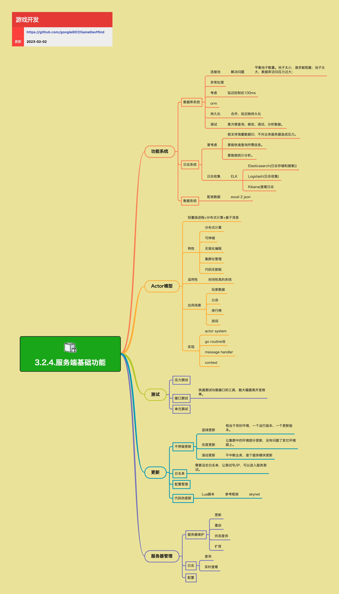

<h2 align="center">服务端基础功能</h2>

服务端环境的运转，除了业务功能以外，还需要一系列的基础功能来支撑其稳定、高效的开发和运转。这些基础功能包括数据库系统、日志系统、配置系统、Actor模型、测试、更新、服务器管理等。

**关键词:** 
*Pool,ORM,ELK,Actor,蓝绿更新,灰度更新,滚动更新*

**标签:** 
*等级: 中级|高级, 阶段: 开发, 分类: 研发能力, 角色: 服务端开发*

## 图谱

## 功能概览

### 功能系统

**做什么的？** 服务端的基础功能系统。

**在哪用？** 所有服务端系统。

**要点和思考方向：**

**数据库系统：**
- **连接池：**
  - **解决问题：** 平衡池子数量。池子太小，请求被阻塞；池子太大，数据库访问压力过大
- **异常处理：** 处理数据库访问异常
- **考虑：** 延迟控制在100ms
- **ORM（Object-Relational Mapping）：**
  - 对象关系映射
  - 适用于关系型数据库
  - 可以通过对象的方式操作数据库，而不需要直接使用SQL语句
- **持久化：** 合并、延迟做持久化
- **调试：** 要方便查询、修改、调试、分析数据

**日志系统：**
- **要考虑：**
  - 能支持海量数据IO，不对业务服务器造成压力
  - 要能快速查询所需信息
  - 要能做统计分析
- **日志收集：** ELK
  - Elasticsearch（日志存储和搜索）
  - Logstash（日志收集）
  - Kibana（查看日志）

**配置系统：**
- **配表数据：** excel 2 json

### Actor模型

**做什么的？** 轻量级进程+分布式计算+基于消息的编程模型。

**在哪用？** 封闭性高的系统。

**会遇到哪些问题？**
- 什么时候使用Actor模型？
- 如何实现Actor模型？

**要点和思考方向：**
- **特性：**
  - 分布式计算
  - 可伸缩
  - 无锁化编程
  - 集群化管理
  - 代码无割裂
- **适用性：** 封闭性高的系统
- **应用场景：**
  - 玩家数据
  - 公会
  - 排行榜
  - 房间
- **实现：**
  - actor system
  - go routine池
  - message handler
  - context

### 测试

**做什么的？** 各种测试方法和工具。

**在哪用？** 开发和上线阶段。

**会遇到哪些问题？**
- 如何进行压力测试？
- 如何进行接口测试？

**要点和思考方向：**
- **压力测试：** 模拟大量玩家同时访问游戏服务器的情况，通过测试服务器的性能、稳定性和可扩展性等指标，评估服务器在实际运行环境中的表现
- **接口测试：** 快速测试功能接口的工具，能大幅提高开发效率
- **单元测试：** 测试单个功能模块
- **测试用例：**
  - 并发用户数
  - 请求频率
  - 网络延迟

### 更新

**做什么的？** 服务端更新和热更新机制。

**在哪用？** 游戏运营和维护阶段。

**会遇到哪些问题？**
- 如何实现不停服更新？
- 如何实现代码热更新？

**要点和思考方向：**
- **不停服更新：**
  - **蓝绿更新：** 相当于双份环境，一个运行版本、一个更新版本
  - **灰度更新：** 让集群中的环境部分更新，没有问题了其它环境跟上
  - **滚动更新：** 不中断业务，逐个服务模块更新
- **白名单：** 需要设定白名单，让测试号/IP，可以进入服务测试
- **配置管理：** 管理服务器配置
- **代码热更新：**
  - **Lua脚本：** 参考框架 - skynet

### 服务器管理

**做什么的？** 服务器的维护和管理功能。

**在哪用？** 服务器运维阶段。

**要点和思考方向：**
- **服务器维护：**
  - 更新
  - 重启
  - 状态查询
  - 扩容
- **日志：**
  - 查询
  - 实时查看
- **配置：** 配置管理

## 更多资料