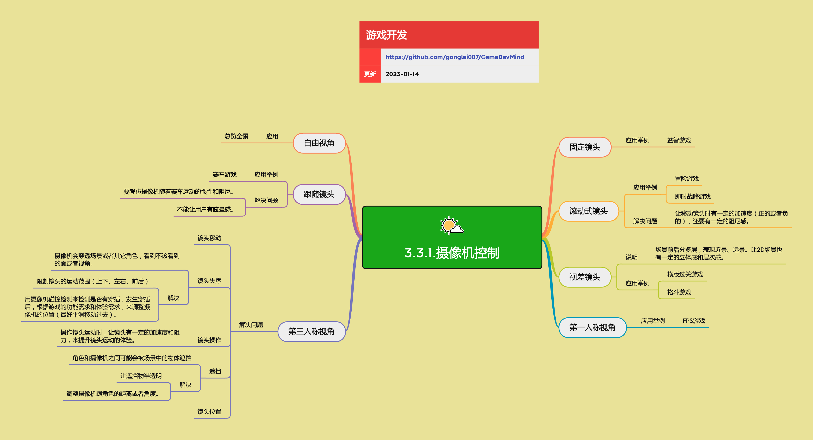

<h2 align="center">摄像机控制</h2>

不同的游戏类型会采用不同的镜头控制方式，这影响到游戏的表达和玩家的体验。摄像机控制包括第一人称、第三人称、滚动式镜头、视差镜头等多种方式，每种方式都有其特定的应用场景和技术要点。

**关键词:** 
*第一人称,第三人称,滚动式镜头,视差镜头,固定镜头,Cinemachine*

**标签:** 
*等级: 中级, 阶段: 开发, 分类: 研发能力, 角色: 客户端开发|策划*

## 图谱

## 基本控制

### 是什么？在哪用？

- **作用**：摄像机的基本运动控制，包括旋转、移动、约束等基础功能
- **应用场景**：所有需要摄像机控制的游戏

### 镜头移动

### 是什么？在哪用？

- **作用**：控制摄像机的旋转和移动，实现不同的视角效果
- **应用场景**：所有需要视角控制的游戏

### 旋转轴

- **Pitch（俯仰角）**：镜头基于左右方向的轴上下转动
  - **应用**：控制视角的上下角度
  - **限制**：通常有上下角度限制，避免视角翻转
- **Yaw（偏航角）**：镜头基于上下方向的轴左右转动
  - **应用**：控制视角的左右角度
  - **限制**：可以360度旋转，或限制在特定范围内
- **Roll（翻滚角）**：镜头基于前后方向的轴转动
  - **应用**：很少使用，主要用于特殊效果（如飞机翻滚、眩晕效果）
  - **注意**：在角色摄像机中很少使用

### 会遇到哪些问题？用什么解决？

- **镜头移动不流畅**
  - **问题**：镜头移动时出现抖动、卡顿，影响游戏体验
  - **解决方向**：
    - 使用平滑插值（Lerp、Slerp）实现平滑移动
    - 添加加速度和阻尼，让镜头运动更自然
    - 使用缓动函数（Easing）优化运动曲线

- **镜头操作体验差**
  - **问题**：镜头操作手感不好，响应不灵敏或过于敏感
  - **解决方向**：
    - 调整镜头灵敏度，适配不同输入设备
    - 添加加速度和阻力，提升操作手感
    - 支持灵敏度设置，让玩家自定义

- **视角翻转问题**
  - **问题**：镜头旋转时可能出现视角翻转，导致玩家眩晕
  - **解决方向**：
    - 限制Pitch角度范围（如-90度到90度）
    - 使用平滑过渡，避免突然翻转
    - 添加视角约束，防止不合理的视角

### 要点和思考方向

- 第一人称时：基于角色自身的轴来转动，镜头与角色绑定
- 第三人称时：一般是以角色为Look at的目标点来转动，镜头围绕角色旋转
- 操作镜头运动时，让镜头有一定的加速度和阻力，来提升镜头运动的体验
- 使用平滑插值和缓动函数，实现流畅的镜头移动

### 镜头振动

### 是什么？在哪用？

- **作用**：实现镜头震动效果，增强游戏表现力
- **应用场景**：
  - 爆炸、撞击等冲击效果
  - 角色受伤、死亡等状态变化
  - 环境震动（地震、爆炸等）

### 会遇到哪些问题？用什么解决？

- **震动效果不自然**
  - **问题**：震动效果过于生硬，不符合物理规律
  - **解决方向**：
    - 使用衰减函数，让震动逐渐减弱
    - 添加随机性，让震动更自然
    - 根据事件强度调整震动幅度和频率

- **震动影响操作**
  - **问题**：震动过于强烈，影响玩家操作
  - **解决方向**：
    - 控制震动幅度，避免过度震动
    - 提供震动开关，让玩家选择
    - 在关键时刻（如瞄准）减少或关闭震动

### 要点和思考方向

- 镜头震动要符合物理规律，使用衰减和随机性
- 震动幅度要适中，避免影响玩家操作
- 根据游戏类型和场景调整震动效果

### 约束

### 是什么？在哪用？

- **作用**：将摄像机的运动限定在一个指定的空间中，防止"穿帮"、避免不好的视角
- **应用场景**：
  - 限制摄像机移动范围
  - 防止摄像机穿透场景
  - 避免不合理的视角

### 会遇到哪些问题？用什么解决？

- **约束范围设置困难**
  - **问题**：如何设置合适的约束范围，既不影响游戏体验，又能防止穿帮
  - **解决方向**：
    - 使用碰撞体或触发器定义约束区域
    - 根据场景和游戏类型调整约束范围
    - 提供可视化工具，方便调试

- **约束与自由度的平衡**
  - **问题**：约束过严影响自由度，约束过松容易穿帮
  - **解决方向**：
    - 根据游戏类型和场景需求调整约束
    - 使用软约束，允许轻微超出但会回弹
    - 在关键区域使用硬约束，其他区域使用软约束

### 要点和思考方向

- 约束要防止"穿帮"、避免不好的视角
- 使用碰撞检测和范围限制实现约束
- 平衡约束和自由度，提供良好的游戏体验

### 分屏/画中画

### 是什么？在哪用？

- **作用**：支持多个摄像机同时渲染，实现分屏或画中画效果
- **应用场景**：
  - 多人同屏游戏
  - 赛车后视镜
  - 监控画面、小地图等

### 会遇到哪些问题？用什么解决？

- **性能问题**
  - **问题**：每个分屏摄像机都要走一遍渲染管线，性能开销大
  - **解决方向**：
    - 优化不同屏幕中的内容，减少渲染负担
    - 降低分屏摄像机的分辨率
    - 使用LOD、遮挡剔除等技术优化
    - 限制分屏数量，避免过多分屏

- **画面同步问题**
  - **问题**：多个摄像机画面不同步，影响游戏体验
  - **解决方向**：
    - 确保所有摄像机使用相同的更新逻辑
    - 使用统一的渲染时机
    - 处理网络延迟（多人游戏）

### 要点和思考方向

- 每个分屏摄像机都要走一遍渲染管线，要考虑不同屏幕中的内容的优化
- 合理使用分屏，避免性能问题
- 确保多个摄像机画面同步

## 第一人称视角

### 是什么？在哪用？

- **作用**：以角色视角观察游戏世界，提供沉浸式的游戏体验
- **应用场景**：
  - FPS游戏（第一人称射击游戏）
  - 部分RPG游戏
  - 探索类游戏
  - VR游戏

### 会遇到哪些问题？用什么解决？

- **镜头与角色绑定**
  - **问题**：如何让镜头完美跟随角色移动和旋转
  - **解决方向**：
    - 将摄像机作为角色的子对象，自动跟随
    - 使用平滑插值，避免镜头抖动
    - 处理角色移动时的镜头补偿（如头部摆动）

- **视野范围设置**
  - **问题**：FOV（视野角度）设置不当，影响游戏体验
  - **解决方向**：
    - 根据游戏类型设置合适的FOV（FPS通常60-90度）
    - 支持FOV动态调整（如瞄准时缩小FOV）
    - 考虑不同屏幕比例的影响

- **武器/手部模型处理**
  - **问题**：第一人称视角下武器和手部模型的显示和动画
  - **解决方向**：
    - 使用独立的摄像机层渲染武器模型
    - 处理武器动画和镜头移动的同步
    - 优化武器模型的渲染性能

- **眩晕问题**
  - **问题**：部分玩家可能因为第一人称视角产生眩晕
  - **解决方向**：
    - 提供视野范围调整选项
    - 添加视野稳定功能（减少头部摆动）
    - 提供第三人称视角选项（如果适合）

### 要点和思考方向

- 相对简单，跟角色绑定，跟着角色动就行
- 注意镜头与角色移动的同步，避免抖动
- 合理设置FOV，提供良好的游戏体验
- 考虑眩晕问题，提供可调节选项

## 第三人称视角

### 是什么？在哪用？

- **作用**：以第三人称视角观察角色和游戏世界，提供更广阔的视野和更好的角色表现
- **应用场景**：
  - 动作冒险游戏
  - 赛车游戏
  - 格斗游戏
  - RPG游戏
  - 开放世界游戏

### 镜头位置

### 是什么？在哪用？

- **作用**：设置摄像机相对于角色的位置，影响视角效果
- **应用场景**：所有第三人称视角游戏

### 会遇到哪些问题？用什么解决？

- **镜头高度设置**
  - **问题**：镜头高度不合适，影响视角和游戏体验
  - **解决方向**：
    - 根据游戏类型设置合适的镜头高度（如动作游戏通常略高于角色）
    - 支持动态调整镜头高度（如跳跃时）
    - 提供镜头高度设置选项

- **镜头距离设置**
  - **问题**：镜头距离不合适，视野过窄或过宽
  - **解决方向**：
    - 根据游戏类型设置合适的镜头距离
    - 支持动态调整距离（如瞄准时拉近）
    - 考虑不同场景的需求

### 要点和思考方向

- 镜头高度和距离要根据游戏类型和场景调整
- 支持动态调整，适应不同游戏状态
- 提供玩家自定义选项

### 镜头失序（穿透场景）

### 是什么？在哪用？

- **作用**：防止摄像机穿透场景或角色，避免看到不该看到的内容
- **应用场景**：所有第三人称视角游戏

### 会遇到哪些问题？用什么解决？

- **穿透检测**
  - **问题**：摄像机会穿透场景或者其它角色，看到不该看到的面或者视角
  - **解决方向**：
    - **限制镜头的运动范围**：上下、左右、前后范围限制
    - **摄像机碰撞检测**：用碰撞检测来检测是否有穿插，发生穿插后，根据游戏的功能需求和体验需求，来调整摄像机的位置（最好平滑移动过去）
    - **距离限制**：限制摄像机和角色的距离，如果距离太近，就把角色透明化
    - **使用碰撞体**：在场景中设置碰撞体，防止摄像机穿透

- **平滑移动**
  - **问题**：摄像机位置调整时出现突然跳跃，影响体验
  - **解决方向**：
    - 使用平滑插值（Lerp）移动摄像机
    - 添加缓动函数，让移动更自然
    - 控制移动速度，避免过快或过慢

### 要点和思考方向

- 使用碰撞检测和范围限制防止穿透
- 摄像机位置调整要平滑，避免突然跳跃
- 距离过近时可以考虑角色透明化

### 遮挡处理

### 是什么？在哪用？

- **作用**：处理角色和摄像机之间被场景物体遮挡的问题
- **应用场景**：所有第三人称视角游戏

### 会遇到哪些问题？用什么解决？

- **遮挡检测**
  - **问题**：角色和摄像机之间可能会被场景中的物体遮挡，看不到角色
  - **解决方向**：
    - **射线检测**：从摄像机向角色发射射线，检测是否有遮挡物
    - **遮挡物半透明**：让遮挡物半透明，既能看到角色，又能看到场景
    - **调整摄像机位置**：调整摄像机跟角色的距离或者角度，避免遮挡
    - **角色高亮**：在遮挡时高亮角色轮廓

- **半透明效果**
  - **问题**：遮挡物半透明后，视觉效果不自然
  - **解决方向**：
    - 使用合适的透明度（通常30-50%）
    - 添加淡入淡出效果，让过渡更自然
    - 只对特定物体使用半透明（如墙壁、柱子）

### 相关技术

- **射线检测（Raycast）**：检测摄像机到角色之间是否有遮挡物
- **材质透明度**：动态调整遮挡物的透明度
- **Shader**：使用特殊Shader实现半透明效果

### 要点和思考方向

- 使用射线检测识别遮挡物
- 遮挡物半透明是常用解决方案
- 调整摄像机位置也可以避免遮挡
- 注意半透明效果的视觉质量

### 镜头跟随

### 是什么？在哪用？

- **作用**：实现摄像机平滑跟随角色移动，提供流畅的视角体验
- **应用场景**：所有第三人称视角游戏

### 会遇到哪些问题？用什么解决？

- **跟随延迟**
  - **问题**：摄像机跟随过于僵硬或延迟，影响体验
  - **解决方向**：
    - 使用平滑插值（Lerp、Slerp）实现跟随
    - 添加惯性和阻尼，让跟随更自然
    - 根据角色移动速度调整跟随速度

- **快速移动时的跟随**
  - **问题**：角色快速移动时，摄像机跟不上或过于敏感
  - **解决方向**：
    - 考虑摄像机随着运动的惯性和阻尼
    - 根据移动速度动态调整跟随参数
    - 使用预测算法，提前移动摄像机

- **眩晕问题**
  - **问题**：镜头跟随可能导致玩家眩晕
  - **解决方向**：
    - 不能让用户有眩晕感
    - 减少不必要的镜头晃动
    - 使用稳定的跟随算法
    - 提供镜头稳定选项

### 要点和思考方向

- 要考虑摄像机随着运动的惯性和阻尼
- 不能让用户有眩晕感
- 使用平滑插值和缓动函数，实现流畅跟随
- 根据游戏类型调整跟随参数

### 多目标跟随

### 是什么？在哪用？

- **作用**：多人游戏时，让多个目标保持"同框"，确保所有玩家都在视野内
- **应用场景**：
  - 多人同屏游戏
  - 合作游戏
  - 竞技游戏

### 会遇到哪些问题？用什么解决？

- **视野范围计算**
  - **问题**：如何计算合适的视野范围，包含所有目标
  - **解决方向**：
    - 计算所有目标的边界框
    - 根据边界框调整摄像机位置和FOV
    - 添加边距，避免目标在屏幕边缘

- **目标距离过远**
  - **问题**：目标距离过远时，无法同时包含在视野内
  - **解决方向**：
    - 限制摄像机距离，保持合理视野
    - 使用分屏或画中画
    - 动态调整FOV（如果合适）

### 要点和思考方向

- 多人游戏时，要让多个目标保持"同框"
- 动态调整摄像机位置和FOV
- 考虑目标距离过远的情况

## 非3D角色摄像机

### 是什么？在哪用？

- **作用**：2D游戏或特殊视角的摄像机控制，提供不同的视角效果
- **应用场景**：
  - 2D游戏
  - 横版游戏
  - 策略游戏
  - 益智游戏

### 滚动式镜头

### 是什么？在哪用？

- **作用**：摄像机跟随角色或目标移动，实现场景滚动效果
- **应用场景**：
  - 冒险游戏
  - 即时战略游戏
  - 横版过关游戏
  - 平台游戏

### 会遇到哪些问题？用什么解决？

- **滚动不流畅**
  - **问题**：镜头移动时出现抖动、卡顿
  - **解决方向**：
    - 让移动镜头时有一定的加速度（正的或者负的）
    - 还要有一定的阻尼感
    - 使用平滑插值，实现流畅滚动

- **边界处理**
  - **问题**：场景边界处镜头如何处理
  - **解决方向**：
    - 限制镜头移动范围，不超出场景边界
    - 在边界处停止或减速
    - 使用平滑过渡，避免突然停止

### 要点和思考方向

- 让移动镜头时有一定的加速度和阻尼感
- 处理场景边界，避免超出范围
- 使用平滑插值，实现流畅滚动

### 视差镜头

### 是什么？在哪用？

- **作用**：场景前后分多层，表现近景、远景，让2D场景也有一定的立体感和层次感
- **应用场景**：
  - 横版过关游戏
  - 格斗游戏
  - 平台游戏
  - 2D动作游戏

### 会遇到哪些问题？用什么解决？

- **层级管理**
  - **问题**：如何管理多个层级的移动速度和关系
  - **解决方向**：
    - 为每个层级设置不同的移动速度（近景快，远景慢）
    - 使用层级管理器统一管理
    - 根据摄像机移动计算各层级位置

- **性能优化**
  - **问题**：多层场景可能导致性能问题
  - **解决方向**：
    - 优化各层级的渲染
    - 使用对象池复用元素
    - 合理设置层级数量和复杂度

### 要点和思考方向

- 场景前后分多层，表现近景、远景
- 让2D场景也有一定的立体感和层次感
- 合理设置各层级的移动速度
- 注意性能优化

### 自由视角

### 是什么？在哪用？

- **作用**：允许玩家自由控制摄像机，总览全景
- **应用场景**：
  - 策略游戏
  - 建造游戏
  - 沙盒游戏
  - 地图浏览

### 会遇到哪些问题？用什么解决？

- **控制复杂度**
  - **问题**：自由视角控制复杂，玩家可能难以掌握
  - **解决方向**：
    - 提供清晰的控制说明
    - 使用直观的控制方式（如拖拽、缩放）
    - 支持多种控制方式（鼠标、键盘、触摸）

- **视角限制**
  - **问题**：完全自由可能导致视角混乱
  - **解决方向**：
    - 设置合理的视角范围限制
    - 提供视角重置功能
    - 使用平滑过渡，避免突然变化

### 要点和思考方向

- 自由视角用于总览全景
- 提供直观的控制方式
- 设置合理的视角限制

### 固定镜头

### 是什么？在哪用？

- **作用**：摄像机位置固定，不跟随角色移动
- **应用场景**：
  - 益智游戏
  - 解谜游戏
  - 部分策略游戏
  - 固定场景游戏

### 会遇到哪些问题？用什么解决？

- **视野范围**
  - **问题**：固定镜头如何设置合适的视野范围
  - **解决方向**：
    - 根据游戏内容设置视野范围
    - 确保所有重要内容都在视野内
    - 使用合适的FOV和位置

- **内容超出视野**
  - **问题**：游戏内容可能超出固定视野范围
  - **解决方向**：
    - 限制游戏内容在视野范围内
    - 使用滚动或分屏显示
    - 动态调整视野范围（如果合适）

### 要点和思考方向

- 固定镜头用于固定场景的游戏
- 确保所有重要内容都在视野内
- 合理设置视野范围

## 中间件与工具

### 是什么？在哪用？

- **作用**：提供摄像机控制的中间件和工具，简化开发流程
- **应用场景**：Unity游戏项目

### Cinemachine

### 是什么？在哪用？

- **说明**：Unity官方的摄像机控制工具，提供强大的摄像机系统
- **特点**：
  - 可视化编辑，无需编写代码
  - 支持多种摄像机行为（跟随、轨道、混合等）
  - 强大的镜头切换和过渡系统
  - 支持多摄像机管理
- **应用场景**：
  - Unity游戏项目
  - 需要复杂摄像机控制的游戏
  - 需要镜头切换和过渡的游戏

### 会遇到哪些问题？用什么解决？

- **学习成本**
  - **问题**：Cinemachine功能强大但学习曲线较陡
  - **解决方向**：
    - 学习官方文档和教程
    - 从简单场景开始，逐步掌握
    - 参考示例项目

- **性能考虑**
  - **问题**：复杂的摄像机系统可能影响性能
  - **解决方向**：
    - 合理使用摄像机数量
    - 优化摄像机更新频率
    - 使用对象池等技术优化

### 要点和思考方向

- Cinemachine是Unity官方的摄像机控制工具，功能强大
- 适合需要复杂摄像机控制的游戏
- 注意学习成本和性能影响

### 其他工具

### 是什么？在哪用？

- **自研摄像机系统**：根据项目需求自行开发的摄像机系统
- **第三方插件**：如Camera Controller Pro等
- **引擎内置系统**：不同游戏引擎提供的摄像机系统

### 要点和思考方向

- 根据项目需求选择合适的工具
- 考虑学习成本、性能、功能等因素
- 可以结合多种工具使用

## 摄像机控制最佳实践

### 是什么？在哪用？

- **作用**：总结摄像机控制的常见问题和解决方案，提供最佳实践指导
- **应用场景**：所有需要摄像机控制的游戏开发

### 会遇到哪些问题？用什么解决？

- **性能优化**
  - **问题**：摄像机系统可能影响游戏性能
  - **解决方向**：
    - 减少不必要的摄像机更新
    - 使用对象池复用摄像机
    - 优化碰撞检测和射线检测
    - 合理使用LOD和遮挡剔除

- **跨平台适配**
  - **问题**：不同平台的输入方式和性能差异
  - **解决方向**：
    - 支持多种输入方式（鼠标、触摸、手柄）
    - 根据平台调整摄像机参数
    - 考虑不同屏幕比例的影响

- **调试和测试**
  - **问题**：摄像机问题难以调试和测试
  - **解决方向**：
    - 提供可视化调试工具
    - 记录摄像机状态和参数
    - 使用摄像机回放功能
    - 建立测试场景和用例

### 要点和思考方向

- 摄像机控制要平衡功能性和性能
- 提供良好的调试和测试工具
- 考虑跨平台适配
- 根据游戏类型选择合适的摄像机方案

## 更多资料

### 在线资料
* [Unity Camera Documentation](https://docs.unity3d.com/Manual/class-Camera.html) - Unity官方摄像机文档
* [Cinemachine Documentation](https://docs.unity3d.com/Packages/com.unity.cinemachine@latest) - Cinemachine官方文档

### 视频资料
* [游戏镜头选择，不止看起来那么简单](https://www.zhihu.com/zvideo/1456023883593359361) - 从游戏设计的角度谈的游戏镜头的种类、特色和选择
* [Making Camera Controls in Unity - Open Kinematic Character Controller](https://www.youtube.com/watch?v=Zw6qvOOHGC4) - Unity摄像机控制实现
* [THIRD PERSON MOVEMENT in Unity](https://www.youtube.com/watch?v=4HpC--2iowE) - 第三人称移动和摄像机控制实现

### 文章
* [游戏摄像机系统设计实践](https://zhuanlan.zhihu.com/p/xxx) - 游戏摄像机系统的设计实践案例