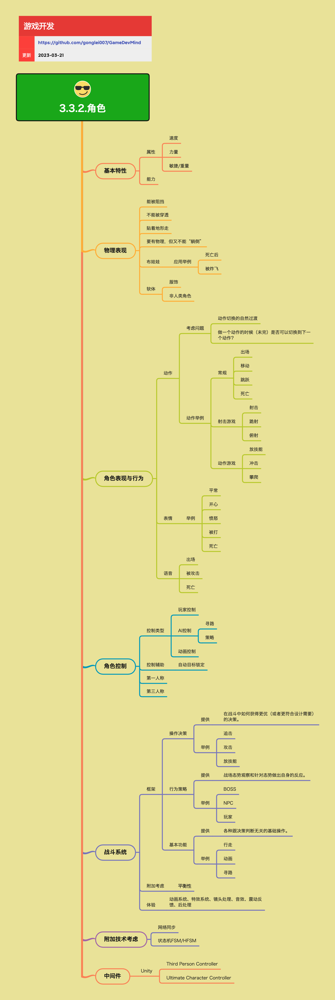

<h2 align="center">角色</h2>

对于有角色的游戏，其中一个最重要的体验感就是来自于角色，包括角色的表现、动作、行为、控制等等。角色系统涉及基本特性、物理表现、角色控制、战斗系统等多个方面。

**关键词:** 
*Character,FSM,HFSM,布娃娃,软体,状态机*

**标签:** 
*等级: 中级, 阶段: 开发, 分类: 研发能力, 角色: 客户端开发|美术*

## 图谱

## 角色系统概览

## 基本特性

**是什么？在哪用？**

- **作用**：角色的基础属性和能力
- **应用场景**：
  - 所有有角色的游戏
  - 角色设计
  - 游戏平衡性设计
- **做什么的？** 角色的基础属性和能力。
- **在哪用？** 所有有角色的游戏。

**会遇到哪些问题？用什么解决？**

- **如何设计角色属性？**
  - **问题**：需要设计合理的角色属性系统
  - **解决方向**：
    - **属性：**
      - **速度：** 角色移动速度
        - 影响角色移动能力
        - 平衡不同角色的速度差异
        - 考虑游戏类型和玩法
      - **力量：** 角色力量属性
        - 影响攻击力或物理能力
        - 平衡战斗系统
        - 考虑角色定位
      - **敏捷/重量：** 角色敏捷或重量属性
        - 影响角色反应速度
        - 影响角色移动灵活性
        - 平衡角色特性
    - 建立属性体系
    - 实现属性计算
    - 实现属性成长

- **如何设计角色能力？**
  - **问题**：需要设计角色的特殊能力
  - **解决方向**：
    - **能力：** 角色的特殊能力
      - 设计独特的能力系统
      - 实现能力激活机制
      - 平衡能力强度
      - 实现能力成长
    - 实现能力系统
    - 实现能力冷却
    - 实现能力效果

**要点和思考方向：**
- **属性：**
  - 速度
  - 力量
  - 敏捷/重量
- **能力：** 角色的特殊能力
- 属性设计要考虑游戏平衡性
- 能力设计要符合角色定位

## 物理表现

**是什么？在哪用？**

- **作用**：角色的物理交互和表现
- **应用场景**：
  - 需要物理交互的游戏
  - 角色与场景交互
  - 角色物理反馈
- **做什么的？** 角色的物理交互和表现。
- **在哪用？** 需要物理交互的游戏。

**会遇到哪些问题？用什么解决？**

- **如何实现角色的物理表现？**
  - **问题**：需要实现真实的物理表现
  - **解决方向**：
    - **基本物理要求：**
      - **能被阻挡：** 角色可以被障碍物阻挡
        - 实现碰撞检测
        - 实现碰撞响应
        - 处理碰撞边界
      - **不能被穿透：** 角色不能穿透其他物体
        - 实现连续碰撞检测
        - 实现穿透修复
        - 优化碰撞性能
      - **贴着地形走：** 角色要贴合地形移动
        - 实现地形检测
        - 实现角色对齐
        - 实现坡度处理
      - **要有物理，但又不能"躺倒"：** 角色要有物理但保持站立
        - 实现物理约束
        - 实现姿态控制
        - 处理物理异常
    - 使用物理引擎
    - 实现物理控制器
    - 优化物理性能

- **如何处理角色与场景的交互？**
  - **问题**：需要处理角色与场景的物理交互
  - **解决方向**：
    - 实现场景碰撞检测
    - 实现交互响应
    - 实现物理反馈
    - 优化交互性能

- **特殊物理效果**
  - **问题**：需要实现特殊的物理效果
  - **解决方向**：
    - **布娃娃：** 布娃娃物理系统
      - **应用举例：**
        - **死亡后：** 角色死亡后使用布娃娃物理
          - 实现布娃娃切换
          - 实现物理模拟
          - 优化性能
        - **被炸飞：** 角色被炸飞时使用布娃娃物理
          - 实现爆炸力计算
          - 实现布娃娃响应
          - 实现动画过渡
    - **软体：** 软体物理系统
      - **服饰：** 服饰的软体物理
        - 实现布料模拟
        - 实现物理约束
        - 优化性能
      - **非人类角色：** 非人类角色的软体物理
        - 实现软体模拟
        - 实现物理响应
        - 优化性能

**要点和思考方向：**
- 能被阻挡
- 不能被穿透
- 贴着地形走
- 要有物理，但又不能"躺倒"
- **布娃娃：**
  - **应用举例：**
    - 死亡后
    - 被炸飞
- **软体：**
  - 服饰
  - 非人类角色
- 物理表现要平衡真实性和游戏性
- 优化物理性能避免影响游戏流畅度

## 角色表现与行为

**是什么？在哪用？**

- **作用**：角色的动作、表情、语音等表现
- **应用场景**：
  - 所有有角色的游戏
  - 角色动画
  - 角色交互
- **做什么的？** 角色的动作、表情、语音等表现。
- **在哪用？** 所有有角色的游戏。

**会遇到哪些问题？用什么解决？**

- **如何实现自然的动作切换？**
  - **问题**：需要实现自然的动作切换
  - **解决方向**：
    - **动作：**
      - **考虑问题：**
        - **动作切换的自然过渡：** 实现动作融合
          - 使用动画融合技术
          - 实现过渡动画
          - 优化过渡时间
        - **做一个动作的时候（未完）是否可以切换到下一个动作？：** 实现动作打断
          - 定义动作优先级
          - 实现动作打断机制
          - 处理打断后的过渡
      - **动作举例：**
        - **常规：** 出场、移动、跳跃、死亡
          - 实现基础动作系统
          - 实现动作状态管理
          - 实现动作播放控制
        - **射击游戏：** 射击、跪射、俯射
          - 实现射击动作
          - 实现姿态切换
          - 实现动作组合
        - **动作游戏：** 放技能、冲击、攀爬
          - 实现技能动作
          - 实现特殊动作
          - 实现动作连击
    - 使用动画状态机
    - 实现动画融合
    - 优化动画性能

- **如何处理动作的打断和过渡？**
  - **问题**：需要处理动作打断和过渡
  - **解决方向**：
    - 实现动作优先级系统
    - 实现打断机制
    - 实现过渡动画
    - 优化打断响应

- **表情和语音**
  - **问题**：需要实现表情和语音表现
  - **解决方向**：
    - **表情：**
      - **举例：** 平常、开心、愤怒、被打、死亡
        - 实现表情系统
        - 实现表情切换
        - 实现表情动画
    - **语音：**
      - **出场：** 角色出场语音
        - 实现语音播放
        - 实现语音触发
      - **被攻击：** 被攻击时的语音
        - 实现语音触发
        - 实现语音随机
      - **死亡：** 死亡时的语音
        - 实现语音播放
        - 实现语音效果
    - 实现表情和语音同步
    - 优化语音性能

**要点和思考方向：**

**动作：**
- **考虑问题：**
  - 动作切换的自然过渡
  - 做一个动作的时候（未完）是否可以切换到下一个动作？
- **动作举例：**
  - **常规：** 出场、移动、跳跃、死亡
  - **射击游戏：** 射击、跪射、俯射
  - **动作游戏：** 放技能、冲击、攀爬

**表情：**
- **举例：** 平常、开心、愤怒、被打、死亡

**语音：**
- 出场
- 被攻击
- 死亡

## 角色控制

**是什么？在哪用？**

- **作用**：角色的控制方式和辅助功能
- **应用场景**：
  - 所有需要角色控制的游戏
  - 玩家控制
  - AI控制
- **做什么的？** 角色的控制方式和辅助功能。
- **在哪用？** 所有需要角色控制的游戏。

**会遇到哪些问题？用什么解决？**

- **如何实现玩家控制？**
  - **问题**：需要实现玩家对角色的控制
  - **解决方向**：
    - **控制类型：**
      - **玩家控制：** 玩家直接控制角色
        - 实现输入处理
        - 实现控制响应
        - 实现控制反馈
    - 实现输入系统
    - 实现控制映射
    - 实现控制辅助

- **如何实现AI控制？**
  - **问题**：需要实现AI对角色的控制
  - **解决方向**：
    - **控制类型：**
      - **AI控制（寻路、策略）：** AI控制角色行为
        - **寻路：** 实现路径寻找
          - 使用寻路算法（A*、NavMesh等）
          - 实现路径优化
          - 实现动态避障
        - **策略：** 实现AI决策
          - 使用状态机或行为树
          - 实现决策逻辑
          - 实现行为选择
    - 实现AI系统
    - 实现行为树或状态机
    - 优化AI性能

- **如何处理第一人称和第三人称？**
  - **问题**：需要支持不同的视角控制
  - **解决方向**：
    - **第一人称：** 第一人称视角控制
      - 实现第一人称摄像机
      - 实现视角控制
      - 实现武器显示
    - **第三人称：** 第三人称视角控制
      - 实现第三人称摄像机
      - 实现视角跟随
      - 实现视角切换
    - 实现视角切换
    - 实现视角平滑过渡
    - 优化视角性能

- **控制辅助功能**
  - **问题**：需要实现控制辅助功能
  - **解决方向**：
    - **控制辅助：** 自动目标锁定
      - 实现目标检测
      - 实现目标锁定
      - 实现锁定切换
    - **控制类型：**
      - **动画控制：** 动画驱动控制
        - 实现动画驱动
        - 实现动画响应
        - 优化动画性能
    - 实现辅助瞄准
    - 实现自动移动
    - 实现操作简化

**要点和思考方向：**
- **控制类型：**
  - 玩家控制
  - AI控制（寻路、策略）
  - 动画控制
- **控制辅助：** 自动目标锁定
- **第一人称：** 第一人称视角控制
- **第三人称：** 第三人称视角控制
- 控制要流畅响应玩家输入
- AI控制要自然合理
- 支持多种控制方式提高游戏体验

## 战斗系统

**是什么？在哪用？**

- **作用**：角色的战斗框架和体验
- **应用场景**：
  - 有战斗系统的游戏
  - 战斗玩法设计
  - 战斗体验优化
- **做什么的？** 角色的战斗框架和体验。
- **在哪用？** 有战斗系统的游戏。

**会遇到哪些问题？用什么解决？**

- **如何设计战斗框架？**
  - **问题**：需要设计合理的战斗框架
  - **解决方向**：
    - **框架：**
      - **操作决策：**
        - **提供：** 在战斗中如何获得更优（或者更符合设计需要）的决策
        - **举例：** 追击、攻击、放技能
          - 实现决策系统
          - 实现决策评估
          - 实现决策执行
      - **行为策略：**
        - **提供：** 战场态势观察和针对态势做出自身的反应
        - **举例：** BOSS、NPC、玩家
          - 实现态势感知
          - 实现策略选择
          - 实现行为执行
      - **基本功能：**
        - **提供：** 各种跟决策判断无关的基础操作
        - **举例：** 行走、动画、寻路
          - 实现基础功能
          - 实现功能组合
          - 优化功能性能
    - 设计战斗流程
    - 实现战斗模块
    - 优化战斗性能

- **如何提供战斗决策支持？**
  - **问题**：需要为玩家或AI提供战斗决策支持
  - **解决方向**：
    - 实现决策系统
    - 实现决策提示
    - 实现自动决策
    - 优化决策性能

- **如何平衡战斗体验？**
  - **问题**：需要平衡战斗体验
  - **解决方向**：
    - **附加考虑：**
      - **平衡性：** 战斗平衡性设计
        - 实现数值平衡
        - 实现机制平衡
        - 实现体验平衡
    - 实现平衡性测试
    - 实现数据收集
    - 实现平衡调整

- **战斗体验优化**
  - **问题**：需要优化战斗体验
  - **解决方向**：
    - **体验：** 战斗体验要素
      - **动画系统：** 战斗动画
        - 实现流畅动画
        - 实现动画反馈
      - **特效系统：** 战斗特效
        - 实现技能特效
        - 实现打击特效
      - **镜头处理：** 战斗镜头
        - 实现镜头跟随
        - 实现镜头切换
      - **音效：** 战斗音效
        - 实现打击音效
        - 实现技能音效
      - **震动反馈：** 震动反馈
        - 实现打击震动
        - 实现技能震动
      - **后处理：** 后处理效果
        - 实现画面效果
        - 实现氛围营造
    - 实现体验优化
    - 实现反馈系统
    - 优化体验性能

**要点和思考方向：**

**框架：**
- **操作决策：**
  - **提供：** 在战斗中如何获得更优（或者更符合设计需要）的决策
  - **举例：** 追击、攻击、放技能
- **行为策略：**
  - **提供：** 战场态势观察和针对态势做出自身的反应
  - **举例：** BOSS、NPC、玩家
- **基本功能：**
  - **提供：** 各种跟决策判断无关的基础操作
  - **举例：** 行走、动画、寻路

**附加考虑：**
- 平衡性

**体验：**
- 动画系统、特效系统、镜头处理、音效、震动反馈、后处理

## 附加技术考虑

**是什么？在哪用？**

- **作用**：角色系统需要的附加技术
- **应用场景**：
  - 复杂的角色系统
  - 多人游戏
  - 状态管理
- **做什么的？** 角色系统需要的附加技术。
- **在哪用？** 复杂的角色系统。

**会遇到哪些问题？用什么解决？**

- **如何实现网络同步？**
  - **问题**：多人游戏中需要同步角色状态
  - **解决方向**：
    - **网络同步：** 多人游戏中角色的同步
      - 实现状态同步
      - 实现动作同步
      - 实现位置同步
      - 优化同步性能
    - 使用状态同步或帧同步
    - 实现客户端预测
    - 实现延迟补偿
    - 优化同步数据量

- **如何管理角色状态？**
  - **问题**：需要管理角色的状态转换
  - **解决方向**：
    - **状态机FSM/HFSM：** 管理角色的状态转换
      - **FSM（有限状态机）：** 基础状态机
        - 实现状态定义
        - 实现状态转换
        - 实现状态行为
      - **HFSM（分层状态机）：** 分层状态机
        - 实现状态分层
        - 实现状态继承
        - 实现状态组合
    - 设计状态结构
    - 实现状态管理
    - 优化状态性能

- **其他技术考虑**
  - **问题**：需要其他技术支持
  - **解决方向**：
    - 实现性能优化
    - 实现内存管理
    - 实现资源管理
    - 实现调试工具

**要点和思考方向：**
- **网络同步：** 多人游戏中角色的同步
- **状态机FSM/HFSM：** 管理角色的状态转换
- 网络同步要考虑延迟和带宽
- 状态机要清晰管理角色行为
- 优化性能保证游戏流畅度

## 中间件

**是什么？在哪用？**

- **作用**：可用的角色控制中间件
- **应用场景**：
  - Unity游戏项目
  - 快速开发角色系统
  - 角色控制实现
- **做什么的？** 可用的角色控制中间件。
- **在哪用？** Unity游戏项目。

**会遇到哪些问题？用什么解决？**

- **如何选择合适的中间件？**
  - **问题**：需要选择合适的角色控制中间件
  - **解决方向**：
    - **Unity：**
      - **Third Person Controller：** 第三人称控制器
        - 功能：第三人称控制
        - 特点：轻量级、易用
        - 适用：简单第三人称游戏
      - **Ultimate Character Controller：** 终极角色控制器
        - 功能：完整的角色控制系统
        - 特点：功能全面、可扩展
        - 适用：复杂角色系统
    - 评估功能需求
    - 评估学习成本
    - 评估扩展性
    - 评估性能

- **如何使用中间件？**
  - **问题**：需要正确使用中间件
  - **解决方向**：
    - 学习中间件文档
    - 理解中间件架构
    - 实现自定义扩展
    - 优化中间件性能

- **中间件定制和扩展**
  - **问题**：可能需要定制和扩展中间件
  - **解决方向**：
    - 实现自定义功能
    - 实现功能扩展
    - 实现性能优化
    - 实现问题修复

**要点和思考方向：**
- **Unity：**
  - Third Person Controller
  - Ultimate Character Controller
- 选择合适的中间件可以加快开发速度
- 理解中间件架构便于扩展和优化
- 注意中间件的性能和兼容性

## 更多资料
## 视频资料
* [FIRST PERSON MOVEMENT in Unity - FPS Controller](https://www.youtube.com/watch?v=_QajrabyTJc)
* [THIRD PERSON MOVEMENT in Unity](https://www.youtube.com/watch?v=4HpC--2iowE)
* [RIVAL DOTS Character Controller FREE on Unity Asset Store!](https://www.youtube.com/watch?v=aM_BGRAe8Y4)

## 实践资料
* [Unity DOTS Character Controller](https://www.vertexfragment.com/ramblings/unity-dots-character-controller) - 使用Unity的DOTS（Data-Oriented Tech Stack）和新的Entities（ECS）和Physics包，实现了一个基本的动力学角色控制器。
* [Unity DOTS Character Controller(Example)](https://github.com/ssell/UnityDotsCharacterController)
* [Rival - DOTS Character Controller](https://forum.unity.com/threads/released-rival-dots-character-controller.1118761/) - 一个扩展性优良的DOTS角色控制器。
* [Making a Character Controller, Part 31: Flight Controls](https://www.youtube.com/watch?v=fqB-8z6-jeQ) - 学习制作一个功能完整的角色控制器，从输入管理到适用于行走、车辆和飞行的模块化控制方案。适合初学者和有一定Unity和C#基础的中级开发者。
