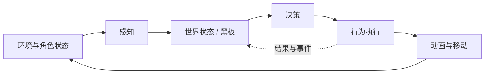

## 游戏 AI 系统

游戏 AI 负责让 NPC、单位和游戏世界根据规则、环境与玩家行为作出决策。它不是单一算法，而是由感知、决策、导航、执行、调试和性能预算共同构成的游戏运行时系统。

**关键词:** 
*游戏AI,NPC,有限状态机,FSM,行为树,Utility AI,寻路,A星,NavMesh,MCTS,感知系统,AI Coding*

**标签:** 
*等级: 中级|高级, 阶段: 开发, 分类: 研发能力, 角色: 客户端开发|服务端开发|策划*

## 分层定位

| 相关层级 | 关注点 |
|----------|--------|
| [人工智能基础](../1.基础能力/1.3.2.人工智能.md) | 机器学习、神经网络、演化算法等通用原理 |
| **本文** | 游戏运行时中的感知、决策、寻路、执行和调试 |
| [AI 助力游戏生产](../4.生产能力/4.1.2.AI助力游戏生产.md) | 用生成式 AI 和智能工具提高生产效率 |
| [AI 助力游戏运营](../6.运营能力/6.2.6.AI助力游戏运营.md) | 用户画像、客服、内容引流和运营决策 |

## 目录

- [系统结构](#系统结构)
- [决策模型](#决策模型)
- [导航与寻路](#导航与寻路)
- [策略搜索](#策略搜索)
- [工程化要点](#工程化要点)

---

## 系统结构

| 子系统 | 作用 | 常见问题 |
|--------|------|----------|
| 感知 | 收集距离、视野、声音、伤害和事件 | 感知频率过高、信息不一致 |
| 世界状态/黑板 | 保存 AI 可使用的上下文 | 数据失效、不同节点互相覆盖 |
| 决策 | 选择当前目标和行为 | 规则膨胀、行为抖动、不可解释 |
| 导航 | 规划路径并进行局部避障 | 动态障碍、多人拥堵、路径频繁重算 |
| 执行 | 驱动移动、动画、技能和交互 | 决策状态与表现状态不同步 |

## 决策模型

| 模型 | 适用场景 | 要点 |
|------|----------|------|
| 有限状态机（FSM） | 状态较少、转换明确的 NPC | 状态增多后使用分层状态机，避免转换爆炸 |
| 行为树 | 行为组合复杂、需要设计师可视化配置 | 明确节点生命周期、打断规则和黑板数据范围 |
| Utility AI | 需要按多个因素动态评分的决策 | 归一化评分，避免权重失控和行为频繁切换 |
| GOAP | 目标明确、允许动态组合行动的场景 | 控制搜索空间，缓存可复用计划 |
| 规则/脚本 | 活动、关卡或 Boss 的确定性逻辑 | 规则数据化，提供校验和调试工具 |

## 导航与寻路

| 技术 | 作用 | 工程考虑 |
|------|------|----------|
| A* | 在图或网格上搜索低成本路径 | 大地图采用分层寻路、预计算和搜索范围限制 |
| NavMesh | 表示 3D 场景中的可行走区域 | 支持烘焙、分块和动态障碍局部更新 |
| RVO/ORCA | 多单位局部避障 | 与全局路径规划分层，控制单位密度和更新频率 |
| 流场寻路 | 大量单位前往相近目标 | 适合 RTS/SLG，注意流场重建成本 |

## 策略搜索

蒙特卡洛树搜索（MCTS）适合棋牌、回合制和策略游戏。实现时应限制单次决策时间或模拟次数，并根据游戏规则设计启发式模拟和状态缓存。实时动作游戏通常更适合行为树、Utility AI 或预计算策略。

## 工程化要点

| 问题 | 解决方向 |
|------|----------|
| AI 难以复现 | 固定随机种子；记录输入、世界状态和决策轨迹；支持回放 |
| 大量 NPC 消耗过高 | 分级更新；视距裁剪；降低远处 AI 频率；服务端批处理 |
| 行为不可解释 | 输出决策原因、评分和状态转换；提供可视化调试面板 |
| 策划调整成本高 | 行为与参数数据化；提供编辑器、校验规则和版本兼容 |
| 客户端与服务端结果冲突 | 明确权威端；客户端只预测表现，关键结果由服务端裁决 |

| 类型 | AI Coding 指南 |
|------|----------------|
| **交互提示** | 说明游戏类型、单位数量、权威端、决策频率和可调试性要求 |
| **方法** | 先设计感知、状态、决策和执行边界，再选择 FSM、行为树、Utility AI 或搜索算法 |
| **应用** | NPC 架构、Boss 行为、群体寻路、决策回放和 AI 调试工具 |
| **提示词范例** | 「为 100 个 RTS 单位设计游戏 AI：全局 A*、局部 ORCA、分级更新；请给出系统分层、数据结构、每帧预算和可视化调试方案」 |

## 更多资料

- [Game AI Pro](http://www.gameaipro.com/)
- [Recast Navigation](https://github.com/recastnavigation/recastnavigation)
