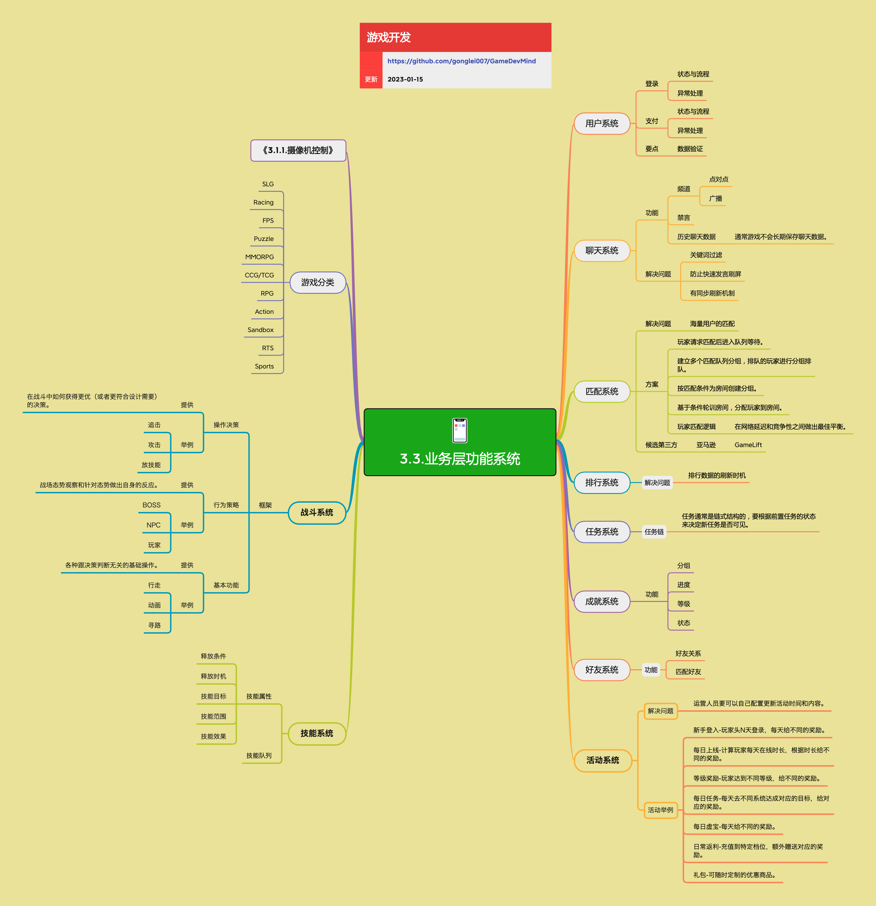

<h2 align="center">业务层功能</h2>

大多数网游都有的业务层的系统。

**关键词:**  
*3C,用户系统，聊天系统，匹配系统，排行系统，任务系统，好友系统，成就系统，活动系统，技能系统*

**标签:** 
*等级: 中级, 阶段: 开发, 分类: 研发能力, 角色: 客户端开发|服务端开发|策划*

## 图谱

* [3.3.1.摄像机控制](3.3.1.摄像机控制.md)
* [3.3.2.角色](3.3.2.角色.md)
* [3.3.3.综合业务层功能](3.3.3.综合业务层功能.md)
