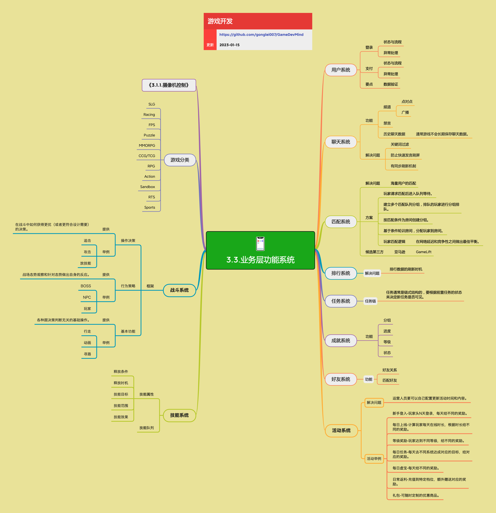

## 游戏系统与玩法研发

面向玩家体验、游戏规则和产品运行时的玩法与业务系统。这些系统会组合客户端表现、服务端权威逻辑、配置数据和运营接口，是游戏研发区别于通用软件开发最明显的部分。

**关键词:**  
*3C,游戏AI,用户系统,帐号系统,聊天系统,匹配系统,排行系统,任务系统,好友系统,成就系统,活动系统,技能系统*

**标签:** 
*等级: 中级, 阶段: 开发, 分类: 研发能力, 角色: 客户端开发|服务端开发|策划*

## 图谱

* [3.3.1.摄像机控制](3.3.1.摄像机控制.md)
* [3.3.2.角色](3.3.2.角色.md)
* [3.3.3.综合游戏系统](3.3.3.综合业务层功能.md)
* [3.3.4.游戏 AI 系统](3.3.4.游戏AI系统.md)
* [3.3.5.用户与帐号系统](3.3.5.用户与帐号系统.md)
