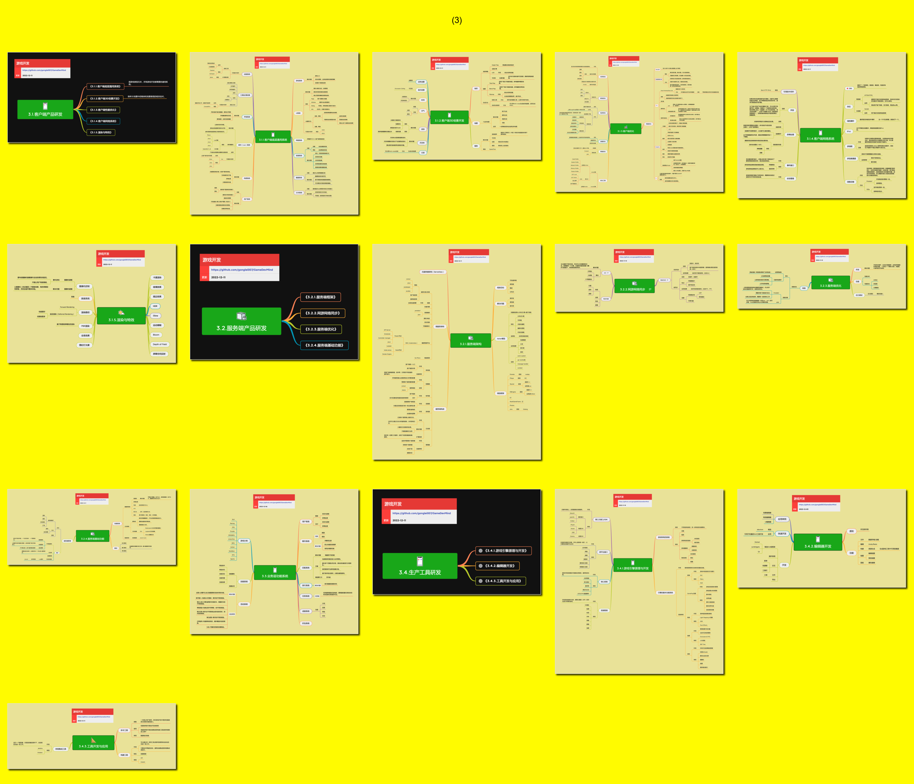

<h2 align="center">研发能力</h2>

游戏产品研发涉及客户端、服务端以及业务层功能的开发。这些能力决定了游戏产品的技术实现质量和开发效率。

**关键词:** 
*客户端开发,服务端开发,业务逻辑,游戏系统,架构设计,性能优化*

**标签:** 
*等级: 中级|高级, 阶段: 开发, 分类: 研发能力, 角色: 客户端开发|服务端开发|全栈开发*

----

## 目录

* [3.1.客户端产品研发](3.1.客户端产品研发.md)
    * [⭕ 3.1.1.客户端底层通用系统](3.1.1.客户端底层通用系统.md)
    * [3.1.2.客户端3D场景开发](3.1.2.客户端3D场景开发.md)
    * [⭕ 3.1.3.客户端优化](3.1.3.客户端优化.md)
    * [⭕ 3.1.4.客户端网络系统](3.1.4.客户端网络系统.md)
    * [3.1.5.效果与表现](3.1.5.效果与表现.md)
    * [3.1.6.UI系统](3.1.6.UI系统.md)
    * [3.1.7.客户端中间件](3.1.7.客户端中间件.md)
* [3.2.服务端产品研发](3.2.服务端产品研发.md)
    * [⭕ 3.2.1.服务端底层架构](3.2.1.服务端底层架构.md)
    * [3.2.2.网游网络同步](3.2.2.网游网络同步.md)
    * [3.2.3.服务端优化](3.2.3.服务端优化.md)
    * [3.2.4.服务端基础功能](3.2.4.服务端基础功能.md)
    * [⭕ 3.2.5.服务端业务架构](3.2.5.服务端业务架构.md)
* [3.3.业务层功能](3.3.业务层功能.md)
  * [⭕ 3.3.1.摄像机控制](3.3.1.摄像机控制.md)
  * [3.3.2.角色](3.3.2.角色.md)
  * [3.3.3.综合业务层功能](3.3.3.综合业务层功能.md)
 

----

## 预览

