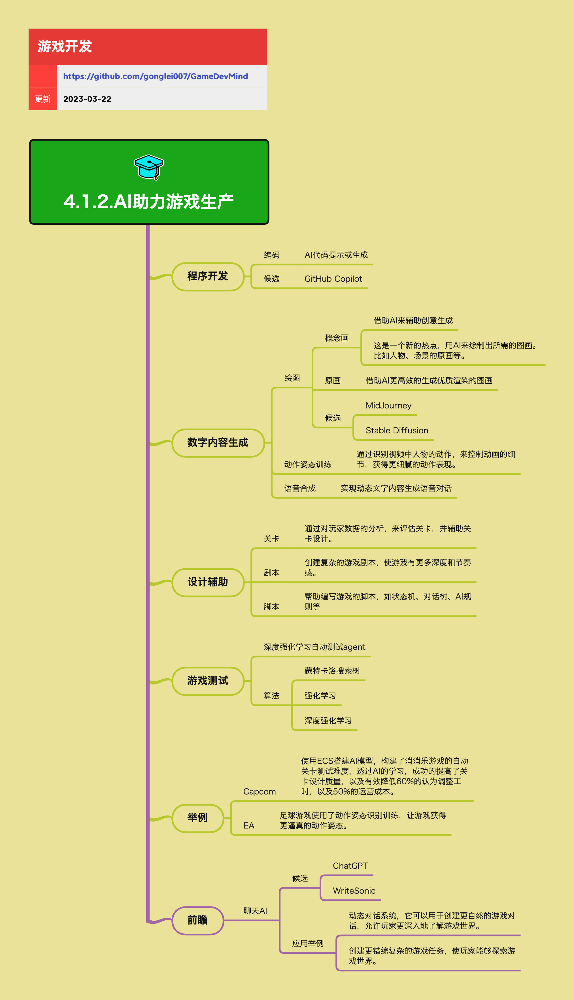

<h2 align="center">AI助力游戏生产</h2>

在游戏开发和运营中，有大量的内容需要创作生产，有大量的数据需要处理。如果用 AI 来辅助这些工作，将会大幅提高生产效率。本章节聚焦「AI 作为生产工具」如何插入到现有工作流中，而不是讨论模型原理。

**关键词:** 
*代码生成，代码分析，AI绘图，语音合成，关卡设计，自动测试，强化学习*

**标签:** 
*等级: 中级|高级, 阶段: 开发, 分类: 生产能力, 角色: 客户端开发|服务端开发|美术|策划*

## 图谱

## 程序开发

### 是什么？在哪用？

- **作用**：让 AI 辅助程序开发，提高编码和维护效率
- **应用场景**：
  - **代码生成**：AI 代码提示或生成（补全函数、生成样板代码、重构建议）
  - **代码分析**：阅读遗留代码、找潜在问题、生成注释/文档
  - **Bug 修复**：基于报错信息和代码上下文给出修复方案
  - **代码审查**：自动检查代码规范、潜在问题、安全漏洞

### 会遇到哪些问题？用什么解决？

- **代码质量不可控**
  - **问题**：AI 生成的代码可能包含错误、不符合项目规范、存在安全隐患
  - **解决方向**：
    - 对关键模块仍需人工 Code Review
    - 建立代码规范检查机制
    - AI 输出更适合作为草稿与参考，需要人工验证和调整

- **上下文理解不足**
  - **问题**：AI 可能不理解项目的整体架构和业务逻辑
  - **解决方向**：
    - 提供详细的代码注释和文档
    - 使用项目特定的提示词和上下文
    - 分模块、分功能逐步使用 AI 辅助

- **工具集成成本**
  - **问题**：不同 AI 工具需要不同的集成方式和学习成本
  - **解决方向**：
    - 选择与现有 IDE 集成良好的工具
    - 建立团队统一的 AI 工具使用规范
    - 提供工具使用培训和最佳实践

### 工具候选

- **GitHub Copilot**：与 VS Code、JetBrains IDE 深度集成
- **Gemini Code Assist**：Google 的 AI 编程助手
- **Cursor**：基于 AI 的代码编辑器
- **Codeium**：免费的 AI 代码补全工具
- **驭码**：国内 AI 编程助手

### 要点和思考方向

- 将 AI 工具集成到 IDE 中，作为「随身 pair programmer」
- AI 适合处理重复性、模板化的代码任务
- 对关键模块仍需人工 Code Review，AI 输出更适合作为草稿与参考
- 建立团队统一的 AI 工具使用规范，避免代码风格不一致
- 注意代码版权和隐私问题，避免将敏感代码上传到云端 AI 服务

## 数字内容生成

### AI 绘图

### 是什么？在哪用？

- **作用**：让 AI 协助概念设计和原画制作，大幅提升美术生产效率
- **应用场景**：
  - **概念画**：
  - 借助 AI 辅助创意生成，快速产出多种气质、构图方案
  - 适合作为头脑风暴和方向探索的输入
    - 快速验证美术风格方向
  - **原画**：
  - 借助 AI 更高效地生成高质量渲染的图画
  - 由美术进行二次调整与统一风格
    - 用于角色设计、场景设计、道具设计等

### 会遇到哪些问题？用什么解决？

- **风格一致性**
  - **问题**：AI 生成的图片风格可能不一致，难以形成统一的游戏美术风格
  - **解决方向**：
    - 建立统一的风格参考与提示词库
    - 使用 LoRA、ControlNet 等技术控制生成风格
    - 由美术进行二次调整与统一风格

- **版权与商用风险**
  - **问题**：AI 生成图的版权归属不明确，可能存在商用风险
  - **解决方向**：
    - 明确 AI 生成图的版权与商用风险
    - 必要时使用自建/授权模型
    - 选择有明确商用授权的 AI 工具
    - 对关键美术资源进行人工审核和调整

- **质量控制**
  - **问题**：AI 生成的图片质量不稳定，需要大量筛选和调整
  - **解决方向**：
    - 建立质量评估标准
    - 使用批量生成和筛选流程
    - 结合人工审核和调整

### 工具候选

- **ComfyUI**：更好的可控性与流程化，适合专业美术工作流
- **MidJourney**：高质量图像生成，适合概念设计
- **Stable Diffusion**：开源可定制，可本地部署
- **DALL·E**：OpenAI 的图像生成工具
- **豆包**：国内 AI 图像生成工具

### 要点和思考方向

- 建立统一的风格参考与提示词库，保证整体美术风格的一致性
- 明确 AI 生成图的版权与商用风险，必要时使用自建/授权模型
- AI 绘图适合概念设计和快速迭代，最终成品仍需美术专业调整
- 建立 AI 绘图工作流，提高生成效率和可控性

### 动画

### 是什么？在哪用？

- **作用**：利用 AI 生成或润色角色动作与动画，提升动画制作效率
- **应用场景**：
  - **动作捕捉优化**：
  - 通过识别视频中人物的动作，生成或驱动骨骼动画
  - 用于提升动作细节，获得更细腻的动作表现
  - **动作补间**：
    - AI 自动生成关键帧之间的过渡动画
    - 减少手动 K 帧的工作量
  - **动作风格迁移**：
    - 将一种动作风格应用到不同角色上
    - 保持动作库的一致性

### 会遇到哪些问题？用什么解决？

- **动作质量不稳定**
  - **问题**：AI 生成的动作可能不自然、不符合物理规律
  - **解决方向**：
    - 建立动作质量标准
    - 结合物理引擎约束
    - 人工审核和调整关键动作

- **动作库管理**
  - **问题**：大量 AI 生成的动作需要有效的管理和检索
  - **解决方向**：
    - 建立动作库分类和标签系统
    - 使用动作相似度搜索
    - 建立动作复用机制

### 要点和思考方向

- 建立「动作库 + AI 姿态拟合」的工作流，减少纯手 K 帧工作量
- AI 适合处理重复性、标准化的动作，复杂动作仍需专业动画师制作
- 注意动作的物理合理性和游戏性，避免过度依赖 AI 生成

### 声音

### 是什么？在哪用？

- **作用**：利用 AI 生成或合成语音与音效，降低配音成本，提高多语言支持效率
- **应用场景**：
  - **语音合成**：
  - 将动态文字内容转为语音对话（任务引导、剧情对话、旁白等）
  - 快速迭代多语言配音 Demo，再由专业配音进行最终打磨
    - 用于临时版本、测试版本、多语言版本
  - **音效生成**：
    - AI 生成游戏音效（脚步声、环境音、UI 音效等）
    - 快速生成大量变体音效

### 会遇到哪些问题？用什么解决？

- **音色一致性**
  - **问题**：AI 生成的语音音色可能不稳定，不同版本间有差异
  - **解决方向**：
    - 为主要角色设定稳定的音色配置
    - 使用角色专属的语音模型
    - 建立音色库和配置管理

- **情感表达不足**
  - **问题**：AI 生成的语音可能缺乏情感和表现力
  - **解决方向**：
    - 使用情感标注和情感控制技术
    - 关键对话仍使用专业配音
    - AI 语音用于辅助和快速迭代

- **多语言质量**
  - **问题**：不同语言的 AI 语音质量差异较大
  - **解决方向**：
    - 选择支持多语言的优质 AI 语音服务
    - 对关键语言进行人工审核
    - 建立多语言质量评估标准

### 工具候选

- **Azure Speech Services**：微软的语音合成服务，支持多语言
- **Google Cloud Text-to-Speech**：Google 的语音合成服务
- **Amazon Polly**：AWS 的语音合成服务
- **讯飞语音**：国内语音合成服务
- **百度语音**：百度语音合成服务

### 要点和思考方向

- 为主要角色设定稳定的音色配置，避免版本间声音风格漂移
- AI 语音适合用于快速迭代和多语言支持，关键对话仍需专业配音
- 注意语音的情感表达和游戏性，避免过度依赖 AI 生成

## 设计与创作辅助

### 关卡设计

### 是什么？在哪用？

- **作用**：用 AI 帮助评估和迭代关卡设计，提高关卡质量和平衡性
- **应用场景**：
  - **难度评估**：通过对玩家数据的分析，评估关卡难度、通过率、流失点
  - **参数优化**：提供参数调整建议，如怪物血量、资源分布、时间限制等
  - **关卡生成**：自动生成关卡布局和内容（适用于特定类型游戏）

### 会遇到哪些问题？用什么解决？

- **数据质量依赖**
  - **问题**：AI 评估依赖大量玩家数据，新游戏或新关卡可能数据不足
  - **解决方向**：
    - 使用模拟玩家或测试玩家数据
    - 结合规则系统和 AI 评估
    - 建立数据收集和分析机制

- **创意与平衡的平衡**
  - **问题**：AI 可能过度优化数值平衡，导致关卡缺乏创意和趣味性
  - **解决方向**：
    - AI 提供建议，策划做最终决策
    - 建立创意和平衡的评估标准
    - 保留人工设计的核心创意

### 要点和思考方向

- AI 适合用于关卡数据分析和参数优化，核心设计仍需策划把控
- 建立数据驱动的关卡迭代流程，提高关卡质量
- 注意保持关卡的创意和趣味性，避免过度依赖 AI 优化

### 剧本与剧情

### 是什么？在哪用？

- **作用**：辅助编写和润色游戏剧本，提高剧情创作效率
- **应用场景**：
  - **主线剧情**：创建复杂的游戏剧本，使游戏有更多深度和节奏感
  - **支线剧情**：帮助补全支线剧情、背景故事、世界观细节
  - **对话生成**：生成 NPC 对话、任务描述等文本内容
  - **剧情润色**：优化现有剧本的语言表达和节奏

### 会遇到哪些问题？用什么解决？

- **风格一致性**
  - **问题**：AI 生成的文本可能风格不一致，不符合游戏世界观
  - **解决方向**：
    - 建立风格指南和提示词库
    - 使用游戏特定的训练数据
    - 人工审核和调整关键剧情

- **创意与原创性**
  - **问题**：AI 生成的剧情可能缺乏原创性和深度
  - **解决方向**：
    - AI 用于辅助和灵感，核心创意由策划把控
    - 建立剧情审核机制
    - 结合人工创作和 AI 辅助

### 要点和思考方向

- AI 适合用于批量生成和润色，核心剧情仍需策划创作
- 建立剧情风格指南，保证整体一致性
- 注意剧情的原创性和深度，避免过度依赖 AI 生成

### 脚本与系统设计

### 是什么？在哪用？

- **作用**：辅助设计游戏逻辑与系统规则，提高设计效率
- **应用场景**：
  - **脚本编写**：帮助编写游戏脚本，如状态机、对话树、AI 规则等
  - **系统推演**：辅助推演系统设计（例如数值系统、成长系统、经济系统）的边界情况
  - **设计文档**：生成系统设计文档和说明

### 会遇到哪些问题？用什么解决？

- **逻辑正确性**
  - **问题**：AI 生成的脚本和系统设计可能存在逻辑错误
  - **解决方向**：
    - 人工审核和测试
    - 建立设计规范和检查机制
    - 使用 AI 辅助，人工做最终决策

- **系统复杂度**
  - **问题**：复杂系统设计可能超出 AI 的理解能力
  - **解决方向**：
    - 分模块、分功能逐步设计
    - 提供详细的上下文和需求说明
    - 结合人工设计和 AI 辅助

### 要点和思考方向

- AI 适合用于模板化和标准化的设计任务，复杂系统仍需人工设计
- 建立设计规范和模板，提高 AI 辅助效果
- 注意系统的逻辑正确性和游戏性，避免过度依赖 AI 生成

### 数值与文案

### 是什么？在哪用？

- **作用**：对数值方案和文案进行初步生成与批量润色，提高生产效率
- **应用场景**：
  - **数值设计**：为数值表提供初版参数与曲线形态建议（需数值策划复核）
  - **文案生成**：为大量重复型文案（成就、任务说明、物品描述）提供初稿与统一风格润色
  - **多语言文案**：快速生成多语言版本的文案

### 会遇到哪些问题？用什么解决？

- **数值平衡**
  - **问题**：AI 生成的数值可能不平衡，影响游戏体验
  - **解决方向**：
    - AI 提供初版建议，数值策划复核和调整
    - 建立数值平衡检查机制
    - 结合游戏测试和数据分析

- **文案质量**
  - **问题**：AI 生成的文案可能缺乏创意和吸引力
  - **解决方向**：
    - 建立文案风格指南
    - 关键文案由策划创作
    - AI 用于批量生成和润色

### 要点和思考方向

- AI 适合用于批量生成和初步设计，关键内容仍需人工把控
- 建立数值和文案的质量标准，保证整体质量
- 注意内容的创意和游戏性，避免过度依赖 AI 生成

## 游戏测试

### 自动测试 Agent

### 是什么？在哪用？

- **作用**：使用 AI 作为自动化测试玩家，覆盖大量关卡与玩法，提高测试效率
- **应用场景**：
  - **关卡测试**：在游戏中反复游玩，学习通关策略，评估关卡难度与可玩性
  - **回归测试**：持续回归关键关卡和核心玩法，发现版本更新后的问题
  - **压力测试**：模拟大量玩家行为，测试服务器性能和稳定性
  - **平衡性测试**：测试游戏数值平衡，发现不平衡的设计

### 会遇到哪些问题？用什么解决？

- **训练成本高**
  - **问题**：AI 测试 Agent 需要大量训练时间和计算资源
  - **解决方向**：
    - 使用预训练模型和迁移学习
    - 优化训练算法和参数
    - 结合规则系统和 AI 学习

- **测试覆盖不全**
  - **问题**：AI 可能只测试常见路径，遗漏边缘情况
  - **解决方向**：
    - 结合多种测试方法（AI + 人工 + 自动化脚本）
    - 设计多样化的测试场景
    - 建立测试覆盖度评估机制

- **结果解释困难**
  - **问题**：AI 测试结果可能难以理解和复现
  - **解决方向**：
    - 记录详细的测试日志和视频
    - 使用可解释的 AI 方法
    - 建立测试结果分析工具

### 核心算法

- **蒙特卡洛搜索树（MCTS）**：用于策略搜索和决策
- **强化学习**：通过试错学习最优策略
- **深度强化学习**：结合深度学习和强化学习

### 要点和思考方向

- 将测试 Agent 接入构建流水线中，持续回归关键关卡和核心玩法
- AI 测试适合用于重复性和标准化的测试任务，复杂场景仍需人工测试
- 注意测试的覆盖度和结果的可解释性，避免过度依赖 AI 测试

## 行业实践举例

### Capcom

- 使用 ECS 搭建 AI 模型，构建了消消乐游戏的自动关卡测试难度系统  
- 通过 AI 学习：
  - 提高关卡设计质量
  - 有效降低约 60% 的人工调整工时
  - 降低约 50% 的运营成本

### EA

- 在足球游戏中使用动作姿态识别训练  
- 让游戏获得更逼真的动作姿态和运动节奏

## 前瞻：聊天 AI 与动态内容

### 聊天 AI

### 是什么？在哪用？

- **作用**：使用聊天 AI 创建动态游戏内容和交互体验
- **应用场景**：
  - **动态对话系统**：
  - 创建更自然的游戏对话，让 NPC 能根据上下文和玩家行为作出不同回应
    - 提供个性化的游戏体验
  - **任务与事件生成**：
  - 创建更错综复杂的游戏任务，使玩家能够以更丰富的方式探索游戏世界
    - 动态生成游戏内容，延长游戏生命周期

### 会遇到哪些问题？用什么解决？

- **内容安全与审核**
  - **问题**：AI 生成的内容可能包含不当内容，需要严格审核
  - **解决方向**：
    - 建立内容过滤和审核机制
    - 使用安全的内容生成模型
    - 设置内容边界和限制
    - 实时监控和人工审核

- **内容质量控制**
  - **问题**：AI 生成的内容质量不稳定，可能影响游戏体验
  - **解决方向**：
    - 建立内容质量标准
    - 使用模板和规则约束
    - 结合人工审核和调整

- **性能与成本**
  - **问题**：实时 AI 对话需要大量计算资源，成本较高
  - **解决方向**：
    - 使用本地模型或边缘计算
    - 优化模型大小和推理速度
    - 合理设计使用场景，避免过度使用

### 工具候选

- **ChatGPT**：OpenAI 的对话 AI，适合内容生成
- **Claude**：Anthropic 的对话 AI，安全性较好
- **文心一言**：百度的对话 AI
- **通义千问**：阿里的对话 AI
- **WriteSonic**：专业的文案生成工具

### 要点和思考方向

- 聊天 AI 更适合作为「设计辅助」和「可控模板生成」工具  
- 线上实时对话需重点考虑安全、审核与内容边界
- 注意内容的质量和游戏性，避免过度依赖 AI 生成
- 建立内容审核和质量控制机制，保证游戏体验

## AI 工具选择与集成

### 是什么？在哪用？

- **作用**：选择合适的 AI 工具并集成到现有工作流中
- **应用场景**：所有需要使用 AI 辅助的生产环节

### 会遇到哪些问题？用什么解决？

- **工具选择困难**
  - **问题**：AI 工具众多，功能重叠，难以选择
  - **解决方向**：
    - 明确具体需求和场景
    - 评估工具的功能、成本、易用性
    - 考虑工具的稳定性和长期支持
    - 先小范围试用，再大规模推广

- **工作流集成**
  - **问题**：AI 工具需要与现有工作流集成，可能影响现有流程
  - **解决方向**：
    - 设计渐进式的集成方案
    - 建立工具使用规范和培训
    - 提供工具使用文档和最佳实践
    - 收集反馈，持续优化工作流

- **成本控制**
  - **问题**：AI 工具使用可能产生较高成本
  - **解决方向**：
    - 评估 ROI，选择性价比高的工具
    - 合理设计使用场景，避免过度使用
    - 考虑本地部署和开源方案
    - 建立成本监控和预算管理

### 要点和思考方向

- AI 工具是辅助工具，不能完全替代人工，关键环节仍需人工把控
- 建立 AI 工具使用规范和最佳实践，提高使用效率
- 注意工具的成本、安全性和隐私保护
- 持续关注 AI 技术发展，及时更新工具和流程

## 更多资料

### 在线资料
* [AI in Game Development: Current Applications and Future Potential](https://www.gamedeveloper.com/production/ai-in-game-development-current-applications-and-future-potential) - 游戏开发中 AI 应用的现状和未来潜力
* [How AI is Transforming Game Development](https://www.unrealengine.com/en-US/blog/how-ai-is-transforming-game-development) - AI 如何改变游戏开发

### 文章
* [游戏开发中的 AI 应用实践](https://zhuanlan.zhihu.com/p/xxx) - 游戏开发中 AI 应用的实际案例

### 视频资料
* [AI Tools for Game Developers](https://www.youtube.com/watch?v=xxx) - 游戏开发者可用的 AI 工具介绍