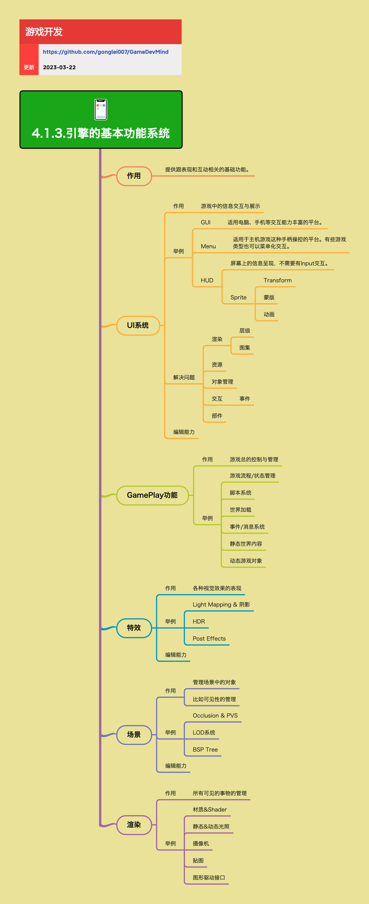

<h2 align="center">引擎的基本功能系统</h2>

游戏引擎为游戏内容制作和开发提供了一整套基础能力，本节聚焦那些「几乎所有项目都会用到」的核心系统：UI、GamePlay、特效、场景与渲染。重点是它们各自解决什么问题、在哪些地方会踩坑，以及在生产流程中的角色，而不是具体 API 细节。

**关键词:** 
*UI系统,GamePlay功能,特效,场景,渲染,可见性,事件系统,Shader*

**标签:** 
*等级: 中级, 阶段: 学习|开发, 分类: 生产能力, 角色: 客户端开发|美术*

## 图谱

## 总体作用

**是什么？在哪用？**

- **作用**：提供与「表现」和「互动」相关的基础功能，让美术和程序站在一个统一的技术地基上协作
- **应用场景**：
  - 游戏开发基础框架
  - 美术和程序协作
  - 工具链和自动化流程
- **做什么的？** 提供与「表现」和「互动」相关的基础功能，让美术和程序站在一个统一的技术地基上协作。

**会遇到哪些问题？用什么解决？**

- **如何复用成熟能力？**
  - **问题**：需要避免每个项目都从零搭建底层
  - **解决方向**：
    - **在生产中的意义：**
      - **复用成熟能力，避免每个项目都从零搭建底层：**
        - 使用成熟的游戏引擎
        - 复用引擎提供的功能系统
        - 建立项目通用框架
        - 提高开发效率
    - 选择合适的游戏引擎
    - 建立项目模板
    - 积累可复用组件

- **如何统一系统接口？**
  - **问题**：需要统一的系统接口便于工具链和自动化流程
  - **解决方向**：
    - **在生产中的意义：**
      - **通过统一的系统接口（UI、事件、渲染、场景等），让工具链和自动化流程更容易搭建：**
        - 定义统一的系统接口
        - 实现标准化的数据格式
        - 建立工具链框架
        - 实现自动化流程
    - 设计统一的接口规范
    - 实现工具链集成
    - 建立自动化流程

**要点和思考方向：**
- 引擎基本功能系统是游戏开发的基础
- 复用成熟能力提高开发效率
- 统一系统接口便于工具链和自动化
- 建立清晰的协作规范

## UI 系统

**是什么？在哪用？**

- **作用**：负责游戏中的信息展示与交互，是玩家与游戏交互的第一入口
- **应用场景**：
  - 游戏界面制作
  - 玩家交互
  - 信息展示
- **做什么的？** 负责游戏中的信息展示与交互，是玩家与游戏交互的第一入口。

**会遇到哪些问题？用什么解决？**

- **如何实现不同平台的UI？**
  - **问题**：不同平台需要不同的UI形式
  - **解决方向**：
    - **典型形式：**
      - **GUI：** 图形用户界面
        - **适用电脑、手机等交互能力丰富的平台：** 支持丰富的交互
          - 实现窗口、按钮、列表、提示等常规组件
          - 支持鼠标和触摸交互
        - **窗口、按钮、列表、提示等常规组件：** 标准UI组件
      - **Menu：** 菜单系统
        - **适用于主机游戏这种手柄操控的平台：** 手柄交互
          - 实现菜单化交互（如主菜单、模式选择、设置页）
          - 支持手柄导航
        - **有些游戏类型也可以采用菜单化交互（如主菜单、模式选择、设置页）：** 菜单化设计
      - **HUD（抬头显示）：** 抬头显示
        - **屏幕上的信息呈现，不需要有 Input 交互：** 信息展示
          - 实现血条、弹药数、小地图、状态图标等
          - 优化HUD性能
        - **例如血条、弹药数、小地图、状态图标等：** HUD元素
    - 实现平台适配
    - 实现输入映射
    - 优化UI性能

- **如何解决UI渲染问题？**
  - **问题**：UI渲染需要处理层级和图集管理
  - **解决方向**：
    - **渲染：**
      - **层级管理（谁在上、谁在下，避免遮挡错乱）：** UI层级管理
        - 实现层级系统
        - 实现层级排序
        - 避免遮挡错乱
      - **图集管理（减少 DrawCall，统一打包）：** 图集优化
        - 实现图集打包
        - 减少DrawCall
        - 优化渲染性能
    - 使用UI渲染优化技术
    - 实现批量渲染
    - 优化渲染流程

- **如何管理UI资源？**
  - **问题**：需要管理UI资源的加载和生命周期
  - **解决方向**：
    - **资源管理：UI 资源的加载、卸载、缓存策略**
      - 实现资源加载策略
      - 实现资源卸载机制
      - 实现资源缓存
      - 优化资源管理
    - 使用资源管理系统
    - 实现资源池
    - 优化内存使用

- **如何管理UI对象？**
  - **问题**：需要管理UI节点的创建和销毁
  - **解决方向**：
    - **对象管理：UI 节点的创建、销毁与复用（对象池）**
      - 实现对象池
      - 实现节点复用
      - 优化对象创建
      - 减少GC压力
    - 使用对象池模式
    - 优化对象生命周期
    - 减少内存分配

- **如何实现UI交互？**
  - **问题**：需要实现UI的交互功能
  - **解决方向**：
    - **交互：**
      - **事件系统（点击、拖拽、悬停、键盘/手柄输入映射）：** UI事件系统
        - 实现点击事件
        - 实现拖拽事件
        - 实现悬停事件
        - 实现输入映射
    - 使用事件系统
    - 实现输入处理
    - 优化交互响应

- **如何实现UI组件化？**
  - **问题**：需要实现可复用的UI组件
  - **解决方向**：
    - **部件化：**
      - **可复用组件（按钮、进度条、列表单元格等）：** UI组件系统
        - 实现可复用组件
        - 实现组件继承
        - 实现组件组合
        - 提高开发效率
    - 设计组件架构
    - 实现组件库
    - 建立组件规范

- **如何实现UI编辑能力？**
  - **问题**：需要提供UI编辑工具
  - **解决方向**：
    - **编辑能力：**
      - **可视化 UI 编辑器（所见即所得）：** UI编辑器
        - 实现可视化编辑
        - 实现实时预览
        - 提高制作效率
      - **布局系统（锚点、对齐、自动适配不同分辨率）：** 布局系统
        - 实现锚点系统
        - 实现对齐功能
        - 实现分辨率适配
        - 支持多分辨率
    - 使用可视化编辑器
    - 实现布局工具
    - 优化编辑体验

**要点和思考方向：**
- UI系统是玩家交互的第一入口
- 需要支持不同平台和输入方式
- 优化UI渲染和资源管理性能
- 实现组件化提高开发效率

## GamePlay 功能

**是什么？在哪用？**

- **作用**：负责游戏整体的控制与管理，是「游戏逻辑层」的核心能力
- **应用场景**：
  - 游戏逻辑实现
  - 游戏流程管理
  - 游戏状态管理
- **做什么的？** 负责游戏整体的控制与管理，是「游戏逻辑层」的核心能力。

**会遇到哪些问题？用什么解决？**

- **如何管理游戏流程和状态？**
  - **问题**：需要管理复杂的游戏流程和状态
  - **解决方向**：
    - **游戏流程 / 状态管理：**
      - **标题 → 登陆 → 大厅 → 战斗 → 结算 → 返回 等状态流转：** 状态流转
        - 实现状态机
        - 实现状态转换
        - 管理游戏流程
      - **支持暂停、恢复、重开等：** 游戏控制
        - 实现暂停功能
        - 实现恢复功能
        - 实现重开功能
    - 使用状态机模式
    - 实现流程管理
    - 优化状态切换

- **如何实现脚本系统？**
  - **问题**：需要支持脚本驱动的游戏逻辑
  - **解决方向**：
    - **脚本系统：**
      - **使用 Lua、C# 脚本等驱动游戏逻辑：** 脚本语言
        - 实现脚本引擎
        - 实现脚本绑定
        - 支持多种脚本语言
      - **支持热更或快速迭代：** 热更新
        - 实现脚本热更新
        - 实现快速迭代
        - 提高开发效率
    - 使用脚本引擎
    - 实现热更新机制
    - 优化脚本性能

- **如何实现世界加载？**
  - **问题**：需要高效加载场景和地图
  - **解决方向**：
    - **世界加载：**
      - **场景 / 地图的加载与卸载：** 场景管理
        - 实现场景加载
        - 实现场景卸载
        - 管理场景生命周期
      - **异步加载、分块加载、Streaming World 等：** 加载优化
        - 实现异步加载
        - 实现分块加载
        - 实现Streaming World
        - 优化加载性能
    - 使用异步加载
    - 实现加载优化
    - 优化内存使用

- **如何实现事件/消息系统？**
  - **问题**：需要实现模块间解耦
  - **解决方向**：
    - **事件 / 消息系统：**
      - **模块间解耦，通过消息或事件通知：** 事件系统
        - 实现事件系统
        - 实现消息系统
        - 实现模块解耦
      - **例如：角色死亡事件通知 UI、音效、任务系统：** 事件应用
        - 实现事件通知
        - 实现事件订阅
        - 优化事件性能
    - 使用观察者模式
    - 实现事件总线
    - 优化事件性能

- **如何管理世界内容？**
  - **问题**：需要管理静态和动态世界内容
  - **解决方向**：
    - **静态世界内容：**
      - **地图、机关、出生点、刷怪点等静态配置：** 静态内容
        - 实现配置系统
        - 实现静态对象管理
        - 优化静态内容加载
    - **动态游戏对象：**
      - **怪物、道具、可破坏物、NPC 等运行时生成的对象：** 动态对象
        - 实现对象生成
        - 实现对象管理
        - 实现对象池
        - 优化对象性能
    - 使用对象管理系统
    - 实现对象池
    - 优化对象性能

**要点和思考方向：**
- GamePlay功能是游戏逻辑层的核心
- 需要支持灵活的脚本系统和热更新
- 优化世界加载和对象管理性能
- 实现模块解耦提高可维护性

## 特效系统

**是什么？在哪用？**

- **作用**：负责各种视觉效果的表现，是「爽感」「反馈感」的重要来源
- **应用场景**：
  - 视觉效果制作
  - 游戏氛围营造
  - 玩家反馈
- **做什么的？** 负责各种视觉效果的表现，是「爽感」「反馈感」的重要来源。

**会遇到哪些问题？用什么解决？**

- **如何实现各种视觉效果？**
  - **问题**：需要实现各种视觉效果
  - **解决方向**：
    - **典型效果：**
      - **Light Mapping & 阴影：** 光照和阴影
        - 实现光照贴图
        - 实现阴影系统
        - 优化光照性能
      - **HDR：** 高动态范围
        - 实现HDR渲染
        - 实现色调映射
        - 优化HDR性能
      - **各类 Post Effects（后处理）：** 后处理效果
        - **Bloom：** 泛光效果
          - 实现泛光算法
          - 优化泛光性能
        - **色调映射：** 色调处理
          - 实现色调映射
          - 优化色调处理
        - **景深：** 景深效果
          - 实现景深算法
          - 优化景深性能
        - **运动模糊：** 运动模糊
          - 实现运动模糊
          - 优化模糊性能
        - **色偏：** 颜色偏移
          - 实现色偏效果
          - 优化色偏处理
    - 使用后处理管线
    - 优化特效性能
    - 实现特效LOD

- **如何实现特效编辑？**
  - **问题**：需要提供特效编辑工具
  - **解决方向**：
    - **编辑能力：**
      - **特效编辑器（粒子系统、轨迹、曲线控制）：** 特效编辑器
        - 实现粒子系统编辑器
        - 实现轨迹编辑器
        - 实现曲线控制
        - 提高制作效率
      - **与时间轴 / 动画系统联动（例如技能释放时的特效时序）：** 时间轴联动
        - 实现时间轴系统
        - 实现动画联动
        - 实现特效时序控制
    - 使用可视化编辑器
    - 实现时间轴系统
    - 优化编辑体验

**要点和思考方向：**
- 特效系统是游戏体验的重要来源
- 需要平衡视觉效果和性能
- 实现灵活的特效编辑工具
- 优化特效性能避免影响游戏流畅度

## 场景系统

**是什么？在哪用？**

- **作用**：管理场景中的对象与空间结构，是「世界」这一概念在引擎中的承载者
- **应用场景**：
  - 场景制作
  - 对象管理
  - 可见性管理
- **做什么的？** 管理场景中的对象与空间结构，是「世界」这一概念在引擎中的承载者。

**会遇到哪些问题？用什么解决？**

- **如何管理场景对象？**
  - **问题**：需要管理场景中的大量对象
  - **解决方向**：
    - **解决的问题：**
      - **管理场景中的对象（放置、启用/禁用、分组）：** 对象管理
        - 实现对象放置
        - 实现启用/禁用
        - 实现对象分组
        - 优化对象管理
    - 使用场景图
    - 实现对象索引
    - 优化查询性能

- **如何实现可见性管理？**
  - **问题**：需要管理对象的可见性以提高性能
  - **解决方向**：
    - **解决的问题：**
      - **可见性管理（哪些东西该被渲染，哪些可以被裁剪）：** 可见性系统
        - 实现视锥剔除
        - 实现遮挡剔除
        - 实现距离剔除
        - 优化渲染性能
    - **典型技术：**
      - **Occlusion & PVS：** 遮挡和可见性
        - **Occlusion Culling（遮挡剔除）：** 遮挡剔除
          - 实现遮挡检测
          - 实现遮挡剔除
          - 优化剔除性能
        - **PVS（Potentially Visible Set），预计算哪个区域能看到哪些物体：** 预计算可见集
          - 实现PVS预计算
          - 实现PVS查询
          - 优化PVS性能
      - **LOD 系统：** 细节层次
        - **不同距离使用不同精度模型/贴图：** LOD管理
          - 实现LOD系统
          - 实现LOD切换
          - 优化LOD性能
      - **BSP Tree 等空间划分结构：** 空间划分
        - **用于快速查询、碰撞检测和渲染裁剪：** 空间结构
          - 实现BSP树
          - 实现八叉树
          - 实现四叉树
          - 优化空间查询
    - 使用空间划分结构
    - 实现可见性优化
    - 优化渲染性能

- **如何实现场景编辑？**
  - **问题**：需要提供场景编辑工具
  - **解决方向**：
    - **编辑能力：**
      - **场景编辑器：支持摆放物体、设置区域、配置触发器：** 场景编辑器
        - 实现可视化编辑
        - 实现物体摆放
        - 实现区域设置
        - 实现触发器配置
      - **分层组织：方便大场景的管理与协作：** 分层管理
        - 实现分层系统
        - 实现协作管理
        - 优化大场景管理
    - 使用可视化编辑器
    - 实现分层管理
    - 优化编辑体验

**要点和思考方向：**
- 场景系统是游戏世界的承载者
- 需要优化可见性管理提高性能
- 实现灵活的场景编辑工具
- 支持大场景的管理和协作

## 渲染系统

**是什么？在哪用？**

- **作用**：负责所有可见事物的最终呈现，是基础中的基础
- **应用场景**：
  - 游戏画面渲染
  - 视觉效果呈现
  - 性能优化
- **做什么的？** 负责所有可见事物的最终呈现，是基础中的基础。

**会遇到哪些问题？用什么解决？**

- **如何实现材质和Shader系统？**
  - **问题**：需要实现灵活的材质和Shader系统
  - **解决方向**：
    - **材质 & Shader：**
      - **材质系统（PBR / 非 PBR）：** 材质系统
        - 实现PBR材质
        - 实现非PBR材质
        - 实现材质管理
        - 优化材质性能
      - **Shader 管线与可扩展机制（自定义 Shader、Shader Graph 等）：** Shader系统
        - 实现Shader管线
        - 实现自定义Shader
        - 实现Shader Graph
        - 支持Shader扩展
    - 使用Shader系统
    - 实现材质编辑器
    - 优化Shader性能

- **如何实现光照系统？**
  - **问题**：需要实现真实的光照效果
  - **解决方向**：
    - **光照：**
      - **静态光照（光照贴图、预计算 GI）：** 静态光照
        - 实现光照贴图
        - 实现预计算GI
        - 优化静态光照
      - **动态光照（动态阴影、实时反射等）：** 动态光照
        - 实现动态阴影
        - 实现实时反射
        - 优化动态光照性能
    - 使用光照系统
    - 实现光照优化
    - 平衡光照质量和性能

- **如何实现摄像机系统？**
  - **问题**：需要支持多种摄像机需求
  - **解决方向**：
    - **摄像机：**
      - **多摄像机支持（主摄像机、UI 摄像机、回放摄像机等）：** 多摄像机
        - 实现主摄像机
        - 实现UI摄像机
        - 实现回放摄像机
        - 管理多摄像机
      - **视口设置（分屏、画中画）：** 视口系统
        - 实现分屏
        - 实现画中画
        - 实现视口管理
    - 使用摄像机系统
    - 实现摄像机管理
    - 优化摄像机性能

- **如何管理贴图资源？**
  - **问题**：需要管理大量贴图资源
  - **解决方向**：
    - **贴图：**
      - **纹理导入、压缩、Mipmap、图集管理等：** 贴图管理
        - 实现纹理导入
        - 实现纹理压缩
        - 实现Mipmap
        - 实现图集管理
        - 优化贴图性能
    - 使用贴图管理系统
    - 实现自动压缩
    - 优化内存使用

- **如何封装图形驱动接口？**
  - **问题**：需要封装底层图形API
  - **解决方向**：
    - **图形驱动接口：**
      - **封装底层图形 API（如 DirectX / OpenGL / Vulkan / Metal 等）：** 图形API封装
        - 实现API抽象层
        - 支持多平台
        - 优化API调用
        - 提高跨平台兼容性
    - 使用图形抽象层
    - 实现平台适配
    - 优化API性能

- **如何与生产流程结合？**
  - **问题**：需要与生产流程结合
  - **解决方向**：
    - **与生产的关系：**
      - **决定了美术资源的技术规格（贴图格式、大小、Shader 限制等）：** 资源规格
        - 定义资源规格
        - 实现资源验证
        - 建立资源规范
      - **与性能优化高度相关（DrawCall、填充率、带宽等）：** 性能优化
        - 优化DrawCall
        - 优化填充率
        - 优化带宽
        - 实现性能监控
    - 建立资源规范
    - 实现性能优化
    - 建立性能监控

**要点和思考方向：**
- 渲染系统是游戏画面的基础
- 需要平衡视觉效果和性能
- 建立清晰的资源规格和规范
- 优化渲染性能保证游戏流畅度

## 更多资料