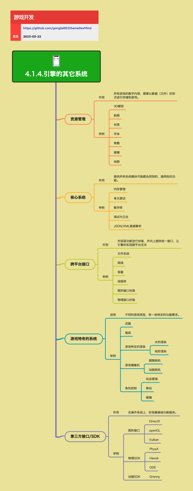

<h2 align="center">引擎的其它系统</h2>

除了渲染、场景、UI 等「看得见」的部分，引擎内部还有一批支撑性系统，负责资源管理、核心通用能力、跨平台封装以及与第三方 SDK 的衔接。这些系统决定了引擎和产品能否高效开发、稳定运行和长期演进。

**关键词:** 
*资源管理,核心系统,跨平台接口,第三方SDK,游戏特有系统*

**标签:** 
*等级: 中级, 阶段: 学习|开发, 分类: 生产能力, 角色: 客户端开发*

## 图谱

## 资源管理

**是什么？在哪用？**

- **作用**：管理所有游戏数字内容在磁盘和运行时中的组织、加载与生命周期
- **应用场景**：
  - 游戏资源加载
  - 资源生命周期管理
  - 资源打包和分发
  - 资源依赖管理
- **做什么的？** 管理所有游戏数字内容在磁盘和运行时中的组织、加载与生命周期。

**核心认识：**
- 所有游戏的数字内容，都要以数据（文件）的形式进行存储和使用
- 资源管理决定了项目的可维护性、加载性能和包体结构

**会遇到哪些问题？用什么解决？**

- **如何管理各种资源类型？**
  - **问题**：需要管理多种类型的游戏资源
  - **解决方向**：
    - **典型资源类型：**
      - **3D 模型：** 模型资源
        - 实现模型加载
        - 实现模型优化
        - 管理模型格式
      - **贴图：** 纹理资源
        - 实现贴图加载
        - 实现贴图压缩
        - 管理贴图格式
      - **材质：** 材质资源
        - 实现材质加载
        - 管理材质参数
        - 实现材质实例化
      - **字体：** 字体资源
        - 实现字体加载
        - 管理字体缓存
        - 支持动态字体
      - **骨骼：** 骨骼动画资源
        - 实现骨骼加载
        - 管理骨骼动画
        - 优化骨骼性能
      - **碰撞数据：** 碰撞体资源
        - 实现碰撞数据加载
        - 管理碰撞体类型
        - 优化碰撞性能
      - **地图 / 关卡数据：** 关卡资源
        - 实现关卡加载
        - 管理关卡数据
        - 实现关卡流式加载
    - 建立资源类型系统
    - 实现统一资源接口
    - 优化资源加载性能

- **如何建立资源规范？**
  - **问题**：需要统一的资源命名和目录规范
  - **解决方向**：
    - **生产视角的要点：**
      - **统一的资源命名与目录规范（方便工具和脚本自动处理）：** 资源规范
        - 建立命名规范
        - 建立目录结构
        - 实现自动化工具
        - 提高开发效率
    - 制定资源规范文档
    - 实现资源验证工具
    - 建立资源管理流程

- **如何管理资源依赖关系？**
  - **问题**：资源之间存在复杂的依赖关系
  - **解决方向**：
    - **生产视角的要点：**
      - **资源依赖关系管理（模型引用的材质、贴图、动画等）：** 依赖管理
        - 实现依赖分析
        - 实现依赖加载
        - 管理依赖关系
        - 优化依赖性能
    - 使用依赖图管理
    - 实现依赖预加载
    - 优化依赖加载顺序

- **如何实现资源打包？**
  - **问题**：需要支持多种打包格式
  - **解决方向**：
    - **生产视角的要点：**
      - **支持打 AssetBundle / Pak / 自定义包格式等打包流程：** 打包系统
        - 实现AssetBundle打包
        - 实现Pak打包
        - 支持自定义包格式
        - 优化打包流程
    - 使用打包工具
    - 实现增量打包
    - 优化包体大小

**要点和思考方向：**
- 资源管理是游戏开发的基础
- 建立统一的资源规范提高可维护性
- 优化资源加载性能影响游戏体验
- 管理资源依赖关系避免加载错误

## 核心系统

**是什么？在哪用？**

- **作用**：提供所有系统模块都可能用到的通用能力，是引擎的「基础库层」
- **应用场景**：
  - 所有系统模块的基础支撑
  - 通用功能实现
  - 开发工具支持
- **做什么的？** 提供所有系统模块都可能用到的通用能力，是引擎的「基础库层」。

**会遇到哪些问题？用什么解决？**

- **如何实现核心系统功能？**
  - **问题**：需要提供各种核心系统功能
  - **解决方向**：
    - **典型内容：**
      - **内存管理：** 内存管理系统
        - 实现内存分配
        - 实现内存回收
        - 实现内存池
        - 优化内存性能
      - **单元测试框架：** 测试框架
        - 实现测试框架
        - 支持单元测试
        - 支持集成测试
        - 提高代码质量
      - **数学库（向量、矩阵、四元数、随机数等）：** 数学库
        - 实现向量运算
        - 实现矩阵运算
        - 实现四元数运算
        - 实现随机数生成
        - 优化数学性能
      - **调试与日志系统：** 调试工具
        - 实现日志系统
        - 实现调试工具
        - 支持日志分级
        - 支持日志过滤
      - **JSON / XML 等数据解析：** 数据解析
        - 实现JSON解析
        - 实现XML解析
        - 支持其他数据格式
        - 优化解析性能
    - 建立核心系统库
    - 实现统一接口
    - 优化系统性能

- **如何建立日志规范？**
  - **问题**：需要统一的日志规范便于问题排查
  - **解决方向**：
    - **生产视角的要点：**
      - **统一的日志规范（等级、打点位置、输出格式），为线上问题排查提供基础：** 日志规范
        - 定义日志等级
        - 定义打点位置
        - 定义输出格式
        - 实现日志系统
        - 支持日志分析
    - 制定日志规范文档
    - 实现日志工具
    - 建立日志分析流程

- **如何提供数学库？**
  - **问题**：需要良好的数学库减少重复劳动
  - **解决方向**：
    - **生产视角的要点：**
      - **良好的数学库与工具，减少「各写一套数学函数」的重复劳动：** 数学库
        - 实现完整数学库
        - 提供数学工具
        - 优化数学性能
        - 提高开发效率
    - 使用成熟数学库
    - 实现数学工具集
    - 优化数学性能

- **如何实现单元测试？**
  - **问题**：需要单元测试框架降低演进风险
  - **解决方向**：
    - **生产视角的要点：**
      - **单元测试框架的存在，降低引擎和中间件演进的风险：** 测试框架
        - 实现测试框架
        - 支持自动化测试
        - 支持持续集成
        - 提高代码质量
    - 使用测试框架
    - 实现测试工具
    - 建立测试流程

**要点和思考方向：**
- 核心系统是引擎的基础库层
- 建立统一的规范和工具提高开发效率
- 优化核心系统性能影响整体性能
- 实现完善的测试框架保证代码质量

## 跨平台接口

**是什么？在哪用？**

- **作用**：对操作系统和底层库进行封装，向上提供统一接口，让引擎逻辑尽量不关心具体平台差异
- **应用场景**：
  - 多平台游戏开发
  - 跨平台发布
  - 底层库封装
- **做什么的？** 对操作系统和底层库进行封装，向上提供统一接口，让引擎逻辑尽量不关心具体平台差异。

**会遇到哪些问题？用什么解决？**

- **如何封装不同平台的功能？**
  - **问题**：需要封装不同平台的底层功能
  - **解决方向**：
    - **典型封装方向：**
      - **文件系统：** 文件系统封装
        - 实现统一文件接口
        - 封装平台差异
        - 支持异步IO
        - 优化文件性能
      - **网络：** 网络封装
        - 实现统一网络接口
        - 封装平台差异
        - 支持多协议
        - 优化网络性能
      - **容器 / 线程库：** 并发封装
        - 实现统一容器接口
        - 实现统一线程接口
        - 封装平台差异
        - 优化并发性能
      - **图形接口封装（统一 DirectX / OpenGL / Vulkan / Metal 等差异）：** 图形API封装
        - 实现图形抽象层
        - 统一图形接口
        - 封装API差异
        - 优化图形性能
      - **物理接口封装（对不同物理 SDK 的统一抽象）：** 物理API封装
        - 实现物理抽象层
        - 统一物理接口
        - 封装SDK差异
        - 优化物理性能
    - 设计抽象层架构
    - 实现平台适配层
    - 优化跨平台性能

- **如何实现接口统一？**
  - **问题**：需要让上层模块只依赖统一接口
  - **解决方向**：
    - **生产视角的要点：**
      - **让上层模块（渲染、物理、资源管理等）只依赖统一接口，可以在项目后期更换/升级底层实现：** 接口统一
        - 设计统一接口
        - 实现接口抽象
        - 支持接口替换
        - 提高可维护性
    - 使用接口设计模式
    - 实现依赖注入
    - 建立接口规范

- **如何简化多平台发布？**
  - **问题**：需要简化多平台发布流程
  - **解决方向**：
    - **生产视角的要点：**
      - **简化多平台发布流程（PC / 主机 / 移动端）的差异处理：** 多平台发布
        - 实现平台抽象
        - 实现构建系统
        - 实现自动化发布
        - 减少平台差异处理
    - 使用构建工具
    - 实现自动化流程
    - 建立发布规范

**要点和思考方向：**
- 跨平台接口是引擎可移植性的基础
- 设计良好的抽象层提高可维护性
- 优化跨平台性能影响游戏体验
- 简化多平台发布流程提高开发效率

## 游戏特有的系统

**是什么？在哪用？**

- **作用**：针对不同游戏类型定制的系统，通常建立在引擎通用能力之上
- **应用场景**：
  - 特定游戏类型开发
  - 游戏特色功能实现
  - 游戏玩法系统
- **做什么的？** 针对不同游戏类型定制的系统，通常建立在引擎通用能力之上。

**会遇到哪些问题？用什么解决？**

- **如何实现游戏特有系统？**
  - **问题**：需要实现各种游戏特有系统
  - **解决方向**：
    - **举例：**
      - **武器系统：** 武器系统
        - 实现武器管理
        - 实现武器属性
        - 实现武器切换
        - 优化武器性能
      - **载具系统：** 载具系统
        - 实现载具控制
        - 实现载具物理
        - 实现载具动画
        - 优化载具性能
      - **游戏特定的渲染：** 特殊渲染
        - **水的渲染：** 水体渲染
          - 实现水体效果
          - 实现水体物理
          - 优化水体性能
        - **地形渲染：** 地形渲染
          - 实现地形系统
          - 实现地形LOD
          - 优化地形性能
      - **游戏摄像机：** 摄像机系统
        - **跟随相机：** 跟随相机
          - 实现相机跟随
          - 实现相机平滑
          - 优化相机性能
        - **动画相机：** 动画相机
          - 实现相机动画
          - 实现相机控制
          - 优化相机性能
      - **角色控制：** 角色系统
        - **状态管理：** 状态管理
          - 实现状态机
          - 实现状态切换
          - 优化状态性能
        - **移动：** 移动系统
          - 实现角色移动
          - 实现移动控制
          - 优化移动性能
        - **碰撞：** 碰撞系统
          - 实现碰撞检测
          - 实现碰撞响应
          - 优化碰撞性能
    - 基于引擎通用能力
    - 实现游戏特有功能
    - 优化系统性能

- **如何沉淀可复用模块？**
  - **问题**：需要将通用部分抽象下沉
  - **解决方向**：
    - **思考方向：**
      - **这些系统有明显的「品类特性」，但内部也会沉淀可复用的引擎模块：** 模块沉淀
        - 识别通用功能
        - 抽象通用模块
        - 实现模块复用
        - 提高开发效率
    - 分析系统共性
    - 抽象通用模块
    - 建立模块库

- **如何形成游戏中间件？**
  - **问题**：需要在项目后期形成团队级中间件
  - **解决方向**：
    - **思考方向：**
      - **建议在项目后期将通用部分抽象下沉，形成团队级的「游戏中间件」：** 中间件建设
        - 识别通用部分
        - 抽象中间件
        - 实现中间件库
        - 建立中间件规范
    - 建立中间件架构
    - 实现中间件系统
    - 建立中间件规范

**要点和思考方向：**
- 游戏特有系统体现游戏特色
- 基于引擎通用能力实现
- 沉淀可复用模块提高效率
- 形成团队级中间件积累技术资产

## 第三方接口 / SDK

**是什么？在哪用？**

- **作用**：在操作系统之上，利用成熟的第三方库实现图形、物理、动画等基础功能服务
- **应用场景**：
  - 图形渲染
  - 物理模拟
  - 动画处理
  - 其他基础功能
- **做什么的？** 在操作系统之上，利用成熟的第三方库实现图形、物理、动画等基础功能服务。

**会遇到哪些问题？用什么解决？**

- **如何选择合适的SDK？**
  - **问题**：需要选择合适的第三方SDK
  - **解决方向**：
    - **举例：**
      - **图形接口：** 图形SDK
        - **DirectX：** DirectX图形API
          - Windows平台图形
          - 高性能渲染
          - 丰富的功能
        - **OpenGL：** OpenGL图形API
          - 跨平台图形
          - 广泛支持
          - 标准接口
        - **Vulkan：** Vulkan图形API
          - 低开销API
          - 多线程支持
          - 高性能渲染
      - **物理 SDK：** 物理引擎
        - **PhysX：** PhysX物理引擎
          - NVIDIA物理引擎
          - 高性能物理
          - 广泛使用
        - **Havok：** Havok物理引擎
          - 专业物理引擎
          - 高质量物理
          - 商业授权
        - **ODE：** ODE物理引擎
          - 开源物理引擎
          - 免费使用
          - 跨平台支持
      - **动画 SDK：** 动画引擎
        - **Granny：** Granny动画引擎
          - 专业动画引擎
          - 高质量动画
          - 商业授权
    - 评估SDK性能
    - 评估SDK稳定性
    - 评估许可协议
    - 评估平台支持
    - 评估社区活跃度

- **如何封装第三方SDK？**
  - **问题**：需要合理封装第三方SDK
  - **解决方向**：
    - **生产视角的要点：**
      - **通过合理的封装，让第三方 SDK 可被安全升级或替换：** SDK封装
        - 实现抽象层
        - 封装SDK接口
        - 支持SDK替换
        - 提高可维护性
    - 设计抽象接口
    - 实现适配层
    - 建立封装规范

- **如何选择SDK？**
  - **问题**：需要综合考虑多个因素选择SDK
  - **解决方向**：
    - **生产视角的要点：**
      - **在选择 SDK 时，综合考虑：性能、稳定性、许可协议、平台支持度与社区活跃度：** SDK选择
        - 评估性能指标
        - 评估稳定性
        - 评估许可协议
        - 评估平台支持
        - 评估社区活跃度
        - 综合评估选择
    - 建立评估标准
    - 实现评估流程
    - 建立选择规范

**要点和思考方向：**
- 第三方SDK提供成熟的基础功能
- 合理封装提高可维护性和可替换性
- 综合考虑多个因素选择合适SDK
- 建立SDK管理规范提高开发效率

## 更多资料