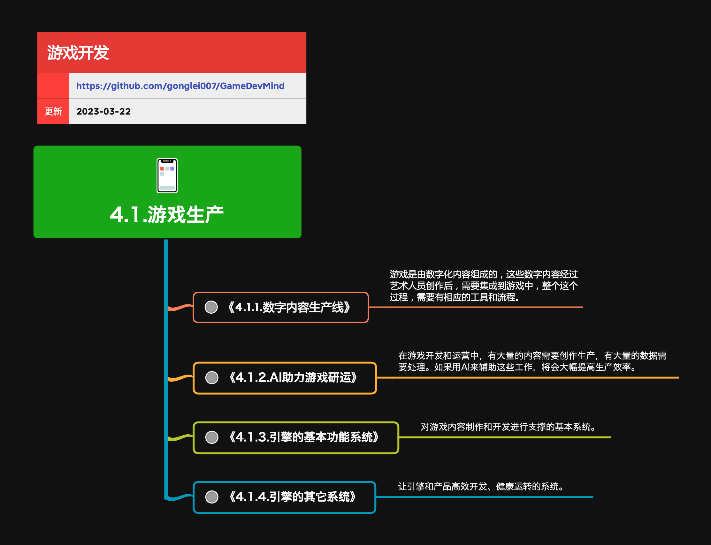

<h2 align="center">游戏生产</h2>

游戏产品规模越来越大、工业化程度越来越高。有强有力的工具支撑，会让生产效率十倍百倍的提升。

**关键词:** 
*Qt,编辑器*

**标签:** 
*等级: 中级, 阶段: 开发, 分类: 生产能力, 角色: 客户端开发|美术*

## 图谱

* [4.1.1.数字内容生产](4.1.1.数字内容生产.md)
* [4.1.2.AI助力游戏生产](4.1.2.AI助力游戏生产.md)
* [4.1.3.引擎的基本功能系统](4.1.3.引擎的基本功能系统.md)
* [4.1.4.引擎的其它系统](4.1.4.引擎的其它系统.md)
## 目录

- [更多资料](#更多资料)

----

## 更多资料
