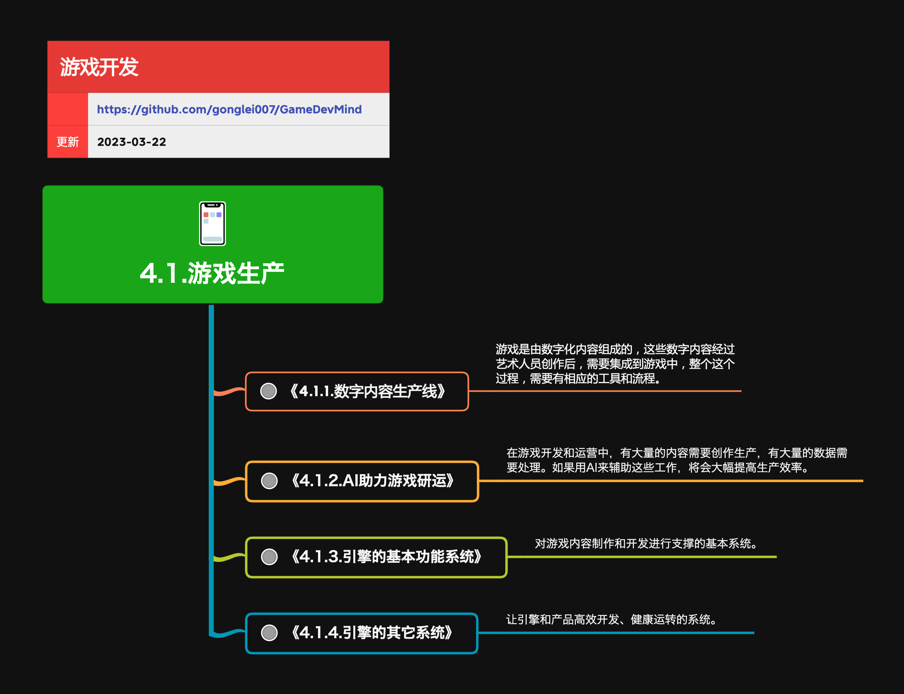

## 内容生产

游戏内容生产关注数字内容、配置数据和资产管线如何被稳定、高效地制作并进入项目。游戏引擎运行时功能属于技术能力；本模块关注内容如何被生产、检查、组织和复用。

**关键词:** 
*Qt,编辑器*

**标签:** 
*等级: 中级, 阶段: 开发, 分类: 生产能力, 角色: 客户端开发|美术*

## 图谱

* [4.1.1.数字内容生产](4.1.1.数字内容生产.md)
* [4.1.2.AI助力游戏生产](4.1.2.AI助力游戏生产.md)

> 游戏引擎功能系统参见 [2.1.客户端技术](../2.技术能力/2.1.客户端技术.md)。
## 目录

- [更多资料](#更多资料)

----

## 更多资料
