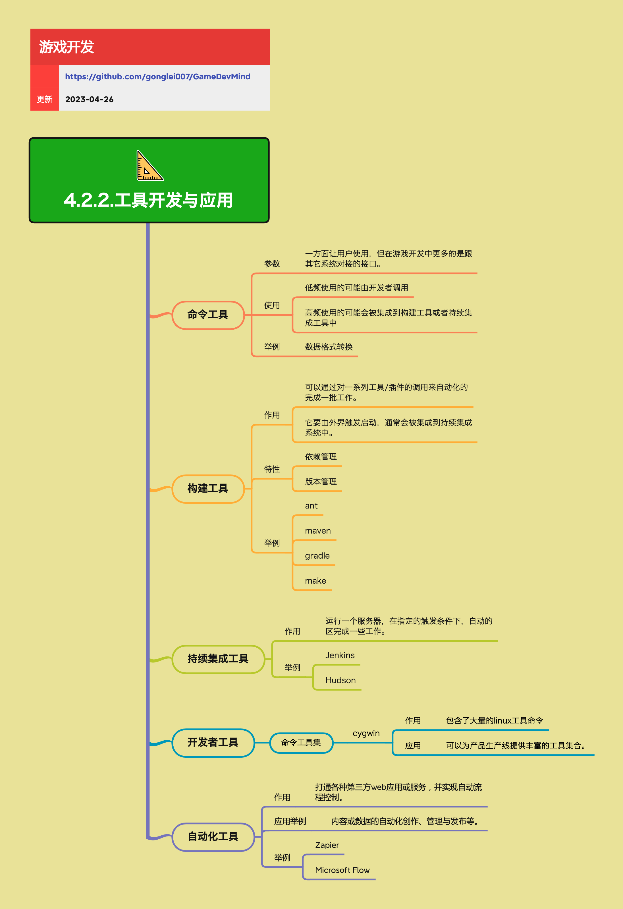

<h2 align="center">工具开发与应用</h2>

开发和应用合适的工具，可以让游戏生产效率成倍提升。本章节从命令行工具、构建工具、持续集成、开发者工具和自动化测试等角度，梳理一条贯穿整个生产流程的「工具链」思路。

**关键词:** 
*命令行工具,构建工具,持续集成,自动化测试,Zapier,cygwin*

**标签:** 
*等级: 中级, 阶段: 开发, 分类: 生产能力, 角色: 客户端开发|服务端开发|全栈开发*

## 图谱

## 命令工具

**是什么？在哪用？**

- **作用**：提供通过命令行调用的功能模块，一方面供开发者直接使用，更重要的是作为其它系统（构建系统、CI、脚本）的对接接口
- **应用场景**：
  - 开发者直接使用
  - 构建系统集成
  - CI/CD流程集成
  - 脚本自动化
- **做什么的？** 提供通过命令行调用的功能模块，一方面供开发者直接使用，更重要的是作为其它系统（构建系统、CI、脚本）的对接接口。

**会遇到哪些问题？用什么解决？**

- **如何设计命令工具？**
  - **问题**：需要设计清晰、稳定的命令接口
  - **解决方向**：
    - **要点与思考方向：**
      - **命令参数要清晰、稳定，适合被脚本和自动化工具调用：** 参数设计
        - 设计清晰的参数格式
        - 保持参数稳定性
        - 支持脚本调用
        - 实现参数验证
      - **可读的帮助信息（`--help`）、错误码设计，有利于集成与排查问题：** 帮助和错误处理
        - 实现帮助信息
        - 设计错误码
        - 实现错误提示
        - 提高可调试性
    - 设计命令接口规范
    - 实现参数解析
    - 实现错误处理

- **如何使用命令工具？**
  - **问题**：需要支持不同的使用方式
  - **解决方向**：
    - **使用方式：**
      - **低频使用：由开发者手动调用（本地调试、小批量处理）：** 手动调用
        - 实现交互式界面
        - 实现详细输出
        - 支持调试模式
      - **高频使用：被集成到构建工具或持续集成（CI）流程中，作为流水线步骤：** 自动化集成
        - 实现非交互模式
        - 实现静默模式
        - 实现返回码
        - 优化执行性能
    - 支持多种使用模式
    - 实现灵活的配置
    - 优化执行性能

- **如何实现命令工具功能？**
  - **问题**：需要实现各种命令工具功能
  - **解决方向**：
    - **举例：**
      - **数据格式转换脚本（如 Excel → JSON、JSON → 二进制配置）：** 数据转换
        - 实现格式转换
        - 实现批量处理
        - 优化转换性能
      - **资源检查工具（命名规范、引用完整性、尺寸/格式检查等）：** 资源检查
        - 实现规范检查
        - 实现完整性检查
        - 实现格式检查
        - 生成检查报告
    - 实现工具功能
    - 优化工具性能
    - 提供工具文档

**要点和思考方向：**
- 命令工具是工具链的基础组件
- 设计清晰的接口便于集成和使用
- 支持多种使用方式提高灵活性
- 优化工具性能保证执行效率

## 构建工具

**是什么？在哪用？**

- **作用**：通过对一系列工具 / 插件的编排调用，自动化完成一批构建和打包工作
- **应用场景**：
  - 项目构建
  - 打包发布
  - 自动化流程
  - CI/CD集成
- **做什么的？** 通过对一系列工具 / 插件的编排调用，自动化完成一批构建和打包工作。

**会遇到哪些问题？用什么解决？**

- **如何实现构建自动化？**
  - **问题**：需要自动化完成构建和打包工作
  - **解决方向**：
    - **生产视角：**
      - **通常由外界触发（命令行、CI、任务调度系统）：** 触发机制
        - 支持命令行触发
        - 支持CI触发
        - 支持任务调度
        - 实现触发接口
      - **常被集成到持续集成 / 持续交付（CI/CD）流水线中：** CI/CD集成
        - 实现CI集成
        - 实现CD集成
        - 实现流水线配置
        - 优化集成性能
    - 设计构建流程
    - 实现构建脚本
    - 优化构建性能

- **如何管理依赖？**
  - **问题**：需要管理复杂的依赖关系
  - **解决方向**：
    - **特性：**
      - **依赖管理：** 依赖系统
        - **管理不同模块 / 库之间的依赖关系：** 依赖关系
          - 实现依赖解析
          - 实现依赖管理
          - 管理依赖版本
        - **确保构建顺序正确：** 构建顺序
          - 实现依赖排序
          - 实现并行构建
          - 优化构建顺序
    - 使用依赖管理工具
    - 实现依赖解析
    - 优化依赖性能

- **如何管理版本？**
  - **问题**：需要对构建产物进行版本管理
  - **解决方向**：
    - **特性：**
      - **版本管理：** 版本系统
        - **对构建产物进行版本标记：** 版本标记
          - 实现版本生成
          - 实现版本标记
          - 管理版本信息
        - **与代码仓库版本联动（Tag、Branch 等）：** 版本联动
          - 实现Git集成
          - 实现版本同步
          - 管理版本关联
    - 实现版本管理系统
    - 实现版本标记
    - 优化版本管理

- **如何选择构建工具？**
  - **问题**：需要选择合适的构建工具
  - **解决方向**：
    - **常见工具举例：**
      - **ant：** Apache Ant
        - Java构建工具
        - XML配置
        - 跨平台支持
      - **maven：** Apache Maven
        - 项目管理和构建工具
        - 依赖管理
        - 插件系统
      - **gradle：** Gradle
        - 灵活的构建工具
        - Groovy/Kotlin DSL
        - 增量构建
      - **make：** Make
        - 传统构建工具
        - Makefile配置
        - 广泛支持
    - 评估工具特性
    - 评估项目需求
    - 选择合适工具

**要点和思考方向：**
- 构建工具是自动化流程的核心
- 实现完善的依赖管理保证构建正确性
- 实现版本管理便于追踪和管理
- 选择合适的构建工具提高开发效率

## 持续集成工具

**是什么？在哪用？**

- **作用**：运行一个长期在线的服务，在指定触发条件下（如代码提交、定时任务），自动完成构建、测试、部署等工作
- **应用场景**：
  - 自动化构建
  - 自动化测试
  - 自动化部署
  - 持续集成流程
- **做什么的？** 运行一个长期在线的服务，在指定触发条件下（如代码提交、定时任务），自动完成构建、测试、部署等工作。

**会遇到哪些问题？用什么解决？**

- **如何实现持续集成？**
  - **问题**：需要实现自动化构建、测试、部署流程
  - **解决方向**：
    - 实现触发机制
    - 实现构建流程
    - 实现测试流程
    - 实现部署流程
    - 优化CI性能

- **如何选择CI工具？**
  - **问题**：需要选择合适的CI工具
  - **解决方向**：
    - **举例：**
      - **Jenkins：** Jenkins CI
        - 开源CI工具
        - 丰富的插件
        - 广泛使用
      - **Hudson：** Hudson CI
        - 开源CI工具
        - Jenkins的前身
    - 评估工具特性
    - 评估项目需求
    - 选择合适工具

- **如何实现流水线？**
  - **问题**：需要将工具和脚本串联成流水线
  - **解决方向**：
    - **生产视角要点：**
      - **将「命令工具 + 构建脚本」串联起来形成固定流水线：** 流水线构建
        - 设计流水线流程
        - 实现工具串联
        - 实现流程配置
        - 优化流水线性能
    - 设计流水线架构
    - 实现流水线配置
    - 优化流水线性能

- **如何实现结果展示和通知？**
  - **问题**：需要对构建和测试结果进行展示和通知
  - **解决方向**：
    - **生产视角要点：**
      - **对每次构建与测试结果进行可视化展示与通知（邮件、IM、看板）：** 结果展示
        - 实现可视化展示
        - 实现邮件通知
        - 实现IM通知
        - 实现看板展示
    - 实现结果展示系统
    - 实现通知机制
    - 优化展示性能

**要点和思考方向：**
- 持续集成工具是自动化流程的核心
- 实现完善的流水线提高开发效率
- 实现结果展示和通知便于问题追踪
- 选择合适的CI工具满足项目需求

## 开发者工具

**是什么？在哪用？**

- **作用**：为开发者提供一套丰富的命令行环境和工具集合
- **应用场景**：
  - 开发环境
  - 脚本编写
  - 自动化流程
  - 跨平台开发
- **做什么的？** 为开发者提供一套丰富的命令行环境和工具集合。

**会遇到哪些问题？用什么解决？**

- **如何提供工具集合？**
  - **问题**：需要提供丰富的工具集合
  - **解决方向**：
    - **命令工具集：**
      - **举例：**
        - **cygwin：** Cygwin工具集
          - **作用：包含大量 Linux 工具命令：** Linux工具
            - 提供Linux工具
            - 跨平台支持
            - 丰富的命令集
          - **应用：可以为产品生产线提供丰富的工具集合，方便编写跨平台脚本与自动化流程：** 跨平台脚本
            - 支持跨平台脚本
            - 支持自动化流程
            - 提高开发效率
    - 选择合适的工具集
    - 实现工具集成
    - 优化工具性能

- **如何统一工具环境？**
  - **问题**：需要统一团队的工具环境
  - **解决方向**：
    - **思考方向：**
      - **尽量统一团队使用的基础工具集合（Shell、Python 版本、命令工具等）：** 工具统一
        - 统一Shell版本
        - 统一Python版本
        - 统一命令工具
        - 建立工具规范
    - 建立工具规范
    - 实现环境配置
    - 建立工具文档

- **如何降低使用门槛？**
  - **问题**：需要降低工具使用门槛
  - **解决方向**：
    - **思考方向：**
      - **通过脚本封装复杂命令，降低使用门槛：** 脚本封装
        - 实现脚本封装
        - 实现命令简化
        - 提供使用文档
        - 提高易用性
    - 实现脚本库
    - 提供使用文档
    - 优化使用体验

**要点和思考方向：**
- 开发者工具是开发效率的基础
- 统一工具环境提高协作效率
- 通过脚本封装降低使用门槛
- 选择合适的工具集满足开发需求

## 测试自动化

**是什么？在哪用？**

- **作用**：用自动化方式替代大量重复的手工测试工作，提升效率和质量
- **应用场景**：
  - 功能测试
  - 回归测试
  - 性能测试
  - 兼容性测试
- **做什么的？** 用自动化方式替代大量重复的手工测试工作，提升效率和质量。

**会遇到哪些问题？用什么解决？**

- **如何实现测试自动化？**
  - **问题**：需要实现自动化测试
  - **解决方向**：
    - 实现测试框架
    - 实现测试脚本
    - 实现测试执行
    - 实现测试报告
    - 优化测试性能

- **如何提高测试效率？**
  - **问题**：需要提高测试效率
  - **解决方向**：
    - **带来的价值：**
      - **提高效率：** 效率提升
        - **自动执行测试用例，减少手动测试工作量：** 自动化执行
          - 实现自动化执行
          - 减少手动工作
          - 提高执行效率
        - **在较短时间内执行大量测试案例：** 批量测试
          - 实现批量执行
          - 实现并行测试
          - 优化测试性能
    - 实现自动化测试框架
    - 实现并行测试
    - 优化测试性能

- **如何确保测试质量？**
  - **问题**：需要确保测试质量
  - **解决方向**：
    - **带来的价值：**
      - **确保质量：** 质量保证
        - **确保各功能和模块在不同平台和环境下的稳定性和一致性：** 稳定性测试
          - 实现多平台测试
          - 实现环境测试
          - 确保一致性
        - **重复执行相同测试，保证版本间行为一致：** 回归测试
          - 实现回归测试
          - 确保行为一致
          - 提高测试可靠性
    - 实现多平台测试
    - 实现回归测试
    - 优化测试覆盖

- **如何提高测试可靠性？**
  - **问题**：需要提高测试可靠性
  - **解决方向**：
    - **带来的价值：**
      - **提高可靠性：** 可靠性提升
        - **减少人为错误，提高测试准确性和可靠性：** 准确性提升
          - 减少人为错误
          - 提高测试准确性
          - 提高可靠性
        - **精确模拟用户操作和各种场景：** 场景模拟
          - 实现场景模拟
          - 实现用户操作模拟
          - 提高测试真实性
    - 实现自动化测试
    - 实现场景模拟
    - 优化测试准确性

- **如何加速发布周期？**
  - **问题**：需要加速发布周期
  - **解决方向**：
    - **带来的价值：**
      - **加速发布周期：** 发布加速
        - **每次代码更改后自动执行测试，快速反馈问题：** 快速反馈
          - 实现自动测试
          - 实现快速反馈
          - 缩短反馈时间
        - **缩短测试周期，加速版本发布：** 周期缩短
          - 缩短测试周期
          - 加速版本发布
          - 提高发布效率
    - 实现持续测试
    - 实现快速反馈
    - 优化测试流程

- **如何降低长期成本？**
  - **问题**：需要降低长期成本
  - **解决方向**：
    - **带来的价值：**
      - **降低长期成本：** 成本降低
        - **初期需要投入编写和维护脚本，但长期可明显减少测试人力成本：** 成本优化
          - 初期投入脚本开发
          - 长期减少人力成本
          - 提高投资回报
    - 实现测试脚本复用
    - 实现测试维护
    - 优化测试成本

- **如何选择测试工具？**
  - **问题**：需要选择合适的测试工具
  - **解决方向**：
    - **工具举例：**
      - **appium：** Appium测试工具
        - **开源自动化工具，使用 WebDriver 在 Android 或 iOS 上运行脚本和测试：** 移动测试
          - 支持Android测试
          - 支持iOS测试
          - 使用WebDriver
        - **支持原生应用、移动 Web 应用和混合应用：** 应用类型
          - 支持原生应用
          - 支持Web应用
          - 支持混合应用
    - 评估工具特性
    - 评估项目需求
    - 选择合适工具

**要点和思考方向：**
- 测试自动化是质量保证的重要手段
- 提高测试效率和质量
- 选择合适的测试工具满足项目需求
- 平衡初期投入和长期收益

## 其它自动化工具

**是什么？在哪用？**

- **作用**：打通各种第三方 Web 应用或服务，串联形成自动流程
- **应用场景**：
  - 工作流自动化
  - 服务集成
  - 通知自动化
  - 数据自动化
- **做什么的？** 打通各种第三方 Web 应用或服务，串联形成自动流程。

**会遇到哪些问题？用什么解决？**

- **如何实现服务集成？**
  - **问题**：需要集成各种第三方服务
  - **解决方向**：
    - 实现服务接口
    - 实现服务连接
    - 实现数据转换
    - 优化集成性能

- **如何实现自动化流程？**
  - **问题**：需要实现自动化工作流
  - **解决方向**：
    - **应用举例：**
      - **内容或数据的自动化创作、管理与发布：** 内容自动化
        - **如：生成报表后自动发送邮件 / 推送到 IM 群：** 通知自动化
          - 实现报表生成
          - 实现邮件发送
          - 实现IM推送
          - 实现自动化流程
        - **构建完成后自动通知相关负责人并附带链接：** 构建通知
          - 实现构建监控
          - 实现自动通知
          - 实现链接生成
          - 实现通知分发
    - 设计工作流
    - 实现流程自动化
    - 优化流程性能

- **如何选择自动化工具？**
  - **问题**：需要选择合适的自动化工具
  - **解决方向**：
    - **工具举例：**
      - **Zapier：** Zapier自动化平台
        - 工作流自动化平台
        - 丰富的服务集成
        - 易于使用
      - **Microsoft Flow（现 Power Automate）：** Power Automate
        - Microsoft自动化平台
        - Office 365集成
        - 企业级功能
    - 评估工具特性
    - 评估服务支持
    - 选择合适工具

**要点和思考方向：**
- 自动化工具提高工作效率
- 实现服务集成形成自动化流程
- 选择合适的工具满足业务需求
- 优化自动化流程提高效率

## 更多资料