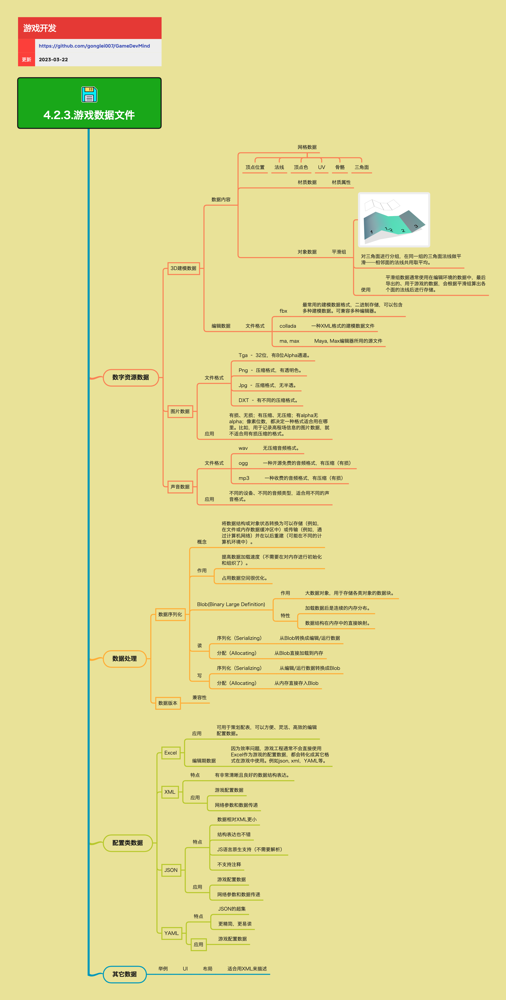

<h2 align="center">游戏数据文件</h2>

游戏开发中涉及各种格式文件的读写，有些数据是内容工具方定义的，有些数据是大家常用的标准格式，有些数据是游戏中自定义的。不同的数据对结构化、解析、存取速度等的需求不同。本章节更关注「如何为不同用途选对数据格式和处理方式」，而不是教具体文件规格。

**关键词:** 
*序列化,Blob,配置数据,资源格式,版本兼容*

**标签:** 
*等级: 中级, 阶段: 开发, 分类: 生产能力, 角色: 客户端开发|服务端开发*

## 图谱

## 数字资源数据

### 3D 建模数据

**是什么？在哪用？**

- **作用**：描述 3D 模型在引擎中的几何与材质信息
- **应用场景**：
  - 3D模型导入
  - 模型渲染
  - 模型编辑
- **做什么的？** 描述 3D 模型在引擎中的几何与材质信息。

**会遇到哪些问题？用什么解决？**

- **如何管理3D模型数据？**
  - **问题**：需要管理复杂的3D模型数据
  - **解决方向**：
    - **数据内容：**
      - **网格数据：** 几何数据
        - **顶点位置：** 顶点坐标
          - 存储顶点位置
          - 优化顶点数据
        - **法线：** 法线向量
          - 存储法线信息
          - 计算法线
        - **顶点色：** 顶点颜色
          - 存储顶点颜色
          - 优化颜色数据
        - **UV：** UV坐标
          - 存储UV坐标
          - 优化UV数据
        - **骨骼权重：** 骨骼动画
          - 存储骨骼权重
          - 优化骨骼数据
        - **三角面索引：** 面索引
          - 存储面索引
          - 优化索引数据
      - **材质数据：** 材质信息
        - **材质属性（颜色、金属度、粗糙度等）：** 材质参数
          - 存储材质属性
          - 管理材质数据
      - **对象数据：** 对象信息
        - **平滑组：** 平滑处理
          - **对三角面进行分组，在同一组的三角面上法线做平滑（相邻面的法线取平均）：** 平滑计算
            - 实现平滑组
            - 计算平滑法线
          - **平滑组数据通常仅存在于编辑环境；导出到游戏使用的数据，一般已经根据平滑组计算好每个顶点/面的法线：** 数据转换
            - 编辑期保留平滑组
            - 运行时使用计算后的法线
    - 设计数据格式
    - 实现数据管理
    - 优化数据性能

- **如何选择数据格式？**
  - **问题**：需要选择合适的3D模型数据格式
  - **解决方向**：
    - **编辑期数据格式：**
      - **fbx：** FBX格式
        - **最常用的建模数据格式，二进制存储，可包含多种建模数据：** 格式特性
          - 二进制格式
          - 支持多种数据
          - 性能较好
        - **可兼容多种 DCC 编辑器：** 兼容性
          - 支持多种编辑器
          - 广泛使用
      - **collada：** Collada格式
        - **一种 XML 格式的建模数据文件：** XML格式
          - XML格式
          - 可读性好
          - 跨平台
      - **ma / max：** 编辑器格式
        - **Maya / 3ds Max 编辑器的源文件格式：** 编辑器格式
          - 编辑器原生格式
          - 保留编辑信息
    - 评估格式特性
    - 评估兼容性
    - 选择合适格式

**要点和思考方向：**
- 3D建模数据是游戏资源的重要组成部分
- 选择合适的格式平衡性能和兼容性
- 优化数据格式提高加载性能
- 管理数据版本保证兼容性

### 图片数据

**是什么？在哪用？**

- **作用**：为模型、UI、特效等提供纹理与贴图
- **应用场景**：
  - 模型贴图
  - UI纹理
  - 特效贴图
  - 背景图片
- **做什么的？** 为模型、UI、特效等提供纹理与贴图。

**会遇到哪些问题？用什么解决？**

- **如何选择图片格式？**
  - **问题**：需要选择合适的图片格式
  - **解决方向**：
    - **常见格式：**
      - **TGA – 32 位，有 8 位 Alpha 通道：** TGA格式
        - 32位色深
        - 支持Alpha通道
        - 无压缩
        - 适合高质量贴图
      - **PNG – 压缩格式，有透明色：** PNG格式
        - 无损压缩
        - 支持透明
        - 适合UI和图标
      - **JPG – 压缩格式，无半透明：** JPG格式
        - 有损压缩
        - 文件小
        - 适合照片和背景
      - **DXT – 多种 GPU 友好压缩格式：** DXT格式
        - GPU友好
        - 压缩率高
        - 适合运行时使用
    - 评估格式特性
    - 评估应用场景
    - 选择合适格式

- **如何应用图片数据？**
  - **问题**：需要根据应用场景选择合适的格式
  - **解决方向**：
    - **应用要点：**
      - **有损 vs 无损、有压缩 vs 无压缩、有 Alpha vs 无 Alpha、像素位数：** 格式选择
        - 评估质量需求
        - 评估文件大小
        - 评估Alpha需求
        - 评估像素位数
      - **例如：用于记录高度场信息的贴图，一般不适合用有损压缩格式：** 特殊应用
        - 高度场需要无损格式
        - 避免数据损失
        - 保证精度
    - 根据应用场景选择格式
    - 优化图片质量
    - 优化文件大小

**要点和思考方向：**
- 图片数据是游戏视觉表现的基础
- 根据应用场景选择合适的格式
- 平衡图片质量和文件大小
- 优化图片加载性能

### 声音数据

**是什么？在哪用？**

- **作用**：为游戏提供音效与背景音乐
- **应用场景**：
  - 背景音乐
  - 音效
  - 语音
  - 环境音
- **做什么的？** 为游戏提供音效与背景音乐。

**会遇到哪些问题？用什么解决？**

- **如何选择音频格式？**
  - **问题**：需要选择合适的音频格式
  - **解决方向**：
    - **常见格式：**
      - **WAV：无压缩音频格式，音质好，体积较大：** WAV格式
        - 无压缩
        - 音质好
        - 体积大
        - 适合短音效
      - **OGG：开源免费的有损压缩音频格式：** OGG格式
        - 开源免费
        - 有损压缩
        - 体积小
        - 适合BGM和语音
      - **MP3：常见有损压缩音频格式（注意部分平台上的授权与专利问题）：** MP3格式
        - 有损压缩
        - 广泛支持
        - 注意授权问题
        - 适合BGM
    - 评估格式特性
    - 评估授权问题
    - 选择合适格式

- **如何应用音频数据？**
  - **问题**：需要根据应用场景选择合适的格式和码率
  - **解决方向**：
    - **应用要点：**
      - **不同设备、不同类型音频（BGM、语音、短音效）适合不同格式和码率：** 应用场景
        - BGM使用压缩格式
        - 语音使用中等码率
        - 短音效使用高质量格式
        - 根据设备选择码率
    - 根据应用场景选择格式
    - 优化音频质量
    - 优化文件大小

**要点和思考方向：**
- 声音数据是游戏体验的重要组成部分
- 根据应用场景选择合适的格式和码率
- 注意音频格式的授权问题
- 优化音频加载和播放性能

## 数据处理

### 数据序列化

**是什么？在哪用？**

- **作用**：将数据结构或对象状态转换为可以存储（文件或内存缓冲区）或传输（网络）的形式，并在以后重建（可能在不同的计算机环境中）
- **应用场景**：
  - 数据存储
  - 数据加载
  - 网络传输
  - 数据持久化
- **概念：** 将数据结构或对象状态转换为可以存储（文件或内存缓冲区）或传输（网络）的形式，并在以后重建（可能在不同的计算机环境中）。

**会遇到哪些问题？用什么解决？**

- **如何实现数据序列化？**
  - **问题**：需要实现高效的数据序列化
  - **解决方向**：
    - **作用：**
      - **提高数据加载速度：加载后可以直接使用，不必再进行复杂解析与初始化：** 加载优化
        - 实现快速加载
        - 减少解析时间
        - 优化初始化
      - **更优化的数据空间占用：** 空间优化
        - 优化数据格式
        - 减少空间占用
        - 提高存储效率
    - 设计序列化格式
    - 实现序列化算法
    - 优化序列化性能

**要点和思考方向：**
- 数据序列化是数据存储和传输的基础
- 优化序列化格式提高加载速度
- 优化数据空间占用减少存储成本
- 实现高效的序列化算法

### Blob（Binary Large Object）

**是什么？在哪用？**

- **作用**：作为大数据对象，用于存储各类对象的数据块
- **应用场景**：
  - 大数据存储
  - 快速加载
  - 内存映射
- **做什么的？** 作为大数据对象，用于存储各类对象的数据块。

**会遇到哪些问题？用什么解决？**

- **如何实现Blob存储？**
  - **问题**：需要实现高效的Blob存储
  - **解决方向**：
    - **特性：**
      - **加载数据后是连续的内存分布：** 连续内存
        - 实现连续内存分配
        - 优化内存布局
        - 提高访问性能
      - **数据结构在内存中的直接映射（结构体布局与文件布局一致）：** 直接映射
        - 实现结构体映射
        - 优化内存布局
        - 提高加载速度
    - 设计Blob格式
    - 实现内存映射
    - 优化加载性能

- **如何实现Blob读写？**
  - **问题**：需要实现高效的Blob读写流程
  - **解决方向**：
    - **读流程：**
      - **序列化（Serializing）：从 Blob 转换成编辑 / 运行时数据：** 反序列化
        - 实现反序列化
        - 转换数据格式
      - **分配（Allocating）：从 Blob 直接加载到内存：** 内存分配
        - 实现直接加载
        - 优化内存分配
    - **写流程：**
      - **序列化（Serializing）：从编辑 / 运行时数据转换成 Blob：** 序列化
        - 实现序列化
        - 转换数据格式
      - **分配（Allocating）：从内存直接存入 Blob：** 内存存储
        - 实现直接存储
        - 优化内存使用
    - 实现读写流程
    - 优化读写性能
    - 实现错误处理

**要点和思考方向：**
- Blob是高效数据存储的重要方式
- 实现连续内存分布提高访问性能
- 实现直接映射减少转换开销
- 优化读写流程提高性能

### 数据版本

**是什么？在哪用？**

- **作用**：保证数据结构升级时仍能兼容旧版本
- **应用场景**：
  - 数据格式升级
  - 版本兼容
  - 数据迁移
- **做什么的？** 保证数据结构升级时仍能兼容旧版本。

**会遇到哪些问题？用什么解决？**

- **如何实现版本兼容？**
  - **问题**：需要实现数据格式版本兼容
  - **解决方向**：
    - **要点：**
      - **在二进制格式中加入版本号与兼容处理逻辑：** 版本管理
        - 实现版本号
        - 实现兼容处理
        - 实现版本检测
      - **对新增字段采用默认值策略，避免旧数据崩溃：** 默认值策略
        - 实现默认值
        - 处理缺失字段
        - 避免数据崩溃
    - 设计版本系统
    - 实现兼容处理
    - 实现数据迁移

**要点和思考方向：**
- 数据版本管理是长期维护的基础
- 实现版本号便于版本识别
- 实现兼容处理保证向后兼容
- 使用默认值策略避免数据崩溃

## 配置类数据

### Excel

**是什么？在哪用？**

- **作用**：策划配表的主战场，方便、灵活、高效地编辑配置数据
- **应用场景**：
  - 策划配表
  - 数据编辑
  - 数据管理
- **作用：** 策划配表的主战场，方便、灵活、高效地编辑配置数据。

**会遇到哪些问题？用什么解决？**

- **如何使用Excel数据？**
  - **问题**：需要将Excel数据转换为游戏可用格式
  - **解决方向**：
    - **编辑期数据：**
      - **游戏工程通常不会直接使用 Excel 作为运行时配置数据：** 数据转换
        - 不直接使用Excel
        - 需要格式转换
      - **一般会导出为 JSON、XML、YAML 或自定义二进制格式再在游戏中使用：** 导出格式
        - 导出为JSON
        - 导出为XML
        - 导出为YAML
        - 导出为二进制格式
    - 实现数据导出工具
    - 实现格式转换
    - 优化转换性能

**要点和思考方向：**
- Excel是策划配表的主要工具
- 需要将Excel数据转换为游戏可用格式
- 选择合适的导出格式平衡性能和可读性
- 实现自动化导出流程提高效率

### XML

**是什么？在哪用？**

- **作用**：结构化的数据格式，适合表达层级关系
- **应用场景**：
  - 游戏配置数据
  - 网络参数和数据传递
  - 配置文件
- **特点：** 结构表达清晰且层级明确。

**会遇到哪些问题？用什么解决？**

- **如何应用XML？**
  - **问题**：需要选择合适的应用场景
  - **解决方向**：
    - **应用：**
      - **游戏配置数据：** 配置数据
        - 实现XML解析
        - 实现配置加载
      - **网络参数和数据传递：** 网络数据
        - 实现XML序列化
        - 实现网络传输
    - 实现XML解析器
    - 实现XML序列化
    - 优化解析性能

**要点和思考方向：**
- XML适合表达层级结构
- 结构清晰但文件较大
- 选择合适的应用场景
- 优化解析性能

### JSON

**是什么？在哪用？**

- **作用**：轻量级的数据交换格式，广泛使用
- **应用场景**：
  - 游戏配置数据
  - 网络参数和数据传递
  - API数据交换
- **特点：** 相对 XML 数据更小，结构表达也不错，JS 语言原生支持（无需解析库），不支持注释。

**会遇到哪些问题？用什么解决？**

- **如何应用JSON？**
  - **问题**：需要选择合适的应用场景
  - **解决方向**：
    - **特点：**
      - **相对 XML 数据更小：** 文件大小
        - 文件更小
        - 传输更快
      - **结构表达也不错：** 结构表达
        - 结构清晰
        - 易于理解
      - **JS 语言原生支持（无需解析库）：** 原生支持
        - JS原生支持
        - 无需额外库
      - **不支持注释：** 限制
        - 不支持注释
        - 需要其他方式记录说明
    - **应用：**
      - **游戏配置数据：** 配置数据
        - 实现JSON解析
        - 实现配置加载
      - **网络参数和数据传递：** 网络数据
        - 实现JSON序列化
        - 实现网络传输
    - 实现JSON解析器
    - 实现JSON序列化
    - 优化解析性能

**要点和思考方向：**
- JSON是广泛使用的数据格式
- 文件小、结构清晰
- JS原生支持便于Web开发
- 不支持注释需要注意

### YAML

**是什么？在哪用？**

- **作用**：人类可读的数据序列化格式，适合配置文件
- **应用场景**：
  - 游戏配置数据（尤其是需要人手编辑的配置）
  - 配置文件
  - 文档配置
- **特点：** JSON 的超集，更精简，更易读。

**会遇到哪些问题？用什么解决？**

- **如何应用YAML？**
  - **问题**：需要选择合适的应用场景
  - **解决方向**：
    - **特点：**
      - **JSON 的超集：** 格式特性
        - 支持JSON特性
        - 扩展功能
      - **更精简，更易读：** 可读性
        - 更易读
        - 更易编辑
    - **应用：**
      - **游戏配置数据（尤其是需要人手编辑的配置）：** 配置数据
        - 实现YAML解析
        - 实现配置加载
        - 适合人工编辑
    - 实现YAML解析器
    - 实现YAML序列化
    - 优化解析性能

**要点和思考方向：**
- YAML适合需要人工编辑的配置
- 可读性好，易于编辑
- 选择合适的应用场景
- 优化解析性能

## 其它数据

### UI 数据

**是什么？在哪用？**

- **作用**：描述UI布局和组件信息
- **应用场景**：
  - UI布局
  - UI组件配置
  - UI样式
- **举例：** 布局信息：适合用 XML / JSON / 自定义格式来描述；与引擎 UI 系统结合（组件树、样式、绑定关系等）。

**会遇到哪些问题？用什么解决？**

- **如何管理UI数据？**
  - **问题**：需要管理UI布局和组件数据
  - **解决方向**：
    - **举例：**
      - **布局信息：适合用 XML / JSON / 自定义格式来描述：** 布局格式
        - 使用XML格式
        - 使用JSON格式
        - 使用自定义格式
        - 实现布局解析
      - **与引擎 UI 系统结合（组件树、样式、绑定关系等）：** UI系统集成
        - 实现组件树
        - 实现样式系统
        - 实现绑定关系
        - 优化UI性能
    - 设计UI数据格式
    - 实现UI数据解析
    - 优化UI加载性能

**要点和思考方向：**
- UI数据是UI系统的基础
- 选择合适的格式描述UI布局
- 与引擎UI系统结合提高效率
- 优化UI数据加载性能

## 更多资料
* [Serialization For Games](https://jorenjoestar.github.io/post/serialization_for_games/)