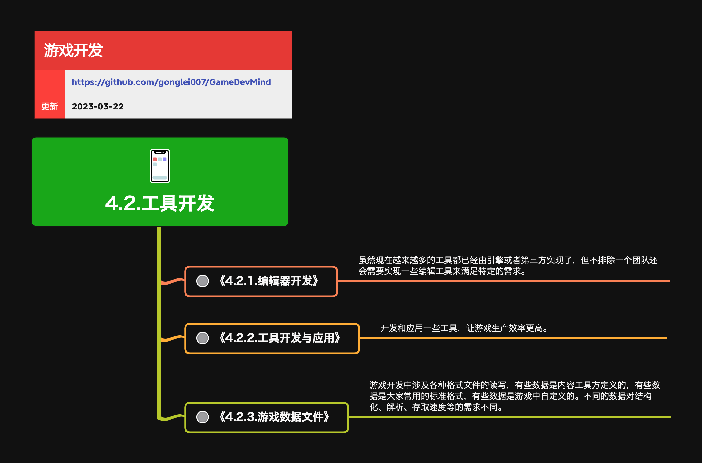

## 工具开发

有效的工具能让游戏开发过程更高效，特定的项目往往需要定制开发一些帮助生产的工具。

**关键词:** 
*游戏引擎,Unity3D,Unreal Engine,Asset,Plugin,ECS*

**标签:** 
*等级: 中级|高级, 阶段: 开发, 分类: 生产能力, 角色: 客户端开发*

## 图谱

* [4.2.1.编辑器开发](4.2.1.编辑器开发.md)
* [4.2.2.工具开发与应用](4.2.2.工具开发与应用.md)
* [4.2.3.游戏数据文件](4.2.3.游戏数据文件.md)

> **分层边界：** 使用 IDE、调试器、抓包器等现成工具属于 [2.3.开发者工具箱](../2.技术能力/2.3.开发者工具箱.md)；为项目定制编辑器、数据转换、校验和自动化工具属于本模块。
