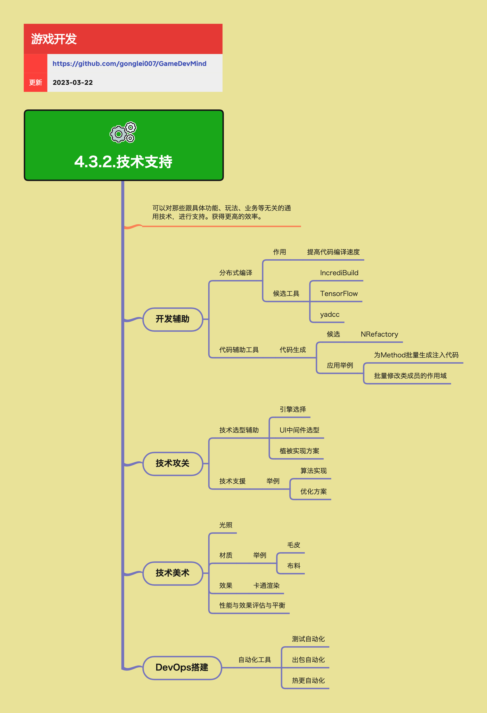

<h2 align="center">技术支持</h2>

一个项目团队，无论是美术、策划还是程序，都可能会有一些非业务型的技术支持需求，让产品开发更有保障和效率。本章节聚焦那些「跨项目、跨角色」的通用技术支持工作，例如开发辅助、技术攻关、技术美术和 DevOps 搭建。

**关键词:** 
*开发辅助,技术攻关,技术美术,DevOps*

**标签:** 
*等级: 中级|高级, 阶段: 开发, 分类: 生产能力, 角色: 客户端开发|服务端开发|美术*

## 图谱

## 开发辅助

### 分布式编译

**做什么的？**  
通过分布式编译来提高代码编译速度，缩短开发反馈周期。

**要点：**
- 将编译任务分发到多台机器并行处理
- 对大型 C++/多平台项目尤为关键

**候选工具：**
- IncrediBuild  
- yadcc 等

### 代码辅助工具

**做什么的？**  
通过工具自动生成或批量修改代码，减少机械性工作与手误。

**典型能力：**
- 代码生成：
  - 为 Method 批量生成注入代码（如日志、监控、权限校验等）
  - 批量修改类成员的作用域

**候选：**
- NRefactory 等代码分析 / 生成框架

## 技术攻关

### 技术选型辅助

**做什么的？**  
在关键技术选型上提供调研、验证与决策支持。

**常见议题：**
- 引擎选择（自研 / Unity / Unreal 等）
- UI 中间件选型
- 植被实现方案（如 SpeedTree、自研植被系统等）

### 技术支援

**做什么的？**  
为项目组在特定技术难点上提供支持。

**举例：**
- 算法实现（如寻路、匹配、推荐等）
- 性能优化方案（如渲染优化、内存优化等）

## 技术美术（TA）

**做什么的？**  
连接程序与美术，在「效果与性能」之间寻找平衡。

### 典型工作方向

- **光照：**  
  - 光照方案选型与烘焙流程（静态光照、实时光照、混合光照）
- **材质：**  
  - 如毛皮、布料等特殊材质的实现与优化
- **效果：**  
  - 卡通渲染等风格化渲染方案
- **性能与效果评估与平衡：**  
  - 为不同平台/档位制定表现与性能的平衡策略

## DevOps 搭建

**做什么的？**  
为项目搭建完整的开发运维（DevOps）体系，让开发、测试、发布尽可能自动化与可观测。

### 自动化工具

**典型自动化方向：**
- 测试自动化
- 出包自动化
- 热更自动化

**思考方向：**
- 将自动化流程沉淀为可配置的流水线，而不是一次性脚本

## 子主题
