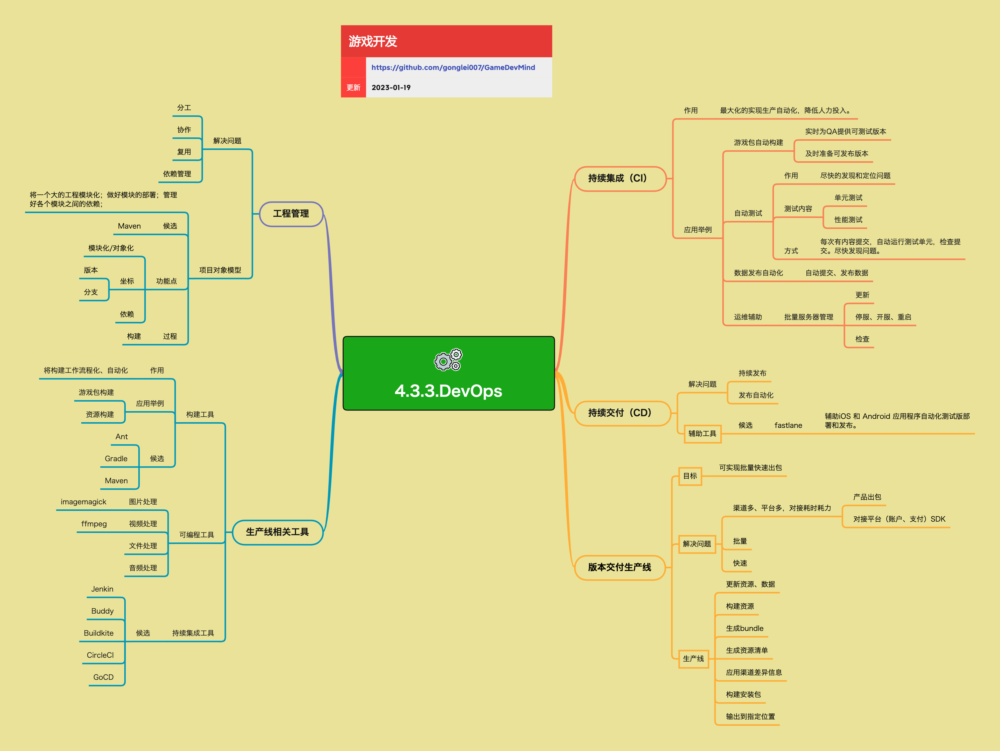

<h2 align="center">DevOps</h2>

在游戏开发过程中，要不断地出数据和产品的版本来进行测试、调试和发布，这些过程如果全部依赖人工操作是非常低效且容易出错的。
通过建设 DevOps 体系（CI/CD、版本生产线、工程管理等），可以用自动化工具链和规范化流程，大幅提升项目的生产效率和稳定性。

**关键词:** 
*CI,CD,DevOps,Maven,Jenkins,出包生产线,工程管理*

**标签:** 
*等级: 中级|高级, 阶段: 开发, 分类: 生产能力, 角色: 客户端开发|服务端开发|运维*

## 图谱

## 持续集成（CI）

**是什么？在哪用？**

- **作用**：最大化地实现生产自动化，降低人力投入，让每次提交都尽快得到「可运行、可测试」的反馈
- **应用场景**：
  - 自动化构建
  - 自动化测试
  - 自动化发布
  - 提高开发效率
- **做什么的？** 最大化地实现生产自动化，降低人力投入，让每次提交都尽快得到「可运行、可测试」的反馈。

**会遇到哪些问题？用什么解决？**

- **如何实现持续集成？**
  - **问题**：需要实现自动化生产流程
  - **解决方向**：
    - **应用举例：**
      - **游戏包自动构建：** 自动构建
        - **实时为 QA 提供可测试版本：** QA版本
          - 实现自动构建
          - 实现版本分发
          - 优化构建性能
        - **及时准备可发布版本：** 发布版本
          - 实现发布版本构建
          - 实现版本归档
          - 优化构建流程
      - **自动测试：** 自动化测试
        - **作用：尽快发现和定位问题：** 问题发现
          - 实现自动测试
          - 实现问题定位
          - 优化测试流程
        - **测试内容：单元测试、性能测试等：** 测试类型
          - 实现单元测试
          - 实现性能测试
          - 实现其他测试
        - **方式：每次有内容提交，自动运行测试单元，检查提交，尽快发现问题：** 测试触发
          - 实现自动触发
          - 实现测试执行
          - 实现结果反馈
      - **数据发布自动化：** 数据自动化
        - **自动提交、发布配置、活动表、资源清单等：** 数据发布
          - 实现自动提交
          - 实现配置发布
          - 实现资源发布
      - **运维辅助：** 运维自动化
        - **批量服务器管理（更新、停服、开服、重启、检查等）：** 服务器管理
          - 实现批量操作
          - 实现服务器管理
          - 优化运维效率
    - 设计CI流程
    - 实现自动化工具
    - 优化CI性能

**要点和思考方向：**
- 持续集成是提高开发效率的重要手段
- 实现自动化减少人力投入
- 快速反馈提高问题发现速度
- 持续优化CI流程提高效率

## 持续交付（CD）

**是什么？在哪用？**

- **作用**：保证代码从提交到交付测试 / 上线之间的流程尽可能自动化和可重复
- **应用场景**：
  - 自动化交付
  - 自动化发布
  - 提高发布效率
  - 降低发布风险
- **做什么的？** 保证代码从提交到交付测试 / 上线之间的流程尽可能自动化和可重复。

**会遇到哪些问题？用什么解决？**

- **如何实现持续交付？**
  - **问题**：需要实现自动化交付流程
  - **解决方向**：
    - **典型目标：**
      - **持续发布：** 发布流程
        - **代码提交后，可以自动 / 手动触发出包，交付 QA 进行测试：** 测试版本
          - 实现自动触发
          - 实现手动触发
          - 实现出包流程
          - 实现QA交付
        - **批量出正式发布版本并归档：** 正式版本
          - 实现批量出包
          - 实现版本归档
          - 优化出包流程
      - **发布自动化：** 自动化发布
        - **尽量减少人工干预步骤，降低出错概率：** 减少人工
          - 实现自动化流程
          - 减少人工步骤
          - 降低出错概率
    - 设计CD流程
    - 实现自动化工具
    - 优化CD性能

- **如何选择辅助工具？**
  - **问题**：需要选择合适的辅助工具
  - **解决方向**：
    - **辅助工具：**
      - **候选：**
        - **fastlane：辅助 iOS 和 Android 应用程序自动化测试版部署和发布：** fastlane工具
          - iOS自动化
          - Android自动化
          - 测试版部署
          - 发布自动化
    - 评估工具特性
    - 评估项目需求
    - 选择合适工具

**要点和思考方向：**
- 持续交付是提高发布效率的重要手段
- 实现自动化流程减少人工干预
- 降低出错概率提高发布质量
- 选择合适的工具提高效率

## 版本交付生产线

**是什么？在哪用？**

- **作用**：搭建一条「可以实现批量快速出包」的统一生产线
- **应用场景**：
  - 批量出包
  - 多渠道支持
  - 多平台支持
  - 提高出包效率
- **做什么的？** 搭建一条「可以实现批量快速出包」的统一生产线。

**会遇到哪些问题？用什么解决？**

- **如何解决多渠道多平台问题？**
  - **问题**：渠道多、平台多，对接耗时耗力
  - **解决方向**：
    - **解决的问题：**
      - **渠道多、平台多，对接耗时耗力：** 多渠道问题
        - **产品出包：** 出包流程
          - 实现统一出包流程
          - 实现多渠道支持
          - 优化出包效率
        - **对接平台（账户、支付）SDK：** 平台对接
          - 实现平台SDK对接
          - 实现统一接口
          - 优化对接流程
      - **需要做到：** 目标要求
        - **批量：** 批量处理
          - 实现批量出包
          - 实现批量处理
        - **快速：** 快速处理
          - 优化出包速度
          - 优化处理性能
    - 设计统一生产线
    - 实现多渠道支持
    - 优化出包性能

- **如何实现生产线流程？**
  - **问题**：需要实现完整的生产线流程
  - **解决方向**：
    - **典型生产线流程：**
      - **更新资源、数据：** 资源更新
        - 实现资源更新
        - 实现数据更新
      - **构建资源：** 资源构建
        - 实现资源构建
        - 优化构建性能
      - **生成 bundle：** Bundle生成
        - 实现Bundle生成
        - 优化生成性能
      - **生成资源清单：** 清单生成
        - 实现清单生成
        - 优化清单管理
      - **应用渠道差异信息：** 渠道差异
        - 实现渠道差异应用
        - 实现差异管理
      - **构建安装包：** 安装包构建
        - 实现安装包构建
        - 优化构建性能
      - **输出到指定位置（本地或制品仓库）：** 输出管理
        - 实现本地输出
        - 实现制品仓库输出
        - 优化输出流程
    - 设计生产线流程
    - 实现流程步骤
    - 优化流程性能

**要点和思考方向：**
- 版本交付生产线是批量出包的基础
- 解决多渠道多平台问题
- 实现批量快速出包
- 持续优化生产线流程

## 生产线相关工具

### 构建工具

**是什么？在哪用？**

- **作用**：将构建工作流程化、自动化
- **应用场景**：
  - 游戏包构建
  - 资源构建
  - 自动化构建
- **作用：** 将构建工作流程化、自动化。

**会遇到哪些问题？用什么解决？**

- **如何选择构建工具？**
  - **问题**：需要选择合适的构建工具
  - **解决方向**：
    - **应用举例：**
      - **游戏包构建：** 游戏包
        - 实现游戏包构建
        - 优化构建性能
      - **资源构建：** 资源构建
        - 实现资源构建
        - 优化构建性能
    - **候选：**
      - **Ant：** Apache Ant
        - Java构建工具
        - XML配置
        - 跨平台支持
      - **Gradle：** Gradle
        - 灵活的构建工具
        - Groovy/Kotlin DSL
        - 增量构建
      - **Maven：** Apache Maven
        - 项目管理和构建工具
        - 依赖管理
        - 插件系统
    - 评估工具特性
    - 评估项目需求
    - 选择合适工具

**要点和思考方向：**
- 构建工具是生产线的基础
- 选择合适的工具提高构建效率
- 实现流程化和自动化
- 持续优化构建性能

### 可编程工具

**是什么？在哪用？**

- **作用**：为生产线提供灵活的、可脚本化的处理能力
- **应用场景**：
  - 资源处理
  - 文件处理
  - 自动化处理
- **做什么的？** 为生产线提供灵活的、可脚本化的处理能力。

**会遇到哪些问题？用什么解决？**

- **如何选择可编程工具？**
  - **问题**：需要选择合适的可编程工具
  - **解决方向**：
    - **举例：**
      - **图片处理：imagemagick：** ImageMagick
        - 图片处理工具
        - 支持多种格式
        - 脚本化处理
      - **视频处理：ffmpeg：** FFmpeg
        - 视频处理工具
        - 支持多种格式
        - 脚本化处理
      - **文件处理：grep 等：** 文件工具
        - 文件搜索工具
        - 文本处理工具
        - 脚本化处理
      - **音频处理：各类音频批处理工具：** 音频工具
        - 音频处理工具
        - 批处理支持
        - 脚本化处理
    - 评估工具特性
    - 评估处理需求
    - 选择合适工具

**要点和思考方向：**
- 可编程工具提供灵活的处理能力
- 选择合适的工具满足处理需求
- 实现脚本化处理提高效率
- 持续优化处理性能

### 持续集成工具

**是什么？在哪用？**

- **作用**：运行一个长期在线的服务，在指定触发条件下（如代码提交、定时任务），自动完成构建、测试、部署等工作
- **应用场景**：
  - 自动化构建
  - 自动化测试
  - 自动化部署
  - 持续集成流程
- **候选：** Jenkins、Buddy、Buildkite、CircleCI、GoCD 等。

**会遇到哪些问题？用什么解决？**

- **如何选择CI工具？**
  - **问题**：需要选择合适的CI工具
  - **解决方向**：
    - **候选：**
      - **Jenkins：** Jenkins CI
        - 开源CI工具
        - 丰富的插件
        - 广泛使用
      - **Buddy：** Buddy CI
        - 云CI工具
        - 易于使用
        - 快速构建
      - **Buildkite：** Buildkite CI
        - 云CI工具
        - 灵活的配置
        - 高性能
      - **CircleCI：** CircleCI
        - 云CI工具
        - 快速构建
        - 易于集成
      - **GoCD：** GoCD CI
        - 开源CI工具
        - 流水线可视化
        - 灵活的配置
    - 评估工具特性
    - 评估项目需求
    - 选择合适工具

**要点和思考方向：**
- 持续集成工具是自动化流程的核心
- 选择合适的工具满足项目需求
- 实现完善的CI流程
- 持续优化CI性能

## 工程管理

**是什么？在哪用？**

- **作用**：通过合理的工程管理和依赖管理，解决大项目中的分工、协作、复用与依赖问题
- **应用场景**：
  - 大型项目管理
  - 模块化管理
  - 依赖管理
  - 团队协作
- **做什么的？** 通过合理的工程管理和依赖管理，解决大项目中的分工、协作、复用与依赖问题。

**会遇到哪些问题？用什么解决？**

- **如何实现工程管理？**
  - **问题**：需要解决大项目中的管理问题
  - **解决方向**：
    - **典型关注点：**
      - **分工：** 分工管理
        - 实现模块分工
        - 实现职责划分
        - 优化分工效率
      - **协作：** 协作管理
        - 实现团队协作
        - 实现沟通机制
        - 优化协作效率
      - **复用：** 复用管理
        - 实现代码复用
        - 实现模块复用
        - 优化复用效率
      - **依赖管理：** 依赖管理
        - 实现依赖解析
        - 实现依赖管理
        - 优化依赖性能
    - 设计工程管理架构
    - 实现管理机制
    - 优化管理效率

- **如何实现项目对象模型？**
  - **问题**：需要实现模块化工程管理
  - **解决方向**：
    - **项目对象模型：**
      - **做什么的？将一个大的工程模块化；做好模块的部署；管理好各个模块之间的依赖：** 模块化管理
        - 实现工程模块化
        - 实现模块部署
        - 实现依赖管理
      - **候选：**
        - **Maven 等：** Maven工具
          - 项目对象模型
          - 依赖管理
          - 构建管理
      - **功能点：**
        - **模块化 / 对象化：** 模块化
          - 实现模块划分
          - 实现对象化
        - **坐标：** 坐标系统
          - **版本：** 版本管理
            - 实现版本控制
            - 实现版本管理
          - **分支：** 分支管理
            - 实现分支管理
            - 实现分支控制
        - **依赖描述与管理：** 依赖管理
          - 实现依赖描述
          - 实现依赖管理
        - **构建与发布流程定义：** 流程定义
          - 实现构建流程
          - 实现发布流程
    - 设计项目对象模型
    - 实现模块化管理
    - 优化管理效率

**要点和思考方向：**
- 工程管理是大型项目的基础
- 实现模块化管理提高可维护性
- 实现依赖管理保证项目稳定
- 持续优化工程管理效率

## 更多资料
### 视频资料
* [Setting Up a Build Server for Unity with Jenkins](https://www.youtube.com/watch?v=4J3SmhGxO1Y) - 一个关于如何用Jenkins搭建一个Unity项目构建服务器。
* [Unite 2015 - Continuous Integration with Unity](https://www.youtube.com/watch?v=kSXomLkMR68) - 了解设置与 Unity 持续集成的步骤，包括源代码控制、使用 Unity Cloud Build、使用 Unity 测试工具进行测试、将构建分发到 HockeyApp 或 Dropbox 等服务、使用 FAKE 编写命令行构建脚本以及升级到您自己的 CI 服务器与 TeamCity 一起用于更高级的场景。
