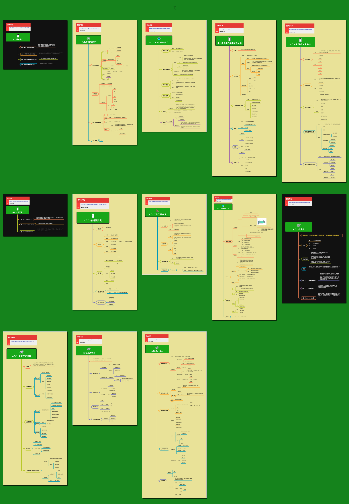

<h2 align="center">管理能力</h2>

管理中最具挑战的是尺度、分寸与随机应变。 
火候少一分，生了；火候多一分，焦了。 
追求的是复杂的事情简单化，面对的也可能是简单的事情复杂化。

## 目录

* [4.1.游戏生产](4.1.游戏生产.md)
  * [4.1.1.数字内容生产](4.1.1.数字内容生产.md)
  * [4.1.2.AI助力游戏研运](4.1.2.AI助力游戏生产.md)
  * [4.1.3.引擎的基本功能系统](4.1.3.引擎的基本功能系统.md)
  * [4.1.4.引擎的其它系统](4.1.4.引擎的其它系统.md)
* [4.2.工具开发](4.2.工具开发.md)
  * [4.2.1.编辑器开发](4.2.1.编辑器开发.md)
  * [4.2.2.工具开发与应用](4.2.2.工具开发与应用.md)
  * [4.2.3.游戏数据文件](4.2.3.游戏数据文件.md)
* [4.3.技术中台](4.3.技术中台.md)
  * [4.3.1.快速开发框架](4.3.1.快速开发框架.md)
  * [4.3.2.技术支持](4.3.2.技术支持.md)
  * [4.3.3.DevOps](4.3.3.DevOps.md)

 

## 预览

