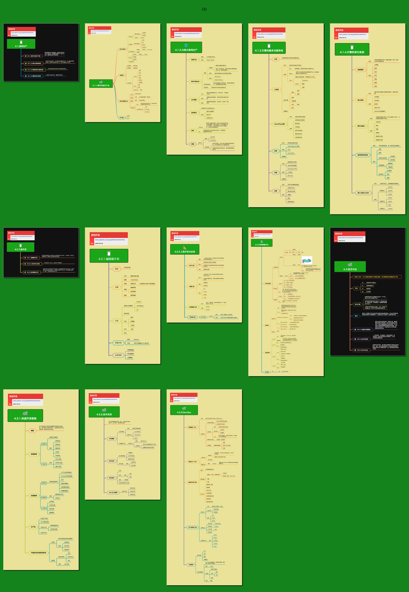

## 生产能力

生产能力关注游戏的工业化生产链：如何让内容、数据、代码和版本可重复、可检查、可追踪地批量生产。它包含内容管线、编辑器、工具与自动化、技术中台和交付生产线，不再承载游戏运行时技术本身。

**关键词:** 
*游戏生产,数字内容,工具开发,编辑器,技术中台,DevOps,快速开发框架*

**标签:** 
*等级: 中级|高级, 阶段: 开发, 分类: 生产能力, 角色: 客户端开发|服务端开发|美术|工具开发*

## 目录

* [4.1.内容生产](4.1.游戏生产.md)
  * [4.1.1.数字内容生产](4.1.1.数字内容生产.md)
  * [⭕ 4.1.2.AI助力游戏生产](4.1.2.AI助力游戏生产.md)
* [4.2.工具开发](4.2.工具开发.md)
  * [4.2.1.编辑器开发](4.2.1.编辑器开发.md)
  * [4.2.2.工具开发与应用](4.2.2.工具开发与应用.md)
  * [4.2.3.游戏数据文件](4.2.3.游戏数据文件.md)
* [4.3.技术中台](4.3.技术中台.md)
  * [4.3.1.快速开发框架](4.3.1.快速开发框架.md)
  * [4.3.2.技术支持](4.3.2.技术支持.md)
  * [4.3.3.DevOps](4.3.3.DevOps.md)

> **分层边界：** 游戏引擎的运行时功能系统已归入 [2.1.客户端技术](../2.技术能力/2.1.客户端技术.md)。本模块只保留引擎对内容制作、资产处理、编辑器扩展和版本生产的支撑能力。

 

----

## 预览

