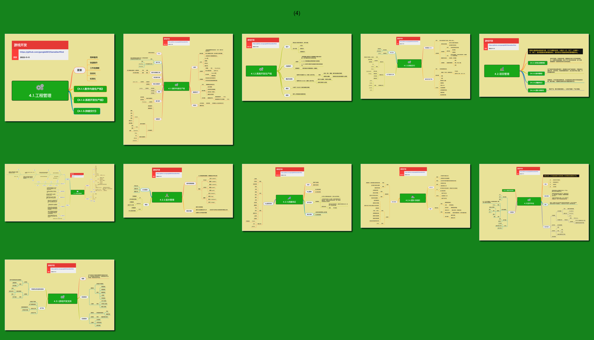

<h2 align="center">管理能力</h2>

管理中最具挑战的是尺度、分寸与随机应变。 
火候少一分，生了；火候多一分，焦了。 
追求的是复杂的事情简单化，面对的也可能是简单的事情复杂化。

## 目录

* [4.1.工程管理](4.1.工程管理.md)
    * [4.1.1.数字内容生产线](4.1.1.数字内容生产线.md)
    * [4.1.2.系统开发生产线](4.1.2.系统开发生产线.md)
    * [4.1.3.DevOps](4.1.3.DevOps.md)
    * [4.1.4.开发工作流](4.1.4.开发工作流.md)
* [4.2.项目管理](4.2.项目管理.md)
    * [4.2.1.项目里程](4.2.1.项目里程.md)
    * [4.2.2.版本管理](4.2.2.版本管理.md)
    * [4.2.3.质量保证](4.2.3.质量保证.md)
    * [4.2.4.团队与组织](4.2.4.团队与组织.md)
    * [4.2.5.SCRUM](4.2.5.SCRUM.md)
    * [4.2.6.团队管理](4.2.6.团队管理.md)
    * [4.2.7.项目管理综合](4.2.7.项目管理综合.md)
* [4.3.技术中台](4.3.技术中台.md)
    * [4.3.1.快速开发框架](4.3.1.快速开发框架.md)
    * [4.3.2.技术支持](4.3.2.技术支持.md)

 

## 预览

