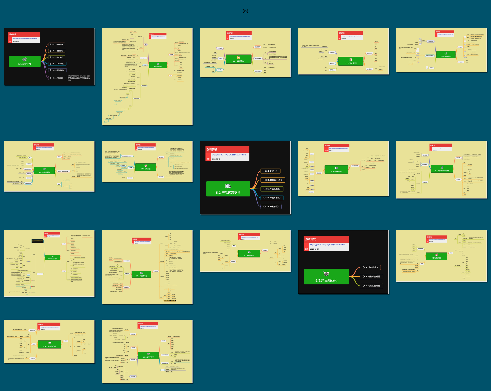

<h2 align="center">商品化能力</h2>
<p>
作为一个组织，不论你有什么样的技术或能力，一个最重要的目标是——赚钱。<br/>
在当下的市场环境下，一款好玩的游戏做出来了不一定就能够赚钱。<br/>
还需要有一系列商品化能力，才能让产品运转和盈利，让团队持续存活。<br/>

```/* 这里只展示跟技术有关的那些事情 */```
</p>

## 目录

* [5.1.运维技术](mds/5.1.运维技术.md)
    * [5.1.1.网络维护](mds/5.1.1.网络维护.md)
    * [5.1.2.数据存储](mds/5.1.2.数据存储.md)
    * [5.1.3.资产管理](mds/5.1.3.资产管理.md)
    * [5.1.4.Linux系统](mds/5.1.4.Linux系统.md)
    * [5.1.5.中间件](mds/5.1.5.中间件.md)
    * [5.1.6.网络安全](mds/5.1.6.网络安全.md)
* [5.2.产品运营支持](mds/5.2.产品运营支持.md)
    * [5.2.1.GM后台](mds/5.2.1.GM后台.md)
    * [5.2.2.数据统计分析](mds/5.2.2.数据统计分析.md)
    * [5.2.3.产品热更新](mds/5.2.3.产品热更新.md)
    * [5.2.4.产品本地化](mds/5.2.4.产品本地化.md)
    * [5.2.5.开发配合](mds/5.2.5.开发配合.md)
* [5.3.产品商业化](mds/5.3.产品商业化.md)
    * [5.3.1.游戏安全](mds/5.3.1.游戏安全.md)
    * [5.3.2.帐号与支付](mds/5.3.2.帐号与支付.md)
<br/>

## 预览



