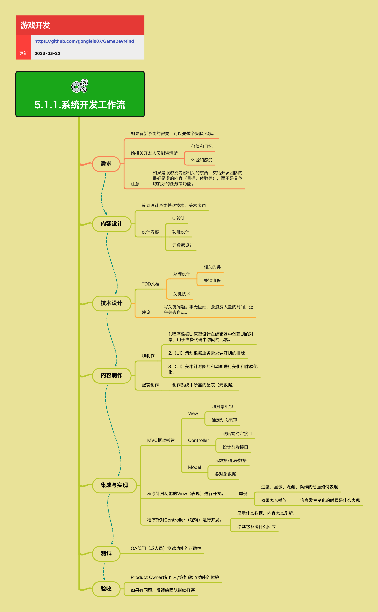

<h2 align="center">系统开发工作流</h2>

大部分游戏会包含很多基于UI交互的系统玩法，开发这个系统是要经过多个工种、使用不同工具、按照一定的流程完成的。系统开发工作流定义了从想法到验收的完整流程，确保各角色高效协作，产出高质量的游戏系统。

**关键词:** 
*MVC,集成,测试,工作流,内容设计,技术设计,功能实现*

**标签:** 
*等级: 中级, 阶段: 开发, 分类: 管理能力, 角色: 管理|客户端开发|服务端开发|策划|测试*

## 图谱

## 工作流概览

### 想法与需求

**做什么的？** 系统开发的起始阶段，明确系统的价值和目标。

**在哪用？** 所有新系统开发的初期阶段。

**会遇到哪些问题？**
- 如何让相关开发人员理解系统的价值和目标？
- 如何传达系统的体验和感受？
- 如何避免过度细化任务，保持灵活性？

**要点和思考方向：**
- 如果有新系统的需要，可以先做个头脑风暴
- **给相关开发人员能讲清楚：**
  - 价值和目标
  - 体验和感受
- **注意：** 如果是跟游戏内容相关的东西，交给开发团队的最好是虚的内容（目标、体验等），而不是具体切割好的任务或功能。这样可以让开发团队有更多的发挥空间，也能更好地应对需求变化

### 内容设计

**做什么的？** 策划设计系统功能、UI布局、操作流程和配置数据。

**在哪用？** 系统开发的策划设计阶段。

**会遇到哪些问题？**
- 如何清晰地表达系统功能？
- 如何设计UI布局和操作流程？
- 如何设计数据驱动的配置？

**要点和思考方向：**

**策划交付：**
- **系统功能说明：**
  - 读者：程序、QA
  - 需要清晰描述系统功能、交互逻辑、边界条件
- **UI设计：**
  - **Layout（图）设计：** 页面上有什么，放在哪
    - **最佳实践：**
      - 策划能直接在游戏引擎中搭建UI布局、放置UI部件（用占位图）。这个过程可能会需要程序的支持协助
      - 如果策划不能直接使用游戏引擎做UI Layout，就需要在另外的原型工具中制作Layout，程序也需要在后续的流程中完成这个UI初始搭建的工作
  - **流程（图）设计：** 操作流程
    - 读者：程序、QA
- **元数据（配置数据）设计：** 数据驱动开发，设计配置表结构

**沟通：** 策划设计系统并跟技术、美术沟通，确保各方理解一致

### 技术设计

**做什么的？** 程序进行技术方案设计，明确实现路径。

**在哪用？** 系统开发的技术设计阶段。

**会遇到哪些问题？**
- 如何设计技术架构？
- 如何平衡设计文档的详细程度？

**要点和思考方向：**

**程序交付：**
- **TDD文档（技术设计文档）：**
  - 相关的类
  - 关键流程
  - 关键技术
- **建议：** 写关键问题。事无巨细，会浪费大量的时间，还会失去焦点。重点关注架构设计、关键技术难点、接口设计等核心内容

### 内容制作

**做什么的？** 美术、程序、策划协作制作系统所需的各种内容。

**在哪用？** 系统开发的内容制作阶段。

**会遇到哪些问题？**
- 如何协调UI、动画、音效的制作？
- 如何处理外包内容制作？
- 如何确保内容规格符合要求？

**要点和思考方向：**

**UI制作：**
- **美术交付：**
  - **静态内容设计：** 优先基于前期UI主题设计的素材，来搭建新页面
  - 美术制作
- **动画交付：**
  - **动态效果设计：** 包括页面切换的效果或者部件的动态效果
  - 动画制作
- **音效交付：**
  - **音效设计：** 如果有动画效果，通常就需要有音效来配合
  - 音效制作
- **程序交付：**
  - 在引擎中设置程序所需的对象属性
  - **妥协流程：** 程序来根据策划Layout搭建所有对象

**配表制作：** 制作系统中所需的配表（元数据）

**潜在协作流程：**
- 让第三方（外包）团队来制作具体内容。例如：图标、角色、原画、音效等等
- **需求说明：** 如果需要外包制作，就需要对要做的事情做好详细的需求说明
  - **举例：**
    - **图标：** 命名、格式、规格、风格等等
    - **动画：** 工具、版本、动作描述等等

### 内容集成

**做什么的？** 将制作好的内容资源集成到游戏工程中。

**在哪用？** 内容制作完成后的集成阶段。

**会遇到哪些问题？**
- 如何确保资源正确放置和命名？
- 如何提高集成效率？

**要点和思考方向：**
- **人工集成：**
  - 把资源放到正确的目录，使用正确的命名
  - 更新UI对象的图素
  - **处理人：** 每个团队根据自己的情况协商好由谁来做这个事情
- **自动化：** 产品线可以开发自动化辅助功能，产品线自动（或一键）把资源集成到游戏工程中。这可以大大提高效率，减少人为错误

### 功能实现

**做什么的？** 程序实现系统的功能逻辑和表现。

**在哪用？** 系统开发的核心实现阶段。

**会遇到哪些问题？**
- 如何组织代码结构？
- 如何实现View、Controller、Model的分离？
- 如何处理表现和逻辑的对接？

**要点和思考方向：**

**推荐实践：**
- 先写框架（类、方法及注释），再实现内容，这样有助于对系统的宏观把握
- **推荐使用MVC框架搭建：**
  - **View：** UI对象组织、确定动态表现
  - **Controller：** 跟后端约定接口、设计前端接口
  - **Model：** 元数据/配表数据、各对象数据

**程序针对功能的View（表现）进行开发：**
- **可能包括：**
  - 内容的集成
  - 程序实现动态效果
  - 表现内容和数据的对接
  - 表现内容和业务逻辑的对接
- **举例：**
  - 过渡、显示、隐藏、操作的动画如何表现
  - 效果怎么播放
  - 信息发生变化的时候是什么表现

**程序针对Controller（逻辑）进行开发：**
- 显示什么数据，内容怎么刷新
- 给其它系统什么回应

### 集成测试

**做什么的？** 测试系统功能的正确性和完整性。

**在哪用？** 功能实现完成后的测试阶段。

**会遇到哪些问题？**
- 如何确保测试覆盖全面？
- 如何提高测试效率？

**要点和思考方向：**
- **开发团队优先自测功能，然后交给QA：** 开发人员应该先进行自测，确保基本功能正常，减少QA的无效测试
- **QA部门（或人员）测试功能的正确性：** QA进行更全面的测试，包括功能测试、边界测试、兼容性测试等

### 验收

**做什么的？** 最终验收系统是否符合预期。

**在哪用？** 测试完成后的验收阶段。

**会遇到哪些问题？**
- 如何判断系统是否符合预期？
- 如何处理验收中的问题？

**要点和思考方向：**
- **Product Owner（制作人/策划）验收功能的体验：** 从产品角度验收系统是否符合设计预期，体验是否良好
- **如果有问题，反馈给团队继续打磨：** 验收中发现的问题需要反馈给开发团队，进行迭代优化

## 更多资料
