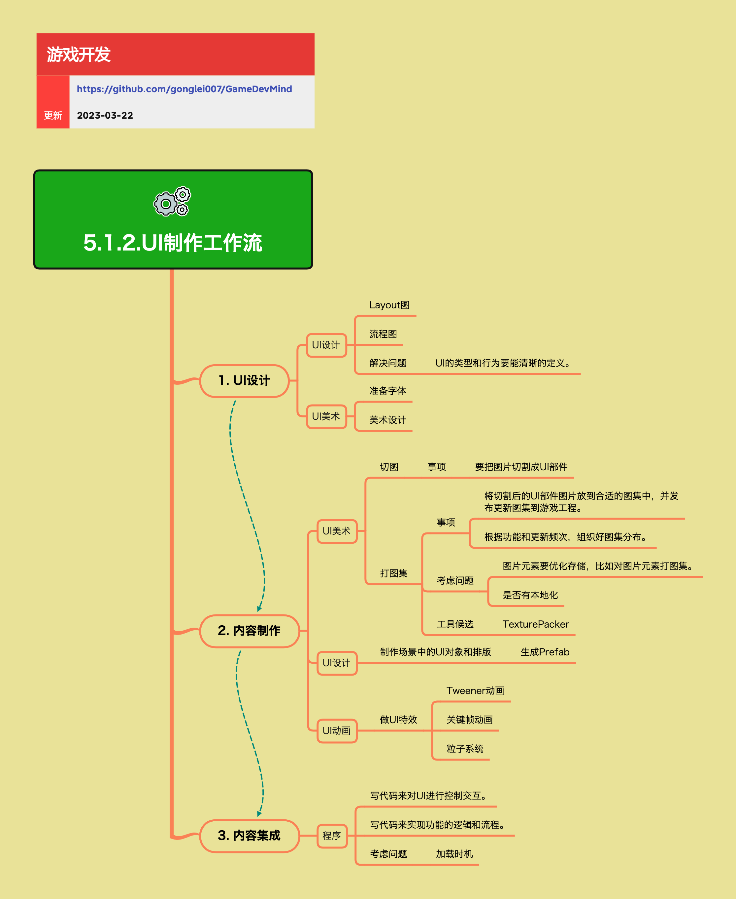

<h2 align="center">UI制作工作流</h2>

工具和流程要能有效促进设计、美术、程序之间的协同生产。UI制作工作流定义了从UI设计到最终集成的完整流程，确保各角色高效协作，产出高质量的游戏UI。

**关键词:** 
*UI,Layout,切图,图集,UI动画,Prefab*

**标签:** 
*等级: 中级, 阶段: 开发, 分类: 管理能力, 角色: 客户端开发|美术|策划*

## 图谱

## 工作流概览

## 1. UI设计

**是什么？在哪用？**

- **作用**：UI设计的初始阶段，包括Layout设计、流程设计和美术设计
- **应用场景**：
  - UI制作的起始阶段
  - 所有需要制作UI的场景
  - UI设计规划
- **做什么的？** UI设计的初始阶段，包括Layout设计、流程设计和美术设计。
- **在哪用？** UI制作的起始阶段，所有需要制作UI的场景。

**会遇到哪些问题？用什么解决？**

- **如何清晰定义UI的类型和行为？**
  - **问题**：需要清晰定义UI的类型和行为
  - **解决方向**：
    - **UI设计：**
      - **Layout图：定义页面上有什么，放在哪：** 布局设计
        - 定义页面元素
        - 定义元素位置
        - 明确布局关系
      - **流程图：定义操作流程和页面跳转：** 流程设计
        - 定义操作流程
        - 定义页面跳转
        - 明确流程关系
      - **解决问题：UI的类型和行为要能清晰的定义。这有助于后续的美术制作和程序实现：** 类型定义
        - 清晰定义UI类型
        - 清晰定义UI行为
        - 便于后续制作
    - 编写UI设计文档
    - 使用设计工具
    - 组织设计评审

- **如何设计UI的Layout和流程？**
  - **问题**：需要设计UI的Layout和流程
  - **解决方向**：
    - 设计Layout图
    - 设计流程图
    - 明确设计规范
    - 组织设计评审

- **如何准备UI所需的美术资源？**
  - **问题**：需要准备UI所需的美术资源
  - **解决方向**：
    - **UI美术：**
      - **准备字体：选择合适的字体，考虑多语言支持：** 字体准备
        - 选择合适字体
        - 考虑多语言支持
        - 确保字体可用
      - **美术设计：根据UI主题和风格进行美术设计，包括色彩、风格、视觉元素等：** 美术设计
        - 根据主题设计
        - 确定色彩方案
        - 确定风格方案
        - 设计视觉元素
    - 准备字体资源
    - 进行美术设计
    - 确保资源可用

**要点和思考方向：**
- UI设计是UI制作的基础
- 清晰定义UI的类型和行为有助于后续制作
- 设计Layout图和流程图明确UI结构
- 准备字体和美术资源确保设计实现

## 2. 内容制作

**是什么？在哪用？**

- **作用**：将UI设计转化为可用的游戏资源
- **应用场景**：
  - UI设计完成后的制作阶段
  - 资源制作
  - UI对象制作
  - 动画制作
- **做什么的？** 将UI设计转化为可用的游戏资源。
- **在哪用？** UI设计完成后的制作阶段。

**会遇到哪些问题？用什么解决？**

- **如何高效地切图和打图集？**
  - **问题**：需要高效地切图和打图集
  - **解决方向**：
    - **UI美术：**
      - **切图：**
        - **事项：要把图片切割成UI部件：** 切图工作
          - 按照设计稿精确切割
          - 确保每个UI部件都是独立的图片
          - 保持切图精度
      - **打图集：**
        - **事项：**
          - **将切割后的UI部件图片放到合适的图集中，并发布更新图集到游戏工程：** 图集制作
            - 选择合适的图集
            - 发布更新图集
            - 更新游戏工程
          - **根据功能和更新频次，组织好图集分布：** 图集组织
            - 根据功能组织
            - 根据更新频次组织
            - 优化图集分布
        - **考虑问题：**
          - **图片元素要优化存储，比如对图片元素打图集。这样可以减少Draw Call，提高性能：** 性能优化
            - 优化存储方式
            - 减少Draw Call
            - 提高性能
          - **是否有本地化需求，需要考虑多语言UI资源的组织：** 本地化支持
            - 考虑多语言需求
            - 组织多语言资源
        - **工具候选：TexturePacker 等图集打包工具：** 工具选择
          - 使用TexturePacker
          - 使用其他图集工具
          - 优化工具使用
    - 建立切图规范
    - 使用图集工具
    - 优化图集组织

- **如何在引擎中制作UI对象？**
  - **问题**：需要在引擎中制作UI对象
  - **解决方向**：
    - **UI设计：**
      - **制作场景中的UI对象和排版：**
        - **生成Prefab：在游戏引擎中制作UI对象，生成可复用的Prefab：** Prefab制作
          - 在引擎中制作UI对象
          - 生成可复用Prefab
          - 提高复用性
        - **需要按照Layout图进行精确排版，确保UI元素的位置和大小符合设计：** 精确排版
          - 按照Layout图排版
          - 确保位置准确
          - 确保大小符合
    - 在引擎中制作UI对象
    - 生成Prefab
    - 确保排版精确

- **如何制作UI动画和特效？**
  - **问题**：需要制作UI动画和特效
  - **解决方向**：
    - **UI动画：**
      - **做UI特效：**
        - **Tweener动画：使用补间动画实现UI的过渡效果：** 补间动画
          - 实现过渡效果
          - 优化动画性能
        - **关键帧动画：使用关键帧动画实现复杂的UI动画：** 关键帧动画
          - 实现复杂动画
          - 优化动画性能
        - **粒子系统：使用粒子系统实现UI特效，如按钮点击特效、升级特效等：** 粒子特效
          - 实现UI特效
          - 优化特效性能
    - 选择合适的动画方式
    - 实现UI动画和特效
    - 优化动画性能

**要点和思考方向：**
- 内容制作是将设计转化为资源的关键步骤
- 高效切图和打图集提高制作效率
- 在引擎中制作UI对象确保精确排版
- 制作UI动画和特效提升用户体验

## 3. 内容集成

**是什么？在哪用？**

- **作用**：程序将UI资源集成到游戏中，实现交互和逻辑
- **应用场景**：
  - UI内容制作完成后的集成阶段
  - UI功能实现
  - UI交互实现
  - UI逻辑实现
- **做什么的？** 程序将UI资源集成到游戏中，实现交互和逻辑。
- **在哪用？** UI内容制作完成后的集成阶段。

**会遇到哪些问题？用什么解决？**

- **如何控制UI的交互？**
  - **问题**：需要控制UI的交互
  - **解决方向**：
    - **程序：**
      - **写代码来对UI进行控制交互：实现UI的点击、拖拽、输入等交互功能：** 交互实现
        - 实现点击交互
        - 实现拖拽交互
        - 实现输入交互
        - 实现其他交互
    - 实现交互系统
    - 处理用户输入
    - 优化交互性能

- **如何实现UI的功能逻辑？**
  - **问题**：需要实现UI的功能逻辑
  - **解决方向**：
    - **程序：**
      - **写代码来实现功能的逻辑和流程：实现UI背后的业务逻辑，如数据刷新、状态管理、页面跳转等：** 逻辑实现
        - 实现数据刷新
        - 实现状态管理
        - 实现页面跳转
        - 实现其他业务逻辑
    - 实现业务逻辑
    - 管理UI状态
    - 优化逻辑性能

- **如何优化UI的加载时机？**
  - **问题**：需要优化UI的加载时机
  - **解决方向**：
    - **程序：**
      - **考虑问题：**
        - **加载时机：UI的加载时机需要仔细考虑，避免影响游戏性能。可以预加载常用UI，延迟加载不常用UI：** 加载优化
          - 考虑加载时机
          - 避免影响性能
          - 预加载常用UI
          - 延迟加载不常用UI
    - 设计加载策略
    - 实现预加载机制
    - 优化加载性能

**要点和思考方向：**
- 内容集成是UI功能实现的关键步骤
- 实现UI交互和功能逻辑
- 优化UI加载时机避免影响性能
- 预加载常用UI，延迟加载不常用UI

## 更多资料
