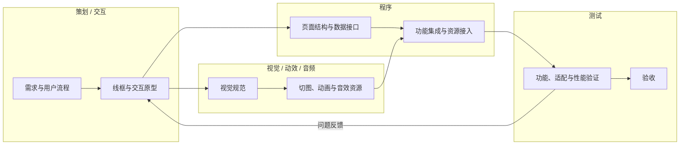

## UI制作工作流

工具和流程要能有效促进设计、美术、程序之间的协同生产。UI制作工作流定义了从UI设计到最终集成的完整流程，确保各角色高效协作，产出高质量的游戏UI。

**关键词:** 
*UI,Layout,切图,图集,UI动画,Prefab,AI Coding*

**标签:** 
*等级: 中级, 阶段: 开发, 分类: 管理能力, 角色: 客户端开发|美术|策划*

## 图谱

## 目录

- [工作流概览](#工作流概览)
- [1. UI设计](#1-ui设计)
- [2. 内容制作](#2-内容制作)
- [3. 内容集成](#3-内容集成)
- [更多资料](#更多资料)

----

> 💡 **AI Coding 总览**（为何要掌握知识才能更好操作 AI、指南的三类内容等）见 [阅读说明 - AI Coding 总览](../../阅读说明.md#ai-coding-总览)。

---

## 工作流概览

```mermaid
flowchart LR
    subgraph Design["策划 / 交互"]
        A["需求与用户流程"] --> B["线框与交互原型"]
    end
    subgraph Art["视觉 / 动效 / 音频"]
        C["视觉规范"] --> D["切图、动画与音效资源"]
    end
    subgraph Dev["程序"]
        E["页面结构与数据接口"] --> F["功能集成与资源接入"]
    end
    subgraph QA["测试"]
        G["功能、适配与性能验证"] --> H["验收"]
    end
    B --> C
    B --> E
    D --> F
    F --> G
    G -->|问题反馈| B
```

## 1. UI设计

| 维度 | 内容 |
|------|------|
| **作用** | UI设计的初始阶段，包括Layout设计、流程设计和美术设计 |
| **应用场景** | UI制作的起始阶段；所有需要制作UI的场景；UI设计规划 |
| **做什么的？** | UI设计的初始阶段，包括Layout设计、流程设计和美术设计 |
| **在哪用？** | UI制作的起始阶段，所有需要制作UI的场景 |

| 问题 | 解决方向 |
|------|----------|
| **如何清晰定义UI的类型和行为？** | Layout图：定义页面元素、元素位置和布局关系 流程图：定义操作流程和页面跳转、流程关系 清晰定义UI的类型和行为，有助于后续美术制作和程序实现 编写UI设计文档，使用设计工具，组织设计评审 |
| **如何设计UI的Layout和流程？** | 设计Layout图；设计流程图；明确设计规范；组织设计评审 |
| **如何准备UI所需的美术资源？** | 准备字体：选择合适字体，考虑多语言支持 美术设计：根据UI主题和风格进行设计，确定色彩、风格和视觉元素 |

| 要点和思考方向 |
|----------------|
| UI设计是UI制作的基础 |
| 清晰定义UI的类型和行为有助于后续制作 |
| 设计Layout图和流程图明确UI结构 |
| 准备字体和美术资源确保设计实现 |

## 2. 内容制作

| 维度 | 内容 |
|------|------|
| **作用** | 将UI设计转化为可用的游戏资源 |
| **应用场景** | UI设计完成后的制作阶段；资源制作；UI对象制作；动画制作 |
| **做什么的？** | 将UI设计转化为可用的游戏资源 |
| **在哪用？** | UI设计完成后的制作阶段 |

| 问题 | 解决方向 |
|------|----------|
| **如何高效地切图和打图集？** | 切图：按设计稿精确切割，确保每个UI部件都是独立图片，保持精度 打图集：将切割后的图片放到合适图集中，发布更新到游戏工程；根据功能和更新频次组织图集分布 性能优化：对图片元素打图集可减少Draw Call，提高性能；考虑多语言本地化需求组织资源 工具：TexturePacker等图集打包工具 建立切图规范，优化图集组织 |
| **如何在引擎中制作UI对象？** | 在游戏引擎中制作UI对象，生成可复用的Prefab；按照Layout图精确排版，确保UI元素位置和大小符合设计 |
| **如何制作UI动画和特效？** | Tweener动画：使用补间动画实现UI过渡效果 关键帧动画：使用关键帧动画实现复杂UI动画 粒子系统：使用粒子系统实现UI特效（按钮点击特效、升级特效等） 选择合适的动画方式，优化动画性能 |

| 要点和思考方向 |
|----------------|
| 内容制作是将设计转化为资源的关键步骤 |
| 高效切图和打图集提高制作效率 |
| 在引擎中制作UI对象确保精确排版 |
| 制作UI动画和特效提升用户体验 |

## 3. 内容集成

| 维度 | 内容 |
|------|------|
| **作用** | 程序将UI资源集成到游戏中，实现交互和逻辑 |
| **应用场景** | UI内容制作完成后的集成阶段；UI功能实现；UI交互实现；UI逻辑实现 |
| **做什么的？** | 程序将UI资源集成到游戏中，实现交互和逻辑 |
| **在哪用？** | UI内容制作完成后的集成阶段 |

| 问题 | 解决方向 |
|------|----------|
| **如何控制UI的交互？** | 程序写代码控制UI交互：实现UI的点击、拖拽、输入等交互功能；实现交互系统，处理用户输入，优化交互性能 |
| **如何实现UI的功能逻辑？** | 程序写代码实现功能的逻辑和流程：实现数据刷新、状态管理、页面跳转等业务逻辑；管理UI状态，优化逻辑性能 |
| **如何优化UI的加载时机？** | 仔细考虑UI加载时机，避免影响游戏性能；预加载常用UI，延迟加载不常用UI；设计加载策略，实现预加载机制 |

| 要点和思考方向 |
|----------------|
| 内容集成是UI功能实现的关键步骤 |
| 实现UI交互和功能逻辑 |
| 优化UI加载时机避免影响性能 |
| 预加载常用UI，延迟加载不常用UI |

| 类型 | AI Coding 指南 |
|------|----------------|
| **交互提示** | 说明需求；如「Layout」「图集」「Prefab」「Draw Call」「Tweener」 |
| **方法** | 让 AI 设计 UI 工作流、切图规范、集成 checklist |
| **应用** | UI 设计文档、图集规划、Prefab 结构 |
| **提示词范例** | 「UI 制作需 Layout/流程图→切图打图集→Prefab→程序集成，请设计各阶段交付物模板、图集组织策略与 Draw Call 优化要点」 |

## 更多资料
