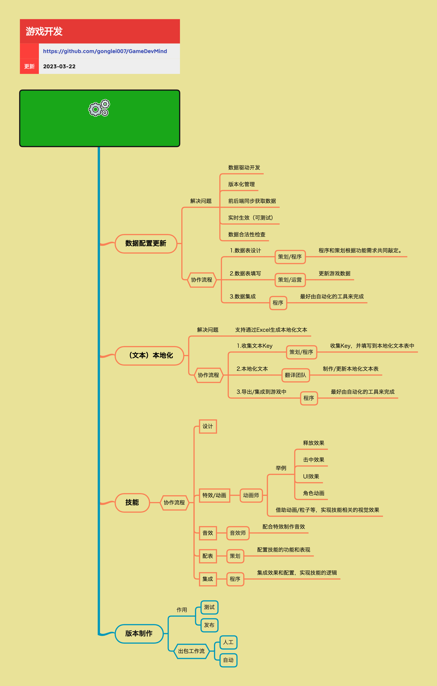

<h2 align="center">更多开发工作流</h2>

游戏开发需要多工种协同工作，这就需要一定的流程和配合方法。除了系统开发和UI制作，还有数据配置更新、本地化、技能制作、版本制作等工作流，每个工作流都有其特定的协作方式和注意事项。

**关键词:** 
*数据配置,本地化,技能制作,版本制作,工作流,协作流程*

**标签:** 
*等级: 中级, 阶段: 开发, 分类: 管理能力, 角色: 客户端开发|服务端开发|策划|美术*

## 图谱

## 工作流概览

### 数据配置更新

**是什么？在哪用？**

- **作用**：游戏配置数据的制作、更新和管理流程
- **应用场景**：
  - 所有需要数据驱动的游戏功能
  - 角色属性配置
  - 道具数据配置
  - 关卡配置
  - 数值平衡配置
- **做什么的？** 游戏配置数据的制作、更新和管理流程。
- **在哪用？** 所有需要数据驱动的游戏功能，如角色属性、道具数据、关卡配置等。

**会遇到哪些问题？用什么解决？**

- **如何实现数据驱动开发？**
  - **问题**：需要实现数据驱动开发
  - **解决方向**：
    - **解决问题：**
      - **数据驱动开发：通过配置数据而非硬编码来实现游戏功能，提高灵活性和可维护性：** 数据驱动
        - 使用配置数据
        - 避免硬编码
        - 提高灵活性
        - 提高可维护性
    - 设计数据表结构
    - 实现数据加载系统
    - 实现数据驱动逻辑

- **如何管理配置数据的版本？**
  - **问题**：需要管理配置数据的版本
  - **解决方向**：
    - **解决问题：**
      - **版本化管理：配置数据需要版本管理，支持回滚和对比：** 版本管理
        - 实现版本管理
        - 支持版本回滚
        - 支持版本对比
    - 实现版本管理系统
    - 实现版本回滚机制
    - 实现版本对比工具

- **如何确保前后端数据同步？**
  - **问题**：需要确保前后端数据同步
  - **解决方向**：
    - **解决问题：**
      - **前后端同步获取数据：确保前后端使用相同的数据结构，避免不一致：** 数据同步
        - 使用相同数据结构
        - 实现数据同步机制
        - 避免数据不一致
    - 建立数据结构规范
    - 实现数据同步机制
    - 实现数据一致性检查

- **如何实现数据的实时生效？**
  - **问题**：需要实现数据的实时生效
  - **解决方向**：
    - **解决问题：**
      - **实时生效（可测试）：配置数据更新后能够实时生效，方便测试和调试：** 实时生效
        - 实现数据热更新
        - 实现实时生效机制
        - 方便测试和调试
    - 实现热更新机制
    - 实现实时生效系统
    - 优化更新性能

- **如何检查数据的合法性？**
  - **问题**：需要检查数据的合法性
  - **解决方向**：
    - **解决问题：**
      - **数据合法性检查：对配置数据进行校验，避免错误数据导致游戏问题：** 数据校验
        - 实现数据校验
        - 避免错误数据
        - 保证数据质量
    - 实现数据校验规则
    - 实现数据校验工具
    - 优化校验性能

- **如何实现协作流程？**
  - **问题**：需要实现高效的协作流程
  - **解决方向**：
    - **协作流程：**
      - **1. 数据表设计：策划/程序 - 程序和策划根据功能需求共同敲定数据表结构：** 数据表设计
        - 共同敲定结构
        - 明确功能需求
        - 设计数据表
      - **2. 数据表填写：策划/运营 - 更新游戏数据，填写配置内容：** 数据表填写
        - 更新游戏数据
        - 填写配置内容
        - 确保数据正确
      - **3. 数据集成：程序 - 最好由自动化的工具来完成，将配置数据集成到游戏中：** 数据集成
        - 使用自动化工具
        - 集成配置数据
        - 优化集成流程
    - 建立协作流程
    - 实现自动化工具
    - 优化协作效率

**要点和思考方向：**
- 数据配置更新是数据驱动开发的基础
- 实现数据驱动开发提高灵活性和可维护性
- 管理配置数据版本支持回滚和对比
- 确保前后端数据同步避免不一致
- 实现数据实时生效方便测试和调试
- 检查数据合法性保证数据质量

### （文本）本地化

**是什么？在哪用？**

- **作用**：游戏文本的多语言本地化流程
- **应用场景**：
  - 需要支持多语言的游戏
  - 国际化游戏
  - 多地区运营
- **做什么的？** 游戏文本的多语言本地化流程。
- **在哪用？** 需要支持多语言的游戏。

**会遇到哪些问题？用什么解决？**

- **如何收集和管理本地化文本Key？**
  - **问题**：需要收集和管理本地化文本Key
  - **解决方向**：
    - **协作流程：**
      - **1. 收集文本Key：策划/程序 - 收集Key，并填写到本地化文本表中。需要确保Key的唯一性和可读性：** Key管理
        - 收集文本Key
        - 填写到文本表
        - 确保唯一性
        - 确保可读性
    - 建立Key命名规范
    - 实现Key管理系统
    - 实现Key唯一性检查

- **如何支持通过Excel生成本地化文本？**
  - **问题**：需要支持通过Excel生成本地化文本
  - **解决方向**：
    - **解决问题：**
      - **支持通过Excel生成本地化文本：使用Excel等工具管理本地化文本，方便翻译团队协作：** Excel支持
        - 使用Excel管理
        - 方便翻译协作
        - 提高工作效率
    - 实现Excel导入导出
    - 实现文本格式转换
    - 优化工具使用

- **如何高效地完成翻译和集成？**
  - **问题**：需要高效完成翻译和集成
  - **解决方向**：
    - **协作流程：**
      - **2. 本地化文本：翻译团队 - 制作/更新本地化文本表，进行多语言翻译：** 翻译工作
        - 制作文本表
        - 更新文本表
        - 进行多语言翻译
      - **3. 导出/集成到游戏中：程序 - 最好由自动化的工具来完成，将本地化文本导出并集成到游戏中：** 文本集成
        - 使用自动化工具
        - 导出本地化文本
        - 集成到游戏中
    - 建立翻译流程
    - 实现自动化工具
    - 优化集成效率

**要点和思考方向：**
- 本地化是国际化游戏的基础
- 收集和管理本地化文本Key确保唯一性和可读性
- 支持通过Excel生成本地化文本方便翻译协作
- 实现自动化工具提高翻译和集成效率

### 技能

**是什么？在哪用？**

- **作用**：游戏技能系统的制作流程，包括设计、特效、音效、配表和集成
- **应用场景**：
  - 有技能系统的游戏
  - RPG游戏
  - MOBA游戏
  - 动作游戏
- **做什么的？** 游戏技能系统的制作流程，包括设计、特效、音效、配表和集成。
- **在哪用？** 有技能系统的游戏，如RPG、MOBA、动作游戏等。

**会遇到哪些问题？用什么解决？**

- **如何协调技能的设计、特效、音效和配置？**
  - **问题**：需要协调技能的设计、特效、音效和配置
  - **解决方向**：
    - **协作流程：**
      - **设计：策划设计技能的功能、效果、数值等：** 技能设计
        - 设计技能功能
        - 设计技能效果
        - 设计技能数值
      - **特效/动画：动画师：** 特效制作
        - **举例：**
          - **释放效果：** 释放特效
            - 制作释放特效
            - 实现视觉效果
          - **击中效果：** 击中特效
            - 制作击中特效
            - 实现视觉效果
          - **UI效果：** UI特效
            - 制作UI特效
            - 实现UI反馈
          - **角色动画：** 角色动画
            - 制作角色动画
            - 实现动画表现
        - **借助动画/粒子等，实现技能相关的视觉效果：** 视觉效果
          - 使用动画实现
          - 使用粒子实现
          - 实现视觉效果
      - **音效：音效师 - 配合特效制作音效，增强技能的听觉体验：** 音效制作
        - 配合特效制作
        - 增强听觉体验
        - 实现音效同步
      - **配表：策划 - 配置技能的功能和表现，包括伤害、范围、冷却时间等：** 技能配表
        - 配置技能功能
        - 配置技能表现
        - 配置伤害、范围、冷却时间等
    - 建立协作流程
    - 协调制作进度
    - 确保内容一致

- **如何确保技能的表现和逻辑一致？**
  - **问题**：需要确保技能的表现和逻辑一致
  - **解决方向**：
    - **协作流程：**
      - **集成：程序 - 集成效果和配置，实现技能的逻辑，确保技能的表现和功能一致：** 技能集成
        - 集成效果和配置
        - 实现技能逻辑
        - 确保表现和功能一致
    - 实现技能系统
    - 实现表现逻辑对接
    - 确保一致性

**要点和思考方向：**
- 技能制作需要多角色协作
- 协调技能的设计、特效、音效和配置
- 确保技能的表现和逻辑一致
- 建立清晰的协作流程

### 版本制作

**是什么？在哪用？**

- **作用**：游戏版本的构建、测试和发布流程
- **应用场景**：
  - 所有需要测试和发布的游戏版本
  - 测试版本制作
  - 正式版本发布
- **做什么的？** 游戏版本的构建、测试和发布流程。
- **在哪用？** 所有需要测试和发布的游戏版本。

**会遇到哪些问题？用什么解决？**

- **如何高效地制作测试版本？**
  - **问题**：需要高效制作测试版本
  - **解决方向**：
    - **作用：**
      - **测试：为QA提供可测试的版本：** 测试版本
        - 制作测试版本
        - 提供给QA测试
        - 优化制作效率
    - 实现自动化构建
    - 优化构建流程
    - 提高制作效率

- **如何自动化版本构建和发布？**
  - **问题**：需要自动化版本构建和发布
  - **解决方向**：
    - **作用：**
      - **发布：制作正式发布版本：** 发布版本
        - 制作发布版本
        - 优化发布流程
    - **出包工作流：**
      - **人工：手动执行构建、打包、签名等步骤，适合初期或特殊版本：** 人工出包
        - 手动执行步骤
        - 适合初期版本
        - 适合特殊版本
      - **自动：通过自动化工具链完成版本制作，提高效率和一致性。可以参考 [4.3.3.DevOps](../4.生产能力/4.3.3.DevOps.md) 中的持续集成和持续交付相关内容：** 自动出包
        - 使用自动化工具链
        - 提高制作效率
        - 提高一致性
        - 参考DevOps实践
    - 实现自动化工具链
    - 优化自动化流程
    - 提高效率和一致性

**要点和思考方向：**
- 版本制作是游戏发布的基础
- 高效制作测试版本为QA提供支持
- 实现自动化版本构建和发布提高效率
- 参考DevOps实践优化版本制作流程

## 更多资料
