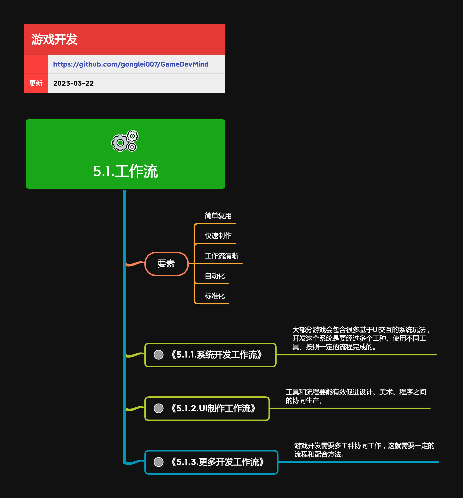

<h2 align="center">工作流</h2>

游戏“工业化”生产的相关流程。

**关键词:**  
*构建,持续集成,Gradle,Ant*

**标签:** 
*等级: 中级, 阶段: 开发, 分类: 管理能力, 角色: 客户端开发|服务端开发|管理*

## 图谱

## 子主题
* [5.1.1.系统开发工作流](5.1.1.系统开发工作流.md)
* [5.1.2.UI制作工作流](5.1.2.UI制作工作流.md)
* [5.1.3.更多开发工作流](5.1.3.更多开发工作流.md)
