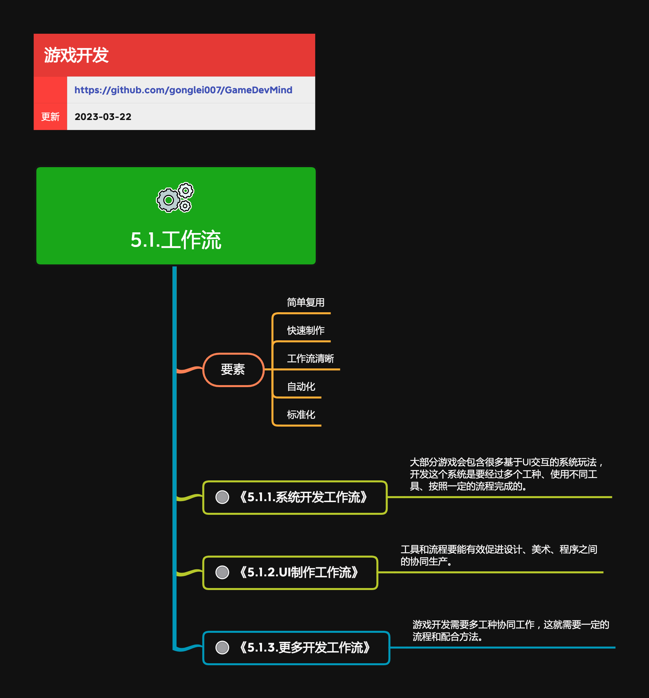

## 研发与内容流程管理

定义游戏研发与内容生产中的角色、交付物、评审、验收和反馈机制。自动构建、数据处理和制品生产等执行工具归入生产能力。

**关键词:**  
*构建,持续集成,Gradle,Ant*

**标签:** 
*等级: 中级, 阶段: 开发, 分类: 管理能力, 角色: 客户端开发|服务端开发|管理*

## 图谱

* [5.1.1.系统开发工作流](5.1.1.系统开发工作流.md)
* [5.1.2.UI制作工作流](5.1.2.UI制作工作流.md)
* [5.1.3.更多开发工作流](5.1.3.更多开发工作流.md)

> 生产流程的自动化实现参见 [4.3.3.DevOps](../4.生产能力/4.3.3.DevOps.md)；本节关注流程治理，而不是工具执行细节。
